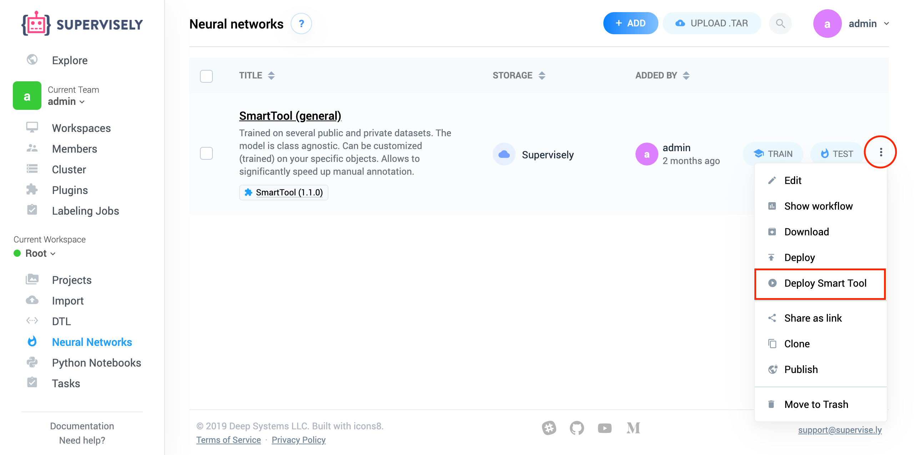
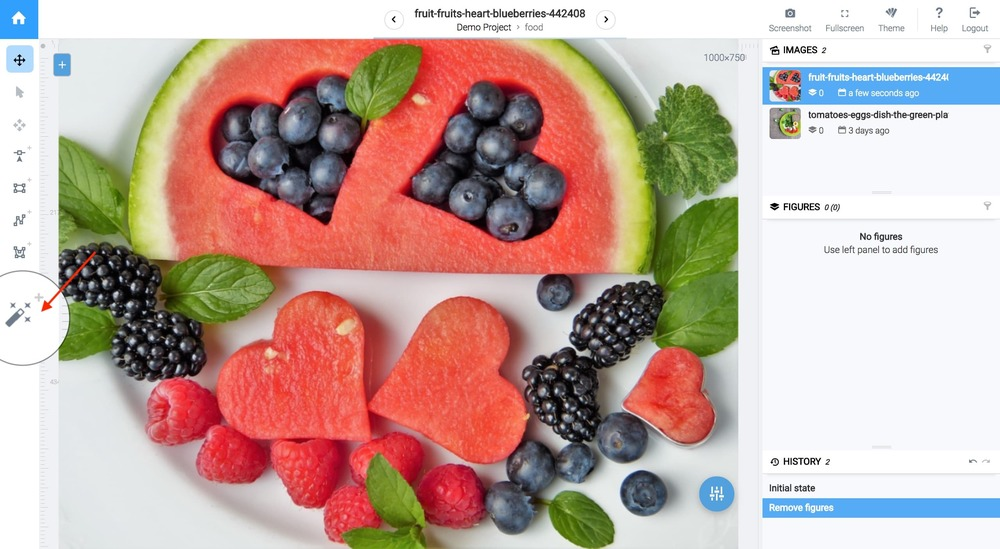
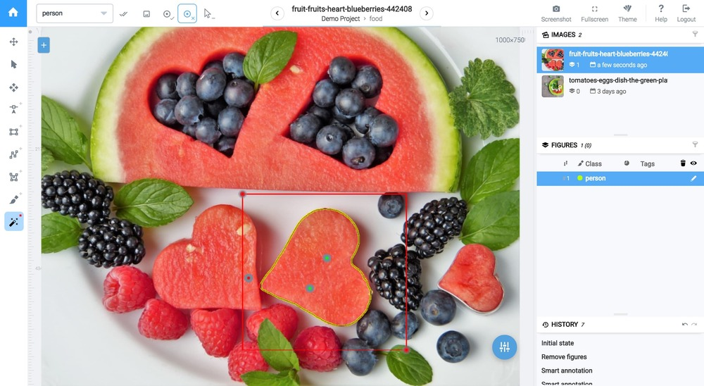
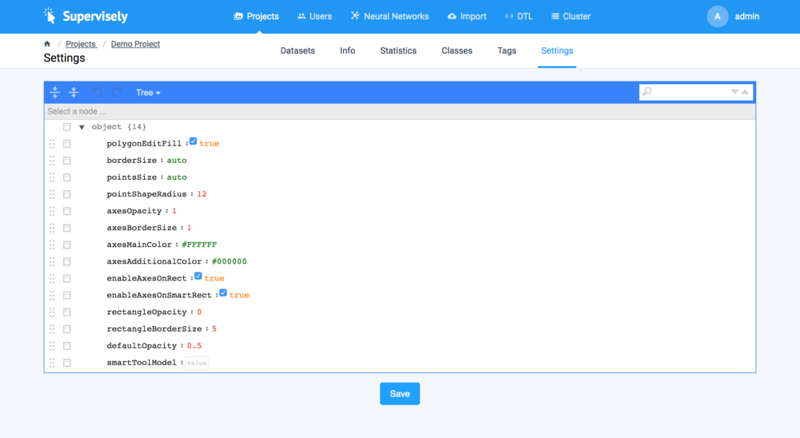
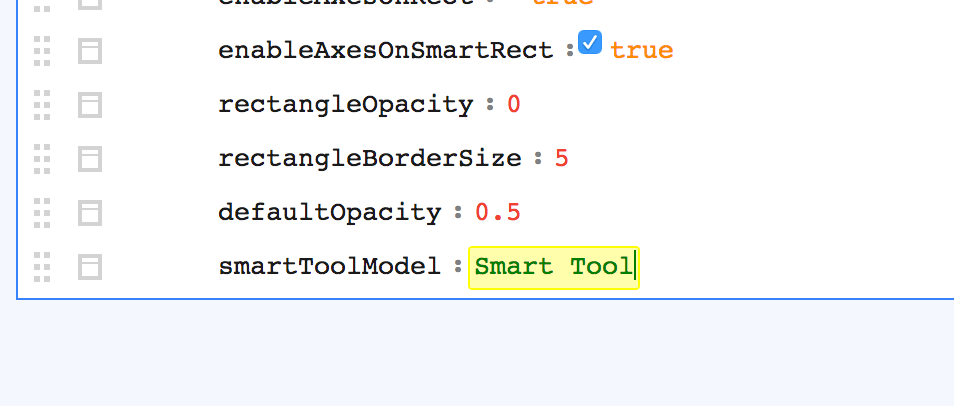

[Smart tool](https://supervisely.com/smart-tool) is a class-agnostic annotation tool created specifically for semantic segmentation. You have probably already seen how it works, but if not, check out this example:


Cool, right? But the best part is that Smart tool is just yet another neural network. You can train your custom version of it and switch between them in dashboard. Let me show how to do that.


To deploy Smart tool you will need at least one node with GPU in the cluster. If you haven't already add a node, [read here](../../../customization/agents/add_delete_node/add_delete_node.md) how to do it.


## Step 1. Add a model from the Models list

We ship already pre-trained models in Explore. Because Smart tool is just neural network, you will find a few pre-trained smart tool there. Go to `Explore` → `Neural networks` and search for "Smart Tool".

Point mouse cursor over model and click "Add".

## Step 2. Deploy model on cluster

Selected model has been added to "Neural Networks" section of your team. Click "three dots" icon and select action "Deploy Smart Tool".



## Step 3. Enter settings

Popup window will appear. Choose here node that you want smart tool to be deployed on (because smart tool is a neural network, it must be deployed on a machine with GPU device). If your node has several GPUs on-board, you can choose Device ID here.


You can deploy multiple smart tools on one node. Just make sure you have enough memory.


Click "Submit" to proceed to the next step.


## Step 4. Wait Smart tool to be deployed

You will be automatically transferred to the cluster tasks page. It will take a few minutes for an agent to pull docker image and start container with the model. You can monitor status in Output column or click "three dots" icon and open "Log" popup.

When Smart tool will be deployed you will see status "Deployed" and message "Waiting for messages in endless loop." in log. Now we can use smart tool in annotation tool.


## Step 5. Try smart tool!

Go to the Project section and click on any dataset to open annotation tool. Click "magic wand" icon in toolset menu to select smart tool.



Now place two points to form rectangle over any object and see results. That's it!



## How to stop (un-deploy) smart tool

If don't really need smart tool anymore (or you want to deploy another one but do not have enough GPU memory, who knows?), you can stop it by going to "Cluster" → "Tasks". Now click "three dots" icon and select "Stop task".


## How to switch between different smart tools

You can have multiple smart tools at the same time and use different smart tools in different project. For example, you can use dedicated smart tool model trained on people for projects with humans in sight and general smart tool for the rest of the projects.

Go to "Projects" → "%Your Project%"" → "Settings". Here is an example configuration:



To assign a specific smart tool to a project, edit parameter `smartToolModel` and set it to the name of your smart tool model. For example, in example above i have added a smart tool model called "Smart Tool". To assign that model to a specific project, set json settings as following:

```json
{
  smartToolModel: "Smart Tool"
}
```

In UI it looks like this:



Press save. Now when you annotate datasets of that project, smart tool with model name "Smart Tool" will be used.


By default `smartToolModel` is set to `NULL`. It means that the first smart tool model created will be used.

