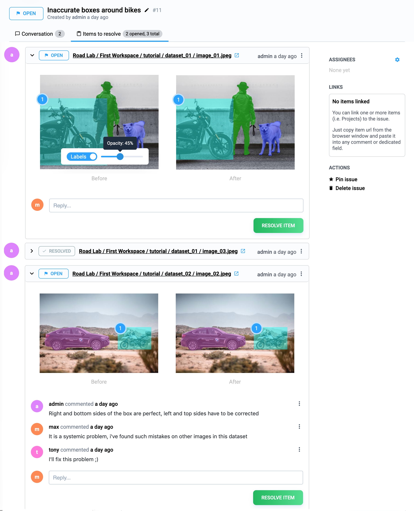

# Issues

## What are Supervisely Issues?

Data Labeling is about collaboration at scale: managers, domain experts, data scientists, inhouse labelers and dedicated external labeling teams. Hundreds of people are involved in. Also, this complicated process requires multi-stage reviewing and correction to **guarantee quality**. And it is hard to organize the entire process without specially designed tools.

#### Supervisely Issues are built in cooperation with professional labeling teams and help to:

* **create**, **organize** and **inspect** issues on invalid images and objects.
* **share**, **discuss**, **resolve** them with your labeling team
* **track** progress and **receive notifications** in real-time
* **collaborate** right in annotation tool without switching interfaces back and forth

Github Issues are the perfect example of efficient collaboration between thousands of developers. We at Supervisely got best practices from Github Issues, adopted them to labeling scenarios and integrated into annotation tools by keeping well-known user interfaces.

## Organize + Search + Filter

Issues has its own section in every team. There are two types of issues: **private** and **public** ones. Private issues help to discuss project-related questions and are available only for team members. Public issues are designed to keep everybody in your organization on the same page, share ideas, hear all voices, consider all options - and establish consensus.

<figure><figcaption></figcaption></figure>

A big part of managing issues is focusing on important tasks and keep plans up to date simultaneously all in one place. The **search** box at the top of the page gets you there faster. You can **filter** search results by type (public/private), author, assignee, project, job, and open/close state. **Sorting** is also available, for example by most commented or recently updated.

<figure><figcaption></figcaption></figure>

## Conversations

A typical issue looks like this:

#### Issue page

* **Title** and **description** describe what the issue is all about
* **Links** associate your issues with any Supervisely entities like projects, labeling jobs, neural networks and so on and help you categorize and filter your issues based on that
* **Assignees** are responsible for working on the issue
* **Comments** allow anyone with access to the Issues to provide feedback
* **Markdown** support - it is a lightweight and easy-to-use syntax for styling all your comments: add tables, images, coloring, lists, links and so on

## Assignees + Links

Once a lot of issues are collected, it is hard to find the ones you care about. **Assignees** and **Links** sections are used to categorize and filter issues. To assign users just click the corresponding gear in the sidebar on the right. To attach links, just copy and paste `URLs` into the comment text block, they will be automatically parsed.

<figure><figcaption></figcaption></figure>

## Integration into annotation tool

<figure><figcaption></figcaption></figure>

Integration into labeling interfaces is an essential part of the effective labeling process:

* **place** an issue to specific **objects**, **images** or some image **regions**
* see the **entire context** of a conversation
* organize **real-time discussion** of edge labeling cases
* get **instant feedback and guides** right from comments
* **filter images** with issues on the right panel
* **change issue positions** or **move discussion popup** so that their placement makes sense
* **resolve issues** from labeling interface, cause no one wants to stop working in order to track work

### Creation of issues in the annotation tool

Create new or apply already created issues to annotations directly in the labeling tool main scene.

* If you notice an invalid object/image annotation during the annotation process, you can create a new issue with its title and description so that other annotators or project managers can easily identify and fix it.&#x20;
* If the issue has been reported previously, you can apply it to the current annotation. It helps unify the labeling or review process and makes it easier to track and fix repeated mistakes.

<figure><figcaption></figcaption></figure>

## Items to resolve

You can close the entire issue or you can create a single issue and attach a lof of items (for example images or projects) to this issue. They will be in the **Items to resolve** page. Every item has its own discussion thread.

<figure><figcaption></figcaption></figure>

## Difference

Supervisely’s issue tracking is special because of our focus on collaboration and visualization tools during labeling. Every item can be discussed and resolved separately. For images and objects, a user sees initial labels (when the issue was created) and a final result.

It is especially useful for tracking how labeling mistakes are fixed over time. Managers and reviewers can easily track changes by comparing the differences between initial and final labels.

<figure><figcaption></figcaption></figure>

## Notifications & Changes

Issues evolve over time: titles change, items resolve, new items appear, discussions become long, issues get new assignees. Changing **history** in conversation gives better insight into these changes.

<figure><figcaption></figcaption></figure>

**Notifications** provide important updates about the conversations and activities you’re involved in. Users don’t miss relevant information and stay informed of what’s going on. Notifications are available through email or right in Supervisely dashboard.
