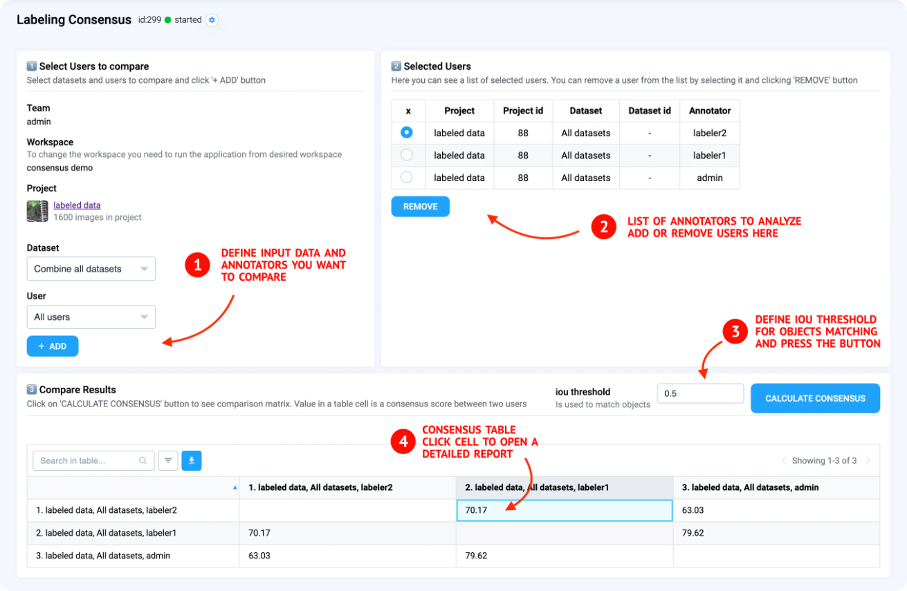

# Labeling Consensus

Consensus labeling is an annotation approach when multiple annotators collaboratively label the same set of images independently and the resulting annotation is based on combining labels with one of the consensus algorithms like, for example, the well-known majority voting. This approach is not limited to specific computer vision tasks and can be used for object detection, semantic and instance segmentation, classification and others.

Traditionally all annotators are compared with each other and the consensus scores are calculated for every possible pair of labelers. These consensus scores measure the agreement between labels and show how similar different annotations are. This metric can have any value between 0 % to 100 %. In case there are 2 completely different annotations the consensus for an image would be 0 %. If annotations are identical - the score would be 100 %. The higher values of the score show that annotations are more similar.

<figure><figcaption></figcaption></figure>


Example above is Labeling Consensus [application](https://ecosystem.supervisely.com/apps/consensus?utm_source=blog) from our Ecosystem.



Learn more about Labeling Consensus in [How to use labeling consensus to get accurate training data](https://supervisely.com/blog/labeling-consensus) tutorial.


## How to Use the Labeling Consensus Tool

This guide explains how to use the labeling consensus tool on the Supervisely platform to analyze the quality of annotations made by different labelers and produce high-quality training data.

#### Features of the Labeling Consensus Tool:

* **Consensus calculation:** Generates a confusion matrix to calculate consensus scores between annotators.
* **Versatile annotations:** Works with bounding boxes, masks, polygons, and image/object tags.
* **Detailed reports:** Provides image-level pixel differences and high-level quality metrics for every annotator pair.
* **Real-time monitoring:** Tracks consensus at any stage of the labeling process, even before completion.

### Step-by-Step Guide

**1. Launching the Consensus Tool**

* Open the **context menu** of a working project and select the app.
* Alternatively, launch the app from the Supervisely Ecosystem and choose a project in the first step.

**2. Viewing the Confusion Matrix**

Once launched, the app displays a confusion matrix with consensus scores for all annotators. It automatically matches labeled images, objects, classes, and tags, calculating metrics for overlapping data.

**3. Interpreting Consensus Scores**

For example, if the consensus score between two annotators is **83%**, it indicates their annotations are 83% similar. This score helps identify discrepancies and areas for further analysis.

**4. Accessing Detailed Reports**

Click on any consensus score in the matrix to open a detailed report. This report provides:

* High-level metrics
* Image-level differences
* Insights into annotation inconsistencies

**5. Customization**

The labeling consensus tool is open-source and written in Python. You can:

* Fork the repository from GitHub.
* Add custom actions, such as removing unmatched annotations or applying majority voting.

Supervisely's App Engine simplifies the creation of tailored apps with a user-friendly graphical interface, designed for Python developers and data scientists


