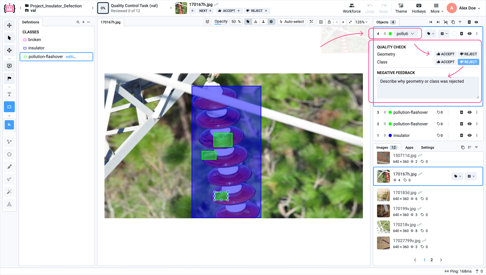

# Labeling Quality Control

The Quality Control functionality in **Supervisely** enables you to assign a random sample of annotated images to one or more reviewers for validation. Reviewers assess the correctness of assigned classes, object geometries, and applied tags. Upon completion, the system generates a summary report providing insights into the overall labeling quality of the project.

## Overview

To start the **extended Quality Control** process in an image project, follow these steps:

1. Open any **Image Project** from the Projects section.
2. In the **`Annotate`** button click the **`v`** arrow on the top right side of the screen.
3. In the dropdown menu, select **Send Sample to QC**.

<figure><figcaption></figcaption></figure>

4. The **Create QC Task** page will open in the Labeling Jobs section.
5. Specify the necessary settings: task name, one or more reviewers, sample size.

    The **sample size** specifies the number of random images that will be taken from this project for validation.

    If you select multiple reviewers, each of them will receive an equal portion of the sample, with random images assigned individually.

6. Click the **`Create`** button to start a new labeling task of the **extended Quality Control** type.

<figure><figcaption></figcaption></figure>

When we click the **`Create`** button, a Quality Control Task is immediately created with the status **On Review**.

<figure><figcaption></figcaption></figure>

Clicking on the title of the **Quality Control Task** opens the Labeling Tool with extended quality control functionality:

1. Extended **Accept/Reject** functionality;
2. **Error Region**.

## 1. Extended Accept/Reject Functionality

Each object includes an additional panel called **Quality Check**, which contains two buttons: **`Accept`** and **`Reject`** - used to evaluate both the **geometry** and the **class** of the object.

<figure><figcaption></figcaption></figure>

This functionality allows the reviewer to indicate exactly what needs to be fixed by the annotator.

 For example, a reviewer can **reject** one or more **classes** or **geometries** in the image, providing detailed feedback on what needs to be fixed. The final click on the main **`Accept`** or **`Reject`** button - applied to the entire image and determines the status of all remaining classes and geometries that haven't been individually reviewed.
 

**Note**: This functionality is only displayed for those jobs that were created via the **Send Sample to QC** function.


This allows the reviewer to selectively reject only those elements that require changes, while all other classes and geometries will be **automatically** accepted when the reviewer clicks the **main `Accept` button and vice versa**, if the reviewer accepts only specific elements and then clicks **Reject**, all others will be automatically rejected.

<figure><figcaption></figcaption></figure>

**Tags** have the same functionality.

<figure><figcaption></figcaption></figure>

All these buttons **Accept** and **Reject**, which relate to classes, geometries and tags, can also be **unchecked**, that is, the status can be removed.

To view all the statistics for the extended functionality of the **Quality Control** Task, go to the Labeling Jobs section and click the **`Stats`** button under the specific task.

<figure><figcaption></figcaption></figure>
    
In the **QC Stats** section you will see the following metrics:

- **Geometric Accuracy** - ratio of annotation objects with geometry marked as correct, divided by total number of reviewed objects;
- **Class Accuracy** - ratio of annotation objects with class marked as correct, divided by total number of reviewed objects;
- **Tags Accuracy** - ratio of tags marked as correct, divided by total number of reviewed tags;
- **Annotations Recall** - ratio of reviewed annotation objects, divided by total number of annotation objects in the labeling job;
- **Reviewed Annotations** - total number of reviewed and non-reviewed annotation objects.

## 2. Error Region

**Error Region** is a tool that can be used to mark problem areas on an image.

<figure><figcaption></figcaption></figure>

In the settings window you can specify the details of the **Error Region**:
1. An annotation or another element is missing,
2. Specify the class of the missing object (geometry),
3. The number of missing objects (geometry),
4. Leave an explanatory comment.


**Note**: This functionality is only displayed for those jobs that were created via the **Send Sample to QC** function.


**Technical details of the Error Region function:**

Each **Error Region** label is saved as a hidden class _$sly.error.region_ and is visible in the list of classes under the Definition tab of the project.