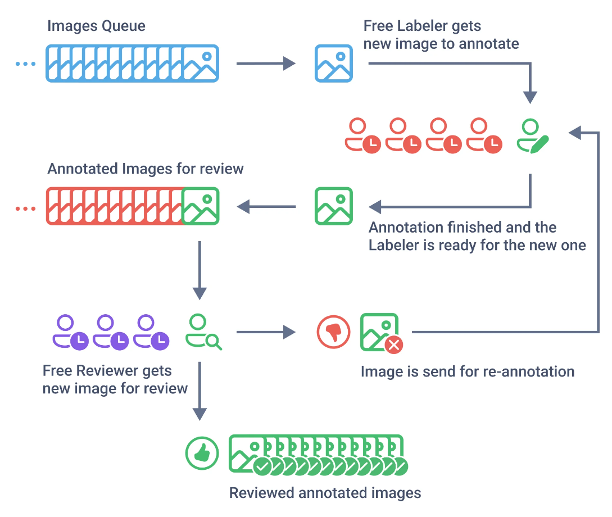

# Labeling Queues

Labeling Queues is a systematic method for distributing and managing labeling process in a [team](../../collaboration/teams.md), where labeling tasks are grouped into queues and sequentially distributed among annotators. The essence of this system is that the data is not distributed between annotators, but is issued from a common queue (pool) of tasks, on a "whoever labels first" basis, until there is no more data to label. This allows to balance data annotation process within the labeling team independently of the speed of individual workers.&#x20;


Learn more about Labeling Queues in [Labeling Queues: Streamline Your Labeling Pipeline.](https://supervisely.com/blog/labeling-queues)


## Using Labeling Queues: Step-By-Step Guide


**Before you start**

Ensure the following:

* A dedicated team assigned with proper roles. Refer to our **Labeling Jobs** documentation for details on roles.
* Necessary projects for annotation with defined classes, figures, and tags.


Suppose you want to train a model to recognize strawberries in images. You have 10,000 images to annotate. Follow these steps to efficiently manage the task with Labeling Queues:

### **Step 1. Create Labeling Queues**

1. The Manager or Reviewer creates a Labeling Queue with defined criteria.
2. Assign Annotators and Reviewers.
3. An empty Labeling Job is created for each Labeler and Reviewer.
4. Once setup is complete, the team is redirected to the Labeling Queues page, where jobs are automatically distributed.

### **Step 2. Image Annotation**

1. Annotators retrieve images one at a time for labeling.
2. After labeling, Annotators press **Confirm and pull next** to continue.
3. Faster Annotators can assist slower teammates, ensuring smooth workflow.
4. The process continues until all images are labeled or the dataset is completed.

### **Step 3. Review and Quality Control**

1. Reviewers sequentially verify the annotations for accuracy.
2. Approved annotations are finalized.
3. Incorrect annotations are sent back to the original Annotator for correction.
4. Reviewed images do not return to the general queue but stay in the original Annotator's job.

***

## Labeling Queues Statistics

📊 Managers and Reviewers can view statistics for each Labeling Job in the queue by clicking the **Stats** button. This provides insights into team performance and helps optimize the annotation process.

***

## Video Tutorial

Watch our concise video tutorial 🎥 to learn how to use **Labeling Queues** effectively in the Supervisely platform.


