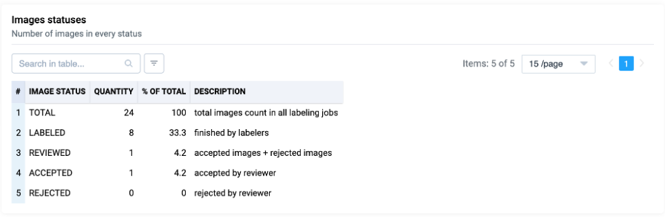
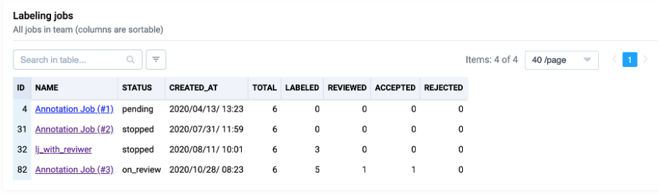

# Labeling statistics

 ## Applications in the Ecosystem

Our applications provide numerous opportunities for efficiently working with data annotation tasks. Applications offer a convenient environment for organizing, managing, and tracking the annotation process. They help teams work with data in a more structured and efficient manner.

### Examples


[Applications in the Ecosystem](https://app.supervisely.com/ecosystem/collaboration)


## Labeling Job Statistics

When working with data annotation tasks, statistics play a crucial role. Our ecosystem provides various statistical data that can be extracted by clicking on "Stats" for each annotation task. In this section, we will explore key aspects of labeling job statistics:

Job Duration: This metric allows you to determine the total time spent on completing the annotation task. It is measured in time and is essential for assessing the efficiency of the annotation process.

Time in Labeling Tool: This parameter indicates the time an annotator actually spent in the annotation tool. It differs from the overall job duration, as it only takes into account active interactions with the data.

Other Statistical Metrics: The statistics section also provides other data, including the number of annotations, completion level, and information on reviews and annotation quality.

## Exporting Activity as .csv

An important feature of our ecosystem is the ability to export activity for annotation tasks in .csv format. This allows users the freedom to analyze and extract the necessary statistics on their own. You can export data from the context menu and further process it according to your needs. This opens up broad opportunities for statistical analysis and report creation in line with your goals and tasks.

