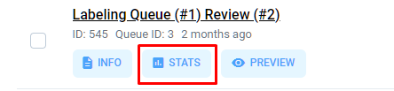
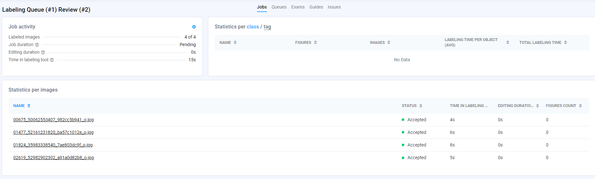
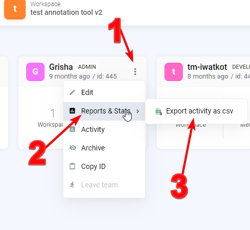
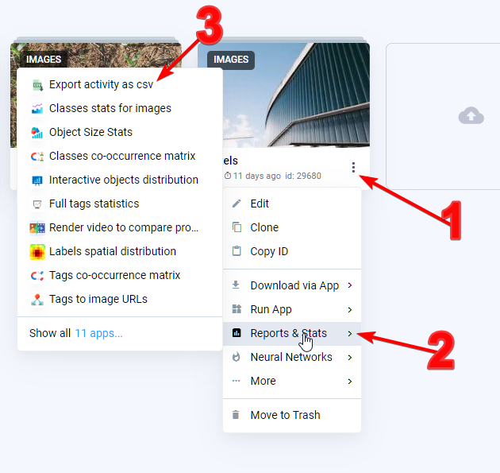

# Labeling statistics

 ## Applications in the Ecosystem

Understanding your data is extremely important if you want to have precise annotations and consistent training data. There are the quality of annotations, data anomalies, performance of your labeling team and many other visualizations you could need. It is impossible to put all the charts and tables in a single interface. That’s why having a constantly growing [Ecosystem](https://ecosystem.supervisely.com/) of various applications is so important. There are just some examples:

### [Labeling Jobs Stats](https://ecosystem.supervisely.com/apps/labeling-jobs-stats)


[Labeling Jobs Stats.](https://ecosystem.supervisely.com/apps/labeling-jobs-stats)
General statistics for all labeling jobs in team


### [Labeling Events Stats](https://ecosystem.supervisely.com/apps/labeling-events-stats)

## Statistics in Labeling Jobs

While Supervisely Apps provide detailed graphics and numbers on many aspects of the platform, sometimes it is important to be able to quickly look at your labeling performance without starting a Supervisely App. You can do this by opening the Labeling Jobs page and clicking the Stats button in the Labeling Jobs list

## Exporting Stats & Activity as .csv

An important feature of our ecosystem is the ability to export activity for annotation tasks in .csv format. This allows users the freedom to analyze and extract the necessary statistics on their own. You can export data from the context menu and further process it according to your needs. This opens up broad opportunities for statistical analysis and report creation in line with your goals and tasks.

**can you do it::**
- Via the jobs context menu

    

- Team context menu

    

- Project context menu

    
