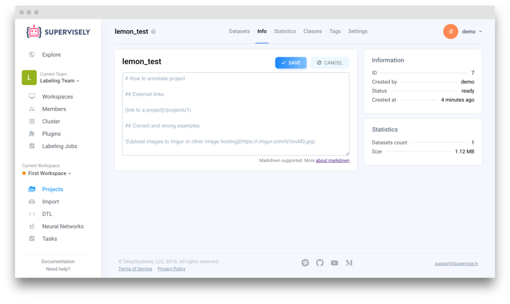
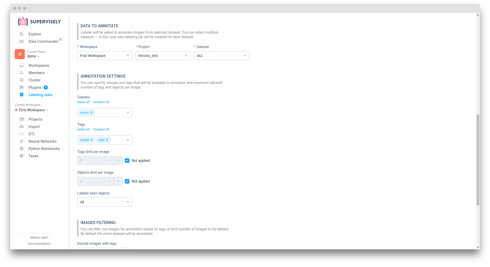
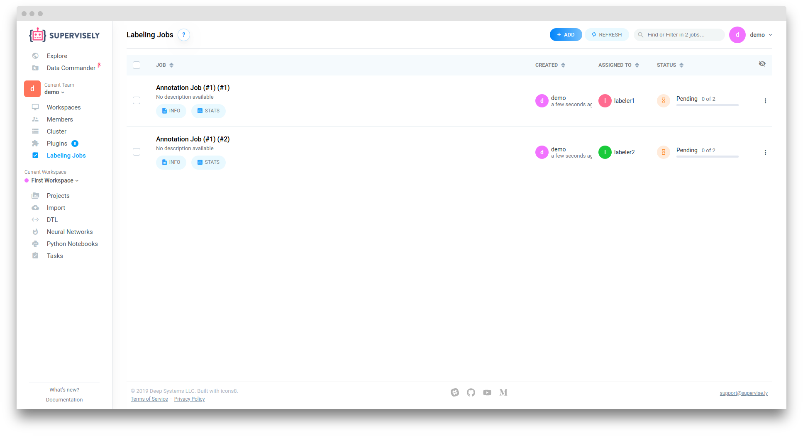
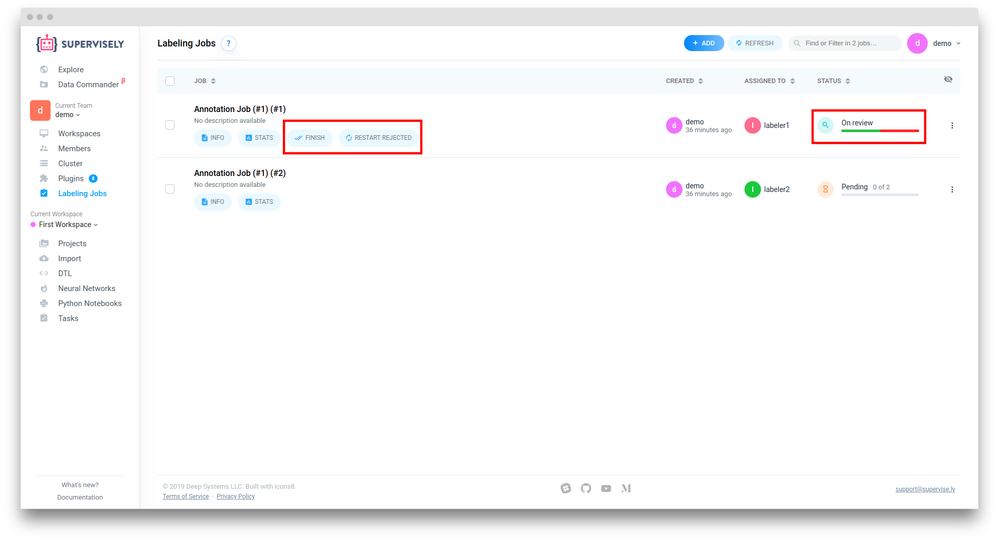
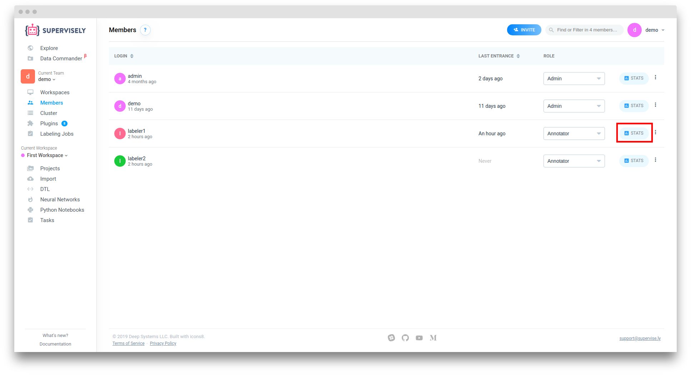
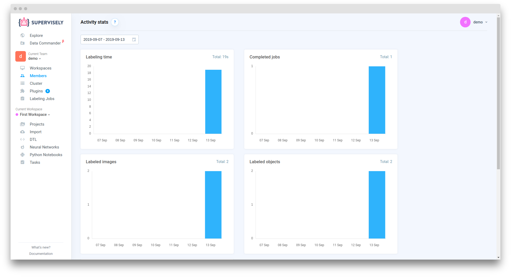

# Labeling Jobs

Labeling Jobs allow assigning annotation tasks to labelers.

While you can call annotation interface directly from the Projects page, there are some difficulties you may face:

- Job management - the need to describe a particular task: what kind of objects to annotate and how
- Progress monitoring - tracking annotation status and reviewing submitted results
- Access permissions - limiting access only to specific datasets and classes within a single job

Labeling Jobs address these problems in the following way:

## Example

Consider this case: we want to annotate large project with two people, split the whole process into separate jobs and track overall progress. How to do that?

### 1. Set up a new team

This step is optional, but it's much more easier to manage access permissions when you have specialized teams for annotation jobs.

Click on the teams selector in the left menu to open teams list. Add a new team, for example, "Labeling team".

You can upload datasets to be annotated here or use "Clone to..." action to copy existing datasets from the other team.

### 2. Create accounts for labelers

You can invite an existing user from "Members" page or create new ones from "Users" section of admin user. In this example we will show both ways.

Click "Signup" button and enter login and password for a new labeler account. We will check "Restricted" option - in this case the new user will have no access to Explore section, won't be able to create or switch teams and no personal team will be created for them during signup.

Now go to the "Members" page and invite some existing user to your "Labeling team". Choose an "Annotator" role - that means that user won't have access to any page apart from "Labeling Jobs". You can choose a "Developer" role if you want that user to be able to upload new data, but we advice to upload datasets in a separate "Working" team and then clone them to "Labeling" team - that way it will be easier to separate research from annotation and manage labeling jobs. 

### 3. Provide a description

Let's make some README for the project to be annotated. Open the "Projects" page, choose your project and go to the "Info" tab. Click the "edit" button to edit project readme information. We support markdown so you can attach images with annotation examples, describe valid and invalid cases and so on.

### 4. Create a new labeling Job

Open "Labeling Jobs" page and click "Add" in the top left corner .

You can change "labeling job" name, add description and readme if you want. Then assign one or more labelers to this job. In our exmaple we selected two users so images in selected datasets will be equally divided between them.

Then in "Data to annotate" section choose your project and dataset. Then in section "Annotation settings" select classes and tags that will be available to the labeler. Additionally, you can limit the number of objects and tags that the labeler can create on each image.

In "Images filtering" section you can specify the parameters by which images will be filtered for annotation. In our case, the "Images range" parameter is disabled, since we assigned this "labeling job" to two users and it will be calculated automatically

Click "Create" to finish. You will be redirected to "labeling jobs" page. Here we see that for each labeler a separate "labeling job" was created

### 5. Complete Jobs

Let's sign in as a labeler. 

As you can see, "labeler1" can only access labeling jobs in this team. But they see all jobs assigned to them. The "Info" button provides the necessary information about the labeling job and project readme we set up earlier.

If we click on the job title you will be redirected to the annotation tool. This will automatically change the job status from "Pending" to "In progress" so that manager can see that the job has been started.

As you can see, we can't create new classes and only classes that were selected on creating "labeling job" are available to us. Annotate an image and when we are done, click "Confirm" to mark that image as completed. Manager will see our progress in the jobs list. He can also track labeling statistics like created objects count, annotation average time per class, etc.

After all images was annotated go back to "Labeling Jobs" and click the "Submit" button. This will mark job as completed and remove it from labeler list.

Let's get back to the Manager account.

After the annotator completes the "labeling job", its status will change to "On review". Click on the name of the "labeling job" and accept or decline the annotations of each image. 

After all the images are checked, go back to the "labeling jobs" list and complete the "labeling job" or, if there are rejected images, restart it

## Statistics

There are two types of statistics:

- Member stats
- "Labeling job" stats

### Member statistics

Go to the "Members" page and click "Stats" button

"Member" statistics contain information about user actions in the current team. It can be filtered by the selected time period and contains information about:

- Labeling time
- Completed jobs
- Labeled images
- Labeled objects
- Reviewed images

### "Labeling job" statistics
To view annotation click "Stats" button under the "labeling job".

"Labeling job" statistics divided into three parts:

- Job activity - general information about "labeling job"
    - Labeled images - annotated images count
    - Job duration - Total time from creating "labeling job"
    - Editing duration - total time of objects editing
    - Annotation duration - total time spent in annotation interface
- Statistics per class 
- Statistics per image
