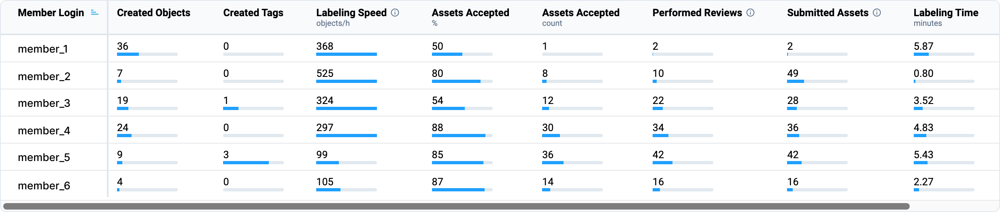

## 1. Introduction

The **Labeling Performance** page is a powerful analytics tool that provides detailed insights into the data annotation process within your team or project. It helps you track team efficiency, monitor individual annotator performance, identify bottlenecks, manage annotation quality, and make data-driven decisions with confidence.

## 2. Why Use Supervisely Labeling Analytics

Unlike other platforms, **Supervisely** offers an advanced and comprehensive analytics system that is available **for free** to all users, including those on the **Free plan**. It allows you to analyze annotation performance across your entire team and across multiple projects, offering a high level of detail and control.

A wide range of filters allows you to tailor the statistics to your specific needs, making the analysis flexible, personalized, and deep. This is especially valuable for teams and companies aiming to optimize their labeling processes, better allocate resources, and improve the quality of training data for AI models.

## 3. How to Use Labeling Performance

### Filters

In the **top-right corner** of the page, you will find a set of filters that affect all charts:

* **Time period filter**
* **Data type filter** (images, videos, DICOM volumes, point clouds, point cloud episodes)
* **Project filter**
* **Labeling job filter**

These filters allow you to adjust the statistics to your specific analysis needs and extract exactly the information you need.

### Progress Tracking

You can quickly and visually monitor the **progress or decline** in labeling performance for the selected period compared to a previous time frame—without needing to change the time range in the filter.

## 4. Charts overview

### 1. **Status of Assets**

**What it shows:**
Number of assets (images, videos, etc.) that changed their annotation status within the selected time period.

**Note:** Status changes do not always reflect actual label edits. An asset may change status without updates, and vice versa.

**Benefits:**
Track overall annotation progress and assess team activity across projects.

---

### 2. **Objects Section**

This section displays the **total number of annotation objects** created during the selected period, along with two interactive charts:

* **Bar charts: Classes distribution among objects**
* **Scatter chart: Classes distribution among objects**

**What are Objects?**
An annotation object is an individual labeled element within a data asset (e.g., image, video, point cloud).

**Examples:**

* A person labeled with a bounding box in an image
* A car segmented with a polygonal mask
* A tumor marked with a brush in a medical scan
* A tree annotated with a cuboid in a 3D point cloud

Each annotation object:

* Belongs to a class (e.g., "car", "pedestrian")
* Has a geometry (e.g., box, polygon)
* May include tags (e.g., "red", "moving")

#### Bar Charts: Classes Distribution Among Objects

**What it shows:**
A ranked list of object classes by the number of objects. Helps identify the most and least frequently used classes.

**Benefits:**
Useful for checking class balance within datasets. When filtered by a specific project, it helps evaluate how balanced the annotations are, which directly impacts model performance.

#### Scatter Chart: Classes Distribution Among Objects

**Chart variables:**

* **Y-axis:** Number of objects
* **X-axis:** Time (by selected period)
* **Small circles:** Classes
* **Circle color:** Class color and geometry type

**What it shows:**
Provides a timeline view of how many objects were labeled for each class over time.

**Benefits:**
Track annotation peaks and gaps for specific classes. Monitor annotation trends across projects.

Both the **bar and scatter charts** are interactive and linked: selecting classes in one chart filters the other accordingly.

---

### 3. **Assets**

**What it shows:**
Number of assets with any labeling activity (e.g., new labels, edits) during the selected period.

**Benefits:**
Assesses total annotation activity and team output over time.

---

### 4. **Labeling Actions**

**What it shows:**
Total number of labeling actions: object creation (e.g., bounding boxes, polygons) and tag assignments.

**Benefits:**
Provides a precise view of annotation activity, regardless of asset status.

---

### 5. **Team Activity (Heatmap)**

**What it shows:**
Daily activity of each annotator, based on the number of labeling actions.

**Benefits:**
Identify high/low activity periods. Helps manage workloads and assess individual contributions.

---

### 6. **Labeling Time**

**What it shows:**
Total time spent by each team member in annotation interfaces while actively working. Inactivity of more than 5 minutes is excluded.

**Benefits:**
Track real active time spent on annotation tasks—not just open sessions.

---

### 7. **Labeling Speed**

**What it shows:**
Labeling speed in objects per hour (objects/h).

**Benefits:**
Evaluate team efficiency and compare individual performance.

---

### 8. **Average Time per Object**

**What it shows:**
The average time spent labeling one object:
`Avg Time per Object = Total Labeling Time / Total Objects`

**Benefits:**

* Analyze team performance
* Identify potential issues (e.g., complexity, unclear guidelines, training needs)
* Spot inefficient labeling workflows

---

### 9. **Acceptance Rate**

**What it shows:**
The percentage of assets marked as **Accepted** during the review stage of Labeling Jobs:
`Acceptance Rate (%) = (Accepted Assets / Total Reviewed Assets) * 100`

**Benefits:**
A core metric for annotation quality and consistency.

---

### 10. **Review Time**

**What it shows:**
Total time spent reviewing annotated assets.

**Benefits:**
When compared with Labeling Time, helps distinguish labeling time from review time.

---

### 11. **Avg Review Time**

**What it shows:**
Average time spent reviewing a single annotation (object or tag):
`Avg Review Time = Total Review Time / Number of Labels Reviewed`

**Benefits:**
Assesses reviewer workload and efficiency.

---

### 12. **Members Performance Table**

A crucial table with detailed stats per individual team member.

**What it shows:**

* **Login**
* **Created Objects** (during selected period)
* **Created Tags**
* **Labeling Speed** (objects per hour)
* **Assets Accepted (% and total)**
* **Performed Reviews**
* **Submitted Assets** (for review)
* **Labeling Time** (active time in minutes)
* **Member ID**

**How to use:**
If a performance drop is noticed in charts above, use this table to identify underperforming members. Use column sorting (sort icon in header) to find users with the lowest speed, quality, or activity.

<figure><figcaption></figcaption></figure>

---

### 13. **Classes and Tags Statistics Table**

This table shows statistics **by class** (default) or **by tag** (click "Tag" tab).

#### Class Mode

* **Class Name**
* **Objects:** Number of objects labeled with this class
* **Assets:** Number of assets containing this class
* **Labeling Time per Object** (in seconds)
* **Total Labeling Time** (in minutes)

#### Tag Mode

* **Tag Name**
* **Objects:** Number of objects labeled with this tag
* **Entities:** Number of assets where this tag was applied
