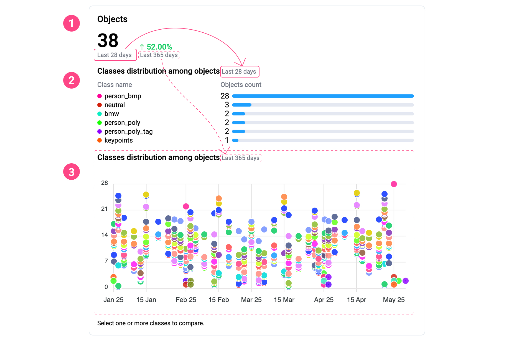


If you are looking for the 3D Point Cloud Labeling Toolbox page, you can find it [here](./3D-Point-Clouds/3D-point-cloud-episodes-2.md)


The **Labeling Performance** page is a powerful analytics tool designed to provide detailed statistics about the data annotation process within your projects. It helps you track team efficiency, monitor each member’s contributions, identify bottlenecks, manage annotation quality, and make informed decisions based on real data.

# Why it’s beneficial to use Supervisely statistics

**Supervisely** provides an extended analytics system that allows users to analyze labeling performance across the entire team and all projects simultaneously. This system is available absolutely free of charge for all users, including those on the Free plan.
The platform offers a wide range of filters to enable flexible, personalized, and in-depth analytics. This is especially valuable for companies and teams looking to improve annotation processes, utilize resources efficiently, and increase the quality of data used for training AI models.

## How to use the Labeling Performance page

**Filters**
In the upper-right corner of the page, you’ll find several filters that directly affect the data shown in all the charts:

* **Time period filter**
* **Data type filter** (images, videos, DICOM volumes, point clouds, point cloud episodes)
* **Project filter**
* **Labeling Job filter**

<figure><figcaption></figcaption></figure>

These filters allow you to finely customize the statistics for your specific needs and obtain the most relevant data for your analysis.

For example, if you filter by a **specific project**, all related **Labeling Jobs** and annotation activity will be shown in the charts.
Filtering by a **Labeling Job** lets you focus on activity within that exact task.

You can combine filters, such as selecting both a **project** and a specific **job** within it, to narrow down the scope of analysis even further.

**Filters help you:**

- Focus on specific tasks or team members,
- Compare performance across different projects,
- Track progress for individual jobs,
- Analyze team efficiency with precision.
 
 

**Track progress or regress**
You can quickly and visually monitor performance progress or decline for the selected time period, compared to a previous period, without switching the time filter. This helps identify trends and evaluate process efficiency instantly.

All the following chart sections follow the same structure:

1. The **large number** at the top displays the **total number of annotated items** (such as assets, objects, or actions) based on the selected time filter.

2. To the right of this number is a **percentage comparison** showing how much better or worse the current value is compared to the average for a longer reference period (usually the next available time interval in the filter list).

3. The **chart** below shows this next time interval in detail.

<figure><figcaption></figcaption></figure>

# Chart explanations

## 1. Status of Assets

**What it shows:** 
The number of assets (images, videos, DICOM volumes, point clouds) whose status changed during the selected annotation period.

**Asset Statuses Explained:**

* **Pending** - the asset is waiting to be annotated:

  * In **Labeling Jobs**, this means the asset has been assigned but annotation hasn't started yet.
  * In **Queues**, this status may include both assets waiting to be annotated and those currently in progress.


**Note:** The **Pending** status does **not** depend on the job’s creation date. Even if a Labeling Job was created a year ago, its assets will still appear in this chart as long as the job remains active and is not finished or stopped.


* **Submitted** - annotation has been completed and the asset has been submitted for review.

* **Rejected** - the asset was reviewed and marked as rejected. Depending on your workflow, it may stay as is, be returned for revision (e.g., in queues), or be included in a new job for re-annotation.

* **Accepted** - the asset was reviewed and approved. No further actions are required.


**Note:** A status change doesn’t always mean the annotations themselves were edited. For example, an asset’s status can change even if no actual labels were modified, and vice versa.


**How to use it:** 
Allows you to track annotation progress and measure overall team activity across projects.

<figure><figcaption></figcaption></figure>
 

## 2. Objects 

**What it shows:** 
The total number of **objects** (1) created during the selected time period, along with two charts:

* **Bar chart:** *Classes distribution among objects* (2)
* **Scatter chart:** *Classes distribution among objects over time* (3)

<figure><figcaption></figcaption></figure>


**Important:** In Supervisely, **objects** and **annotation objects** are not the same.


An **object** is a single labeled instance, geometry (e.g., a bounding box or polygon).

Examples of **objects**:
* A person marked with a bounding box on an image
* A person marked with a bounding box in video frame
* A car annotated using a polygonal mask
* A tumor on a medical scan marked with a brush
* A tree in a 3D point cloud highlighted with a cuboid

An **annotation object** is a special container used in some data types (like 3D point clouds, videos, etc.), but **not** in images. These containers can group multiple **objects** (geometries).

Example of **annotation object**: 
  A person is marked with a bounding box in multiple video frames. While each frame contains a separate **object** (geometry), they are all linked together as part of a single **annotation object** that represents the same person throughout the video.

**In this section, only plain objects are counted**, not annotation objects.

**Each object typically:**
  * Belongs to **class** (e.g., “car”, “pedestrian”)
  * Has a defined **geometry** (bounding box, mask, polygon, etc.)
  * May include **tags** (e.g., “color: red”, “moving”)


**Also note:** Objects are **grouped only by class name** - **regardless of project or geometry type**. If multiple projects use the same class name (e.g., “Car”), they will be counted together in this section.


### Bar Chart

**What it shows:** 
A list of objects grouped by their class names, sorted in descending order of object count.

**How to use:** 
Understand which object classes dominate your annotations.
Useful for identifying class imbalance across your team’s annotations - especially important when training AI models.

### Scatter Chart

**What it shows:** 
Distribution of object classes over time.

**Variables:**

* **Y-axis:** Number of objects
* **X-axis:** Time period
* **Dots:** Object classes
* **Dot color:** Matches the class and the geometry color in your labeling settings

**How to use:** 
Provides insights into the volume and frequency of object creation by class over time. It helps identify peaks or gaps in annotation activity.

#### Interactivity

These two charts are interactive and work together. You can select one or more classes in the bar chart (use `Ctrl` or `Cmd` for multi-select), and the scatter chart will update to display only those selected classes.

This is especially helpful for comparing annotation trends of specific classes over time.
 
 

## 3. Assets

**What it shows:** 
The number of assets (images, videos, DICOM volumes, point clouds) that had annotation activity (e.g., label creation or editing) during the selected period.


**Note**: On this chart, only the asset types that are actually present in the team's projects are included in the totals. If the team works with only one type of asset - for example, images - then only those will be counted in this section. In such cases, the section will be titled accordingly (e.g., "Images" instead of "Assets").


**How to Use:** 
Enables you to evaluate the overall annotation workload and how productivity changes over time.

<figure><figcaption></figcaption></figure>
 

## 4. Labeling Actions

**What it shows:** 
The total number of labeling actions, specifically including the creation of objects (geometries) and the assignment of pre-existing tags directly within the labeling tool. 
It **does not** include actions like creating or defining classes or tags as entities in the project’s Definitions tab.

**How to Use:** 
Provides a detailed view of actual annotation activity, independent of asset status.

<figure><figcaption></figcaption></figure>
 

## 5. Team Activity Heatmap

**What it shows:** 
This chart visualizes the daily annotation activity of team members, measured by the number of labeling actions performed each day. 
Labeling actions in this chart include:
- Creating, editing, and deleting objects (geometries) in the labeling tool
- Assigning tags, editing tag values, and removing tags within the labeling tool
- Changing the status of an asset (Submitted, Accepted, or Rejected) - performed by either annotators or reviewers

**How to Use:** 
* Quickly identify high-activity and low-activity days across the team.
* Spot productivity trends or potential issues (e.g., inactivity, inconsistent workloads).
* Use this data to better allocate resources, balance workloads, or adjust deadlines.

<figure><figcaption></figcaption></figure>
 

## 6. Labeling Time

**What it shows:** 
Total time each team member spent actively working in the annotation interface. This includes **only the time spent creating or editing objects** (e.g., geometries) within Labeling Jobs or Queues.

Time is **not counted** when the user is idle for more than 5 minutes, or when working outside of Labeling Jobs or Queues.
**Tagging or other non-shape interactions are not included** in this metric.

**How to Use:** 
Helps understand how much real, productive time the team spends on annotation (limited to shape creation/editing), not just how long the interface was open.

<figure><figcaption></figcaption></figure>
 

## 7. Labeling Speed

**What it shows:** 
The number of newly created objects per hour of active work in the labeling interface (within Labeling Jobs or Queues, with inactivity excluded).

**Labeling Speed is calculated as:** 
`Labeling Speed = Total number of objects / Active labeling time`

Where:

* **"Objects"** refer to newly created geometries (not edited or deleted ones).
* **"Active labeling time"** is the actual time spent working in the labeling interface, excluding:

  * periods of inactivity (no actions for more than 5 minutes),
  * time spent outside of Labeling Jobs or Queues.

**How to Use:** 
Helps assess efficiency and compare team performance. 
If the team’s overall labeling speed has suddenly decreased, it may indicate that specific team members are slowing down the process. To investigate, go to the **Members Performance Table**, locate the **Labeling Speed** column, and sort it in ascending order. This will bring the slowest-performing members to the top of the list for further analysis.

<figure><figcaption></figcaption></figure>
 

## 8. Average Time per Object

**What it shows:** 
Displays the **average labeling time** spent per object: 
`Avg Time per Object = Total labeling time / Total number of objects`

**Total Labeling Time** refers to the active time a user spent in the annotation interface within Labeling Jobs or Queues. It includes only the time spent creating or editing objects or tags, and excludes:

* periods of inactivity (no user actions for more than 5 minutes),
* time spent outside of Labeling Jobs or Queues.

This metric helps measure how much actual effort is required per object and can reveal inefficiencies or overly complex labeling tasks.

**Usage:**

* Evaluate overall team performance
* Identify efficiency issues
* If the average time per object is too high, it may indicate complex tasks, workflow problems, or the need for additional training for the team or specific members.

<figure><figcaption></figcaption></figure>
 

## 9. Acceptance Rate

**What it shows:** 
The percentage of assets accepted during the review stage in Labeling Jobs.

**Formula:** 
`Acceptance Rate (%) = (Accepted assets / Total assets) * 100`

**How to Use:** 
A key metric for assessing annotation quality. 
In Queue workflows, the total number of reviewed images does not necessarily equal the sum of accepted and rejected items.
The same image can be reviewed multiple times - for example, if it was rejected and later sent back for re-annotation, it may appear again in the queue and be reviewed again. This affects how assets are counted in the Acceptance Rate.

<figure><figcaption></figcaption></figure>
 

## 10. Review Time

**What it shows:** 
Total time spent on asset reviews.

**Review Time** refers to the active time a reviewer spends interacting with assets in review mode (inside Labeling Jobs). This time is counted only when the reviewer performs actions such as opening an asset, viewing it, accepting, or rejecting.

**Review Time excludes:**

* Periods of inactivity longer than 5 minutes,
* Time spent outside review mode (for example, when the review page is open but no interactions occur).

**How to Use:** 
This metric helps assess reviewer workload and the actual effort required to verify annotations.

<figure><figcaption></figcaption></figure>
 

## 11. Average Review Time

**What it shows:** 
The **average time** a reviewer actively spent per **asset** (e.g., image, video) during the review process in Labeling Jobs.

**Formula:** 
`Average Review Time = Total Review Time / Number of reviewed assets`

This metric reflects the **average amount of active time** a reviewer spent evaluating each asset - including actions such as opening the asset, viewing the annotations, and accepting or rejecting them.


**Note:** The system does **not track interactions with individual annotation objects** during review. Therefore, this time is calculated **per asset**, not per object or tag.


**How to Use:** 
Helps assess the **typical effort** reviewers spend on checking each asset and can be useful for optimizing review workflows or balancing review workload across the team.

<figure><figcaption></figcaption></figure>
 

## 12. Members Performance Table

An essential table that displays statistics for each individual team member.

**What it shows:**

* **Member Login** - The username or email address that the team member uses to log in to Supervisely. This is the primary visible identifier for each user in the table and is used to associate performance metrics with specific team members,
* **Created Objects** – Number of objects created by the member during the selected period,
* **Created Tags** – Number of tags assigned by the member during the selected period,
* **Labeling Speed** - The number of new objects annotated by a user per **hour of active work in the annotation interface**.
“Active work” means the time when the user is creating geometries or performing other annotation actions in Labeling Jobs or queues, excluding periods of inactivity (no actions for more than 5 minutes) and time spent outside these tasks.

  So, the speed is calculated as: 
  `Labeling Speed = Number of created objects / Active labeling time`

  
  **Note**: Only **created** objects are counted, not edited or deleted ones. The time reflects actual actions within the tool, not just having the interface open.
  

* **Assets Accepted (%)** – Acceptance rate for assets reviewed,
* **Assets Accepted (count)** – Number of accepted assets (images, videos, DICOM volumes, point clouds, point cloud episodes),
* **Assets Rejected** - The number of assets (images, videos, DICOM volumes, point clouds, or point cloud episodes) that the team member marked as Rejected while acting as a reviewer. This reflects the volume of annotations that were sent back or flagged during the review process,
* **Submitted Assets** – Number of assets submitted for review (as an annotator),
* **Performed Reviews** – Number of assets reviewed by the member (as a reviewer),
* **Labeling Time (min)** – Total active time spent on creating or editing objects (geometries) in the annotation interface,
* **Member ID** - A unique identifier automatically assigned to each team member in the system. Useful for internal tracking, integrations, or when multiple users have similar display names. It helps distinguish between users in large teams or when exporting performance data.

**How to use it:** 
If other charts show a drop in labeling performance, you can use this table to identify members with low metrics. Simply sort the table (using the sort icon next to each column header) to find users with the lowest speed or quality (Acceptance Rate).

<figure><figcaption></figcaption></figure>
 

## 13. Class and Tag Statistics Table

This table consolidates statistics by **class** or **tag**. By default, class statistics are shown. To view tag data, click “Tag” in the table header.

**In Class mode:**

* **Class name** - The name of the class as defined in the project’s labeling configuration (e.g., "Car", "Person", "Tree"),
* **Objects** – The total number of objects assigned to this class during the selected time period. These are counted across all projects and data types,
* **Assets** – The number of unique assets (images, videos, DICOM volumes, point clouds, point cloud episodes) containing this class,
* **Labeling Time per Object (seconds)** - The average time spent actively creating or editing each object of this class, excluding idle time and non-annotation activity,
* **Total Labeling Time (minutes)** - The total time spent actively annotating objects of this class across the entire dataset. Only creation and editing of objects are included, and only during active work periods.

<figure><figcaption></figcaption></figure>

**In Tag mode:**

* **Tag name** - The name of the tag assigned to objects or assets,
* **Objects** – The number of objects that have been assigned this tag,
* **Assets** – The number of assets (images, videos, DICOM volumes, point clouds, point cloud episodes) where this tag appears on at least one object or at the asset level.

<figure><figcaption></figcaption></figure>

Here’s a clear and user-friendly addition in English for the article, explaining all the ways to navigate to the **Labeling Performance** page with contextual filters applied:

# How to Access the Labeling Performance Page

There are several convenient ways to navigate to the **Labeling Performance** page, each automatically applying relevant filters (such as project or job) based on the context you came from:

1. **From the Sidebar Menu**
   You can always access the Labeling Performance page directly from the main sidebar menu. This option provides a general overview without pre-applied filters.
    
   <figure><figcaption></figcaption></figure>
    
2. **From the Project Page → QA & Stats Tab**
   Go to a specific project page, open the **QA & Stats** tab, and click **Labeling Performance** in the navigation menu on the right. The page will scroll to the Labeling Performance section where you can click the **Labeling Performance** link. This takes you to the Labeling Performance page with the corresponding **project filter** already applied.
    
   <figure><figcaption></figcaption></figure>
    
3. **From the Project Page Quick-action button**
   On a specific project page, click the arrow next to the **Annotate** button and select **Labeling Performance** from the dropdown menu. This takes you to the Labeling Performance page with the **project filter** already applied.
    
   <figure><figcaption></figcaption></figure>
    
4. **From the Labeling Jobs Page**
   On the **Labeling Jobs** page, you’ll find a **Performance** button located under each job. Clicking it will take you directly to the Labeling Performance page with the **corresponding job filter** automatically applied.
    
   <figure><figcaption></figcaption></figure>
    
These navigation methods make it easy to analyze annotation metrics with the relevant filters pre-set, saving time and improving workflow efficiency.
