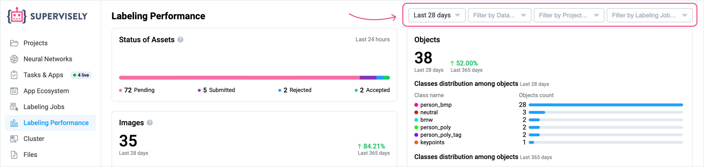

The **Labeling Performance** page is a powerful analytics tool designed to provide detailed statistics about the data annotation process within your projects. It helps you track team efficiency, monitor each member’s contributions, identify bottlenecks, manage annotation quality, and make informed decisions based on real data.

## Why it’s beneficial to use Supervisely statistics

**Supervisely** provides an extended analytics system that allows users to analyze labeling performance across the entire team and all projects simultaneously. This system is available absolutely free of charge for all users, including those on the Free plan.
The platform offers a wide range of filters to enable flexible, personalized, and in-depth analytics. This is especially valuable for companies and teams looking to improve annotation processes, utilize resources efficiently, and increase the quality of data used for training AI models.

### How to use the Labeling Performance page

**Filters**
In the upper-right corner of the page, you’ll find several filters that directly affect the data shown in all the charts:

* Time period filter
* Data type filter (images, videos, DICOM volumes, point clouds, point cloud episodes)
* Project filter
* Labeling Job filter

These filters allow you to finely customize the statistics for your specific needs and obtain the most relevant data for your analysis.

For example, if you filter by a **specific project**, all related **Labeling Jobs** and annotation activity will be shown in the charts.
Filtering by a **Labeling Job** lets you focus on activity within that exact task.

You can combine filters, such as selecting both a **project** and a specific **job** within it, to narrow down the scope of analysis even further.

**Filters help you:**

- Focus on specific tasks or team members,
- Compare performance across different projects,
- Track progress for individual jobs,
- Analyze team efficiency with precision.

<figure><figcaption></figcaption></figure>
 

**Track progress or regress**
You can quickly and visually monitor performance progress or decline for the selected time period, compared to a previous period, without switching the time filter. This helps identify trends and evaluate process efficiency instantly.

All the following chart sections follow the same structure:

1. The large number at the top displays the total number of annotated items (such as assets, objects, or actions) based on the selected time filter.

2. To the right of this number is a percentage comparison showing how much better or worse the current value is compared to the average for a longer reference period (usually the next available time interval in the filter list).

3. The chart below shows this next time interval in detail.

<figure><figcaption></figcaption></figure>
 

## Chart explanations

### 1. Status of Assets

**What it shows:** 
How many assets (images, videos, DICOM volumes, point clouds) in labeling jobs and queues changed their labeling status during the selected period.

**Asset Statuses Explained:**
  * **Pending** — The asset is waiting to be annotated. It has been assigned but no annotation has been started yet.
  * **Submitted** — The asset has been annotated and sent for review. It is now waiting for a reviewer’s decision.
  * **Rejected** — The asset was reviewed and marked as rejected. Depending on the workflow, it may either be left as-is, sent back for revision (e.g., in queues), or included in a new job created for rework.
  * **Accepted** — The asset has been reviewed and approved. No further changes are required.


**Note**: Status changes don’t always mean the annotations themselves were edited. For example, an asset may change status without actual label updates, and vice versa.


**How to Use:** 
Allows you to track annotation progress and measure general team activity across projects.

<figure><figcaption></figcaption></figure>
 

### 2. Objects Section

At the top of this section, you can see the total number (1) of **annotation objects** created during the selected period, along with two charts:

  * **Bar chart** "Classes distribution among objects" (2) 
  * **Scatter chart** "Classes distribution among objects" (3)

  <figure><figcaption></figcaption></figure>

What is an **annotation object**? 
An annotation object is an individual element on an image, video, or other data type that has been highlighted and described using annotation tools.
Examples of annotation objects include:

  * A person marked with a bounding box on an image
  * A car annotated using a polygonal mask
  * A tumor on a medical scan marked with a brush
  * A tree in a 3D point cloud highlighted with a cuboid

  **Each annotation object typically:**
  * Belongs to a specific **class** (e.g., “car”, “pedestrian”)
  * Has a defined **geometry** (bounding box, mask, polygon, etc.)
  * May include **tags** (e.g., “color: red”, “moving”)

### Bar chart

**What it shows:** 
A list of objects sorted by the class they belong to, ordered by descending count of objects in each class.

**How to Use:** 
Helps you understand which object classes appear most frequently in your annotations.
When a specific project is selected via filters, this chart becomes a valuable tool for analyzing class balance in your dataset. Balanced data is critical for training accurate and fair AI models.

### Scatter chart

This chart includes 4 variables:

1. Y-axis: Number of objects
2. X-axis: Time period
3. Dots: Classes
4. Dot color: Corresponds to the class and the geometry color used for annotation

**How to Use:** 
Provides insights into the volume and frequency of object creation by class over time. It helps identify peaks or gaps in annotation activity.

**Interactivity:** 
The bar chart list "Classes distribution among objects" and the scatter chart "Classes distribution among objects" are interconnected and interactive. You can select one or multiple classes by holding the Command key (⌘) or Control key (Ctrl) in the bar chart list, and only the selected classes will be displayed in the scatter chart as well. This mode is useful for comparing only the classes that are relevant to your analysis.
 
 

### 3. Assets

**What it shows:** 
The number of assets (images, videos, DICOM volumes, point clouds) that had annotation activity (e.g., label creation or editing) during the selected period.


**Note**: On this chart, only the asset types that are actually present in the team's projects are included in the totals. If the team works with only one type of asset — for example, images — then only those will be counted in this section. In such cases, the section will be titled accordingly (e.g., "Images" instead of "Assets").


**How to Use:** 
Enables you to evaluate the overall annotation workload and how productivity changes over time.

<figure><figcaption></figcaption></figure>
 

### 4. Labeling Actions

**What it shows:** 
Total number of labeling actions, including object creation (bounding boxes, polygons, etc.) and tag assignments.

**How to Use:** 
Provides a detailed view of actual annotation activity, independent of asset status.

<figure><figcaption></figcaption></figure>
 

### 5. Team Activity Heatmap

**What it shows:** 
Annotator activity within the current team, measured by the number of labeling actions per day.

**How to Use:** 
Identifies spikes and drops in team activity. Useful for workload management and performance evaluation.

<figure><figcaption></figcaption></figure>
 

### 6. Labeling Time

**What it shows:** 
Total time each team member spent actively working in the annotation interface. This includes only periods with real activity — such as creating, editing, or deleting annotation objects (e.g., shapes), assigning tags, or interacting with labeling tools.

Time is not counted when the user is idle for more than 5 minutes, or when working outside of labeling jobs or queues.

**How to Use:** 
Helps understand how much real, productive time the team spends on annotation, not just how long the interface was open.

<figure><figcaption></figcaption></figure>
 

### 7. Labeling Speed

**What it shows:** 
The number of newly created annotation objects per hour of active work in the labeling interface (within Labeling Jobs or Queues, with inactivity excluded).

**Labeling Speed is calculated as:** 
`Labeling Speed = Total number of annotation objects / Active labeling time`

Where:

* **"Annotation objects"** refer to newly created figures (not edited or deleted ones).
* **"Active labeling time"** is the actual time spent working in the labeling interface, excluding:

  * periods of inactivity (no actions for more than 5 minutes),
  * time spent outside of Labeling Jobs or Queues.

**How to Use:** 
Helps assess efficiency and compare performance among team members.

<figure><figcaption></figcaption></figure>
 

### 8. Average Time per Object

**What it shows:** 
Displays the **average labeling time** spent per object: 
`Avg Time per Object = Total labeling time / Total number of objects`

**Total Labeling Time** refers to the active time a user spent in the annotation interface within Labeling Jobs or Queues. It includes only the time spent creating or editing objects or tags, and excludes:

* periods of inactivity (no user actions for more than 5 minutes),
* time spent outside of Labeling Jobs or Queues.

This metric helps measure how much actual effort is required per object and can reveal inefficiencies or overly complex labeling tasks.

**Usage:**

* Evaluate overall team performance
* Identify efficiency issues
* If the average time per object is too high, it may indicate complex tasks, workflow problems, or the need for additional training for the team or specific members.

<figure><figcaption></figcaption></figure>
 

### 9. Acceptance Rate

**What it shows:** 
The percentage of assets accepted during the review stage in Labeling Jobs.

**Formula:** 
`Acceptance Rate (%) = (Accepted assets / Total assets) * 100`

**How to Use:** 
A key metric for assessing annotation quality.

<figure><figcaption></figcaption></figure>
 

### 10. Review Time

**What it shows:** 
Total time spent on asset reviews.

**Review Time** refers to the active time a reviewer spends interacting with assets in review mode (inside Labeling Jobs). This time is counted only when the reviewer performs actions such as opening an asset, viewing it, accepting, or rejecting.

**Review Time excludes:**

* Periods of inactivity longer than 5 minutes,
* Time spent outside review mode (for example, when the review page is open but no interactions occur).

This metric helps assess reviewer workload and the time required for quality checking annotations.

**How to Use:** 
By comparing this with Labeling Time, you can calculate how much time was spent specifically on annotation (i.e., `Labeling Time - Review Time`).

<figure><figcaption></figcaption></figure>
 

### 11. Average Review Time

**What it shows:** 
The average review time per label (figure or tag).

**Formula:** 
`Avg Review Time = Total Review Time / Number of labels reviewed`

**How to Use:** 
Helps measure reviewer workload and review process efficiency.

<figure><figcaption></figcaption></figure>
 

### 12. Members Performance Table

An essential table that displays statistics for each individual team member.

**What it shows:**

* **Member Login**
* **Created Objects** – number of objects created by the member during the selected period
* **Created Tags** – number of tags assigned by the member during the selected period
* **Labeling Speed** is the number of new objects annotated by a user per **hour of active work in the annotation interface**.
“Active work” means the time when the user is creating shapes or performing other annotation actions in Labeling Jobs or queues, excluding periods of inactivity (no actions for more than 5 minutes) and time spent outside these tasks.

  So, the speed is calculated as: 
  `Labeling Speed = Number of created objects / Active labeling time`

  
  **Note**: Only **created** objects are counted, not edited or deleted ones. The time reflects actual actions within the tool, not just having the interface open.
  

* **Assets Accepted (%)** – acceptance rate for assets reviewed
* **Assets Accepted (count)** – number of accepted assets
* **Performed Reviews** – number of assets reviewed by the member (as a reviewer)
* **Submitted Assets** – number of assets submitted for review (as an annotator)
* **Labeling Time (min)** – total active time spent in the annotation interface
* **Member ID**

**How to use it:** 
If other charts show a drop in labeling performance, you can use this table to identify members with low metrics. Simply sort the table (using the sort icon next to each column header) to find users with the lowest speed or quality (Acceptance Rate).

<figure><figcaption></figcaption></figure>
 

### 13. Class and Tag Statistics Table

This table consolidates statistics by **class** or **tag**. By default, class statistics are shown. To view tag data, click “Tag” in the table header.

**In Class mode:**

* **Class name**
* **Objects** – number of objects assigned to the class
* **Assets** – number of assets (images, videos, etc.) containing this class
* **Labeling Time per Object (seconds)**
* **Total Labeling Time (minutes)**

**In Tag mode:**

* **Tag name**
* **Objects** – number of objects assigned this tag
* **Entities** – number of assets (images, videos, etc.) containing this tag.

<figure><figcaption></figcaption></figure>

<figure><figcaption></figcaption></figure>