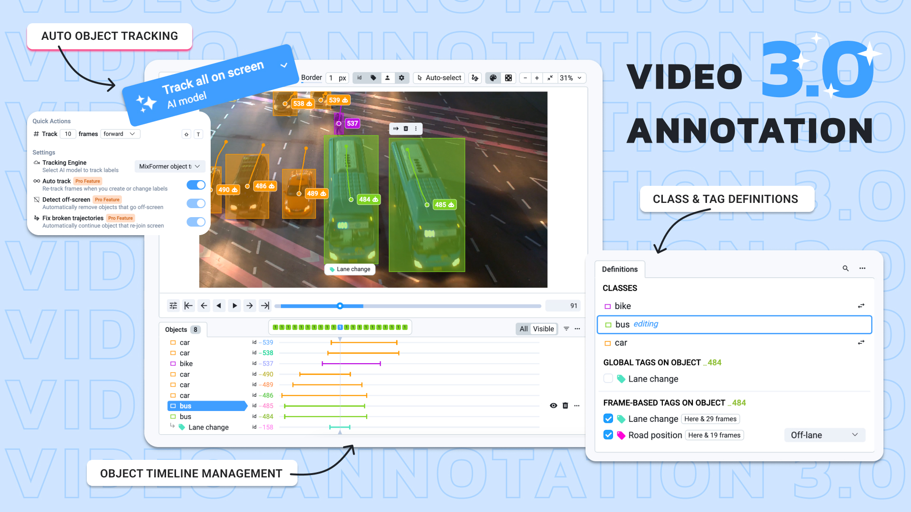
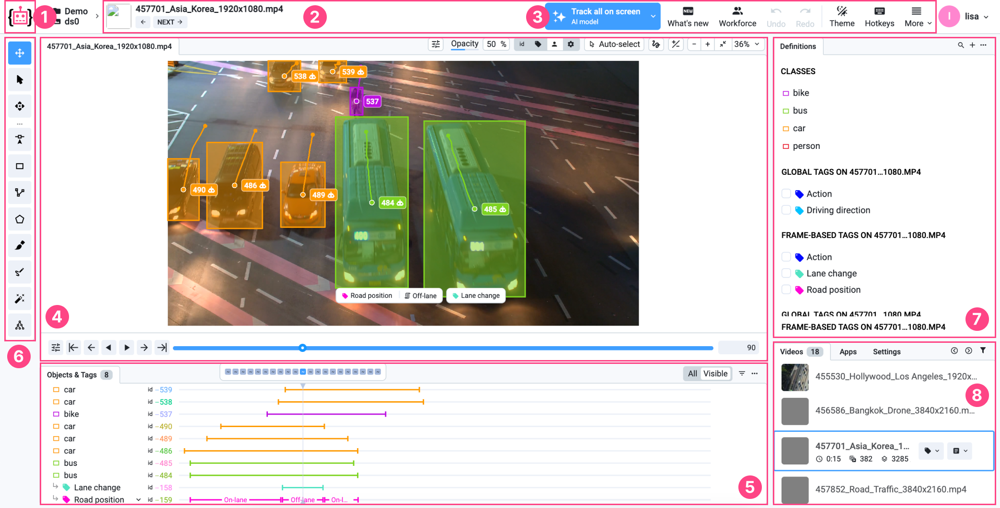

# Videos 3.0

**Video Annotation Tool 3.0** is designed to simplify and streamline the complex task of video annotation, which involves not only labeling multiple frames, but also tracking the relationships between them to ensure consistent object tracking and accurate labeling.

<figure><figcaption></figcaption></figure>

***

**Auto Tracking**: This AI-powered functionality leverages Supervisely Apps and advanced tracking models like MixFormer to automatically choose the best model for various geometry types (bounding box, skeleton, mask, etc.). Auto Tracking not only predicts labels as you move through frames but can also stop tracking when an object leaves the scene, significantly boosting labeling efficiency.

**Definitions Panel**: The revamped Definitions Panel is designed to streamline video labeling by making classes quickly searchable and immediately accessible. Tags can now be assigned globally or frame-by-frame, with options to apply tags to either specific objects or entire videos. This feature allows for greater flexibility in organizing and managing video tags.

**Intuitive Frame Tagging**: Tagging frames is now much simpler. Users can apply tags by checking a box on the current frame, with options to define the tag range either from the current frame to the end, or from frame 0. The tag can also be modified or removed with ease, making it straightforward to label specific ranges without unnecessary steps.

**New Objects & Tags Timeline**: A major improvement in Video Toolbox 3.0, this panel displays a comprehensive overview of all objects and tags across the entire video. Users can quickly jump to specific frames, adjust tag values, and perform various actions from the context menu, while the smaller floating zoomed timeline aids in precise adjustments.

**Trajectories View**: The Trajectories view visualizes object movement across frames, helping users quickly identify tracking errors, especially with static cameras. This feature is invaluable for quality control, as it shows the path of each object and makes inconsistencies in tracking easy to spot.

**Quick Actions Panel**: To save time when annotating large videos, the floating quick actions panel appears beside the annotation object, enabling rapid access to functions such as moving, deleting, or adjusting bounding boxes, thereby minimizing unnecessary cursor movements.

***

## **Overview**

<figure><figcaption></figcaption></figure>

1. **Home button** — returns user to the main menu (Projects page)
2. [Basic interface elements](videos-3.0.md#basic-interface-elements) — basic settings, such as history of operations, theme, a hotkeys map and more useful features.
3. [Auto-Tracking](videos-3.0.md#auto-tracking) — button to start tracking and adjust tracking settings.
4. [Main scene & labeling scene settings & playback](videos-3.0.md#main-scene-and-labeling-scene-settings-and-playback) — annotation area for current video and its labels.
5. [Objects & Tags & Timeline](videos-3.0.md#objects-and-tags-and-timeline) —  video timeline and overview of all objects and tags throughout the entire video.
6. [Instruments panel](videos-3.0.md#instruments-panel) — annotation tools used to create annotations.
7. [Definitions panel](videos-3.0.md#definitions-panel) — make it easy to create, manage and assign classes and tags.
8. [Videos/Apps/Settings panel](videos-3.0.md#images-panel) — list of videos in your dataset, list of additional apps you can embed into the labeling toolbox, visualization and other settings.

***

## Video Annotation Tool 3.0 Tagging and Tracking Guide

This guide provides detailed instructions for using auto-tracking and tagging features in Video Annotation Tool 3.0.

### Step 1. **Run Auto-Tracking**

1. **Open the video** you want to annotate.
2. **Annotate the object** with the desired class, such as a bounding box, skeleton, or mask.
3. **Select the object** you want to track by clicking on it within the video frame.
4. **Click the Auto Tracking button** to activate the Auto Track application. By default, Auto Track will be used, but you can also select other models, like [**Serve Segment Anything**](https://app.supervisely.com/ecosystem/apps/serve-segment-anything-2) or [**MixFormer**](https://app.supervisely.com/ecosystem/apps/supervisely-ecosystem/mixformer/serve/serve), depending on your tracking needs.
5. **Configure tracking settings** by adjusting options such as:
   * **Auto-tracking mode**: Automatically re-tracks the object when labels change or as you move forward through frames.
   * **Detect off-screen**: Automatically stops tracking and removes objects when they go off-screen.
   * **Tracking By Detection**: Automatically finds and tracks new objects in the scene when you extend the track by clicking forward in the video.
6. **Scroll through the video** to view auto-generated label predictions and updates. If the object leaves the frame, tracking will automatically stop.

### Step 2. Configuring the Definitions Panel

1. Go to the Definitions Panel and select the necessary label classes for objects.
2. Use the search bar to quickly access the desired class.
3. Set tags as either global (for the entire video or object) or frame-based (for specific frame ranges).
4. Specify whether each tag applies to the video, object, or both.

Apply global tags like "car," "pedestrian," and "traffic light," along with frame-based tags for traffic light states ("red," "green").

### **Step 3. Applying Frame-Based Tags**

1. On the frame where you want to set a tag, check the box next to the relevant tag.
2. A window will appear where you can select the start and end points for the tag. By default, the tag will apply from the current frame to the end of the video.
3. Uncheck the box at the desired frame to end the tag range.
4. Adjust tag values or edit ranges as needed.

### Step 4. **Using the Objects & Tags Panel**

1. Go to the **Objects & Tags Panel** to get an overview of all objects and tags in the video.
2. Easily navigate to specific segments.
3. Use the minimized timeline for precise adjustment.

### **Step 5. Viewing Trajectories**

1. Activate **Trajectories** to visualize object movement across frames.
2. Review the object's movement; trajectories help identify errors, such as tracking mistakenly jumping to a different object.

## Basic interface elements 

The top toolbar contains options for personalizing the interface and managing data and its annotations.

**Video navigation arrows (next, previous):** Allow users to move between videos in the dataset.

**Undo and redo buttons:** Undo or redo the most recent annotation action.

**Select theme (dark or light):** Ability to switch between light and dark interface themes, especially useful for those who prefer to work at night.

**Hotkeys:** A list of hotkeys for quick access to tools.

**More options:**

* **Enter fullscreen** - this option allows the user to switch the interface to fullscreen mode, maximizing the workspace area. It hides browser toolbars and other elements
* **Screenshot** - the screenshot function enables users to take a snapshot of the current workspace, including the video and any annotations displayed. This can be useful for documentation, sharing progress, or reviewing annotations with team members.
* **Enter restore mode** - enter restore mode provides tools to recover lost or corrupted annotations. When enabled, it offers options to revert changes to a previous state or repair specific parts of the annotation dataset.
* **Restore default layout** - this function resets the interface layout to its default configuration. It is useful when the layout has been modified (e.g., panels moved or resized) and the user wants to return to the original setup.

***

## Auto-Tracking

This smart functionality is powered by Supervisely Apps that work on top of existing tracking apps from our [ecosystem](https://ecosystem.supervisely.com/), such as [MixFormer](https://ecosystem.supervisely.com/apps/mixformer/serve/serve). Auto Tracking intelligently selects the right model based on the type of geometry you’re working with — whether it’s a bounding box, skeleton, mask, or other types.\
As you move through your video or modify labels, **Auto Tracking** predicts labels automatically. But it gets better! The feature is now enhanced with the latest AI developments. For example, it can detect when an **object leaves the scene and stop tracking it**.

***

**1. Auto-Tracking Mode**

* **Automatic Tracking Extension**: Auto-Tracking Mode automatically extends tracking when the user reaches the last 10 frames of the current tracked segment. This feature prevents the need to manually restart tracking, ensuring seamless object tracking, especially in long or dynamic videos.
* **Re-tracking on Label Changes**: When Auto-Tracking Mode is enabled, the tool will automatically re-track the object if labels are modified or as you move through frames. This is useful for dynamic scenes where the object may change shape or position, such as tracking people or vehicles.

***

**2. Track Frames**

* This setting allows you to specify the number of frames to track and the direction of tracking (forward or backward).
* For example, setting "Track 10 frames forward" will extend tracking of the object for the next 10 frames, which is ideal for short but predictable movements, like a car moving a short distance on a road.

***

**3. Interpolate Until Next Real Frame**

* **Interpolation** allows the system to fill intermediate frames between keyframes, creating smoother transitions and enhancing annotation accuracy.
* This feature is ideal for scenes with steady movement, such as a person walking along a straight path, where it’s unnecessary to manually label every frame.

***

**4. Detect Off-Screen**

* **Automatic Removal of Off-Screen Objects**: If an object moves out of the camera’s view, the Detect Off-Screen feature will automatically stop tracking it and remove the label from subsequent frames.
* This feature is useful for videos where objects may leave the frame, such as a vehicle exiting the scene.

***

**5. Tracking By Detection**

* **Detecting and Tracking New Objects**: This feature enables the system to automatically detect and start tracking new objects as you extend tracking by moving forward through frames.
* Tracking By Detection is ideal for crowded scenes, like busy streets, where new objects, such as pedestrians or vehicles, frequently enter the frame and require immediate tracking.

***

**6. Tracking Engine**

* **Selecting a Tracking Model**: Auto-Tracking supports multiple models, such as **Auto Track**, **MixFormer**, and **Serve Segment Anything**. Each model is suited to different tracking tasks — from general object tracking to precise segmentation tracking.
* Users can choose the model that best fits their project needs, such as tracking complex shapes or small objects.

***

## Main scene & labeling scene settings & playback 

This is the central area. It displays the video to be annotated, with various display controls that the user can hide or show in the panel as needed.

Main scene shows the video currently being worked on. Users can interact directly with this area using the annotation tools from the sidebar.

#### Annotation display settings 

**Opacity:** To modify the transparency of objects, hold and drag the cursor left or right. This allows for a more nuanced view of the objects' layers. Additionally, you can hold the `SHIFT` key and scroll the mouse wheel to adjust the opacity conveniently from anywhere on the screen.

**Border:** Enhance the visibility of object boundaries by holding and dragging the cursor left or right. This action changes the width of the objects' borders, allowing for clearer demarcation. Useful when working with huge resolutions or with large number of small objects

**Point:** Adjust the radius of object points by holding and dragging the cursor left or right.

**Default color:** Paint objects with their original colors as defined in class settings. This is the default setting and helps maintain consistency and recognition. So the objects of different classes are visually distinguishable.

**Randomize color:** Randomize object colors to distinguish between objects of the same class. A simple click, followed by `SHIFT+H`, randomizes the object's colors. Can be used in Instance Segmentation Computer Vision task to highlight visual distinction of all objects of the same class on an image.

<figure><figcaption></figcaption></figure>

#### Attribute display settings for clearer context 

**ID:** Toggle the visibility of object IDs near the objects on the scene. This is essential for identifying and referring to specific objects.

**Bindings:** Show or hide bindings near objects to understand how various elements are connected to each other. [Objects can be combined into groups](https://developer.supervisely.com/advanced-user-guide/objects-binding).

**Tags:** Display tags near objects to provide additional context or categorization.

**Classes:** Enable visibility of the classes assigned to each object, helping in the classification and organization of scene elements.

**Author:** Display the creator's name near the objects to acknowledge object authorship.

**Change Visibility Mode:** This option allows users to switch between different visibility modes, optimizing the scene display as per the user's preference. You can choose how to show the attributes:

* **Always** | Users can select full tag display, which means that the information will be visible directly on Objects or Videos in the project.
* **Show on hover** | Tags are only displayed when the cursor is hovered over the annotated object.
* **Show when selected** | The ability to hide Tags until the Object is selected provides a cleaner look and feel to the interface and prevents information overload when working with a project.

<figure><figcaption></figcaption></figure>

#### Advanced interaction with scene objects 

**Auto-select:** Automatically select objects of the current shape when hovering the cursor over them.

**Show object trajectory:** Visualize the path an object has taken in the scene over time.

You can customize the way the trajectory looks using the following settings:

* **Width (px):** This setting controls the thickness of the trajectory line in pixels. A higher value makes the line thicker, making the trajectory more visible, while a lower value makes the line thinner.
* **Draw backward frames:** This option controls how many frames in the past are drawn to represent the object's trajectory. Users can adjust the number of frames using a slider, allowing them to visualize the object's past movements over a longer or shorter period of time.
* **Draw forward frames:** This option controls how many frames in the future are drawn to represent the predicted path of the object. Users can adjust the number of frames using a slider, which helps plan and visualize future motion.

<figure><figcaption></figcaption></figure>

#### Customizing image display settings 

**Scene display settings:** Adjust scene display settings like brightness or contrast to suit different viewing conditions or preferences. For example, you can use them while annotation dark or low-contrast images.

**Grid:** A grid helps organize the navigation on the images with high resolutions and large number of small objects.

<figure><figcaption></figcaption></figure>

#### Visibility and image sizing 

The ability to hide annotation settings declutters the workspace, focusing attention on the task at hand.

Real-time image resizing adapts to various project needs, ensuring optimal viewing and editing conditions. Just zoom-in or out on the images to see object details and perform precise labeling of object boundaries.

<figure><figcaption></figcaption></figure>

#### **Playback controls** 

**Play/Pause buttons(ENTER)**: Standard playback controls to play or pause the video.

**Play video backwards:** Plays the video from the current frame backwards, i.e. from the current frame to the previous frame, and so on to the beginning of the video.

**Previous/Next frame (<- | ->):** Buttons to jump to the previous or next frame.

**Previous/Next 10 frame** **(ALT + <- | ALT + ->):** Buttons to jump to the previous or next 10 frame.

**Frame counter and time display**: Shows the current frame number, total number of frames, and current time position in the video (e.g., "100 / 384" or "0:04 / 0:16"). For example, `122 / 384` means you are at frame 122 out of 384 total frames.

**Track length slider**: Allows you to quickly scroll through the video frames by dragging the slider left or right. Annotated segments of the video are displayed by blue color line.

#### **Playback settings** 

**Speed:** Controls the playback speed (e.g., x2).

**Skip frames:** Allows skipping a specified number of frames during navigation (e.g., +/- 10 frames).

**Fast decoding mode:** Enabling this mode speeds up the video playback process.

**Navigation bar settings:** Switches between different modes for the navigation bar, such as

* **Figures:** show frames with objects
* **Tags:** show frames with tags
* **Auto:** show frames with figures/tags based current selection

\

<figure><figcaption></figcaption></figure>

## Objects & Tags & Timeline

The **Objects & Tags Panel** provides a clear overview of all objects and tags in your video, allowing for efficient navigation and editing.&#x20;

Instead of relying on a single, zoomed-in timeline (which only shows about 50 frames at a time), this panel gives you a **clear overview** of all objects and tags throughout the entire video. You can easily jump to specific segments, adjust tag values, or use various actions from the context menu.

<figure><figcaption></figcaption></figure>

We’ve kept the floating zoomed timeline as well, but now it’s much smaller and designed to help you focus on precision while the Objects & Tags Panel gives you the full picture. You may click on the interesting frame or use your mouse scroll.

1. **Access the Objects & Tags Panel**: This panel displays a timeline for each object and tag, making it easy to see when and where tags have been applied across the video.
2. **Navigate and Select Objects**: Each object (e.g., "car," "bus") has an assigned ID and color-coded timeline. You can select specific objects or tags by clicking on them directly in the panel, allowing you to focus on individual elements without switching frames.
3. **Adjust Tag Ranges**: Each tag (e.g., "Road position," "Lane change") is shown on the timeline with segmented bars indicating its duration. Tags like "On-lane" or "Off-lane" help indicate changes across the timeline.
   * To edit a tag, click on it directly on the timeline. You can drag the edges to adjust its duration or click within the segment to modify it further.
4. **Remove Tags**: To delete a tag, click on the **three dots menu** next to the tag entry. Select **Remove Tag** from the dropdown menu, as shown in the screenshot, to delete it from the selected range.
5. **Control Visibility and Filter**: Use the **Visible/All** filter toggle at the top of the panel to control which objects and tags are visible on the timeline. This helps to declutter the view and focus on specific elements.
6. **Use Timeline for Precision**: Each object and tag timeline is color-coded, allowing for easy identification. The minimized timeline view lets you accurately pinpoint where tags start and end, making adjustments quick and precise.

***

### **Instruments panel** 

[**Pan & Move Scene Tool:**](https://docs.supervisely.com/labeling/labeling-toolbox/videos#basic-interface-elements) Quickly navigate around the image without modifying annotations.

[**Select Figure**:](https://docs.supervisely.com/labeling/labeling-tools/navigation-and-selection-tools) Select and modify existing annotations; essential for refining objects.

[**Drag Figure:**](https://docs.supervisely.com/labeling/labeling-tools/navigation-and-selection-tools) Reposition annotations without altering their size or shape.

[**Point Tool:**](https://docs.supervisely.com/labeling/labeling-tools/point-tool) Label specific points or small objects precisely.

[**Bounding Box:**](https://docs.supervisely.com/labeling/labeling-tools/bounding-box-rectangle-tool) Best for object detection tasks.

[**Polyline Tool:**](https://docs.supervisely.com/labeling/labeling-tools/polyline-tool) Annotate linear objects or edges with multiple connected line segments.

[**Polygon Tool:**](https://docs.supervisely.com/labeling/labeling-tools/polygon-tool) Ideal for irregular and complex shapes.

[**Brush and Eraser Tool:**](https://docs.supervisely.com/labeling/labeling-tools/brush-tool) Flexible for both polygonal and free-form masks.

[**Mask Pen Tool:**](https://docs.supervisely.com/labeling/labeling-tools/mask-pen-tool) Great for segmenting diverse objects with varying shapes.

[**Smart Tool:**](https://docs.supervisely.com/labeling/labeling-tools/smart-tool) Efficient for quick, AI-assisted segmentation.

[**Graph (Keypoins) Tool:**](https://docs.supervisely.com/labeling/labeling-tools/graph-keypoints-tool) For pose-estimation tasks.

<figure><figcaption></figcaption></figure>

***

## Definitions Panel

In Video Toolbox 3.0, the Definitions Panel has been revamped for video labeling, building on what we’ve previously [introduced](https://supervisely.com/blog/definitions-panel/) for image labeling.

Just like with image labeling, you can now quickly search for classes and start labeling right away without needing to manually select the appropriate tool. All your classes of labels are presented clearly on your screen for fast access.

For video, we’ve added the ability to assign tags globally or frame-by-frame. Global tags can be applied to entire videos or specific objects, while frame-based tags let you mark specific ranges. You can even configure whether a tag is assigned only to the video, only to objects, or both. Global tags are assigned as usual: to the selected annotation object or to the current video, if none selected.

In previous versions, this was done by clicking the "clip" icon near the tag.

<figure><figcaption></figcaption></figure>

The Definitions panel provides a simple interface for creating and managing classes and tags in a project. It helps users organize and control annotations.

Instead of choosing a tool first, you can now click on the desired class from the Definitions Panel. The associated tool will be automatically selected, allowing you to start labeling immediately. To start a new label, simply click on any class (including the currently selected one) in the Definitions Panel.

If you want to change the class of the selected object, you can click the small icon on the right, which appears only if the new class shape matches the currently selected object. Tags are also present on the same panel. If no object is selected, image tags are shown. You can check the desired tag or hover the cursor and start typing a tag value or select it from a dropdown, which will automatically assign it.

**Improved Search:** To find classes or tags more easily in a long list, click the magnifying glass icon in the top right corner of the panel. Type your query and select the desired class or tag to continue your workflow.

***

## Videos panel 

The videos panel provides a comprehensive view of all the videos within a selected dataset. Key functionalities include:

* **Tag Management** - Clone tags from the previous video, assign new ones, or modify existing tags to maintain consistency and organization.
* **Filter and Manage** - View and edit metadata details or filter through videos to find exactly what you need.
* **Video Operations** - Delete videos, download them individually, or download annotations for external use.

***

## Apps panel: expand your capabilities 

In an ever-evolving ML landscape, the apps panel serves as a portal to a wide range of applications from the [Computer Vision Ecosystem](https://ecosystem.supervisely.com/), enhancing the functionality of your workspace. This window allows you to run and open the public or private apps and extend the Labeling Toolbox with custom UI and functionality.

***

## Settings panel 

The settings panel is the control center for personalizing the interface. It houses various options allowing users to tweak the interface to match their workflow, preferences, and project requirements.

<figure><figcaption></figcaption></figure>
