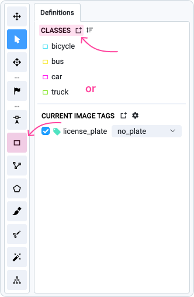
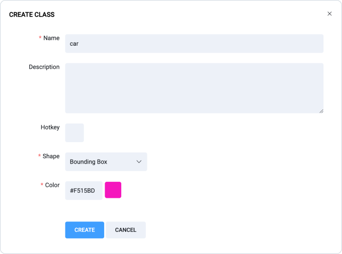
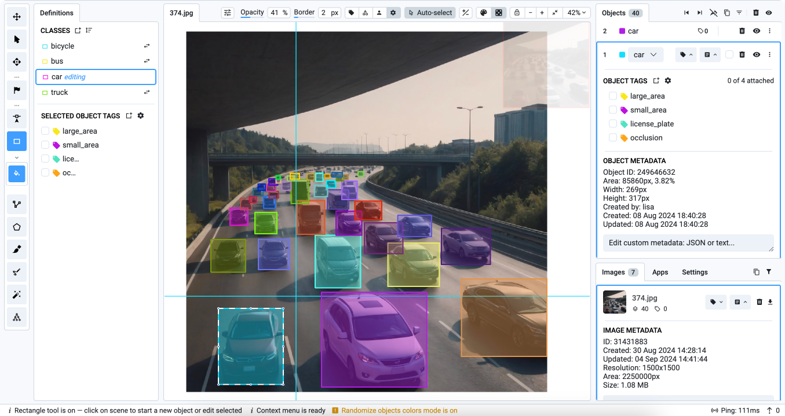

# Bounding Box (Rectangle) Tool

## What is a Bounding Box?

The[ Bounding Box](https://supervisely.com/blog/bounding-box-annotation-for-object-detection/#what-is-object-detection) is a fundamental tool in Computer Vision used for image annotation, object detection and tracking tasks.&#x20;

Rectangles that precisely enclose an object are commonly referred to as bounding boxes. These boxes are defined by coordinates that indicate the position and size of the object. Coordinates are usually specified as the top-left and bottom-right corners (or alternatively, by the center point, width, and height).

The main goal of a bounding box is to provide a clear boundary that the machine learning model can use to identify and locate objects in images or videos.

<figure><figcaption></figcaption></figure>

## Video Tutorial

Watch our 5-minute video tutorial that provides clear and simple instructions on how to create and use Bounding Boxes for image annotation in Supervisely Image Labeling Toolbox.



## How to use Bounding Boxes

We'll explore how to manually draw bounding boxes, including feutures and tips for efficiency and accuracy

### Create Bounding Box

You can create a new class directly from the [Annotation Toolbox](https://app.supervisely.com/ecosystem/annotation\_tools/image-labeling-tool-v2?). To do this:

1. Click on the **Rectangle Icon** in the toolbar of the labeling interface or **Add new class definition**.
2. A modal window will appear prompting you to enter the details of the new class.
3. **Enter the Class Name, select Bounding Box shape** and configure any additional settings, such as color or hotkey.
4. Click the `Create` button to add the new bounding box class to the Definitions list.

<figure><figcaption></figcaption></figure>

 

<figure><figcaption></figcaption></figure>

### Manual Annotation

To create a bounding box, select the object of interest in the image or video and place a rectangle around it. The fewer clicks required, the more efficient the annotation process will be. You don't have to finish labeling the previous object by pressing `SPACE` to move on to the next one; simply set new points.&#x20;


Always aim to create bounding boxes that tightly fit around the object to minimize background noise and enhance model performance.


### Tips

* Use **Auto-select** to switch between classes by hovering over the desired object. Also easily edit existing bounding boxes, including those predicted by Neural Networks.
* Use the **Object Color Randomizer** to instantly change the color of any object with a single click, as often as you like. This is particularly useful if you have many objects of the same class, or if they are close together, so you can easily differentiate between bounding boxes.

<figure><figcaption></figcaption></figure>

## Hotkeys

Control the BBox tool more efficiently with `HOTKEYS`.

<table data-full-width="false"><thead><tr><th width="454">Bounding Box (Rectangle) Tool</th><th>5</th></tr></thead><tbody><tr><td>Create &#x26; add point </td><td>, </td></tr><tr><td>Edit point</td><td>Drag</td></tr><tr><td>Drag bounding box</td><td>Alt + Hold </td></tr><tr><td>Drag bounding box</td><td>Alt + Arrow Keys</td></tr><tr><td><strong>You can create new bounding box immediately after.</strong></td><td></td></tr></tbody></table>

| Scene Navigation                                                                                                                                                                                                                                                                                                                                                                                                                                                                                                                                                                                                                                                                                                                                                                                                                                                                                                                                                                                                                                                                                                                                                                                                                                                    |
| ------------------------------------------------------------------------------------------------------------------------------------------------------------------------------------------------------------------------------------------------------------------------------------------------------------------------------------------------------------------------------------------------------------------------------------------------------------------------------------------------------------------------------------------------------------------------------------------------------------------------------------------------------------------------------------------------------------------------------------------------------------------------------------------------------------------------------------------------------------------------------------------------------------------------------------------------------------------------------------------------------------------------------------------------------------------------------------------------------------------------------------------------------------------------------------------------------------------------------------------------------------------- |
| Zoom with `Mouse wheel`. Hold  to move scene. |

## Integrating Bounding Boxes with Semi-Automated and Automated Tools

Bounding boxes can be seamlessly combined with both semi-automated and fully automated object detection tools to improve and speed up your image annotation.

### **Semi-Automated Object Detection with OWL-ViT**

[OWL-ViT](https://ecosystem.supervisely.com/apps/serve-owl-vit?utm\_source=blog) (Vision Transformer for Open-World Localization) uses bounding boxes as a reference to improve object detection. Here’s how it works:

* **Reference Image Mode**: Annotate an object with a bounding box in a reference image, and OWL-ViT will use this to identify similar objects in other images.
* **Text Prompt Mode**: Define objects using text descriptions, and OWL-ViT will detect these objects across your dataset.

### **Automated Pre-Labeling with YOLOv8**

[YOLOv8](https://ecosystem.supervisely.com/apps/yolov8/serve?utm\_source=blog) offers a fully automated approach to object detection. It uses bounding boxes to quickly and accurately label objects in large datasets:

* **Automatic Detection**: YOLOv8 generates bounding boxes around objects without the need for manual input.
* **Batch Processing**: Apply the model to all images in a project for efficient pre-labeling.

For more information on using bounding boxes with [OWL-ViT](https://ecosystem.supervisely.com/apps/serve-owl-vit?utm\_source=blog) and [YOLOv8](https://ecosystem.supervisely.com/apps/yolov8/serve?utm\_source=blog) models, check out our [**comprehensive Bounding Box guide.**](https://supervisely.com/blog/bounding-box-annotation-for-object-detection/#what-is-object-detection)


