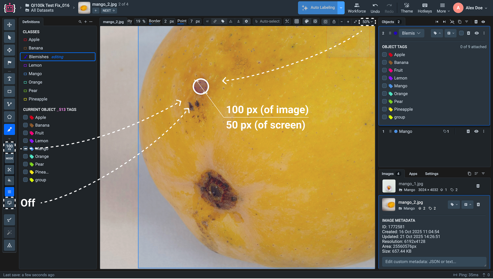
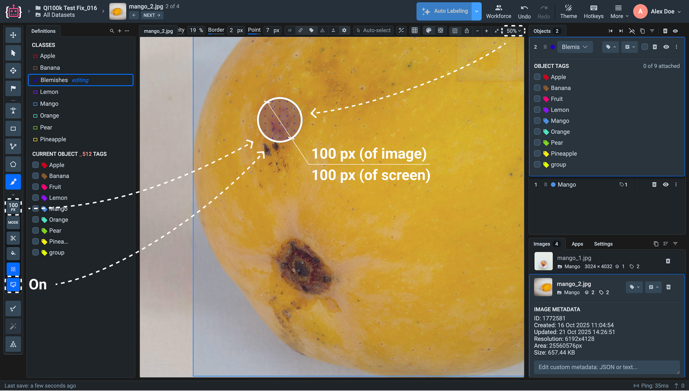

# Brush Tool

## What is Brush Annotation Tool?

The Brush tool is an essential image segmentation tool, specifically designed for creating free-form and independent segmentation masks. With flexible customizable parameters such as size scaling, this tool is ideal for a wide range of segmentation tasks, from outlining complex objects to simpler selections.

The Brush tool is ideal for scenarios involving atypical shapes, such as the decay of a leaf, as well as more straightforward tasks, such as selecting circular objects, like road signs.

Also noteworthy is the benefit of collaboration with other tools, such as the Pen tool. Each tool can complement the functionality of the other, maximizing the ease and accuracy of the segmentation process.

<figure><figcaption></figcaption></figure>

### Brush Tool Modes

The Brush Tool offers three different modes to provide flexibility in how you annotate and edit objects in an image:

1.  **Overlay (Default Mode)**

    In this mode, you can draw on top of existing masks without altering them. The new brush strokes will be layered over the current segmentation, allowing you to create additional details or overlapping annotations without changing the original mask.
2.  **Overwrite**

    This mode replaces the pixels of existing masks with any overlapping brush strokes. When you draw over an area already covered by another mask, the Brush Tool will overwrite it, making it ideal for correcting or refining existing segmentations.
3.  **Preserve**

    In Preserve mode, the Brush Tool only allows you to draw on unpainted areas, leaving the existing masks untouched. This mode is perfect for adding new segments without modifying or interfering with the current annotations, ensuring that previously annotated objects remain intact.

By choosing the appropriate mode, you can control how new annotations interact with existing masks.

<figure><figcaption></figcaption></figure>

 

<figure><figcaption></figcaption></figure>

 

<figure><figcaption></figcaption></figure>

## Video Tutorial

Learn how to effectively use the Brush tool in a 5-minute tutorial. Get hands-on experience with the new interface and explore the advanced features in our labeling toolbox.



## How to use the Brush Tool

Follow these step-by-step instructions to effectively use the Brush tool for image segmentation.

### Create class with Mask shape 

You can create a new class directly from the [Annotation Toolbox](https://app.supervisely.com/ecosystem/annotation\_tools/image-labeling-tool-v2?). To do this:

1. Click the **Brush Icon** in the toolbar of the labeling interface.
2. **Or** select an existing object class or add a new class by clicking **Add new class definition**.
3. In the modal window, enter the class name, choose the Mask or Any shape, and configure additional settings (e.g., color, hotkeys).
4. Click the `Create` button to add the new class to the definitions list.
5. Select the newly created class and segment the object with the mask in the image or video.

### Manual Annotation Guide

1. Customize the brush size using the slider in the settings tab or by pressing the hotkeys `[` to decrease and `]` to increase the brush size.
2. Move the cursor to the area you want to segment. **Click and drag** to draw the outline of the object or region you want to annotate.
3. Continue drawing until you have covered the desired area. You can adjust the brush size dynamically during this process to achieve more accurate segmentation.
4. To remove unwanted parts of the mask, hold down the `SHIFT` key and draw over the area to erase. You can also use the **Eraser Tool** or switch to the **Pen Tool** for finer edits.

<figure><figcaption></figcaption></figure>

**Use bucket fill for gaps**

Click the **Bucket Fill Tool** to quickly fill any gaps or holes in the segmentation with a single click. This will save time by automatically filling in areas that are not fully covered. The selected object is highlighted with a grid of dots.

**Split the mask**&#x20;

Use the **Polygon Split Tool** to divide the current mask into two separate objects. Start drawing around the desired area and close the contour by clicking at the starting point. The selected area will be separated as a new object in the objects list.

**Segmenting object presented by separate parts**

Draw the first segment of the object by clicking and dragging over the area you want to annotate. Move to the next area that is also part of the same object or class, and draw another segment using the Brush Tool. Continue this process for all the separate parts that belong to the same object. All the segments will automatically be grouped into a single object mask. When you have finished annotating all parts, press the `SPACE` key to finalize the annotation and create a new object.

<figure><figcaption></figcaption></figure>

 

<figure><figcaption></figcaption></figure>

### Zoom Independent Brush Size

The brush tool allows you to paint or annotate objects using a circular cursor whose diameter depends on the selected brush thickness. The brush size can vary from 1 px to 600 px.

The **Zoom Independent Brush Size** option defines how the brush cursor behaves when you zoom in or out of the image.

**How It Works**

When this option is **disabled**, the brush size is zoom-dependent - the diameter of the brush cursor changes visually depending on the current zoom level of the image.

For example, if you zoom out to 50% of the original image resolution, the brush cursor will appear two times smaller on the screen.

<figure><figcaption></figcaption></figure>

When zoom independent brush size is **enabled**, the brush diameter on the screen remains constant, regardless of the zoom level.
In this mode, the cursor always represents the actual brush size defined in pixels (e.g., a 100 px brush will always appear as a 100 px circle on the screen), maintaining consistent stroke width during annotation.

<figure><figcaption></figcaption></figure>

### Pro Tips 

* Use the **Object Color Randomizer** to instantly change the color of any object with a single click, as often as you like. This is particularly useful if you have many objects of the same class, or if they are close together, so you can easily differentiate between masks.

Discover all the advanced features and unique applications of the Brush Tool in our [comprehensive blog post](https://supervisely.com/blog/brush/).



## Hotkeys

Control the Brush tool more efficiently with `HOTKEYS`.

| Brush Tool          | 8                                                                                                                                                                                                                                                                                                                                                                                                                                                                                                                                                                                                                                                                                                                                                                                                                                                                                                                                                                                                                                                                                                                                                                                                                                 |
| ------------------- | --------------------------------------------------------------------------------------------------------------------------------------------------------------------------------------------------------------------------------------------------------------------------------------------------------------------------------------------------------------------------------------------------------------------------------------------------------------------------------------------------------------------------------------------------------------------------------------------------------------------------------------------------------------------------------------------------------------------------------------------------------------------------------------------------------------------------------------------------------------------------------------------------------------------------------------------------------------------------------------------------------------------------------------------------------------------------------------------------------------------------------------------------------------------------------------------------------------------------------- |
| Draw pixel mask     |  + Draw |
| Erase               | Hold Shift                                                                                                                                                                                                                                                                                                                                                                                                                                                                                                                                                                                                                                                                                                                                                                                                                                                                                                                                                                                                                                                                                                                                                                                                                        |
| Decrease brush size | \[                                                                                                                                                                                                                                                                                                                                                                                                                                                                                                                                                                                                                                                                                                                                                                                                                                                                                                                                                                                                                                                                                                                                                                                                                                |
| Increase brush size | ]                                                                                                                                                                                                                                                                                                                                                                                                                                                                                                                                                                                                                                                                                                                                                                                                                                                                                                                                                                                                                                                                                                                                                                                                                                 |
| Finish & start new  | Space                                                                                                                                                                                                                                                                                                                                                                                                                                                                                                                                                                                                                                                                                                                                                                                                                                                                                                                                                                                                                                                                                                                                                                                                                             |

|  Use Polygon Split (to cut mask into two figures) and Bucket Fill (to fill holes) in the tool subpanel                                                                                                                                                                                                                                                                                                                                                                                                                                                                                                                                                                                                                                                                                                                                                                                                                                                                                                                                                                                                                                                                                                                                                                   |
| ------------------------------------------------------------------------------------------------------------------------------------------------------------------------------------------------------------------------------------------------------------------------------------------------------------------------------------------------------------------------------------------------------------------------------------------------------------------------------------------------------------------------------------------------------------------------------------------------------------------------------------------------------------------------------------------------------------------------------------------------------------------------------------------------------------------------------------------------------------------------------------------------------------------------------------------------------------------------------------------------------------------------------------------------------------------------------------------------------------------------------------------------------------------------------------------------------------------------------------------------------------------------ |
| Finish area using `SPACE` or  the first point. |

| Scene Navigation                                                  |
| ----------------------------------------------------------------- |
| Zoom with `MOUSE WHEEL`. Hold `RIGHT MOUSE BUTTON` to move scene. |
