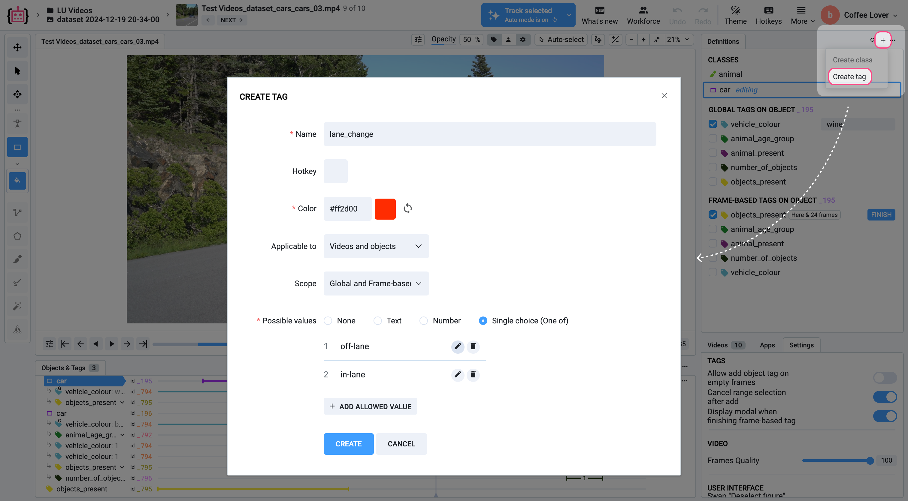
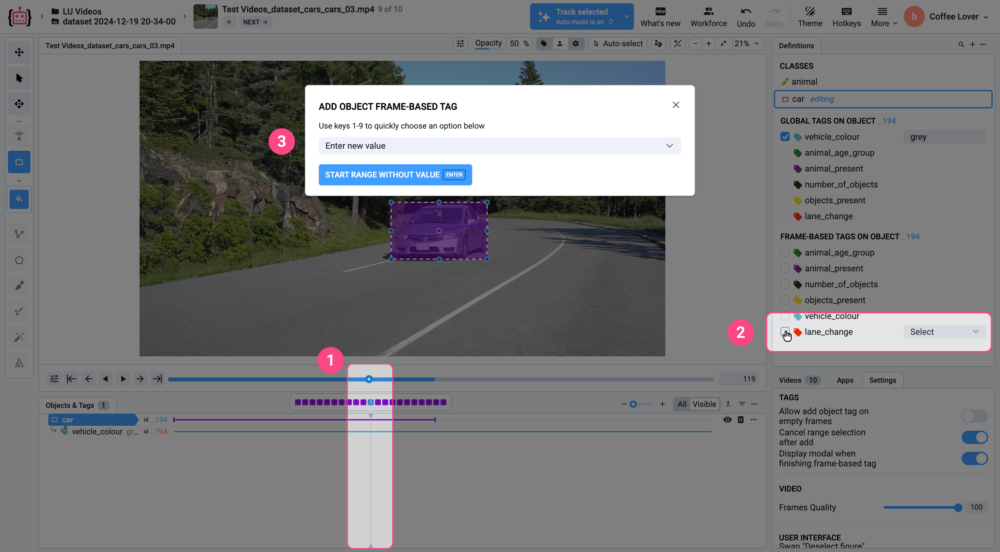
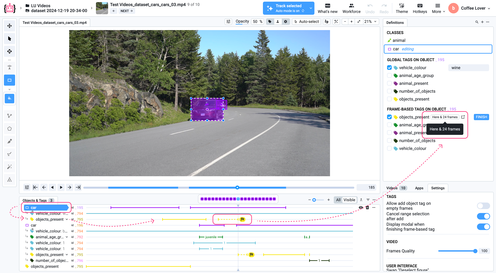
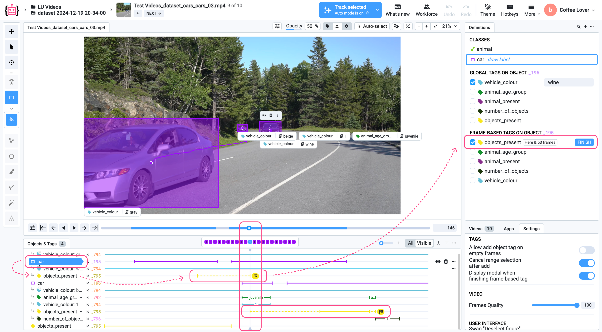
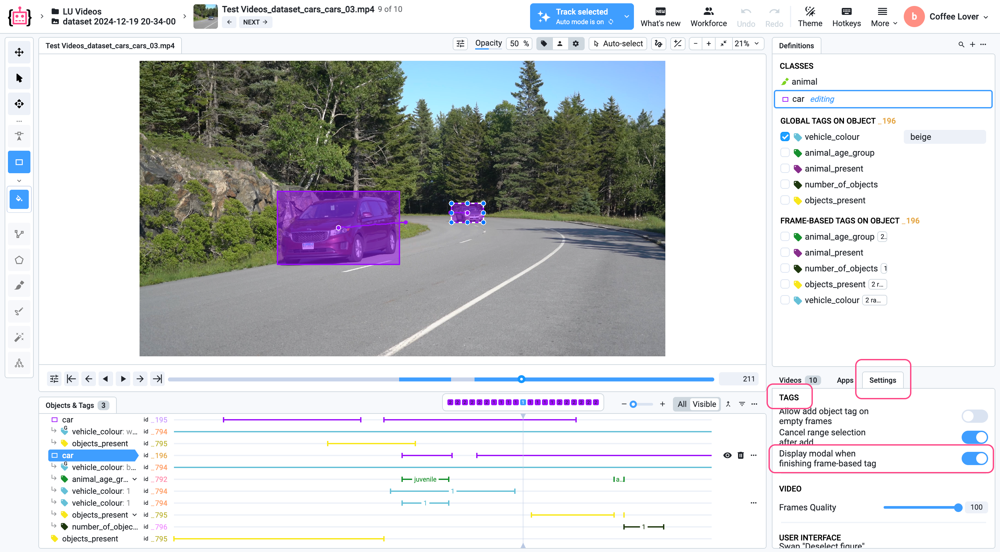
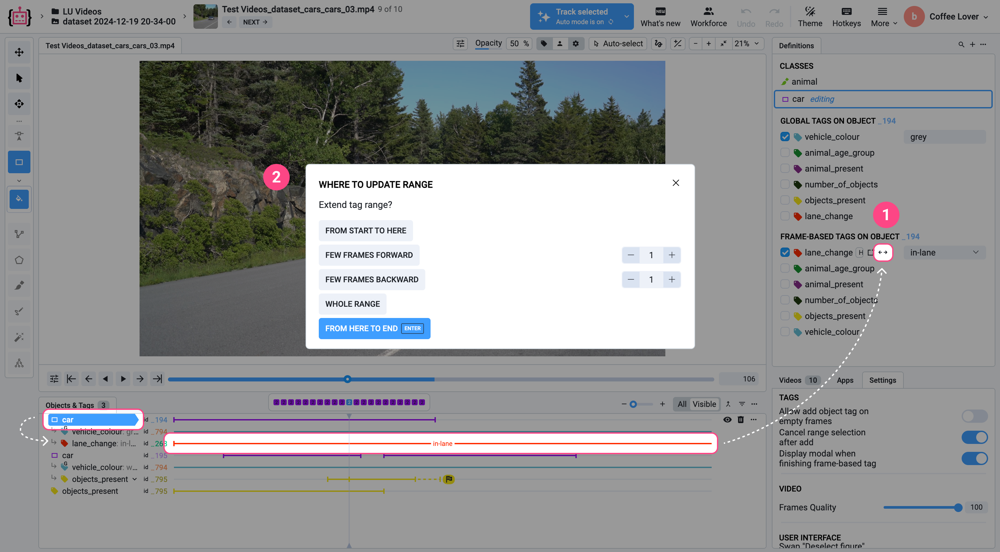
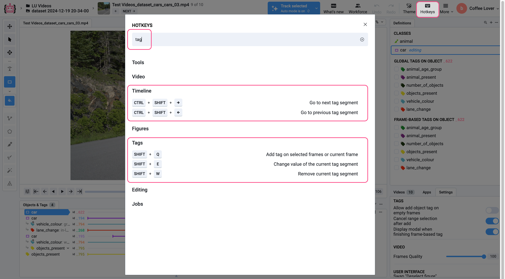

# Frame-based tagging

While applying a tag to a specific label object or video file can be useful, it gets a bit tricky when it comes to assigning a tag (often with a value) to a range of frames or multiple ranges. This short guide will help you learn **how to efficiently apply frame-based tagging** in Supervisely.

## Step 1. Preparing and locating tags

1. **Define tags in the project**:
   * Go to the [project definitions](https://docs.supervisely.com/data-organization/projects/definitions) page.
   * Create the required tags and set their scope to **Global and Frame-based** or **Frame-based**.
2. **Find tags in the Video Labeling Toolbox**:
   * Open the [Video Labeling Toolbox](../labeling-toolbox/videos-3.0.md).
   * Navigate to the [Definitions panel](../labeling-toolbox/videos-3.0.md#definitions-panel) and locate the tags under the **Frame-based Tags** section. Here is a list of tags you have already created.
3. **Define or add tags directly in the Labeling Toolbox**:
   * Find the mini button _**+**_ in the top right corner of the **Definitions** panel.
   * Click on it and select _**Create tag**_.

   <figure><figcaption></figcaption></figure>


**Note:** Tags for annotation objects appear when an object is selected. Tags for the entire video appear when no object is selected.


## Step 2. Adding a frame-based tag

1. **Select a frame:**
   * Navigate to the frame where the tag should start (1). 
   * Choose the tag from the **Definitions** panel by checking its box (2).


**Note:** The gray area on the timeline highlights the video segment visible in the viewport, helping you navigate the time interval and understand the zoom level.


<figure><figcaption></figcaption></figure>

2. **Apply a value (Optional):**
   * Tags with all types of values except "None" will trigger a pop-up that prompts you to select or enter the tag value (3).
   * Apply a value and click the _**Start Range**_ button or simply press `Enter`.
   * Otherwise, select the _**Start Range Without Value**_ button or simply press `Enter`.


**Tip**: Use the timeline zoom for comfortable tagging. Adjust the zoom level to magnify the frame detail up to 128x.


## Step 3. Configuring and Finalizing the Tag Range
After selecting a tag in the **Definitions** panel, the start edge of the tag range will appear in the viewport at your current cursor position and will be marked with a flag icon.

Once a tag is initiated, you can freely navigate to any frame by:
1. Clicking anywhere on the timeline, or
2. Clicking the left/right buttons next to the timeline, or
3. Entering a specific frame number, or
4. Using the arrow keys on your keyboard.

A dashed line will automatically extend to that frame.

<figure><figcaption></figcaption></figure>

To complete the tag creation process and finalize the range at the desired frame:

* Click the flag icon marker at the end of the tag in the viewport, or
* Press _**Finish**_ in the **Definitions** panel.

Tags with all value types except **"None"** will trigger a pop-up prompting you to select or enter a tag value if you skipped this step when initializing the tag.

Apply a value and click the button to select:
* _**Set value & start new range**_ button or simply press `Enter`.
* _**Set value**_ button or simply press `Ctrl` `Enter`.


**Note:** The number of frames the tag has been extended by is displayed next to the current tag in the **Definitions** panel.


<figure><figcaption></figcaption></figure>

You can start multiple unfinished tags as you move through the video and finalize them one by one. This is totally valid!  
All unfinished tags will dynamically extend their dashed range to the currently selected frame. You can finalize them sequentially using either a shared end frame or setting individual ones.

<figure><figcaption></figcaption></figure>

Unfinished tags remain accessible even after closing the tool, allowing others to finalize them later.


**Tip**: If you don't want to choose between _**Finish and start new range**_ or _**Finish**_ every time you complete a tag, and you only need the _**Finish**_ option, go to: **Settings > Tags** and disable the option **"Display modal when finishing frame-based tag"**.

<figure><figcaption></figcaption></figure>
 

**Tip**: Use the **Default Action** setting in the pop-up to simplify repetitive actions (e.g., set "From Here to End" as the default behavior).


## Editing a Finalized Tag

#### 1. Manual Adjustment

* Hover over either edge of the tag in the viewport until the cursor changes, indicating that resizing is possible.
* Click and hold the left mouse button. Then drag to narrow or extend the tag to the desired number of frames.

#### 2. Custom Options

Click the _**Extend tag range**_ button represented by arrows pointing in opposite directions (1), next to the frame-based tag in the **Definitions** panel and choose:

* **From start to here** — Apply the tag from the beginning of the video to the current frame.  
* **Few frames forward / backward** — Apply the tag for a fixed number of frames forward or backward. Use the **+** and **−** buttons to adjust the frame count.  
* **Whole range** — Tag the entire timeline of the object.  
* **From here to end** — Apply the tag from the current frame to the end of the video.

<figure><figcaption></figcaption></figure>


**Tip:** Use the **Default Action** setting in the pop-up to simplify repetitive actions (e.g., set **"From here to end"** as the default behavior).


## Configuring the tag range for clearing tags

When you need to adjust or remove an existing tag's range, select the frame-based tag and uncheck it. The **"Where to Clear Tag"** modal will appear, offering several options to customize how and where the tag should be cleared.

1.  **From Tag Start to Here:** Removes the tag from the beginning of its range up to the current frame.

    Ideal for use cases where the tag should no longer apply to earlier frames but remains valid for later frames.
2. **Few Frames Forward/Backward:** Clears the tag for a set number of frames forward/backward from the current frame. Use the `+` and `-` buttons to adjust the number of frames.
3. **Whole Length:** Clears the tag across its entire range, regardless of the current frame.
4. **Clear From Here to Tag End:** Removes the tag from the current frame to the end of its range. Suitable when the tag should apply only to earlier frames and not extend to the end of the video.

### Example

**Scenario**: You want to adjust the range of a tag applied to an object but only remove part of it.

1. Select the tag in the timeline or **Definitions** panel.
2. In the **"Where to Clear Tag"** modal:

* To remove frames ahead of the current position, choose **Few Frames Forward** and set the desired number of frames.
* To clear frames leading up to the current frame, select **From Tag Start to Here**.
* For complete removal, select **Whole Length**.

3. Confirm the action by clicking the appropriate button, such as **Clear From Here to Tag End** or pressing **Enter**.

## Hotkeys

Click the **Hotkeys** menu item at the top right of the **Definitions** panel to view or customize shortcuts.

#### 1. **Timeline Navigation**
In the **Timeline** section, you’ll find navigation hotkeys:

- **Go to next tag segment** — `CTRL` + `SHIFT` + `→`  
- **Go to previous tag segment** — `CTRL` + `SHIFT` + `←`

#### 2. **Tag Creation & Editing**
In the **Tags** section, you’ll find hotkeys for creating and editing tags:

- **Add tag on selected frames or current frame** — `SHIFT` + `Q`  
- **Change value of the current tag segment** — `SHIFT` + `E`  
- **Remove current tag segment** — `SHIFT` + `W`

> 💡 You can customize all hotkeys to fit your workflow.

<figure><figcaption></figcaption></figure>