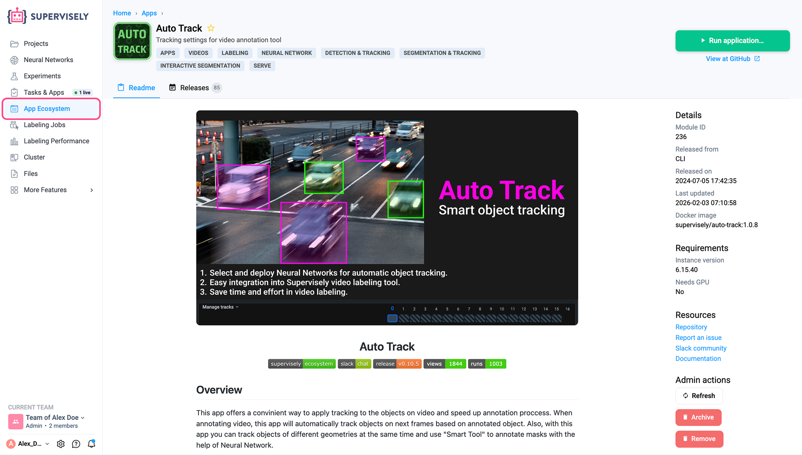
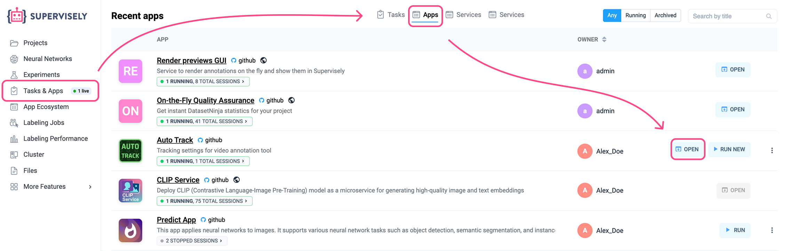
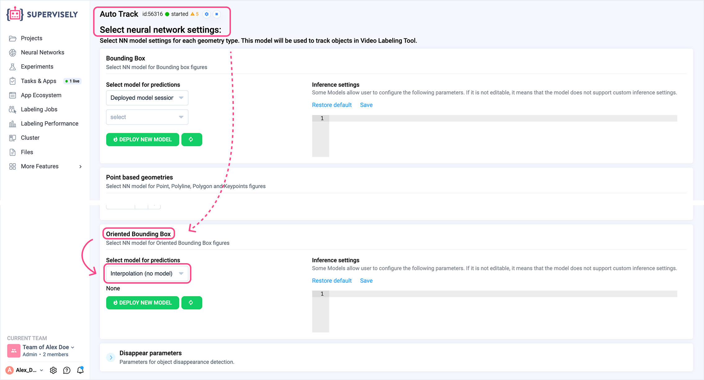
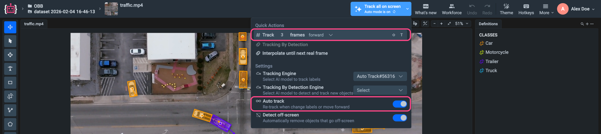
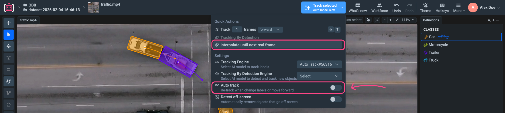
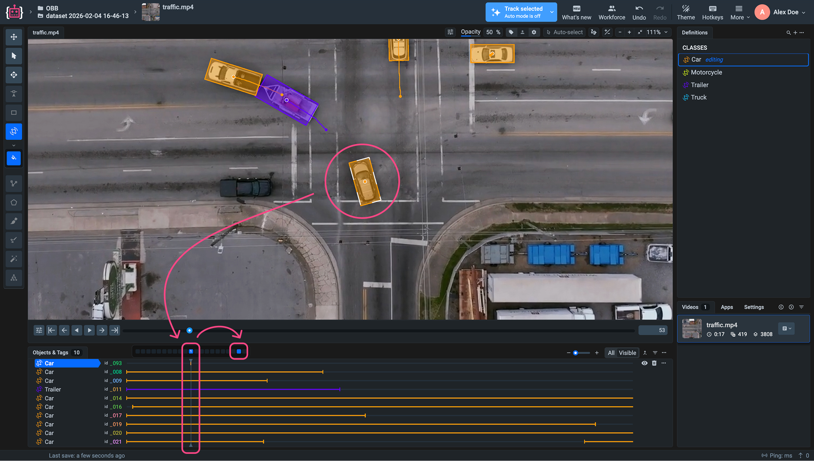
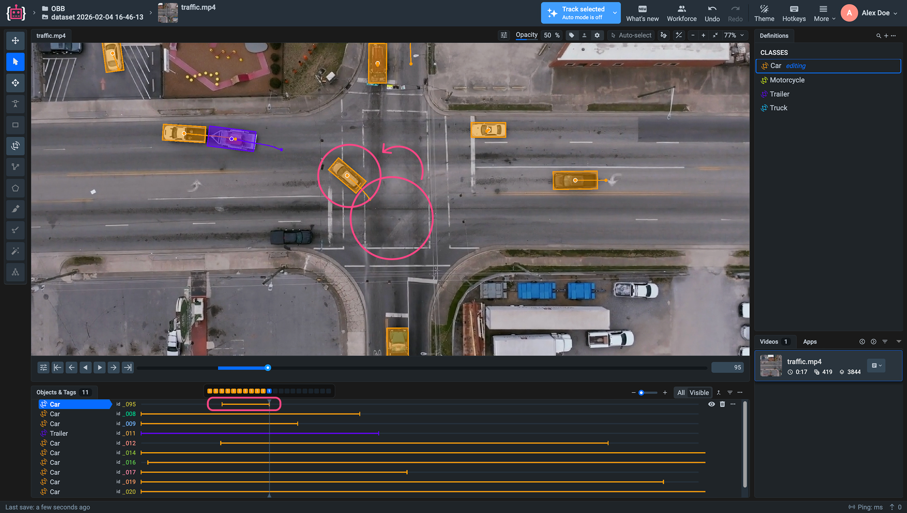
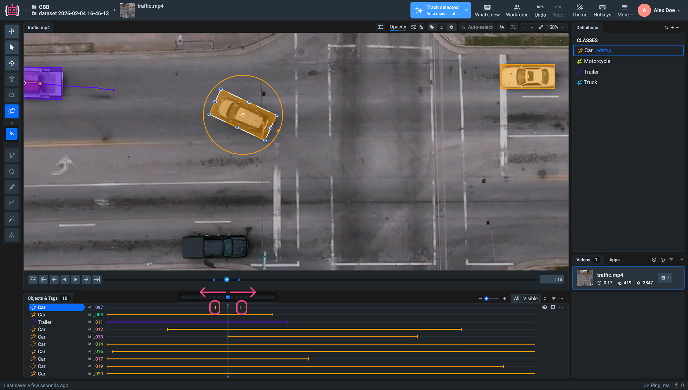
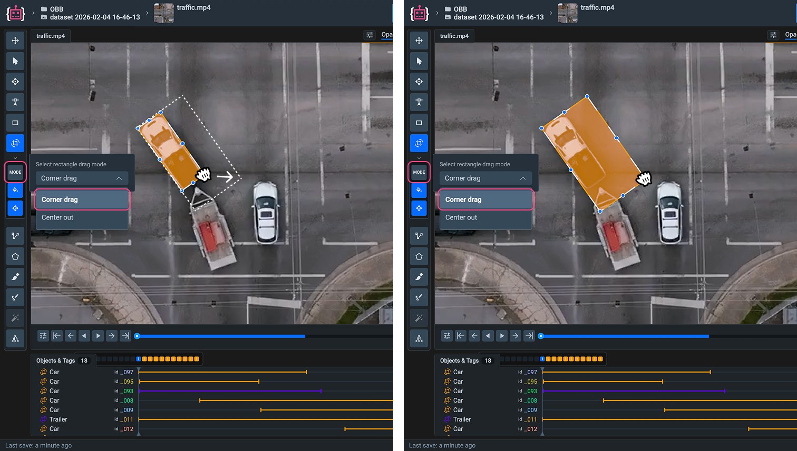
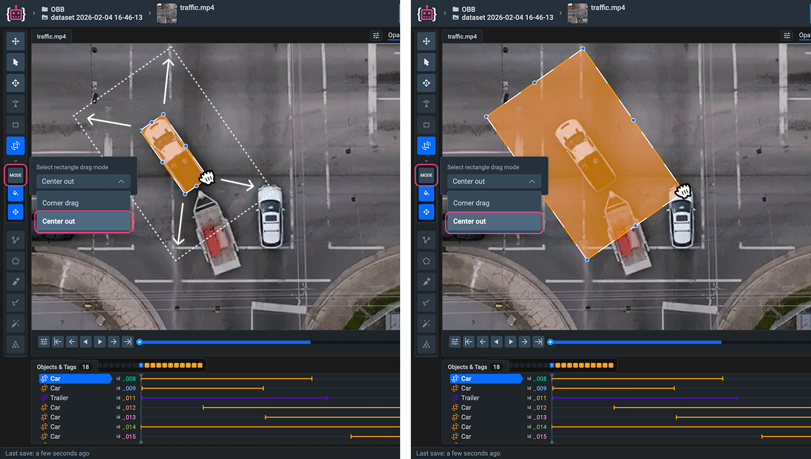

# Oriented Bounding Box Tool

## What is Oriented Bounding Box Annotation Tool?

An Oriented Bounding Box (OBB) is a rotated rectangle defined by two corner points and a rotation angle. Unlike an axis-aligned rectangle, an OBB can be rotated to closely fit objects at arbitrary orientations. This makes it especially suitable for annotating elongated or tilted objects such as vehicles, ships, or text.



## How to use the Bounding Box

To speed up the annotation process, the Oriented Bounding Box tool can be used together with the Auto Track model.

### Setup

1. In the main menu, go to App Ecosystem and start Auto Track.

<figure><figcaption></figcaption></figure>

2. Then open Tasks & Apps from the main menu.
Navigate to the Apps tab.
Find the recently launched Auto Track application and click Open.

<figure><figcaption></figcaption></figure>

3. You will be redirected to the settings page containing all annotation tools compatible with Auto Track.
Scroll down to the Oriented Bounding Box section.
In the Select model for predictions dropdown, choose **Interpolation (No model)** - this is the **Smart Interpolation** method described below.

<figure><figcaption></figcaption></figure>

Return to the labeling tool.

### Smart Interpolation

**Smart Interpolation** is a non-neural tracking method built into the Auto Track app that predicts object motion based on geometry and temporal consistency rather than GPU-based inference. Because it does not use neural networks, it runs entirely on the CPU and works exceptionally well in scenes where object motion is structured and predictable.

**When to use Smart Interpolation:**
- The camera is static or moves smoothly (e.g., slowly zooming into a scene).
- Objects move along clear, constrained trajectories (e.g., vehicles in a top-down traffic scene).
- Object shapes and orientations change smoothly from frame to frame.

Under these conditions, Smart Interpolation is highly effective: once a few keyframes are labeled manually, the tool can interpolate the object’s position, scale, and rotation across frames with high stability. This allows you to build a lightweight tracking workflow without GPU requirements and significantly reduces manual labeling effort.

### Usage Scenarios - Automatic annotation across frames.

<figure><figcaption></figcaption></figure>

In the Quick Actions section of the Auto Track settings, there is an option to automatically apply annotations to any desired number of frames from the frame where the object was annotated using the Oriented Bounding Box tool.

This simple method can be used on a small number of frames to quickly verify the correctness and consistency of the annotation.

### Usage Scenarios - Interpolation between keyframes.

The most effective use of the Oriented Bounding Box together with Auto Track is achieved using the **Interpolate until next real frame** function powered by SmartInterpolation. This allows the system to automatically interpolate object positions and orientations between manually annotated keyframes.


For **Interpolate until next real frame** to work, at least two frames must be manually annotated. The underlying principle is as follows: the model compares the annotation on one frame with the annotation on another frame, calculates the differences in rotation angle, size, and position of the oriented bounding box, and then propagates these differences forward or backward, creating bounding boxes on subsequent frames as if by inertia.


Let’s consider an example of annotating a vehicle moving along a complex trajectory with changes in body orientation.


**Note:** For interpolation to work correctly, Auto Track must be disabled in the Settings.


<figure><figcaption></figcaption></figure>

1. First, annotate the object on any desired frame using the Oriented Bounding Box tool. This annotation will serve as the starting point for automatic interpolation.

<figure><figcaption></figcaption></figure>

2. Next, move to another frame that will act as the final frame in the sequence forming the object’s motion trajectory, and annotate the object there as well.

3. After that, click Interpolate until next real frame. As a result, a fully annotated segment will appear on the timeline, covering all frames between the first and the last manually annotated frames.

<figure><figcaption></figcaption></figure>

The Interpolate until next real frame function evenly interpolates all parameters between the first and last annotated bounding boxes — including rotation angle, size, and position — across all intermediate frames.



### Additional Use Case

Consider another scenario using the same function.
If the object is manually annotated on three frames that are not adjacent, and you then navigate to an annotated frame located between the two outermost ones and apply Interpolate until next real frame, the system will automatically annotate all frames in both directions, up to the two nearest manually annotated frames.

<figure><figcaption></figcaption></figure>

### Editing modes

The Oriented Bounding Box Tool supports two editing modes:

**1. Corner Drag Mode (Default):**

- This is the standard editing behavior.
- Dragging a side adjusts the rectangle along its local axis.
- Dragging a corner adjusts both width and height simultaneously in the dragged direction.
- The rectangle expands or contracts from the side or corner being manipulated, preserving its current rotation.

<figure><figcaption></figcaption></figure>

**2. Center Out Mode:**

- In this mode, the rectangle is resized relative to its center point.
- Dragging any side or corner scales the rectangle uniformly from the center.
- The center point remains fixed.

<figure><figcaption></figcaption></figure>

## Hotkeys

Control the Oriented BBox tool more efficiently with `HOTKEYS`.

<table data-full-width="false">
<thead>
<tr><th width="454">Oriented Bounding Box Tool</th><th></th></tr>
</thead>
<tbody>
<tr><td>Switch between drag modes (Corner Drag ⇄ Center-Out)</td><td>Hold Control or Ctrl</td></tr>
</tbody>
</table>