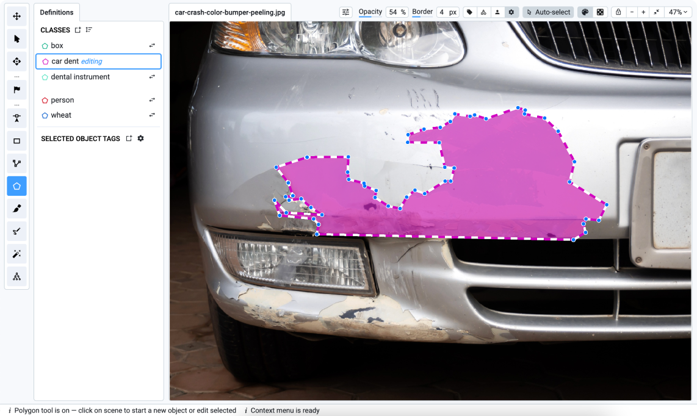
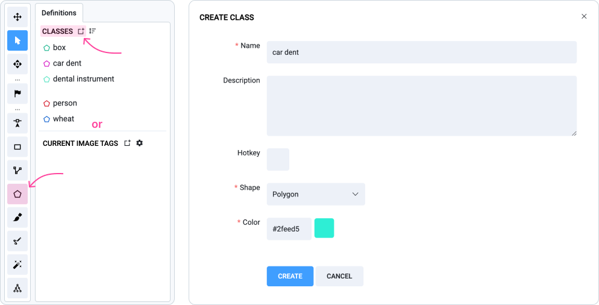

# Polygon Tool

## What is Polygon Annotation Tool?

The **Polygon** is a powerful tool for outlining the boundaries of objects in images or other data. It works by connecting a series of points to create polygonal figures that accurately represent the shape of an object. Usually, Polygon annotation is used to address semantic segmentation and instance segmentation tasks in computer vision.&#x20;

Unlike bounding boxes, which use rectangles to enclose objects, polygons offer greater flexibility by allowing any number of points to closely follow an object’s exact shape. This tool is ideal for complex or irregular shapes where precise object boundaries are necessary.

<figure><figcaption></figcaption></figure>

## Video Tutorial 

Take a moment to watch our comprehensive 5-minute video tutorial, which provides clear and straightforward instructions on how to unlock the full capabilities of our newly enhanced Polygon annotation tool.&#x20;



## How to use the Polygon Tool

Below are step-by-step instructions for creating a polygon class, manually annotating objects, refining annotations, working with holes, and other advanced features to improve your annotation process.

### Create class with Polygon shape

You can create a new class directly from the [Annotation Toolbox](https://app.supervisely.com/ecosystem/annotation\_tools/image-labeling-tool-v2?). To do this:

1. Click the **Polygon Icon** in the toolbar of the labeling interface.
2. **Or** select an existing object class or add a new class by clicking **Add new class definition**.
3. In the modal window, enter the class name, choose the Polygon or Any shape, and configure additional settings (e.g., color, hotkeys).
4. Click the `Create` button to add the new class to the definitions list.
5. Select the newly created class and draw a polygon around the object boundaries in the image or video.

<figure><figcaption></figcaption></figure>

### Manual Annotation Guide

1. Click along the outline of the object to add points. Each click creates a new point connected by a line.
2. To complete the shape, press `SPACE` or return to the starting point.
3. You can easily adjust existing polygons by moving, adding, or removing points as needed. Just `CLICK + DRAG` any existing point to change its position and adjust the shape.
4. Click on the edges of the polygon to add new points or `SHIFT + CLICK` on a point to remove it.

<figure><figcaption></figcaption></figure>

**Correcting and refining annotations**

To correct or refine an annotation, you can add new areas by clicking along the object's edge or remove unwanted sections by specifying new connecting points on the shape.

**Automatic object linking**

Automatically link objects without the need for precise alignment to individual object boundaries. To use this feature, move the pointer over a labeled object and click the nearest point. Then click subsequent points along the boundary to automatically link shapes.

**Auto-placement points**

Simply hold the `SHIFT` key and drag your cursor along the object to automatically set points, making it perfect for objects with smooth and non-linear contours. To add or remove a labeled area, first select or place a starting point, then continue by holding `SHIFT` to segment the area, and finish the path at any existing point.

**Holes creation**

To create a hole in a polygon, hold `SHIFT` and click to define it. You can then hover over the hole and edit it just like any other polygon. To remove a hole, move the cursor over it and press `DELETE`.

<figure><figcaption></figcaption></figure>

 

<figure><figcaption></figcaption></figure>

 

<figure><figcaption></figcaption></figure>

### Tips 

* Turn on the **Auto-Select** feature and hover over any polygon to automatically select it for editing. This feature makes it easier to modify existing annotations without manually selecting each shape.
* Use the **Object Color Randomizer** to instantly change the color of any object with a single click, as often as you like. This is particularly useful if you have many objects of the same class, or if they are close together, so you can easily differentiate between polygons.

Learn more about the advanced capabilities of the Polygon tool and its effective use for semantic and instance segmentation tasks in [our comprehensive blog post](https://supervisely.com/blog/how-to-use-polygon-anotation-tool-for-image-segmentation/):



## Hotkeys

| Polygon Tool (minimum 3 points required) | 7                                                                                                                                                                                                                                                                                                                                                                                                                                                                                                                                                                                                                                                                                                                                                                                                                                                                                                                                                                                                                                                                                                                                                                                                                                          |
| ---------------------------------------- | ------------------------------------------------------------------------------------------------------------------------------------------------------------------------------------------------------------------------------------------------------------------------------------------------------------------------------------------------------------------------------------------------------------------------------------------------------------------------------------------------------------------------------------------------------------------------------------------------------------------------------------------------------------------------------------------------------------------------------------------------------------------------------------------------------------------------------------------------------------------------------------------------------------------------------------------------------------------------------------------------------------------------------------------------------------------------------------------------------------------------------------------------------------------------------------------------------------------------------------------ |
| Start & add point                        |                  |
| Add point on edge                        |                  |
| Move point                               | Drag                                                                                                                                                                                                                                                                                                                                                                                                                                                                                                                                                                                                                                                                                                                                                                                                                                                                                                                                                                                                                                                                                                                                                                                                                                       |
| Remove point                             | Shift +          |
| Finish                                   | Space                                                                                                                                                                                                                                                                                                                                                                                                                                                                                                                                                                                                                                                                                                                                                                                                                                                                                                                                                                                                                                                                                                                                                                                                                                      |
| Finish                                   |  the first point |

| Auto-placement of points                                                                                                                                                                                                                                                                                                                                                                                                                                                                                                                                                                                                                                                                                                                                                                                                                                                                                                                                                                                                                                                                                                                                                                                                                                                                                                                      |
| --------------------------------------------------------------------------------------------------------------------------------------------------------------------------------------------------------------------------------------------------------------------------------------------------------------------------------------------------------------------------------------------------------------------------------------------------------------------------------------------------------------------------------------------------------------------------------------------------------------------------------------------------------------------------------------------------------------------------------------------------------------------------------------------------------------------------------------------------------------------------------------------------------------------------------------------------------------------------------------------------------------------------------------------------------------------------------------------------------------------------------------------------------------------------------------------------------------------------------------------------------------------------------------------------------------------------------------------- |
| When you create or edit a polygon instead of clicking multiple times, you can hold both Shift and  and draw a line. |

| Holes                                                                                                                                                                                                                                                                                                                                                                                                                                                                                                                                                                                                                                                                                                                                                                                                                                                                                                                                                                                                                                                                                                                                                                                                                                                                          |
| ------------------------------------------------------------------------------------------------------------------------------------------------------------------------------------------------------------------------------------------------------------------------------------------------------------------------------------------------------------------------------------------------------------------------------------------------------------------------------------------------------------------------------------------------------------------------------------------------------------------------------------------------------------------------------------------------------------------------------------------------------------------------------------------------------------------------------------------------------------------------------------------------------------------------------------------------------------------------------------------------------------------------------------------------------------------------------------------------------------------------------------------------------------------------------------------------------------------------------------------------------------------------------ |
| You can hold Shift and press  to create polygon hole |
| You can then hover over other holes and edit them just like any other polygon. If you want to remove a hole, move the cursor over the hole and press `Delete`.                                                                                                                                                                                                                                                                                                                                                                                                                                                                                                                                                                                                                                                                                                                                                                                                                                                                                                                                                                                                                                                                                                                 |

| Replace edges in existing polygon                                                          |
| ------------------------------------------------------------------------------------------ |
| Click any point, draw a polyline, finish by clicking any other point or the polygon border |

| Scene Navigation                                                                                                                                                                                                                                                                                                                                                                                                                                                                                                                                                                                                                                                                                                                                                                                                                                                                                                                                                                                                                                                                                                                                                                                                                                                  |
| ----------------------------------------------------------------------------------------------------------------------------------------------------------------------------------------------------------------------------------------------------------------------------------------------------------------------------------------------------------------------------------------------------------------------------------------------------------------------------------------------------------------------------------------------------------------------------------------------------------------------------------------------------------------------------------------------------------------------------------------------------------------------------------------------------------------------------------------------------------------------------------------------------------------------------------------------------------------------------------------------------------------------------------------------------------------------------------------------------------------------------------------------------------------------------------------------------------------------------------------------------------------- |
| Zoom with Mouse wheel. Hold  to move scene. |
