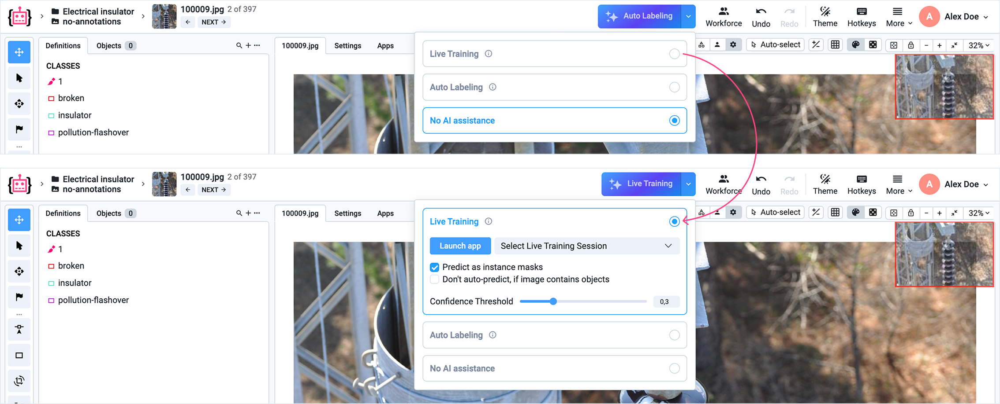
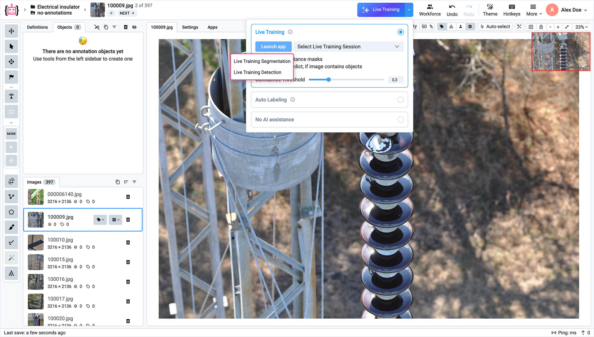
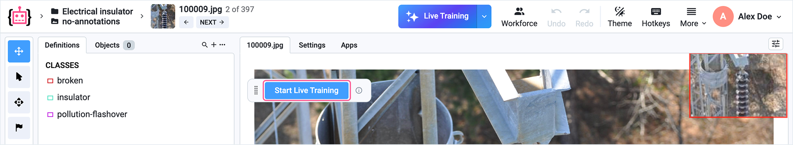
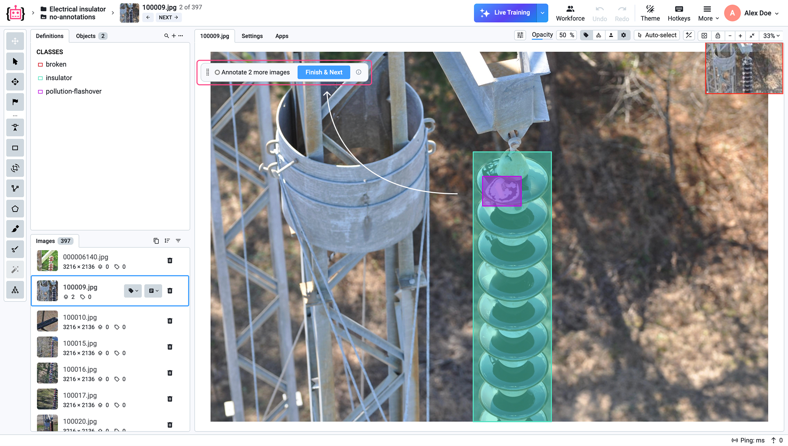
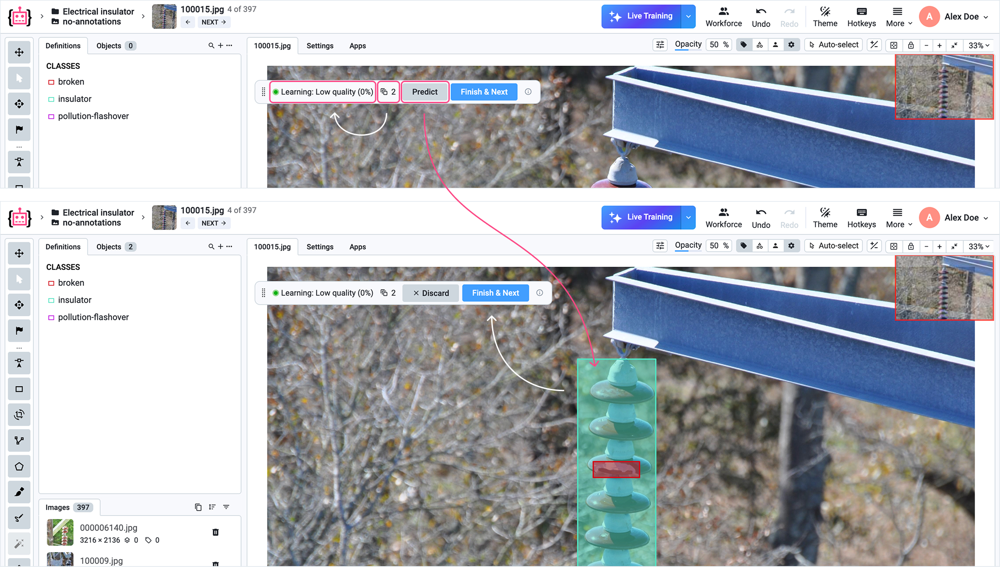
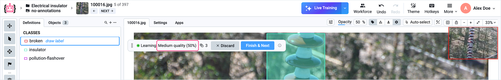
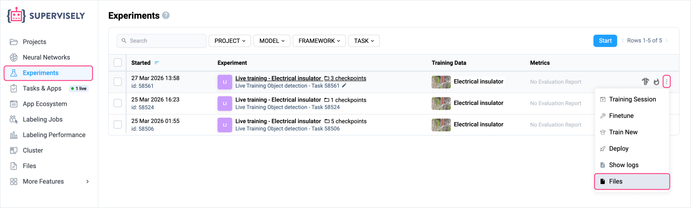

# Live Training

## Introduction

Live Training is a novel framework built by Supervisely where AI models train in parallel with human annotation. As annotators label images, the model quickly adapts to the domain-specific data and annotation patterns. After just 5-10 labeled images, it begins generating useful predictions (pre-labels) that accelerate labeling. The quality of these predictions continuously improves with every new image labeled.

By project completion, you get both a fully annotated dataset and a trained model ready for deployment, with accuracy equivalent to a model trained through conventional offline training.
Live Training transforms annotation projects from a multi-week, multi-team coordination challenge into a streamlined single-phase workflow where AI assistance grows naturally from the first annotation onward.

**Live Training solves two critical limitations in AI-assisted annotation:**

Zero-shot foundation models (SAM, GroundingDINO) are helpful in annotating common objects (human, animals, vehicles), but they fail on specialized domains with almost zero assistance.
Conventional workflows such as Human-in-the-loop and Active Learning involve manual coordination that always create coordination overhead and idle time, resulting in high costs and timelines of annotation projects.

## How to use

### 1. Launch the Application

To start Live Training, click the **Launch App** button in your project workspace. This opens the configuration interface where you can initialize the training session. We need to make the model available for real data processing.

<figure><figcaption></figcaption></figure>

### 2. Choose a Model Type

You will be prompted to select the type of model that fits your annotation task. There are two main options:

- Live Training Segmentation
- Live Training Detection

<figure><figcaption></figcaption></figure>

**Live Training Segmentation**

Segmentation is used when you need pixel-level precision. The model learns to generate detailed masks that outline the exact shape of objects in an image.

*Typical use cases:*

- Medical imaging (organs, tumors) 
- Industrial inspection (defects, surface anomalies) 
- Agriculture (plants, crops, diseases)

As you annotate, the model begins producing pre-labeled masks that closely follow object boundaries, significantly reducing manual effort.

**Live Trainig Detection**

Detection is used when you need to identify and localize objects using bounding boxes. The model predicts rectangular regions around objects of interest.

*Typical use cases:*

- Autonomous driving (vehicles, pedestrians, signs) 
- Retail analytics (products, shelves) 
- Security and surveillance (people, events)

With each labeled image, the model improves its ability to generate accurate pre-labeled bounding boxes, speeding up the annotation process.

While the app is launching, you can view the logs here.

<figure><figcaption></figcaption></figure>

### 3. Start Live Training

After launching the **Live Training** application, click the **Start** button to confirm the beginning of real-time training and data analysis from that moment onward.

<figure><figcaption></figcaption></figure>

### 4. Annotate initial samples

The AI needs a few labeled images before it can generate predictions.
Annotate each image completely and click `Finish & Next` to add it to the training data and to proceed to the next image.
The more you annotate, the better the AI gets. Once quality is sufficient, it will start suggesting predictions automatically.

<figure><figcaption></figcaption></figure>

Even after just 2 annotated images, the **Predict** button will appear. However, at the very beginning, the prediction accuracy will be close to zero, and **Live Training** will not yet suggest annotations automatically.

At this stage, you can continue annotating images manually until the **Live Training** quality improves to an acceptable level and starts suggesting annotations automatically. Alternatively, you can already request predictions from Live Training by clicking the **Predict** button.

<figure><figcaption></figcaption></figure>

If you are not satisfied with the result, you can reject the proposed annotations by clicking **Discard**, or edit/add shapes and continue training and annotation by clicking **Finish and Next**.

The training quality will improve over time.

<figure><figcaption></figcaption></figure>

### 5. Labeling with Live Training assistance

As you can see, the model’s prediction accuracy gradually improves during training. At a certain point, the model begins to automatically suggest shapes (annotations). You can add, modify, or delete them, as well as either accept or reject the suggestions and move on to the next image, where Live Training will again propose annotations.



### 6. Save and Load your trained models

During training, your model automatically appears on the Experiments page. From there, you can access and manage training runs, as well as load a model to continue training at any time.

<figure><figcaption></figcaption></figure>

The Experiments page automatically saves model checkpoints at regular intervals. If training is paused or interrupted, you can resume it later from the latest checkpoint. A checkpoint represents the state of the model weights at a specific point in time, allowing training to continue without losing progress.

Additionally, from the Experiments page, you can navigate to the project’s file storage to locate and access your saved model files and checkpoints.