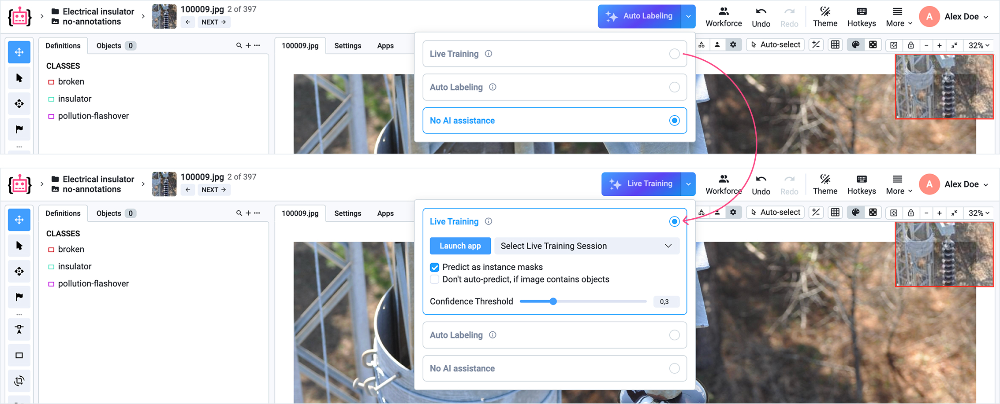
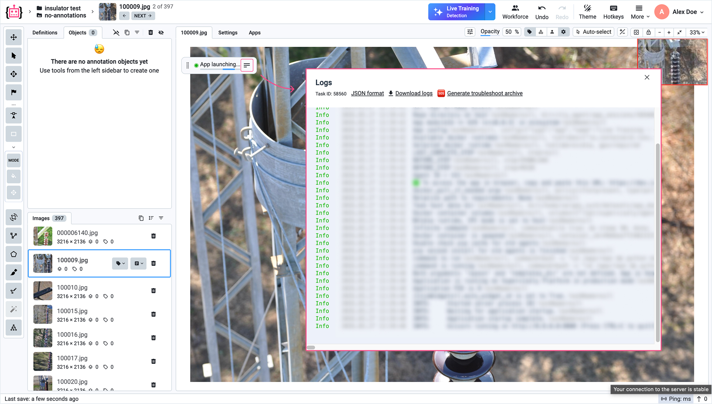
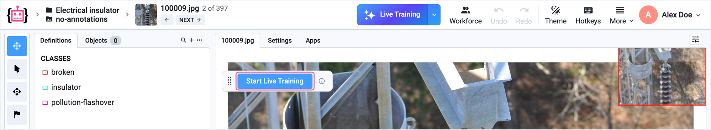
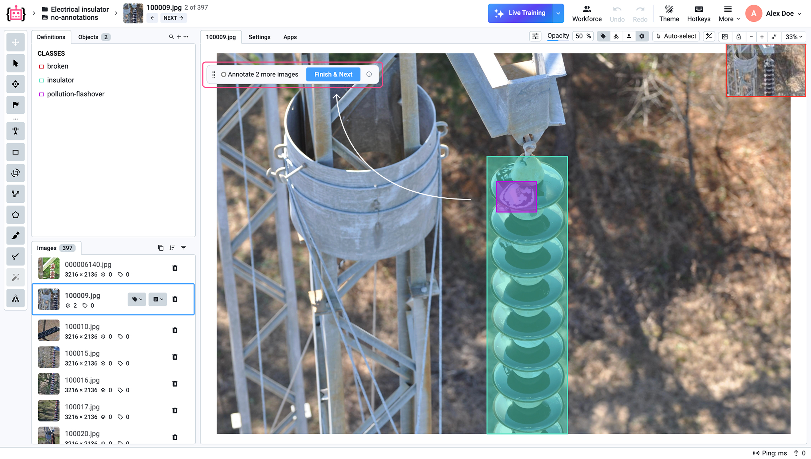
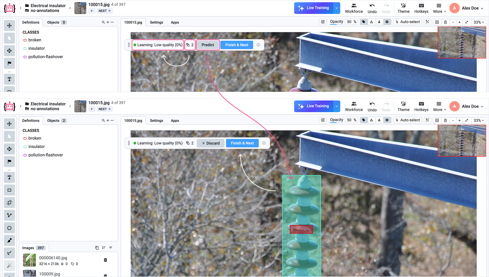
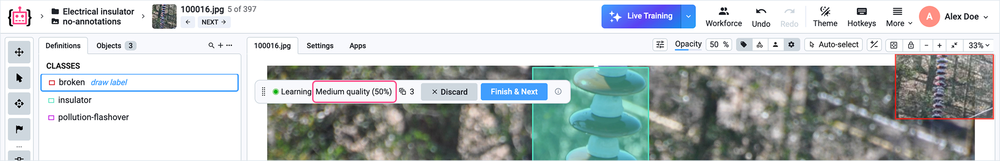
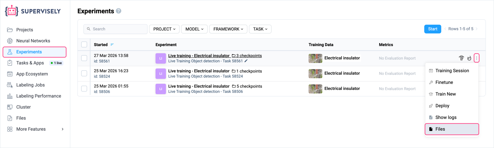

# Live Training

## Introduction

Live Training is a real-time AI annotation framework pioneered by Supervisely. It introduces a new approach to auto-labeling for object detection and segmentation, enabling continuous model fine-tuning **in parallel with human labeling**. As annotators work, the model quickly adapts to your custom dataset and specific domain patterns. After just even 5 labeled images, it begins generating useful high-quality predictions (pre-labels) that accelerate labeling. The quality of these predictions continuously improves with every new image labeled.

By project completion, you get both a fully annotated dataset and a trained model ready for deployment — with accuracy equivalent to a model trained through conventional offline training.


Check the [Technical Report](./technical-report.md) for a deep dive into the architecture and research behind Live Training.


**Live Training solves two key limitations of AI-assisted annotation:**

 - While zero-shot foundation models (like SAM and GroundingDINO) work well for common objects, they often struggle with specialized domains. Live Training overcomes these limitations by fine-tuning foundation models on the fly, providing immediate automated image annotation for complex, niche use cases.
 - Conventional workflows such as Human-in-the-Loop and Active Learning require manual coordination that creates overhead and idle time, resulting in high costs and extended project timelines.

The Live Training approach transforms annotation projects from a multi-week, multi-team coordination challenge into a streamlined single-phase workflow where AI assistance grows naturally from the first annotation onward.

**How it works:**

1. You annotate images in the Labeling Tool as usual (manually, or using other AI-assisted tools).
2. After annotating 2-5 images, the AI model starts generating predictions for each new image.
3. You review and correct the predictions.
4. The model learns from your corrected annotations in real time, improving its accuracy with every new annotation.



**Practical Example:** See Live Training in action with our use case: [Automotive Bolt Annotation with Live Training and Center Out Tool](https://docs.supervisely.com/use-cases/automotive/automotive-bolt-annotation). This real-world example demonstrates how Live Training reduces annotation time by 70% for quality control in automotive manufacturing.

## Quickstart


Currently, Live Training is available only for **Enterprise**.


### 1. Launch Live Training

Navigate to the Labeling Tool interface. On the top panel, click the blue ✨ **Auto Labeling** button to open the AI assistance configuration panel, then select the **Live Training** option.

<figure></figure>

If a Live Training session is already running, it will appear in the dropdown list, and you can use the existing session. To start a new one, click **Launch App**.

Choose the model type that fits your annotation task. Currently, there are two options:

- **Live Training Detection** (Ecosystem app: [Live Training - Object Detection](https://ecosystem.supervisely.com/apps/live-training-detection)) — for bounding box annotation.
- **Live Training Segmentation** (Ecosystem app: [Live Training - Segmentation](https://ecosystem.supervisely.com/apps/live-training-segmentation)) — for mask annotation. See [Live Training Segmentation](#live-training-segmentation) for details.

Configure the app settings in the modal window and click **Run** to launch the Live Training application.

Each Live Training session is attached to a specific project and its classes. To use Live Training for a different project, launch a new session from that project's labeling interface.


💡 **Tip**: Alternatively, you can start Live Training from the **Ecosystem**, just like any other Supervisely application. In this case, select the target project from the app's launch menu.


**Starting Live Training**

While the Live Training application is launching, a floating panel will display the startup progress.

<figure></figure>

Once the application is ready, the floating panel will show the **Start Live Training** button. Make sure you've created all the necessary classes in your project before starting — Live Training will only use classes that already exist when training begins. Click this button to confirm and begin training.

<figure></figure>

### 2. Annotate Initial Samples

After starting Live Training, the floating panel will show the status **Annotate 2 more images**. Before the model can start generating predictions, it needs a few labeled images to learn your specific domain.

1. Annotate your first image manually.
2. Click the **Finish & Next** button on the floating panel. This saves the annotation, adds it to the model's training data, and takes you to the next image.
3. Repeat this process for at least 2-5 images.

<figure></figure>

### 3. Review and Correct AI Predictions 

#### Background Learning

After annotating initial images, the status changes to **Learning**. At this stage, the adaptive AI model begins its online learning process in the background, analyzing your inputs to improve object detection or segmentation accuracy. Continue annotating and submitting images by clicking **Finish & Next**. After a short while, the model will start generating predictions.

#### Initial Predictions

Once the model has adapted to the initial annotations, it starts generating predictions every time you click **Finish & Next**. Review the model predictions, correct any mistakes, and submit the annotations to further improve the model. At this early stage, results may be rough — you can click **Discard** to remove predictions and annotate manually if the suggestions aren't helpful. Use the **Predict** button to request new predictions after discarding.

**Model Quality** is now shown in the floating panel and refreshes after each newly labeled image. [See how it is calculated ↓](#model-quality-score)

<figure></figure>

#### Continuous Improvement

As you continue annotating with model assistance, accuracy rapidly improves. The more you annotate, the better the model becomes at understanding your specific data and annotation style.


Over time, the model will generate nearly perfect predictions, allowing you to simply review and accept them — significantly speeding up your annotation workflow.


<figure></figure>

## Live Training Segmentation

**Live Training - Segmentation** applies the same workflow to mask annotation: the model trains in the background while you draw masks and starts predicting after a few annotated images. The steps in the [Quickstart](#quickstart) above are the same; the differences are listed below.

- **Classes.** Create all object classes before starting. The model produces predictions as bitmap masks, so set the class shape to **Mask** or **Any Shape**. If a class uses **Any Shape**, annotate it with the [Brush Tool](../../labeling-tools/brush-tool.md) so that the resulting annotation is a mask. Live Training Detection, in contrast, uses only `Rectangle` (bounding box) objects.
- **Initial samples.** The model needs at least two completed images (click **Finish & Next** after each) to create its initial training set. In practice, it typically starts suggesting predictions after 5–10 annotated images.
- **Predictions.** Predicted masks are marked with an **A** (Auto) label, which means the mask was proposed by the model. By default, each object is a separate mask; to get one mask per class, disable **Predict as instance masks** in [AI Prediction Settings](#ai-prediction-settings). Review and correct each prediction, then click **Finish & Next** to confirm the final annotation and add it to the training data, or click **Discard** to reject it.
- **What the model learns from.** Only the final annotations you submit are added to the training data. Accepting or rejecting a prediction does not affect training by itself.
- **Model.** The application fine-tunes Mask2Former with a Swin-T backbone, initialized from weights pre-trained on ADE20K.
- **Requirements.** The application requires a GPU and Supervisely instance version 6.17.25 or later. It is available for **Enterprise** instances with the Images Live Training license extension. [Contact us](https://supervisely.com/contact-us) to enable it.

## Model Quality Score

The **Model Quality** percentage shown in the floating panel reflects how well the model's predictions matched your final annotations. It updates each time you click **Finish & Next** and is averaged across all images you have labeled so far.

### Detection

For each submitted image, the system compares what the model predicted against what you actually annotated. Each predicted box is evaluated and placed into one of these categories:

- **Correct prediction** — the box is in the right place and has the right class
- **Imprecise box** — the class is right, but the box fits loosely
- **Wrong class** — the box is in the right place, but the class is wrong
- **Extra object** — the model predicted a box where there was nothing
- **Missed object** — the model missed an object that you annotated

The score is then calculated as:

$$
\text{Score} =
\frac{
1.0 \cdot \text{Correct}
+ 0.5 \cdot \text{Imprecise}
+ 0.7 \cdot \text{Wrong Class}
- 0.1 \cdot \text{Extra}
}{
\text{Total Annotated Objects}
}
$$

Where each term represents the count of predictions in that category.


A score of 70–80% means the model is generating useful pre-labels that need only minor corrections.


### Segmentation

For segmentation, model quality is measured with **mean Boundary IoU**. For each submitted image, the system compares the model's predicted masks with the masks you submitted, separately for every class that you annotated on that image (background is excluded). For each class, it computes the intersection over union of the thin bands along the edges of the predicted and annotated masks. The score is the average over these classes, so the better the predicted mask edges match your annotation, the higher the score.

## Save & Load Live Training Sessions

The system automatically saves model **checkpoints** at regular intervals and when you stop the Live Training session. All checkpoints are stored in Team Files and are accessible from the **[Experiments](/neural-networks/training/experiments.md)** page. This centralized dashboard lets you manage training runs, monitor progress, and resume training later.

<figure></figure>


💡 **Tip**: If your annotation session is paused or interrupted, you can safely resume later by loading the latest checkpoint from the **Experiments** page — no progress will be lost.


To download your trained model or integrate it into a production pipeline, navigate to your project's file storage directly from the **Experiments** page. There you'll find all saved model files, weights, and configurations.

## AI Prediction Settings

The AI assistance configuration panel offers the following settings:

- **Don't auto-predict if image contains objects** (figures/annotations) — By default, Live Training suggests predictions for every new image. Enable this option to skip automatic prediction when the current image already contains any labeled objects. This is useful when your dataset is partially annotated.
- **Confidence Threshold** (only for detection model) — Filters the detections returned by the model. Only predictions with a confidence score above this threshold will be shown as suggestions. Lower values show more predictions (including uncertain ones), while higher values show only the model's most confident detections. Adjust this to balance recall and precision based on your annotation needs.
- **Predict as instance masks** (only for segmentation model) — By default, the segmentation model returns predictions as instance masks (each object is a separate mask). Disable this option to receive semantic segmentation predictions instead (all objects of the same class are merged into one mask). This can be useful for cases where instance-level separation is not necessary, or when objects are very small and densely packed.

---

Check the [Technical Report](./technical-report.md) for a deep dive into the architecture and research behind Live Training.
