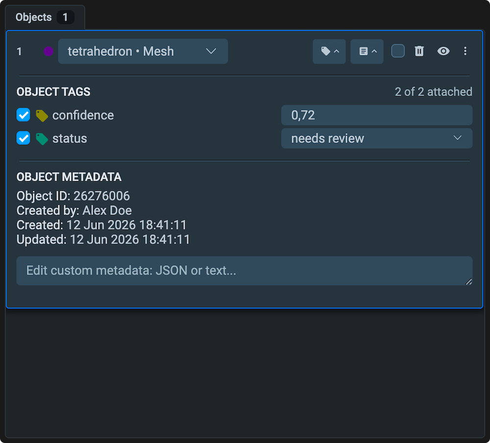
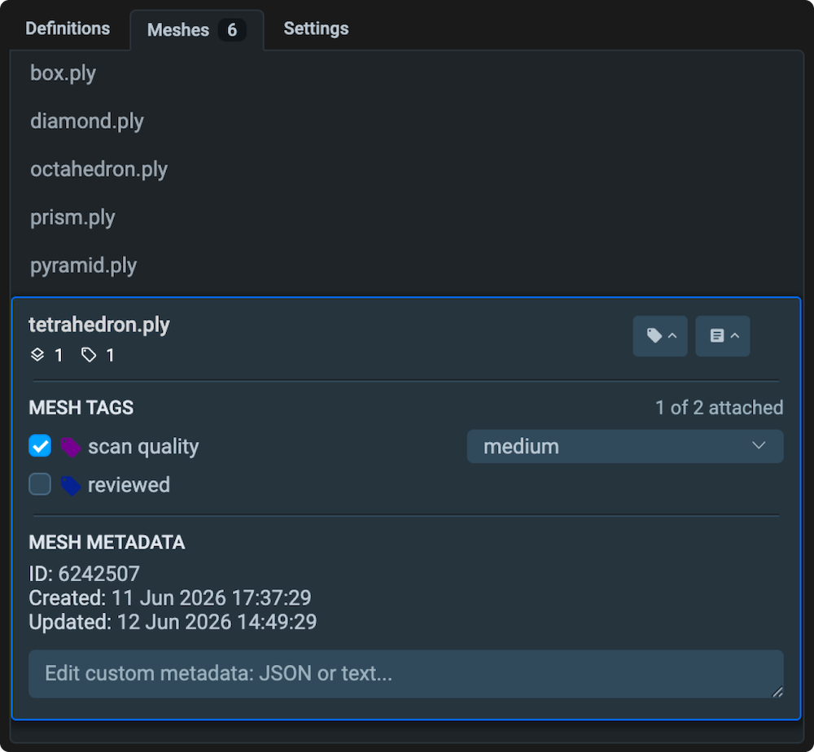

# Meshes

The Mesh Labeling Toolbox is a browser-based annotation interface for 3D surface data. It allows you to select and label regions of the mesh surface (stored as vertex selections), assign them to classes, attach tags and metadata, and navigate between multiple meshes in a dataset — all without leaving the browser.

<figure></figure>

The interface is divided into four areas:

1. [**Top bar**](#top-bar) — navigation, undo/redo, hotkeys, and workspace controls.
2. [**Tools panel**](#tools-panel) — annotation tools for selecting and painting mesh faces.
3. [**Objects panel**](#objects-panel) — list of all labeled objects on the current mesh.
4. [**Meshes panel**](#meshes-panel) — mesh list, tags, and metadata for the current mesh.

---

## Top Bar

<figure></figure>

- **Breadcrumb** — shows the current project, dataset, and mesh filename. Click any level to navigate up.
- **NEXT / PREV** — move to the next or previous mesh in the dataset.
- **Undo / Redo** — step backward or forward through annotation actions.
- **Hotkeys** — open the full hotkey reference for all tools and shortcuts.
- **More** — additional workspace options: fullscreen, screenshot, restore default layout.

---

## Tools Panel

The vertical toolbar on the left provides tools for navigating and annotating the mesh. Only one tool can be active at a time.

### Pan & Zoom (`1`)

Rotate, pan, and zoom the 3D mesh. While this tool is active, interactions with annotations on the scene are disabled.

### Select (`2`)

Click a labeled object on the mesh to select it. Selected objects can be edited, tagged, or deleted from the Objects panel.

### Vertex Paint (`5`)

The main annotation tool for creating and editing mesh objects. It operates in four sub-modes, switchable from the tool settings bar that appears when the tool is active:

- **Paint vertices** — brush over the mesh surface to add vertices to the active object.
- **Erase painted vertices** — brush over existing selections to remove vertices from the active object.
- **Paint faces** — select entire faces at once instead of individual vertices. Useful for coarser, faster annotation.
- **Paint individual vertices** — click single vertices one by one for precise boundary control.

**Brush radius** — adjust the brush size using the radius slider in the tool settings bar, or scroll the mouse wheel while the tool is active.

---

## Objects Panel

The Objects panel lists all labeled objects on the current mesh. It mirrors the behavior of the [Images toolbox Objects panel](../images/README.md#objects-panel).

<figure></figure>

Each row shows:
- **Class color** — the color assigned to the object's class in project settings.
- **Class name** — the class this object belongs to (e.g., `tooth`, `caries`).
- **Object ID** — numeric identifier (e.g., `.806`).
- **Face count** — number of mesh faces included in this object.
- **Tag count** — number of tags attached to this object.
- **Visibility toggle** — hide or show the object on the mesh.
- **Delete** — remove the object from the annotation.

**Creating a new object** — at the top of the panel, use the **Click on scene to create new** selector to choose a class, then paint faces directly on the mesh. The new object is created as soon as you paint the first face.

### Object actions

Right-click an object row or use the action icons to:
- **Select** — activate the object for editing.
- **Rename / change class** — reassign the object to a different class.
- **Add tag** — attach a metadata tag to the individual object.
- **Delete** — remove the object and all its face selections.

---

## Meshes Panel

The Meshes panel, in the bottom-right area, contains three sections: mesh navigation, mesh-level tags, and mesh metadata.

<figure></figure>

### Mesh list

The panel shows all meshes in the current dataset. Click any mesh in the list to switch to it. The active mesh is highlighted and displays its annotation progress (`labeled / total` faces and object count).

### Mesh Property Tags

Tags attached to the mesh as a whole — not to individual objects. Use mesh-level tags for properties that describe the entire scan, such as patient ID, scan quality, or acquisition date.

- Click **Tags Available** to expand the full list of project tags.
- Use the **search box** to filter tags by name.
- Click a tag to attach it to the current mesh. Click again to remove it.

### Mesh Metadata

Displays system-generated and custom metadata for the current mesh:

- **ID** — numeric mesh ID in Supervisely.
- **Created** — timestamp when the mesh was first uploaded.
- **Updated** — timestamp of the last annotation change.
- **Custom metadata** — a free-form JSON or text field. Use it to store any additional information about the mesh (acquisition parameters, source device, processing notes). Click the field to edit and save.
