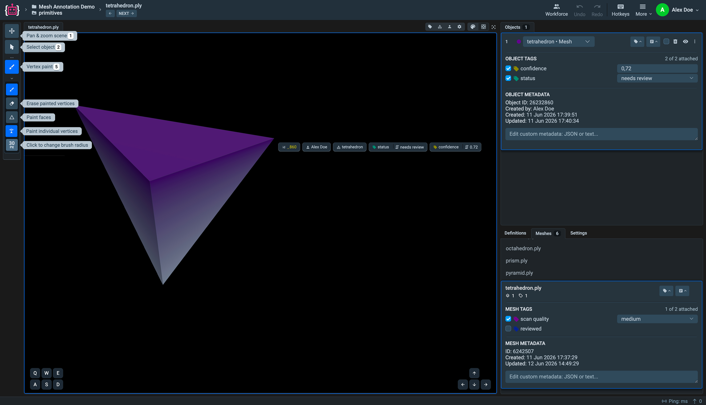
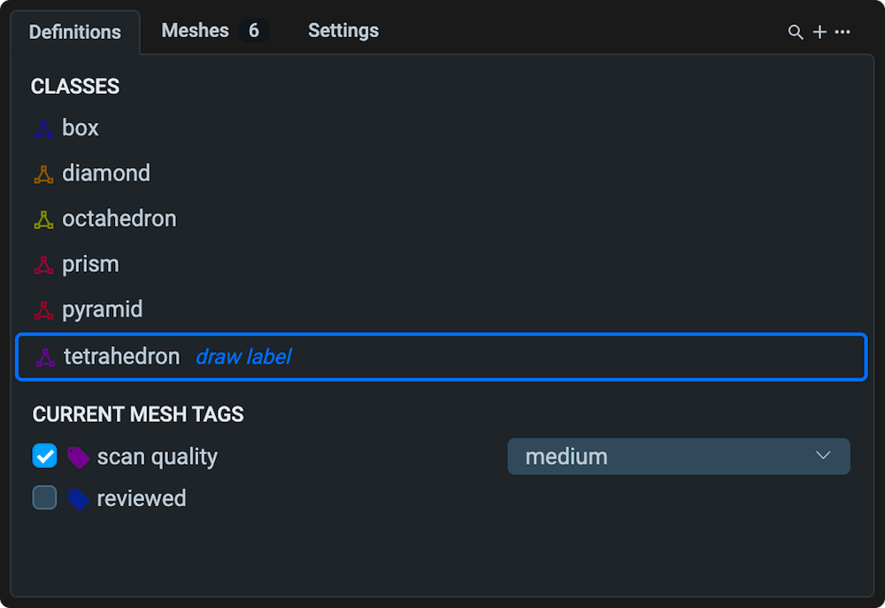
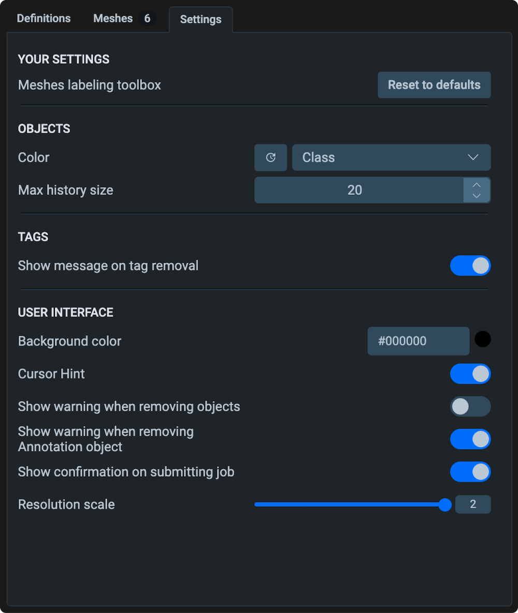

# Meshes

The Mesh Labeling Toolbox in Supervisely is a browser-based annotation interface for 3D surface data. It is designed for tasks like surface segmentation and region labeling on scanned or modeled meshes, making it ideal for applications such as dental scan analysis, industrial inspection, and 3D asset QA.

It provides a streamlined workspace with features such as:

* **Vertex painting** with an adjustable brush — including face-based and single-vertex precision modes
* **Instance and semantic labeling** — each painted region becomes a separate object tied to a project class
* **Tags and metadata** on two levels: the whole mesh and individual objects
* **Definitions panel** for managing classes and tags without leaving the tool
* **Mesh navigation** across the dataset, including nested datasets
* **PLY, STL, and OBJ** source formats, with a per-vertex PLY format for exchanging annotations with external pipelines



The interface is divided into four areas:

1. [**Top bar**](#top-bar) — navigation, undo/redo, hotkeys, and workspace controls.
2. [**Tools panel**](#tools-panel) — scene navigation and vertex painting tools.
3. [**Objects panel**](#objects-panel) — labeled objects on the current mesh, with their tags and metadata.
4. [**Bottom-right panel**](#definitions-meshes-and-settings) — three tabs: **Definitions**, **Meshes**, and **Settings**.

<figure><figcaption>Mesh Labeling Toolbox</figcaption></figure>

---

## Annotating Your First Mesh

1. Open a mesh project and click any mesh — the labeling toolbox opens in a new tab.
2. In the **Objects panel**, choose a class in the **Click on scene to create new** selector (or create one first in the **Definitions** tab).
3. Select the **Vertex Paint** tool (`5`) in the left toolbar.
4. Brush over the mesh surface — a new object is created as soon as you paint the first vertices.
5. Switch to **Erase painted vertices** in the tool settings to clean up the selection edges.
6. Select the object and attach **object tags** (e.g. `status`, `confidence`) in the Objects panel.
7. Attach **mesh tags** (e.g. `scan quality`, `reviewed`) in the **Meshes** tab.
8. Press **NEXT** in the top bar to move to the next mesh. Annotations are saved automatically.

---

## Top Bar

- **Breadcrumb** — shows the current project, dataset, and mesh filename. Click any level to navigate up.
- **NEXT / PREV** — move to the next or previous mesh in the dataset.
- **Undo / Redo** — step backward or forward through annotation actions.
- **Hotkeys** — open the full hotkey reference for all tools and shortcuts.
- **More** — additional workspace options: fullscreen, screenshot, restore default layout.

---

## Tools Panel

The vertical toolbar on the left provides tools for navigating and annotating the mesh. Only one tool can be active at a time.

### Pan & Zoom Scene (`1`)

Rotate, pan, and zoom the 3D mesh. While this tool is active, interactions with annotations on the scene are disabled.

### Select Object (`2`)

Click a labeled object on the mesh to select it. Hovering an object shows a floating summary with its ID, author, class, and tags. Selected objects can be edited, tagged, or deleted from the Objects panel.

### Vertex Paint (`5`)

The main annotation tool for creating and editing mesh objects. When active, a settings bar appears with four sub-modes:

- **Paint vertices** — brush over the mesh surface to add vertices to the active object. Use clicks for precise spots and drag strokes to cover larger regions.
- **Erase painted vertices** — brush over existing selections to remove them from the active object.
- **Paint faces** — paint entire faces at once instead of individual vertices. Useful for coarser, faster annotation on low-poly meshes.
- **Paint individual vertices** — click single vertices one by one for precise boundary control.


The eraser follows the active painting mode: with face painting it removes entire faces at once, with vertex painting it removes only the vertices under the brush.


**Brush radius** — click the radius value at the bottom of the toolbar to change the brush size, or scroll the mouse wheel while the tool is active.

**Moving the scene while painting** — hold `Ctrl` to temporarily switch to scene navigation (rotate, pan, zoom) without leaving the brush. Release `Ctrl` to continue painting.

---

## Objects Panel

The Objects panel in the top-right corner lists all labeled objects on the current mesh.

<figure></figure>

Each row shows the class color, the object class (a dropdown — select a different class to reassign the object), and action icons: attach tags, edit metadata, toggle visibility, delete.

**Creating a new object** — at the top of the panel, use the **Click on scene to create new** selector to choose a class, then paint directly on the mesh. The new object is created as soon as you paint the first vertices.

Selecting an object expands two sections:

### Object Tags

Attach tags to the individual object by toggling them in the **Object Tags** section. Tags with values (numbers or predefined options) get an input or dropdown next to the tag name — for example, `confidence: 0.72` or `status: needs review`. The section header shows how many of the project's object tags are attached.

### Object Metadata

System-generated and custom information about the object:

- **Object ID** — numeric object ID in Supervisely.
- **Created by / Created / Updated** — author and timestamps.
- **Custom metadata** — a free-form JSON or text field for any additional per-object information.

---

## Definitions, Meshes, and Settings

The bottom-right panel contains three tabs.

### Definitions

<figure></figure>

Manage project classes and tags without leaving the tool:

- **Classes** — the list of project classes. Hover a class and click **draw label** to start annotating with it. Use the **plus** icon to create new classes or tags, and the search icon to filter long lists.
- **Current mesh tags** — quick access to the tags attached to the current mesh, with their values.

### Meshes

<figure></figure>

- **Mesh list** — all meshes in the current dataset. Click any mesh to switch to it. The active mesh is highlighted and shows its object and tag counts.
- **Mesh tags** — tags attached to the mesh as a whole, not to individual objects. Use them for properties that describe the entire scan, such as `scan quality` or `reviewed`. Toggle a tag to attach it; tags with values get a dropdown or input.
- **Mesh metadata** — the mesh **ID**, **Created** and **Updated** timestamps, and a free-form **custom metadata** field (JSON or text) for acquisition parameters, source device, processing notes, and similar information.

### Settings

<figure></figure>

Customize the toolbox behavior and appearance:

- **Objects** — color objects by class or randomized per object; maximum undo history size.
- **Tags** — toggle the notification shown on tag removal.
- **User interface** — scene background color, cursor hint, warnings on object removal, confirmation on submitting a job, and the rendering **resolution scale**.

Click **Reset to defaults** to revert all settings.

---

## Scene Navigation

- **Rotate** — drag with the left mouse button on the scene.
- **Zoom** — scroll the mouse wheel.
- **Step rotation** — use the on-screen `Q W E` / `A S D` keys or the arrow buttons in the corners of the scene.
- **Fit to view** — click the frame icon in the scene toolbar to center and fit the mesh.

## Hotkeys

Using keyboard shortcuts helps reduce mouse clicks and saves time during large-scale annotation tasks. You can always view the full searchable list by clicking the **Hotkeys** button in the top bar.

| Group | Hotkey | Action |
|---|---|---|
| Tools | `1` | Move tool |
| | `2` | Select tool |
| | `5` | Vertex paint tool |
| Objects | `Shift` + `-` / `Shift` + `=` | Decrease / increase figure opacity |
| | `Backspace` | Remove selected figure |
| | `Shift` + `D` | Remove all figures on current frame |
| | `Ctrl/⌘` + `C` / `X` / `V` | Copy / cut / paste visible figures |
| | `Alt` + `P` / `Alt` + `N` | Select previous / next figure |
| Scene | `Enter` / `Shift` + `Enter` | Open next / previous mesh |
| Editing | hold `Ctrl` (while painting) | Temporarily navigate the scene |
| | `Space` | Save figure & start next |
| | `Esc` | Deselect current figure, cancel tool action |
| | `Ctrl/⌘` + `Z` / `Ctrl/⌘` + `Shift` + `Z` | Undo / redo |
| Jobs | `Ctrl/⌘` + `B` | Complete mesh annotation |
| | `Ctrl/⌘` + `Alt` + `A` / `R` | Accept / reject mesh |

---

## Import and Export of Meshes

Supervisely provides flexible tools for importing and exporting meshes with annotations.

For a general overview, see the [Import Overview page](../../import-and-export/import/supported-annotation-formats/README.md). By default, **AutoImport** automatically detects and supports the following formats:

* [Supervisely format for meshes](../../data-organization/import/import/supported-formats-meshes/supervisely.md) — mesh files with `.json` annotations and binary geometry files.
* [Per-Vertex Annotation format](../../data-organization/import/import/supported-formats-meshes/per-vertex.md) — ASCII PLY files with labels encoded directly in vertex attributes.


The Per-Vertex format is useful when annotations are produced by external pipelines (e.g. 3D segmentation models): annotated vertices carry their class color plus `class_id`/`object_id` attributes, and white is the neutral color for unannotated vertices.


To export, use the **Export Mesh Project** app from the context menu of a mesh project or dataset (`Download as` → `Export Mesh Project`). It supports both the Supervisely format and the Per-Vertex Labels format.

For more details about the native annotation format, see the [Supervisely Mesh Annotation Format](../../data-organization/Annotation-JSON-format/09_Supervisely_format_mesh.md).

## Summary

The Mesh Labeling Toolbox provides a complete workspace for 3D surface annotation:

* Vertex- and face-based painting with precise erasing and brush control
* Per-object and per-mesh tags and metadata for rich, structured annotations
* In-place class and tag management via the Definitions panel
* Native and per-vertex exchange formats for integration with external pipelines
