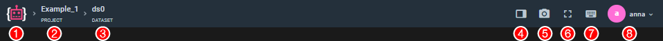

# Navigation and Additional controls

Shows current dataset and selected image.

## General navigation and Additional controls

1. Home button. Click to navigate.
2. Project name. Click to navigate.
3. Dataset name
4. *Hide sidebar* button
5. *Take screenshot* button. A screenshot of the current scene will open in a new window.
6. *Fullscreen* button
7. *Hotkeys list* button. 
8. Quick user menu access 

## Title bar

This element of the interface displays the filename for the current scene and provides an option to quickly navigate back (also **Shift + Enter** hotkey) back and forth (**Enter**) between the files in the dataset.

