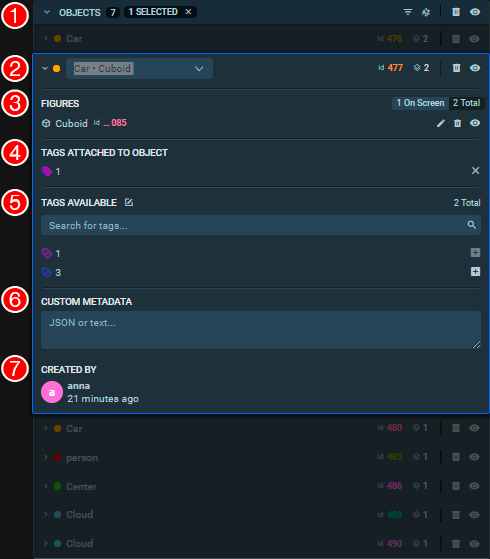
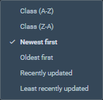

Placeholder from image figures

Also known as *objects*, figures are annotations that you create to show particular things on image.

Figures panel shows all annotations for a currently selected [image](images.md).

## Overview

The menu is divided in several sections. The elements in each section are described from left to right, top to bottow.

1. Main menu panel. This section of the Object menu affects all objects on the scene. It contains:
   - Total number of objects
   - Number of selected objects
   - *Filters* (coming soon)
   - *Sorting order* button
   - *Delete all objects* button
   - *Toggle Global Visibility* button

There are several options available for the way in which the files in the dataset are sorrted: 

2. Selected Object. This section displays:
   - Class colour for the object
   - Class name and shape (you can move objects between classes of the same shape in this drop-down menu)
   - Object ID
   - Number of figures associated with the object
   - *Remove object* button
   - *Hide object* button

3. List of Figures. The section contains:
   - Figures on screen / Total figures toggle
   - Figure shape
   - Figure ID (if the ID is too long it can be viewed by hovering over the shortened number)
   - *Edit* button (You can also click on the figure row to start editing it)
   - *Remove figure* button
   - *Hide figure* button

4. Tags attached to object. This section contains the list of all tags attached to the current object and provides an option to delete them from the object individually.

5. Tags Available. This section contains:
   - Add new tag button (in the section title)
   - The number of total available tags for the current object
   - Search bar for the tags list
   - List of all available tags. Ech tag can be added to the current object by pressing the *+* button on the right.
   
6. Custom Metadata. Use this field to add additional information about the object. All entered data needs to be manually saved save by pressing the corresponding button under the text field.

7. Created By. This section contains the name of the user that created the current object and how long ago that was.

## Filters

Coming Soon
