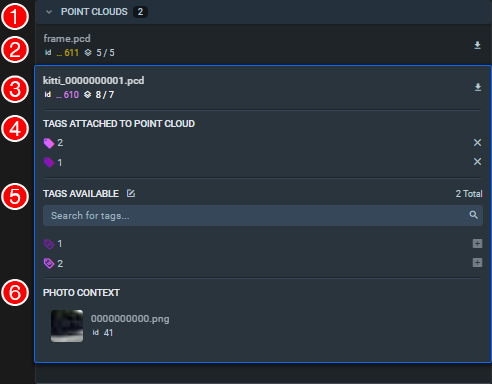

In Supervisely 3D annotation module, all of the files present in the current dataset are displayed in the Point Clouds menu.

## Overview

The menu is divided in several sections. The elements in each section are described from left to right, top to bottow.

1. Main menu panel. The total number of files in the dataset is listed here. 

2. Other files in the current dataset. Each line contain basic information, see 3. for details. 
   
3. Current Point Cloud. This section contains:
   - File name
   - Point cloud ID (if the ID is too long it can be viewed by hovering over the shortened number)
   - Figures / Annotation Objects Count
   - *Download* button (provides an option to download either the point cloud file or the annotation)

4. Tags attached to Point Cloud. This section contains the list of all tags attached to the current files and provides an option to delete them from the file individually.

5. Tags Available. This section contains:
   - Add new tag button (in the section title, this opens a new page)
   - The number of total available tags for the current files
   - Search bar for the tags list
   - List of all available tags. Ech tag can be added to the current file by pressing the *+* button on the right.
   
6. Photo Context. If an associated image is provided for the current .pcd, it's preview, name and an Image ID will be displayed here. The file can be toggled by clicking on the preview.  
