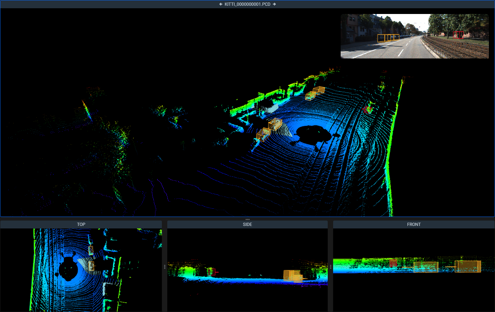

## Main Scene and Photo Context

Main scene takes the largest portion of the screen and is used to display the current file, photo context (if provided) and it's annotations. This area consists of 4 sub-areas: main view window, top, side and front views. 


You can control how large the main view window is by dragging the 3 dots beween it and the sidebar or between it and the bottom row,  right sidebar.


### Main scene view

The camera in this window can be rotated, dragged around and zoomed in and out with the Pan & zoom scene tool to provide you with the optimal viewpoint for the annotation process. Cuboids be placed here, point cloud polygons can be placed and redacted. 

### Top, Side & Front views

In all of these windows, camera angles are always fixed in their respective positons. Cameras can be zoomed in and out and dragged around. All types of figures can be placed and edited here. 

### Photo context

If provided, you can display a photo context image in the main scene view window by clicking on the file in the Point Clouds menu. All of your annotations for the current scene will be projected on this image. By clicking on it, you can switch between a smaller display in the top right corner or a larger view that will fit the main scene horisontally. 
