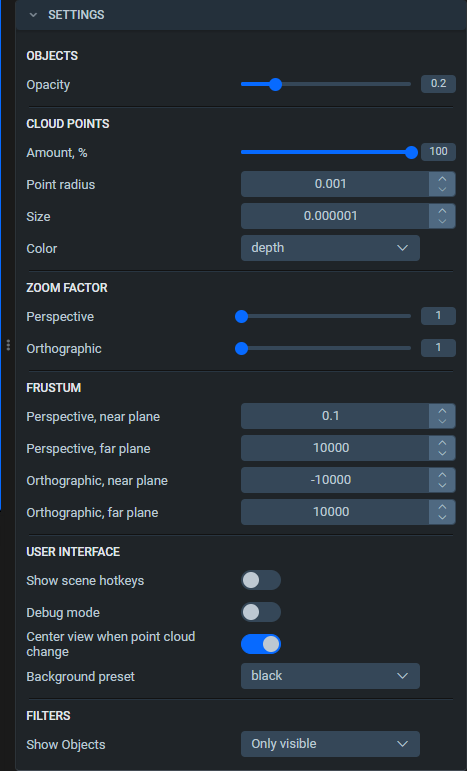

In Supervisely 3D annotation module, all of the display settings for the current project are displayed in a separate menu inside the annotation interface.

## Overview

The menu is divided in several sections:

1. Objects
   - Opacity: changes the opacity of all displayed objects on the scene. The slider goes from 0 to 1.
   
2. Cloud points 
   - Amount, %: Changes the % of the points displayed. The slider goes from 1 to 100.
   - **Point radius:** Effective range is from X to Y.
   - **Size:** Effective range is from X to Y.
   - Color: changes how the points are colored, based on one of the selected modes: regular, **depth** or **distance**.
   
3. Zoom factor
   - **Perspective** Effective range is from X to Y.
   - **Orthographic** Effective range is from X to Y.

4. Frustrum
   - **Perpective, near plane** Effective range is from X to Y.
   - **Perpective, far plane** Effective range is from X to Y.
   - **Orthographic, near plane** Effective range is from X to Y. 
   - **Orthographic, far plane** Effective range is from X to Y. 
   
5. User interface
   - *Show scene hotkeys* toggle
   - *Debug mode* toggle. **Provides ???**
   - *Center view when point cloud change* toggle
   - Background preset: a dropdown menu containting a list of images that can be used as a scene background. 
   
6. Filters
   - Show objects. This affects objects menu, it has two presets available: only visible (only shows the objects which have figures present on the current scene) and all (shows all objects).
