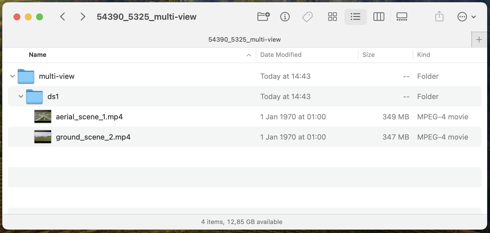
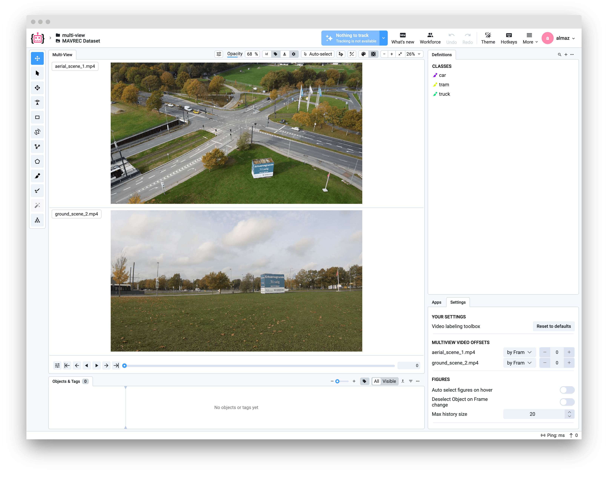
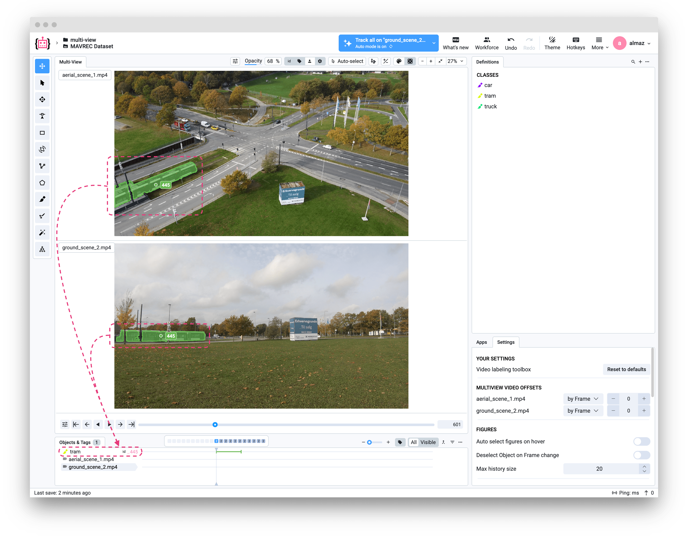
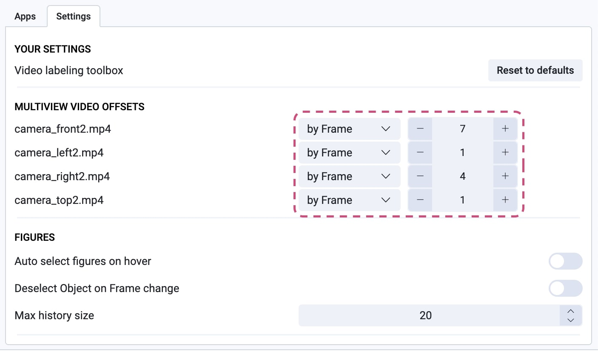
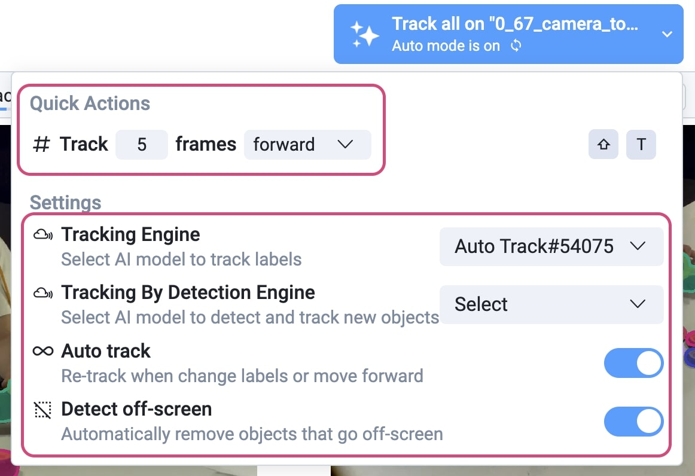

# Multiview Videos

## Overview

Multiview mode allows you to work with multiple videos of the same scene captured from different cameras or angles simultaneously. All videos within one dataset form a synchronized multiview group, enabling efficient annotation of complex multi-camera setups.

This is particularly useful for:

- **Autonomous driving** — multiple cameras mounted on a vehicle
- **Surveillance** — security cameras covering the same area from different angles
- **Sports analytics** — tracking athletes from multiple viewpoints
- **3D reconstruction** — multi-camera setups for depth estimation


---

## Key Concepts

### Unified Objects

If you have a common object appearing across different videos (e.g., a car visible from front, left, and right cameras), you can annotate it as a **single Supervisely object with a shared ID**.

- The object maintains its identity across all videos in the multiview group
- When you export and re-import the project, the object is recreated as a unified entity

### Synchronized Playback

All videos in a multiview group can be played back synchronously:

- Navigate through frames simultaneously across all views
- Configure frame offsets if videos have different starting points
- Control the order of videos in the labeling interface using metadata files with `videoStreamIndex` (see "How to Create Multiview Project" section below)
- Easily compare and analyze object behavior from multiple angles in real-time

---

## How to Create Multiview Project

### Via UI (Drag & Drop)

0. Prepare your data according to the required structure (see below):
   - Create a folder for each multiview group (dataset)
   - Place all camera videos inside the corresponding folder

```text
📂 project
└── 📂 ds1
    ├── 🎥 aerial_scene_1.mp4
    └── 🎥 ground_scene_2.mp4
```



1. Go to your workspace and start from creating a new project (`+ New` ⇨ `New Project Wizard`)
2. Select `Videos` ⇨ `Multi-view` labeling interface and proceed
3. Press `Import` to open the import app wizard
4. Drag and drop your prepared folder or archive
5. The import app will automatically group videos by datasets



In this example we use videos from the [MAVREC Dataset](https://mavrec.github.io) (CC BY 4.0) annotated by Supervisely team.

<details>

<summary>Citation for MAVREC Dataset</summary>

```txt
InProceedings{Dutta_2024_CVPR,
    author = {Dutta, Aritra and Das, Srijan and Nielsen, Jacob and Chakraborty, Rajatsubhra and Shah, Mubarak},
    title = {Multiview Aerial Visual RECognition (MAVREC): Can Multi-view Improve Aerial Visual Perception?},
    booktitle = {Proceedings of the IEEE/CVF Conference on Computer Vision and Pattern Recognition (CVPR)},
    month = {June},
    year = {2024},
    pages = {22678-22690}
}
```

</details>

For detailed import format specification, see [Multiview Import Format](../../../data-organization/import/import/supported-formats-videos/multiview.md).

### Via Python SDK

```python
import supervisely as sly

# Initialize API
api = sly.Api.from_env()

# Create a new project with multiview settings
project = api.project.create(
    workspace_id=WORKSPACE_ID,
    name="My Multiview Project",
    type=sly.ProjectType.VIDEOS,
    change_name_if_conflict=True
)

# Update project settings to enable multiview
api.project.set_multiview_settings(project.id)

# Create a dataset (each dataset = one multiview group)
dataset = api.dataset.create(project.id, "ds1")

# Upload videos to the dataset
video_paths = [
    "/path/to/aerial_scene_1.mp4",
    "/path/to/ground_scene_2.mp4"
]

for video_path in video_paths:
    api.video.upload_path(
        dataset_id=dataset.id,
        name=sly.fs.get_file_name_with_ext(video_path),
        path=video_path
    )
```

Open the project in the Supervisely UI to start annotating in multiview mode.



### Optional: Specify Video Order

To control the order of videos in the multiview labeling interface, you can create a metadata JSON file for each video with the suffix `.meta.json`. This file should include the `videoStreamIndex` to define its position.
For example, for a video named `aerial_scene_1.mp4`, create a file named `aerial_scene_1.mp4.meta.json` with the following content:

```json
{
  "videoStreamIndex": 0
}
```

```text
📂 project_name
    ┣ 📂 ds1
    ┃  ┣ 🎥 aerial_scene_1.mp4
    ┃  ┣ 🎥 aerial_scene_1.mp4.meta.json  # ⬅︎ meta file with videoStreamIndex
    ┃  ┣ 🎥 ground_scene_2.mp4
    ┃  ┗ 🎥 ground_scene_2.mp4.meta.json  # ⬅︎ meta file with videoStreamIndex
    ┗ 📂 ds2
       ┣ 🎥 camera_front.mp4
       ┣ 🎥 camera_left.mp4
       ┗ 🎥 camera_right.mp4
```

---

## Labeling in Multiview Mode

### Interface Overview

The multiview labeling interface includes the following key elements:

- **Video panels & Synchronized timeline** — each video is displayed in its own panel with a shared timeline for synchronized navigation:
- **Objects & Tags panel** — shows objects across all videos and video-specific tags:



- **Multiview settings** — configure frame offsets to align videos temporally to ensure synchronized playback. You can specify number of frames or time in milliseconds for each video:



### Annotating Objects


Note: When annotating in multiview mode, you can create unified objects across videos, but tags remain video-specific.


1. **Create an object** on any video using annotation tools (rectangle, polygon, etc.)
2. **The same object** can be annotated on other videos in the group
3. Objects with the same ID are linked across all videos




### Video-specific Tags

Unlike objects, **tags apply only within a specific video**:

- When you tag a figure, frame, or video, that tag is associated only with that particular video
- Tags are displayed only on the video where they were created
- This allows for view-specific annotations (e.g., "occluded" tag on one camera angle)

### Auto-tracking


To speed up the annotation process, you can use the **Auto Track** app to automatically track objects across multiple videos simultaneously.


To use auto-tracking in multiview mode:

1. **Open a multiview video project** and navigate to the desired frame.
2. **Configure the tracking settings** in the tracking tool:
   - Set number of frames to track
   - Choose direction (forward/backward)
   - Select the tracking engine ([Auto Track](https://app.supervisely.com/ecosystem/apps/supervisely-ecosystem/auto-track) app)
   - Enable/Disable automatic tracking

  

3. **Annotate the object** on one of the videos and start the tracker.
4. After tracking is complete on one video, **switch to another video** in the multiview interface.
5. **Create a new figure** for the same object and press `Alt + Space` (or `Option + Space` on Mac) to complete the figure. This will trigger the tracker to extend the annotation for the same number of frames as before.


There are two options for using auto-tracking: enabling automatic tracking when annotating or editing an object, or manually running the tracker using the hotkey `Shift + T`. If automatic tracking is enabled, the tracker runs automatically on all figures of objects across all videos.




Simple example result of auto-tracking in multiview mode:



---

## Export

Use the **Export Videos in Supervisely Format** app to export your multiview project:

- All videos are exported with their annotations in Supervisely format
- Object relationships across videos are preserved via shared object keys
- Metadata files contain `videoStreamIndex` for maintaining video order
- Project meta include settings for multiview configuration

The exported structure can be re-imported to recreate the exact same multiview setup.

---

## Use Cases

| Use Case               | Description                                                                     |
| ---------------------- | ------------------------------------------------------------------------------- |
| **Autonomous Driving** | Annotate objects visible from front, rear, and side cameras as unified entities |
| **Surveillance**       | Track people or vehicles across multiple security cameras                       |
| **Sports Analytics**   | Follow athletes from different camera angles for comprehensive analysis         |
| **Retail Analytics**   | Monitor customer behavior from multiple store cameras                           |
| **3D Reconstruction**  | Annotate corresponding points across stereo or multi-camera setups              |

---

## Useful Links

- [Multiview Import Format Specification](../../../data-organization/import/import/supported-formats-videos/multiview.md)
- [Video Annotation Format](../../../data-organization/Annotation-JSON-format/00_ann_format_navi.md)
- [Export Videos in Supervisely Format](https://ecosystem.supervisely.com/apps/export-videos-project-in-supervisely-format)
- [Video Labeling Toolbox](../README.md)
