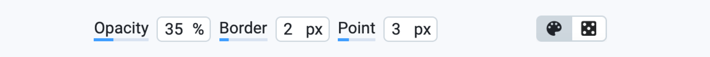
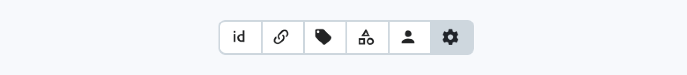
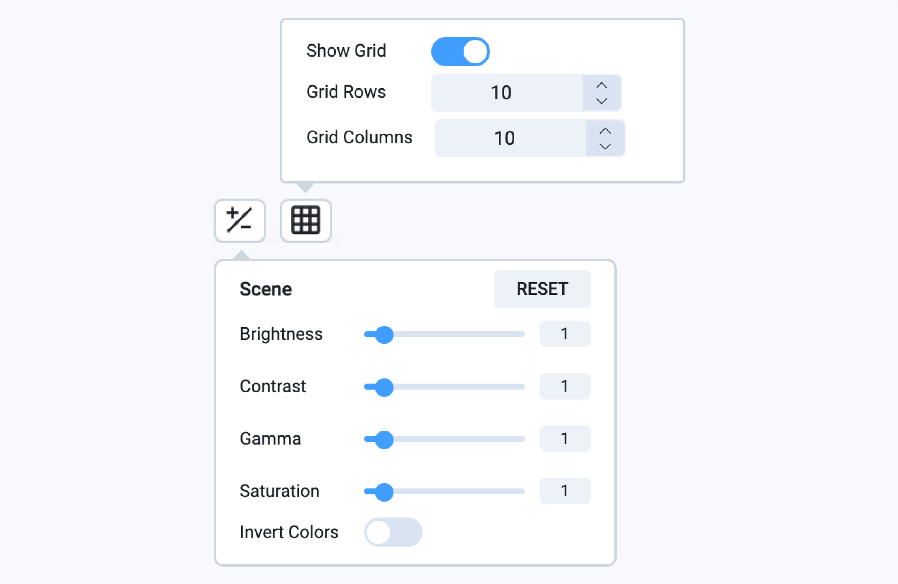
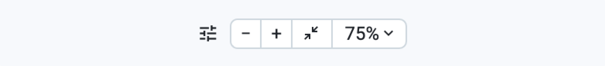

# Videos 2.0

**Advanced Object Tracking:** The video annotation toolbox supports both Single Object Tracking (SOT) and Multiple Object Tracking (MOT), enabling efficient tracking of objects across frames. Users can integrate their own tracking algorithms without needing specialized knowledge.

**AI-Assisted Labeling:** The toolbox offers interactive semantic segmentation tools powered by class-agnostic neural networks, which can be trained on custom datasets. These neural networks are both trainable and customizable, allowing users to adapt them for various data types and use cases.

**Video Tagging:** With segment tagging, users can annotate specific video sections to capture and categorize different events or activities. This simplifies the video annotation workflow and ensures that important moments are accurately labeled.

**User-Friendly Interface:** The interface is highly customizable, allowing users to tailor the annotation environment to their needs. 

**No Conversion Required:** Users can start annotating videos immediately after uploading or by connecting their cloud storage. This eliminates the need for converting videos into image sequences, speeding up the workflow.

**Automatic Management of Tracking IDs:** The toolbox automatically handles tracking IDs across frames, reducing manual intervention. This simplifies the process of tracking multiple objects and enhances workflow efficiency.

**Consistent Frame Handling:** By maintaining consistency across all frames, the toolbox ensures that object tracking and tagging remain accurate over long video segments. This is critical for training neural networks, ensuring they learn from the same data that human annotators have reviewed.

## **Overview**

<figure><figcaption></figcaption></figure>

1. **Home button** — returns user to the main menu (Projects page)
2. [Basic interface elements](./#basic-interface-elements) — basic settings, such as history of operations, theme, a hotkeys map and more useful features.
3. [Main scene & labeling scene settings & playback](./#main-scene-and-labeling-scene-settings-and-playback) — annotation area for current video and its labels.
4. [Timeline and track controls](./#timeline-and-track-controls) —  video timeline and controls for managing tracks and frames.
5. [Definitions panel](./#definitions-panel) — make it easy to create and manage classes and tags.
6. [Instruments panel](./#instruments-panel) — annotation tools used to create annotations.
7. [Objects panel](./#objects-panel) — list of figures on the current video with additional information like classes and tags.
8. [Videos/Apps/Settings panel](./#images-panel) — list of videos in your dataset, list of additional apps you can embed into the labeling toolbox, visualization and other settings.

***

## **Using tags in the Video Annotation Tool 2.0**

### **Global Tags**

Global Tags apply to the entire video or to an object across its presence in the video.

#### **Assign a global tag for an video**

1. Go to the **Videos** panel and open **Toggle tags panel**.
2. In the **Tags Available** section, select or create tags to describe the video property tag (for example, "Traffic Density" or "Weather Condition"). Choose whether the scope is global or global and frame-based when creating a tag.
3. Click the **Attach to video as a property tag** button to assign it as a global tag for the entire video.

<figure><figcaption></figcaption></figure>

#### **Assign a global tag for an object**

1. Click on the labeled object in the video or go to the **Objects** panel and select one (e.g., "car").
2. In the **Tags Available** section, select or create tags to describe the object property tag throughout the video (for example, "Road Position" or "Direction"). Choose whether the scope is global or global and frame-based when creating a tag.
3. Click the **Attach to annotation object as a property tag** to link the tag to the object.

<figure><figcaption></figcaption></figure>

### **Frame-Based Tags**&#x20;

Frame Tag**s** allow you to tag specific moments or actions on individual frames.

**Assign a frame tag for an object**

1. Click on the labeled object in the video or go to the **Objects** panel and select one (e.g., "bus").
2. In the **Tags Available** section, choose a tag (e.g., "Lane Change") and click **Mark Frames** to tag the frames where the bus changes lanes.
3. Use the **Timeline** slider to navigate through the video and label specific frames with the selected tag. Once you've identified the relevant frames, the tag will be applied accordingly to the chosen frames for the object.

<figure><figcaption></figcaption></figure>

**Assign a frame tag for an video**

1. Go to the **Videos** panel and open **Toggle tags panel**.
2. In the **Tags Available** section, choose a tag (e.g., "Traffic Density") and click **Mark Frames** to select the frame range to which you want to apply the tag.
3. Use the **Timeline** slider to navigate through the video and label specific frames with the selected tag. Once you've identified the relevant frames, the tag will be applied accordingly to the chosen frames for the video.

<figure><figcaption></figcaption></figure>

### **Tracking**

**Tracking** enables the system to follow an object across frames, making it easier to add tags and annotations.

1. Select the object in the video.
2. Click **Track** (or use the **SHIFT + T** shortcut) to start tracking. The system will automatically follow the object's movement.
3. In the tracking settings, you can select the tracking method, direction, and number of frames to process. Once tracking is complete, the object will be tracked across all selected frames.

<figure><figcaption></figcaption></figure>

***

## Basic interface elements

The top toolbar contains options for personalizing the interface and managing data and its annotations.

<figure><figcaption></figcaption></figure>

**Video navigation arrows (next, previous):** Allow users to move between videos in the dataset.

**Undo and redo buttons:** Undo or redo the most recent annotation action.

**Select theme (dark or light):** Ability to switch between light and dark interface themes, especially useful for those who prefer to work at night.

**Hotkeys:** A list of hotkeys for quick access to tools.

**More options:**

* **Enter fullscreen** - this option allows the user to switch the interface to fullscreen mode, maximizing the workspace area. It hides browser toolbars and other elements
* **Screenshot** - the screenshot function enables users to take a snapshot of the current workspace, including the video and any annotations displayed. This can be useful for documentation, sharing progress, or reviewing annotations with team members.
* **Enter restore mode** - enter restore mode provides tools to recover lost or corrupted annotations. When enabled, it offers options to revert changes to a previous state or repair specific parts of the annotation dataset.
* **Restore default layout** - this function resets the interface layout to its default configuration. It is useful when the layout has been modified (e.g., panels moved or resized) and the user wants to return to the original setup.

***

## Main scene & labeling scene settings & playback

This is the central area. It displays the video to be annotated, with various display controls that the user can hide or show in the panel as needed.&#x20;

Main scene shows the video currently being worked on. Users can interact directly with this area using the annotation tools from the sidebar.

<figure><figcaption></figcaption></figure>

### Annotation display settings 

**Opacity:** To modify the transparency of objects, hold and drag the cursor left or right. This allows for a more nuanced view of the objects' layers. Additionally, you can hold the `SHIFT` key and scroll the mouse wheel to adjust the opacity conveniently from anywhere on the screen.

**Border:** Enhance the visibility of object boundaries by holding and dragging the cursor left or right. This action changes the width of the objects' borders, allowing for clearer demarcation. Useful when working with huge resolutions or with large number of small objects

**Point:** Adjust the radius of object points by holding and dragging the cursor left or right.

**Default color:** Paint objects with their original colors as defined in class settings. This is the default setting and helps maintain consistency and recognition. So the objects of different classes are visually distinguishable.

**Randomize color:** Randomize object colors to distinguish between objects of the same class. A simple click, followed by `SHIFT+H`, randomizes the object's colors. Can be used in Instance Segmentation Computer Vision task to highlight visual distinction of all objects of the same class on an image.

<figure><figcaption></figcaption></figure>

### Attribute display settings for clearer context 

**ID:** Toggle the visibility of object IDs near the objects on the scene. This is essential for identifying and referring to specific objects.

**Bindings:** Show or hide bindings near objects to understand how various elements are connected to each other. [Objects can be combined into groups](https://developer.supervisely.com/advanced-user-guide/objects-binding).

**Tags:** Display tags near objects to provide additional context or categorization.

**Classes:** Enable visibility of the classes assigned to each object, helping in the classification and organization of scene elements.

**Author:** Display the creator's name near the objects to acknowledge object authorship.

**Change Visibility Mode:** This option allows users to switch between different visibility modes, optimizing the scene display as per the user's preference. You can choose how to show the attributes:

* **Always** | Users can select full tag display, which means that the information will be visible directly on Objects or Videos in the project.
* **Show on hover** | Tags are only displayed when the cursor is hovered over the annotated object.
* **Show when selected** | The ability to hide Tags until the Object is selected provides a cleaner look and feel to the interface and prevents information overload when working with a project.

<figure><figcaption></figcaption></figure>

### Advanced interaction with scene objects 

**Auto-select:** Automatically select objects of the current shape when hovering the cursor over them.

**Show object trajectory:** Visualize the path an object has taken in the scene over time.

You can customize the way the trajectory looks using the following settings:

* **Width (px):** This setting controls the thickness of the trajectory line in pixels. A higher value makes the line thicker, making the trajectory more visible, while a lower value makes the line thinner.
* **Draw backward frames:** This option controls how many frames in the past are drawn to represent the object's trajectory. Users can adjust the number of frames using a slider, allowing them to visualize the object's past movements over a longer or shorter period of time.&#x20;
* **Draw forward frames:** This option controls how many frames in the future are drawn to represent the predicted path of the object. Users can adjust the number of frames using a slider, which helps plan and visualize future motion.

<figure><figcaption></figcaption></figure>

### Customizing image display settings 

**Scene display settings:** Adjust scene display settings like brightness or contrast to suit different viewing conditions or preferences. For example, you can use them while annotation dark or low-contrast images.

**Grid:** A grid helps organize the navigation on the images with high resolutions and large number of small objects.

<figure><figcaption></figcaption></figure>

### Visibility and image sizing 

The ability to hide annotation settings declutters the workspace, focusing attention on the task at hand.

Real-time image resizing adapts to various project needs, ensuring optimal viewing and editing conditions. Just zoom-in or out on the images to see object details and perform precise labeling of object boundaries.

<figure><figcaption></figcaption></figure>

### **Playback controls**

**Play/Pause buttons(ENTER)**: Standard playback controls to play or pause the video.

**Play video backwards:** Plays the video from the current frame backwards, i.e. from the current frame to the previous frame, and so on to the beginning of the video.

**Previous/Next frame (<- | ->):** Buttons to jump to the previous or next frame.

**Previous/Next 10 frame** **(ALT + <- | ALT + ->):** Buttons to jump to the previous or next 10 frame.

**Frame counter and time display**: Shows the current frame number, total number of frames, and current time position in the video (e.g., "100 / 384" or "0:04 / 0:16"). For example, `122 / 384` means you are at frame 122 out of 384 total frames.

**Track length slider**: Allows you to quickly scroll through the video frames by dragging the slider left or right. Annotated segments of the video are displayed by blue color line.

### **Playback settings**

**Speed:** Controls the playback speed (e.g., x2).

**Skip frames:** Allows skipping a specified number of frames during navigation (e.g., +/- 10 frames).

**Fast decoding mode:** Enabling this mode speeds up the video playback process.

**Navigation bar settings:** Switches between different modes for the navigation bar, such as

* **Figures:** show frames with objects
* **Tags:** show frames with tags
* **Auto:** show frames with figures/tags based current selection

<figure><figcaption></figcaption></figure>

***

## Timeline and track controls

It’s easy to get frustrated with thousands of frames and objects labeled!

The tracks panel offers controls for managing tracks, tags, and navigating through video frames. It provides a clear overview of the video's structure, answers questions about what has already been labeled, and simplifies editing tag segments and tracked objects.

### **Manage tracks**

This dropdown list allows you to manage different tracks or objects detected in the video. A track represents a series of frames where an object is detected and labeled. By selecting options from this menu you can choose which track will be visible on the timeline.

**Figures**: Filters and displays only figures detected in the video frames.

**Video Tags**: Displays all tags assigned with the entire video.

**Objects Tags**: Shows tags specific to objects on the frames.

**Current Object Tags**: Focuses on the tags currently assigned with the selected object.

**Current Tag Tags**: Filters and displays the tags that are actively being used in the current tagging session.

Select one or more options to filter and view specific tags in the frame or across the video.

### **Timeline**

It's a linear scale that visually displays the sequence of video frames and associated annotations. It allows users to manage annotation processes, object tracking, and other labeling tasks. The timeline contains various tracks which display data related to objects and tags.

**Time scale:** A horizontal ruler that shows all video frames. Each frame is numbered, making it easy to locate specific points in time. The frame-level timeline provides more detailed control and visualization of the video on a frame-by-frame basis.&#x20;

The manually labeled frames are shown in gray, the frames that were automatically tracked are striped, the current frame is in a blue frame

**Frame segments:** Labeled objects and tags are shown as segments on the timeline. For example, tracks for objects or tags show the start and end points of their presence in the video.

**Track information display**: Displays the current segment of the video you are managing (e.g., "SEGMENT 1 / 2") and allows you to navigate between segments.

* Play segment: **SHIFT + ENTER**
* Previous segment: **SHIFT + <-**
* Next segment: **SHIFT + ->**

### Track

**Track button (SHIFT + T):** Automatically create new figures based on the selected one for the next video frames.

The tracking process is started manually and performed automatically. The system analyzes the selected object or area in the frame and starts tracking its motion and changes as the video plays.

**Tracking progress bar:** A progress bar appears in the interface that shows how many percent of tracking has already been done.

The tracking percentage will be updated in real time as the operation progresses, and the bar will gradually fill up to reflect the progress.&#x20;

When the progress bar reaches 100%, it means that the tracking process has been successfully completed. The object has been tracked on all selected frames.&#x20;

After tracking is complete, the user can track the object if no errors are detected, or edit some frames and re-track them.

**Stop tracking (SHIFT+S)**: The system stops tracking the selected object in the frame. Already created figures will remain.

### **Track settings**

**Method:** Choose the object tracking algorithm. For example, "MixFormer Object Tracking" application is used to track the motion of selected objects.

The predefined **Clone** command creates a duplicate (or clone) of the selected shape, object, or annotation. This clone will have the same parameters as the original, including size, position, shape, and any associated data (such as tags or metadata).

**Working with clones:**

A clone can be created in the same frame as the original shape, or moved to another frame to keep identical settings in different parts of the video. Once a clone is created, you can modify it independently of the original, or use it as a template to create other objects with the same settings.

**Direction:** Defines the direction of tracking, such as "Forward"/"Backward".

**Overwrite figures:** Auto-generated objects will be override.

**Frames:** Defines the number of frames to be processed during tracking (e.g., +/- 10 frames).

### **Editing Tools**

**Scissors (COMMAND + X):** Cuts figures at the current frame.

**Copy (COMMAND + C):** Duplicates the selected figures.&#x20;

**Paste** **(COMMAND + V)**: Pastes duplicate figures.

**Trash (SHIFT +  D)**: Removes the selected figures.&#x20;

**Frame selector (SHIFT + SPACE) :** Allows you to manually select multiple frames for batch tracking, tagging and removal.

***

## Definitions panel 

The Definitions panel provides a simple interface for creating and managing classes and tags in a project. It helps users organize and control annotations.

Instead of choosing a tool first, you can now click on the desired class from the Definitions Panel. The associated tool will be automatically selected, allowing you to start labeling immediately. To start a new label, simply click on any class (including the currently selected one) in the Definitions Panel.

If you want to change the class of the selected object, you can click the small icon on the right, which appears only if the new class shape matches the currently selected object. Tags are also present on the same panel. If no object is selected, image tags are shown. You can check the desired tag or hover the cursor and start typing a tag value or select it from a dropdown, which will automatically assign it.

**Improved Search:** To find classes or tags more easily in a long list, click the magnifying glass icon in the top right corner of the panel. Type your query and select the desired class or tag to continue your workflow.

#### Classes 

Class may be assigned only to an object and represent a clear category to which the object in the image belongs. For example, a classification of vehicles in an image might include the classes "car", "truck", and "bus".

Definitions panel displays the list of annotation classes (e.g., "person", "road sign", "vehicle"). Each class has a unique name, color and shape to identify between different types of objects.

* Add new class definitions using the **add new class definition** option.
* **Organize classes** in the definitions list to improve navigation.

#### Tags 

Tags are used to add additional information to images, objects, or other data. Tags can describe context, object properties, or other parameters that can be useful for data analysis and model training.

Definitions panel shows tags associated with the current image. Tags are metadata that help to categorize or add additional information to images (e.g., weather conditions, time of day).

* Use the **add project tags definitions** feature to create and manage tags at the project level.
* **Tag removal:** You can configure the system to ask for confirmation when tags are removed.
* **Attaching a single tag multiple times:** You can enable or disable the ability to attach a single tag multiple times to an object. This setting can be adjusted by editing `Project → Settings → Tags → Multiple Tags Mode` in the Dashboard.
* **Removing tags with hotkeys:** You can enable or disable the feature that allows a tag to be removed when pressing the corresponding hotkey again.

#### **Video property tags**

* This section is for tags that describe general properties of the video as a whole.
* **No tags here** indicates that no tags have been added to this section.
* These tags can include attributes like the video’s location, weather conditions, or general scene characteristics that are constant throughout the video.

#### **Video frame tags**

* This section is for tags that apply to specific frames in the video.
* Tags here help to identify or categorize specific moments or frames within the video.
* **X On Screen** indicates tags currently visible on any frame.
* **X Total** indicates tags created for any frame in the entire video..
* Video frame tags can be used for frame-specific annotations, like marking a moment when a skier jumps or a snowboarder falls.

#### **Object Property Tags**&#x20;

* This section is for tags that describe general properties of an object in the video as a whole.&#x20;
* **No tags here** indicates that no tags have been added to this section.&#x20;
* These tags can include attributes such as the object's type, color, size, or other characteristics that remain common across the video.

**Example:** snowboarder

**Object type:** human; **clothing:** winter suit, helmet; **snowboard color:** black: **equipment:** snowboard

#### Object Frame Tags&#x20;

* This section is for tags that apply to specific frames in the video and describe changes or actions related to an object.&#x20;
* Tags here help identify or categorize specific actions or occurrences for an object at specific frames.&#x20;
* X On Screen indicates tags that are currently visible on any frame for the object.&#x20;
* X Total indicates tags created for the object across all frames in the video.&#x20;
* Object frame tags can be used for frame-specific annotations, such as marking when an object moves, changes state, or interacts with another object (for example, when a person picks up an object or a vehicle starts moving).

**Example:** snowboarder performing a trick

**Frame 00:15:** snowboarder begins a jump off the ramp; **frame 00:17:** performs a 360-degree spin; **frame 00:19:** lands on the slope

**Tags available**&#x20;

* This section lists all the available tags that can be used in the whole video.&#x20;
* **Search for tags...** input field allows the user to search for a specific tag if the list is extensive.&#x20;
* In the example provided, there is 1 tag available: status-segment...: A tag that appears to be related to the status or segmentation of objects or frames. It is indicated by a blue icon.
* **Link icon** (🔗): Allows the user to link the tag to specific frames or objects.&#x20;
* **Mark Frames** **button**: Probably used to mark or assign this tag to a range of frames in the video.

<figure><figcaption></figcaption></figure>

***

## **Instruments panel**

[**Pan & Move Scene Tool:**](./#basic-interface-elements) Quickly navigate around the image without modifying annotations.

[**Select Figure**:](../labeling-tools/navigation-and-selection-tools.md) Select and modify existing annotations; essential for refining objects.

[**Drag Figure:**](../labeling-tools/navigation-and-selection-tools.md) Reposition annotations without altering their size or shape.

[**Point Tool:**](../labeling-tools/point-tool.md) Label specific points or small objects precisely.

[**Bounding Box:**](../labeling-tools/bounding-box-rectangle-tool.md) Best for object detection tasks.

[**Polyline Tool:**](../labeling-tools/polyline-tool.md) Annotate linear objects or edges with multiple connected line segments.

[**Polygon Tool:**](../labeling-tools/polygon-tool.md) Ideal for irregular and complex shapes.

[**Brush and Eraser Tool:**](../labeling-tools/brush-tool.md) Flexible for both polygonal and free-form masks.

[**Mask Pen Tool:**](../labeling-tools/mask-pen-tool.md) Great for segmenting diverse objects with varying shapes.

[**Smart Tool:**](../labeling-tools/smart-tool.md) Efficient for quick, AI-assisted segmentation.

[**Graph (Keypoins) Tool:**](../labeling-tools/graph-keypoints-tool.md) For pose-estimation tasks.

<figure><figcaption></figcaption></figure>

***

## Objects panel 

The Objects panel displays key properties and parameters of objects that can be tracked on the timeline. It is a dynamic space for showcasing and managing object tags, attributes, and metadata. Some of the features it offers include:

* **Clone Objects** - Easily replicate selected objects to the next frame with a simple right arrow key press ( ->).&#x20;
* **Filter and Manage** - Quickly filter objects, remove all from the video, or toggle their visibility according to your needs. For example you can hide all objects except of the specific class.
* **Advanced Interactions** - Select, delete, hide, merge objects, or adjust their layering. Additionally, you can modify metadata and assign or manage tags right from this window, enhancing the object's data with minimal effort.

<figure><figcaption></figcaption></figure>

***

## Videos panel 

The videos panel provides a comprehensive view of all the videos within a selected dataset. Key functionalities include:

* **Tag Management** - Clone tags from the previous video, assign new ones, or modify existing tags to maintain consistency and organization.
* **Filter and Manage** - View and edit metadata details or filter through videos to find exactly what you need.
* **Video Operations** - Delete videos, download them individually, or download annotations for external use.

***

## Apps panel: expand your capabilities 

In an ever-evolving ML landscape, the apps panel serves as a portal to a wide range of applications from the [Computer Vision Ecosystem](https://ecosystem.supervisely.com/), enhancing the functionality of your workspace. This window allows you to run and open the public or private apps and extend the Labeling Toolbox with custom UI and functionality.

***

## Settings panel 

The settings panel is the control center for personalizing the interface. It houses various options allowing users to tweak the interface to match their workflow, preferences, and project requirements.

<figure><figcaption></figcaption></figure>

***

## **Speed up labeling with AI-assistance**

Video labeling toolbox has countless features, but most importantly, it provides integrations with the best AI models that dramatically improve your labeling performance. For example:

* [MixFormer](https://ecosystem.supervisely.com/apps/mixformer/serve/serve?utm\_source=blog) for bounding box detection and tracking
* [RITM](https://ecosystem.supervisely.com/apps/ritm-interactive-segmentation/supervisely?utm\_source=blog) and [SAM](https://ecosystem.supervisely.com/apps/serve-segment-anything-model?utm\_source=blog) for mask segmentation and tracking
* [TAP-Net](https://ecosystem.supervisely.com/apps/serve-tapnet/tapnet/supervisely/serve?utm\_source=blog) for polygon segmentation and tracking

You can check this short video to get an overview on AI capabilities in the video labeling toolbox:


