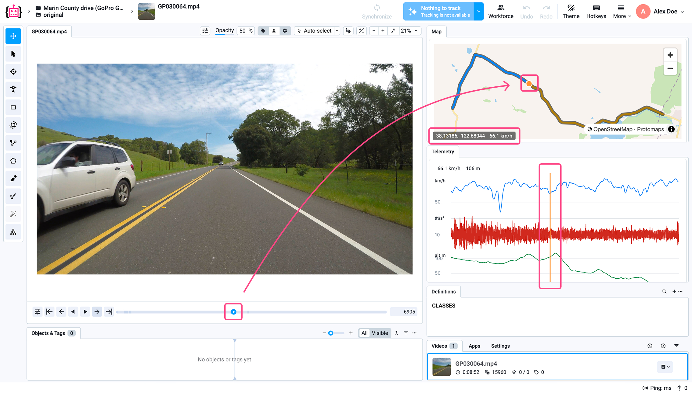
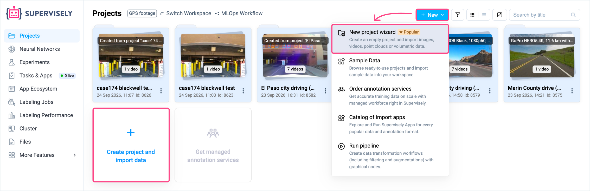
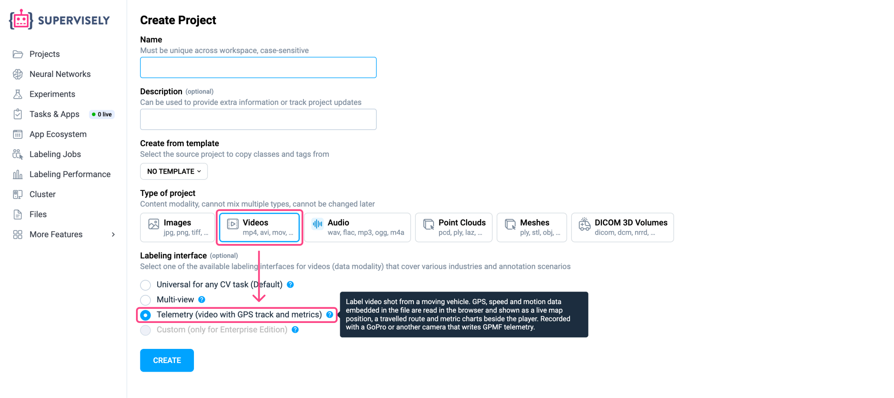
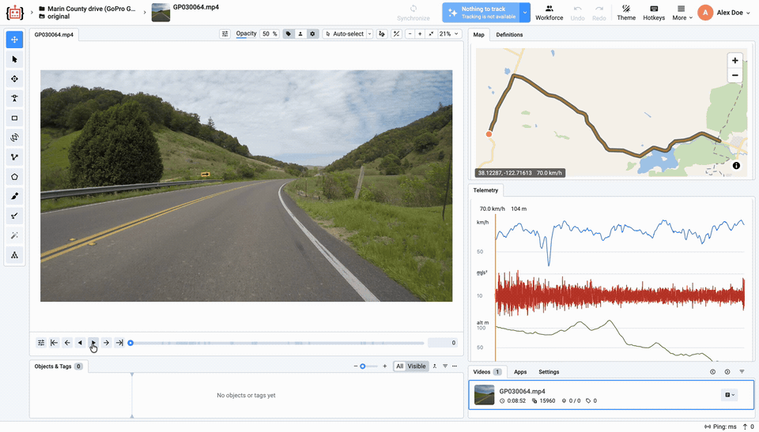
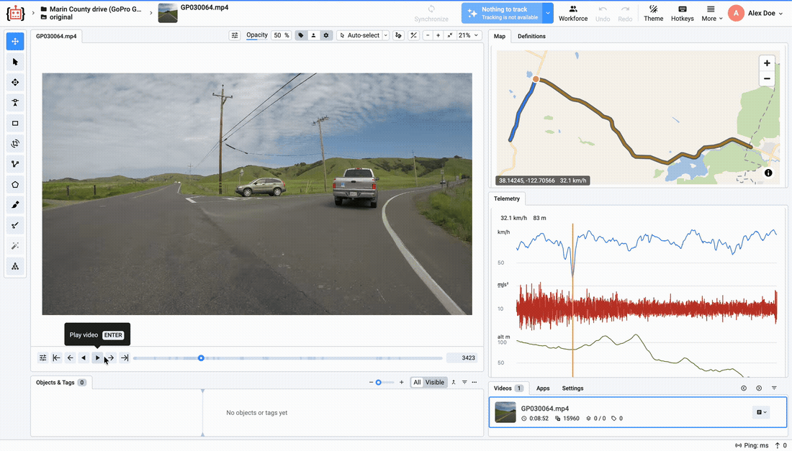
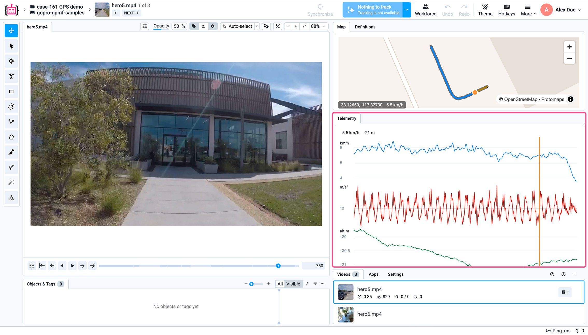
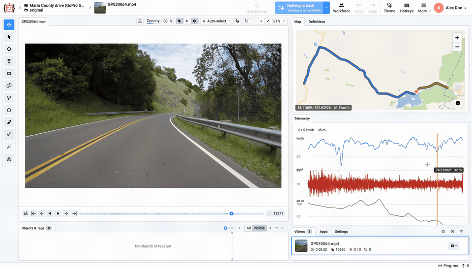
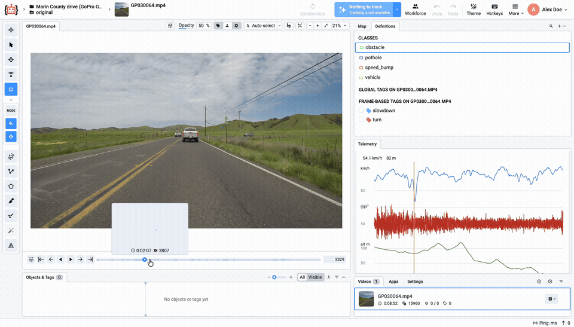
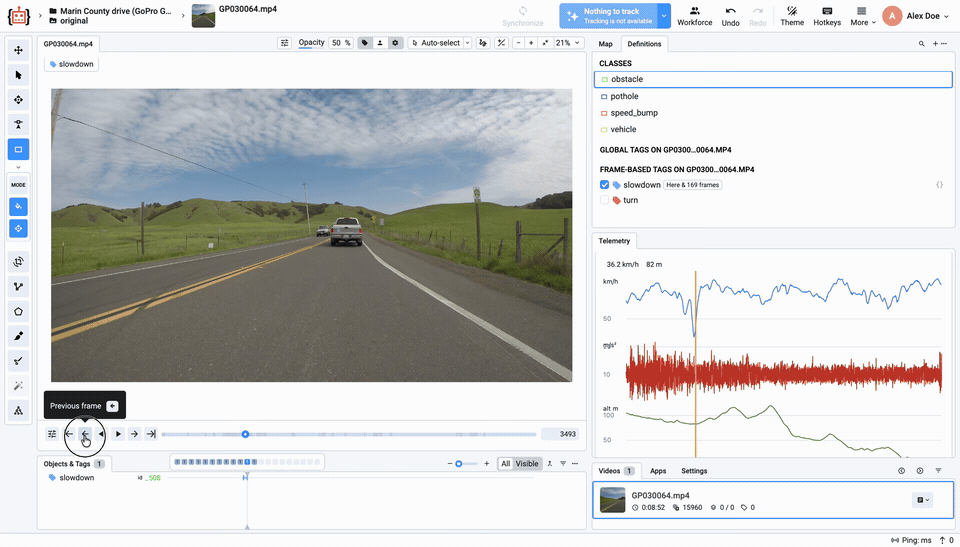
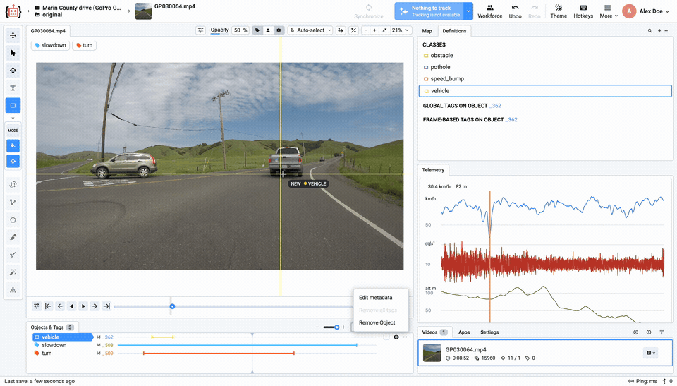

# Video + GPS Telemetry

**Video + GPS Telemetry** is a labeling and review interface for footage recorded by a moving camera, whether from a car, a train or during a route survey. It brings together the image, map position and motion metrics so reviewers can understand **what happened, where and under what conditions**, then annotate the corresponding frames.

In a long recording, a timestamp alone may not help you find a particular bend, level crossing or slowdown. Telemetry lets you start with a location on the map or a change on a chart and jump directly to the corresponding video. These views share a timeline, so you do not have to match them manually.

The **Map** panel displays the recorded GPS route and the camera's position at the current moment. The **Telemetry** panel displays speed, acceleration and altitude. During playback, the map marker and chart playhead follow the video; selecting a point on the map or a chart also updates the frame in the player.



*All footage on this page: [“Driving in Marin County, CA Countryside”](https://archive.org/details/MarinCountyCADriving) by HelloColby, Internet Archive, [CC BY 4.0](https://creativecommons.org/licenses/by/4.0/), shown in screenshots and recordings of the Supervisely interface; explanatory annotations added.*

## Questions the tool helps answer

| Review question | How Telemetry helps |
| --- | --- |
| Where was this frame recorded? | The map marker shows the camera's position at the selected moment. |
| What happened at a particular location along the route? | Click a route point to open the corresponding frame without searching through the entire recording. |
| Where did the speed drop, and what was happening there? | Select a dip on the speed chart and compare the frame with its map position. For example, the slowdown may coincide with a bend or a stop. |
| Which moment needs closer review because of shaking or sudden movement? | Find a change on the acceleration chart and review the corresponding segment. Use the footage and recording conditions to investigate the cause. |
| How can I record an observed event or object? | Annotate an object in the frame or tag a segment using the Video Labeling Tool. |

## Interface capabilities

- **Video and route in one workspace.** View frames alongside the map, current coordinates and speed. The map helps you locate a section of the route, while the video lets you inspect its details.
- **Three synchronized navigation methods.** Seek on the video timeline, click the route in **Map**, or click a chart in **Telemetry**. The video, map marker and chart playhead show the same moment.
- **Metrics across the recording.** Speed, acceleration and altitude charts help you find a segment of interest and compare it with nearby sections. Available metrics depend on the data in the file.
- **Embedded telemetry support.** Use original videos with GoPro GPMF or compatible CAMM telemetry. These recordings do not require manually matching a separate GPS track to the video.
- **Annotation in the same workspace.** After selecting a moment, use [video annotation tools](../labeling-toolbox/videos-3.0.md#instruments-panel) and [classes and tags](../../data-organization/project-dataset/define-classes-tags.md) to describe objects and events for review or dataset preparation.

## When to use it

**Road and railway infrastructure inspection.** Find sections along a route, review road surfaces, signs, level crossings and other visible objects, and flag segments that need attention. Railway workflows require footage of the relevant railway route with telemetry.

**Dashcam review.** Investigate stops, slowdowns and turns by comparing the scene with its location and motion metrics.

**Route survey and mapping footage review.** Use the map to orient yourself and the video to visually inspect landmarks and objects along the recorded route.

**Computer vision dataset preparation.** Find events of interest by location or motion metrics, then annotate the corresponding frames and segments.

Telemetry helps reviewers select and investigate a moment in a recording; determining the cause requires interpretation. An acceleration peak alone does not prove a track defect, and a drop in speed does not establish a dangerous situation. The GPS marker represents the camera's position, not the precise coordinates of every object in the frame.

## Before you start

Use a Supervisely deployment that includes the Telemetry video interface. For Enterprise installations, the license must enable `videosLabelingInterfaces.telemetry`. Contact your administrator if the interface is unavailable.

For Python workflows, install **Supervisely SDK 6.74.39 or later**. The SDK recognizes the interface, but installing it does not add Telemetry to an older platform deployment.

### Supported recordings

| Source | Embedded telemetry format | What to upload |
| --- | --- | --- |
| GoPro | GPMF in a `gpmd` track | The original camera MP4, recorded with GPS enabled and a stable GPS fix (GPS lock) |
| Compatible Insta360 cameras and dashcams | CAMM | A recording containing supported CAMM telemetry |

The camera brand alone does not guarantee GPS data. Available metrics depend on the recording and the camera's sensors.


Upload original GoPro files without re-encoding. Video converters and editors can remove the embedded GPS stream even when the picture looks unchanged. Keep the camera original.


## Create a Telemetry project

1. Open your [workspace](../../data-organization/project-dataset/data-structure.md) and launch the [project creation wizard](../../data-organization/project-dataset/create.md).

   

2. Select **Videos** as the project type and **Telemetry** (`telemetry`) as the labeling interface.

   

3. [Upload the original camera recordings into a dataset](../../data-organization/project-dataset/create.md#creating-a-dataset).
4. Open a video in the [Video Labeling Tool](../labeling-toolbox/videos-3.0.md). Wait for telemetry to load: the **Map** and **Telemetry** panels appear beside the player.
5. Play the video or move to a specific moment on the timeline to inspect the corresponding location and telemetry.

<!-- GitHub review: animated GIF fallback. For GitBook publication, upload gps-synchronized-navigation.webm and embed its hosted URL as a video block; replace the GIF and download link. -->



[Download the full-resolution video (WebM)](https://github.com/supervisely/docs/raw/refs/heads/review/video-gps-telemetry/.gitbook/assets/gps-synchronized-navigation.webm).

The Marin County example shows a countryside drive recorded on a GoPro with embedded GPS data.

## Navigate using the video, map and telemetry charts

You can move to a specific moment in the recording in three ways:

- **Using the video timeline** — select a moment on the track below the player. See [playback controls](../labeling-toolbox/videos-3.0.md#playback-controls) for playback buttons and frame navigation.
- **Using the Map tab** — click a point on the recorded route.
- **Using the Telemetry tab** — click a moment on the speed, acceleration or altitude chart.

All three navigation methods are synchronized: seeking updates the video frame, the map marker and the chart playhead. Start with whichever view makes the relevant part of the recording easiest to find.

**Use the map to find a specific place.** Select a route point, such as a bend, to see what happened there on video and compare the footage with the telemetry.

**Use the charts to find changes in the metrics.** For example, click a drop in speed on the blue chart. The video and map move to the same moment: you can see whether the slowdown coincided with a bend and check the footage to understand how the vehicle went through it.

See the Video Labeling Tool guide for [annotation tools](../labeling-toolbox/videos-3.0.md#instruments-panel). To configure object categories and tags, see [Classes and Tags](../../data-organization/project-dataset/define-classes-tags.md).

### Jump to a frame from the route

In **Map**, click a section of the drawn GPS route. The video seeks to the recorded moment associated with that location; the marker and chart playhead update with the frame. Select the route itself: an arbitrary point on the basemap does not necessarily correspond to recorded footage. Use [frame navigation](../labeling-toolbox/videos-3.0.md#playback-controls) to refine the position after seeking.

In the layout shown here, **blue** represents the route up to the current playback position and **ochre** represents the remaining section. The colors indicate playback progress, not road condition or speed. The **orange marker** shows the camera's position. The badge at the bottom of the map displays **latitude, longitude and speed in km/h** for the current position.



## Read the telemetry charts

The **Telemetry** panel contains three charts. The horizontal axis represents video time, and the orange vertical line marks the current playback position. Use it to match the video frame with the readings on all three charts. The current speed and altitude appear above the charts.

| Chart | What it shows | How to use it |
| --- | --- | --- |
| **Blue — speed, km/h** | The camera's speed according to GPS data. | Find stops, slowdowns and faster sections, then review the corresponding frames. |
| **Red — acceleration, m/s²** | The acceleration magnitude recorded by the camera's sensor. | Find shaking, vibration and sudden movements for closer video review. |
| **Green — altitude, m** | Altitude from the telemetry data. | Compare the video with climbs, descents and altitude changes along the route. |



**Acceleration is not the same as vehicle acceleration or braking.** The sensor also responds to movement of the camera itself. Its readings may include the effect of gravity, so values around 10 m/s² should not be interpreted directly as vehicle acceleration. A peak helps identify a moment to review, but does not by itself prove that the road has a defect.

**Altitude depends on the reference system and the accuracy of the source data.** A negative value, such as −21 m, does not mean depth and does not by itself indicate an error. Small fluctuations may reflect measurement uncertainty rather than changes in terrain.

To investigate an event, move to the corresponding moment on the video timeline and compare the footage, map position and chart readings.

### Hover tooltips and long recordings

Hover over a chart to read the tooltip values for that time position. In the demonstration, the tooltip contains speed and altitude. Hover to inspect the values; click the chart to seek to the corresponding frame. The values under the mouse pointer may differ from the current-frame readings above the charts.

<!-- GitHub review: animated GIF fallback. For GitBook publication, upload gps-hover-tooltip.webm and embed its hosted URL as a video block; replace the GIF and download link. -->



[Download the full-resolution video (WebM)](https://github.com/supervisely/docs/raw/refs/heads/review/video-gps-telemetry/.gitbook/assets/gps-hover-tooltip.webm).

For a long recording, use the chart as an overview: locate a noticeable change, click it, then refine the event's start and end using frame navigation in the player. A brief event occupies little space on the full timeline, so inspect the video to distinguish nearby events. Allow telemetry to load before reviewing the complete route.

## Annotate frames found through telemetry

The map and charts help you find a frame; annotation takes place in the video. The aim is to record road conditions that may have affected movement and speed. For example, a vehicle ahead may have slowed down, or there may be an obstacle, pothole or speed bump.

Configure [classes and tags](../../data-organization/project-dataset/define-classes-tags.md) for your task. A slowdown can be marked with a frame-based video tag such as `slowdown`, while visible objects can be annotated using classes with appropriate geometries, such as `vehicle`, `pothole`, `speed_bump` or `obstacle`. Use the classes relevant to objects actually present in your footage.

These annotations help relate speed changes to observable road conditions and prepare examples for analysis and model training. Events occurring at the same time may be related, but timing alone does not establish the cause of a slowdown.

### Example: annotating a slowdown and a turn

In the Marin County recording, you can find a drop in speed on the chart and examine what is happening on the road at that moment. In the example below, the slowdown is marked with the tag `slowdown`. This name is chosen for the demonstration; tags and their names depend on the annotation task.

The chart helps locate the moment of interest, while reviewing nearby frames helps refine the event boundaries and identify objects that may have affected movement.

<!-- GitHub review: animated GIF fallback. For GitBook publication, upload gps-slowdown-tag.webm and embed its hosted URL as a video block; replace the GIF and download link. -->



[Download the full-resolution video (WebM)](https://github.com/supervisely/docs/raw/refs/heads/review/video-gps-telemetry/.gitbook/assets/gps-slowdown-tag.webm).

In the same segment, the turn is marked with the tag `turn`. The slowdown is identified using the speed chart, while the turn is identified using the video and map. Their tag ranges may differ: for example, the vehicle may begin slowing down before entering the turn.

If a segment is short and individual frames are difficult to select on the full timeline, use **Timeline Zoom** to enlarge the relevant section. It takes up more space on screen, making it easier to move between frames and refine where the event starts and ends.

<!-- GitHub review: animated GIF fallback. For GitBook publication, upload gps-turn-tag.webm and embed its hosted URL as a video block; replace the GIF and download link. -->



[Download the full-resolution video (WebM)](https://github.com/supervisely/docs/raw/refs/heads/review/video-gps-telemetry/.gitbook/assets/gps-turn-tag.webm).

### Annotate an object in the selected frame

If a visible vehicle ahead may have contributed to the slowdown, you can select a `vehicle` class with rectangle geometry in **Definitions** and draw a box around it. A visible pothole, speed bump or other obstacle can similarly be annotated with the appropriate class.

Use the standard Video Labeling Tool features to annotate subsequent frames: creating an object on one frame does not automatically annotate the entire recording. [Auto-Tracking](../labeling-toolbox/videos-3.0.md#auto-tracking) can help extend the annotation, including the **Interpolate until next real frame** quick action, which fills the intermediate frames between two manually annotated keyframes.

For example, draw a box around a vehicle on the first frame of the segment, then move to the last frame you want to annotate and adjust the annotation for the same object, keeping its ID. Return to the first annotated frame, select the object and run **Interpolate until next real frame** from the Auto Track quick actions. Annotations will be generated automatically between the two keyframes. Review the result and adjust the boxes where needed. See the [keyframe interpolation example](../labeling-tools/oriented-bounding-box-tool.md#usage-scenarios-interpolation-between-keyframes) for more details.

<!-- GitHub review: animated GIF fallback. For GitBook publication, upload gps-object-labeling.webm and embed its hosted URL as a video block; replace the GIF and download link. -->



[Download the full-resolution video (WebM)](https://github.com/supervisely/docs/raw/refs/heads/review/video-gps-telemetry/.gitbook/assets/gps-object-labeling.webm).

Speed, acceleration and GPS readings describe the camera mounted on the recording vehicle, not the annotated vehicle ahead. A `vehicle` box does not associate that object with the telemetry readings, and drawing a box or adding a tag does not automatically produce geographic coordinates for the object.


**Anonymize Data v1.4.1+** preserves GPS and telemetry when it anonymizes a video. Check the route and synchronization in the resulting copy.


## Create a project with the Python SDK

For general programmatic upload options, see [Import using API and SDK](../../data-organization/import/import/import-sdk-api.md). The example below creates a Telemetry project.

```bash
python -m pip install "supervisely>=6.74.39"
```

Set the `SERVER_ADDRESS` and `API_TOKEN` environment variables. Set `WORKSPACE_ID` to the destination workspace ID. A team ID and a workspace ID are different values.

```python
import os
from pathlib import Path

import supervisely as sly
from supervisely.project.project_settings import LabelingInterface, ProjectSettings

api = sly.Api.from_env()
settings = ProjectSettings(labeling_interface=LabelingInterface.TELEMETRY)

project = api.project.create(
    workspace_id=int(os.environ["WORKSPACE_ID"]),
    name="Video GPS Telemetry",
    type=sly.ProjectType.VIDEOS,
    settings=settings.to_json(),
)
dataset = api.dataset.create(project.id, "original")

# Use an original camera recording without editing or re-encoding.
video_path = Path("/path/to/GX010001.MP4")
api.video.upload_path(dataset.id, video_path.name, str(video_path))
```

`LabelingInterface.TELEMETRY` serializes to `"telemetry"`. SDK versions earlier than 6.74.39 may raise `ValueError: Invalid labeling interface value: telemetry` when reading the settings of such a project.

## Videos without a GPS lock

A camera may record video without obtaining a valid GPS fix. If a recording has no usable GPS telemetry, the interface displays **“This video has no GPS telemetry”** instead of a route. This is an empty state, not a processing error. A metadata track alone does not mean it contains valid coordinates.

Before recording a new video, enable GPS and wait for a stable GPS lock. Uploading the file again or converting it cannot restore a route that the camera never recorded.

## Troubleshooting

| Problem | What to check |
| --- | --- |
| Telemetry is unavailable during project creation | Check that the platform version supports the interface and that the Enterprise license permits it. |
| The original works, but an edited copy has no route | Editing or conversion may have removed telemetry. Use the original and verify that processing preserves the GPS stream and its timing. |
| An anonymized copy has no route | Check the output in the labeling tool. Successful face or license plate blurring does not guarantee telemetry was preserved. |
| The SDK does not recognize `telemetry` | Upgrade to SDK 6.74.39 or later in the environment running the script or application. |
