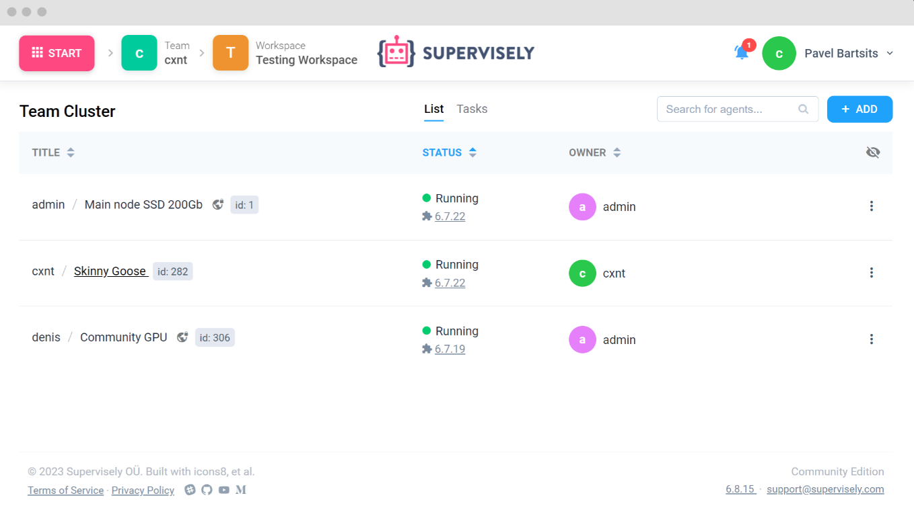

# Deploy an Agent

Connect your PC or a cloud server with GPU to Supervisely by running a simple command in your terminal. That will allow you to train neural networks and run inference right from the Supervisely web interface. You can find information on how to do this [here](../../getting-started/connect-your-computer/README.md)

