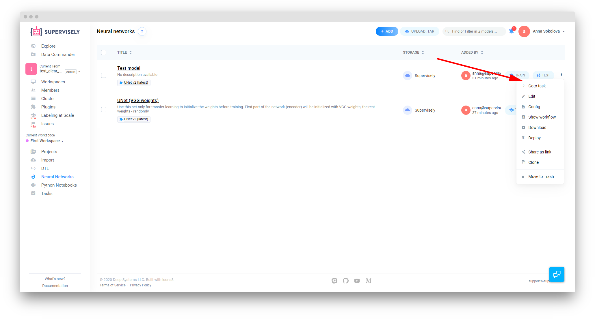
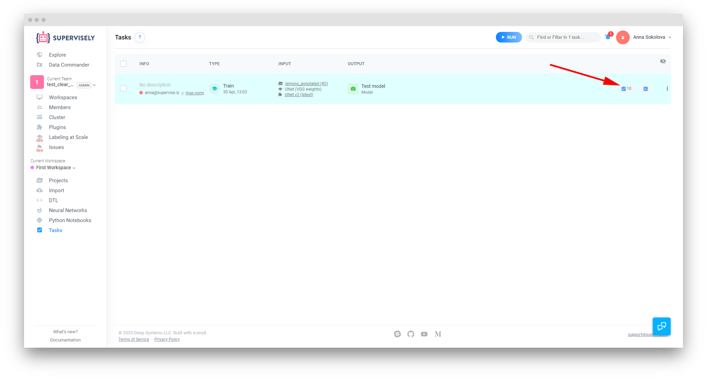
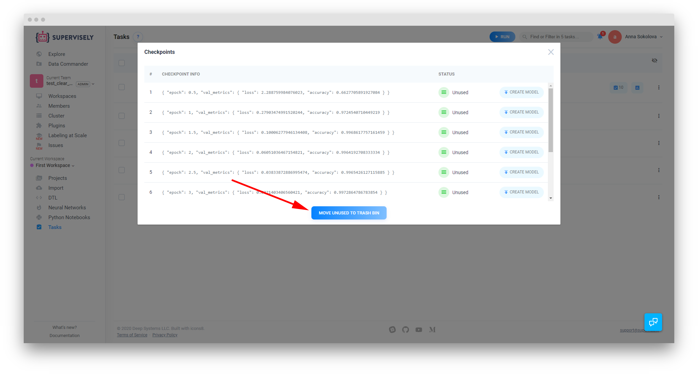
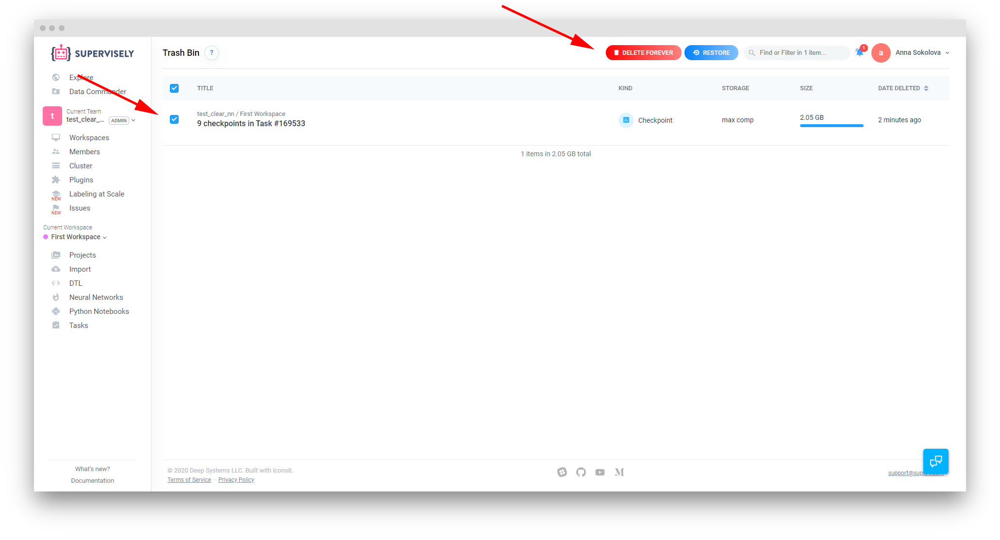
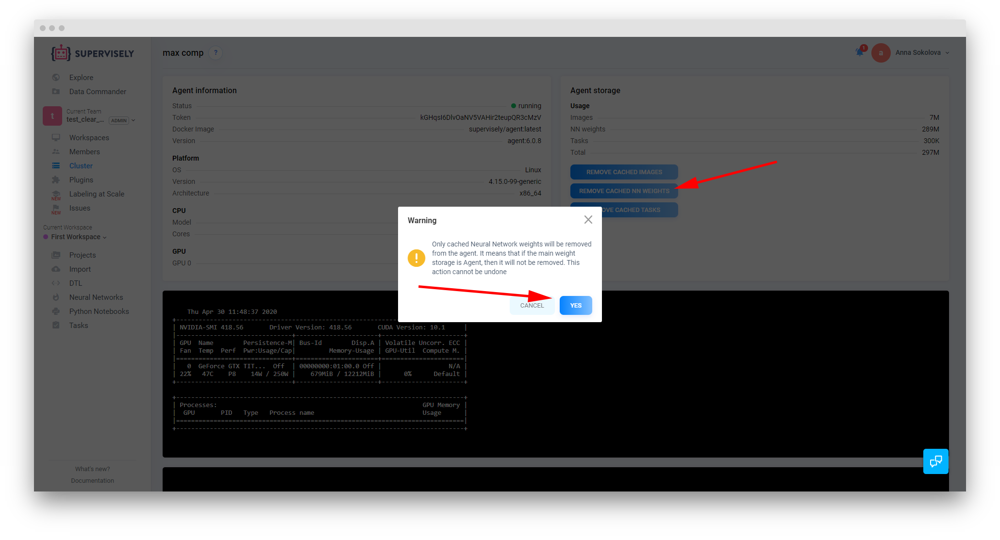
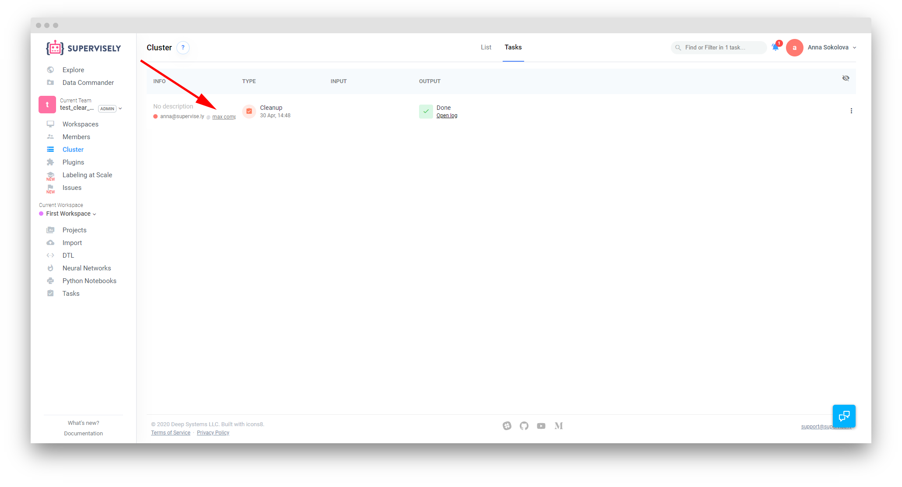
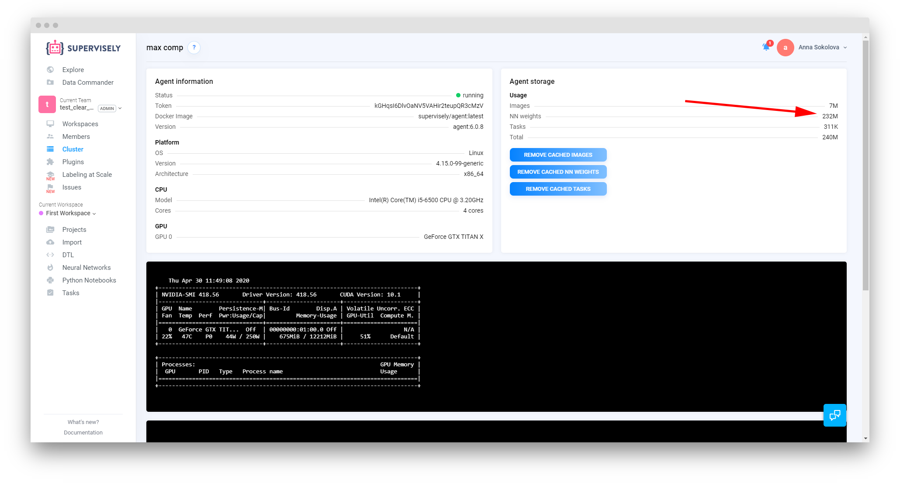

# How to remove NN weights from Supervisely Agent

For every training task in Supervisely the system creates several checkpoints. The exact number depends on the settings you specified for ```epochs``` and ```val_every``` parameters when starting the task. As long as the task these checkpoints are associated with is not archived, they are not considered cached, and you can use them to create a model at any point. The downside to this is that they take up some space on your hard drive.

In our example, we have 2GB of data in NN weights at the beginning of it:


To clear some space, you can delete the extra NN weights from your agent. Here’s how:

**Step 1.** Open the Neural Networks page. Open the ⋮ menu for your trained model and select Goto task. 



**Step 2.** You will be redirected to the corresponding task on the Tasks page. It will always be highlighted for the ease of navigation. Click on the ‘view and manage checkpoints’ button.




**Step 3.** In the new pop-up menu, press the ‘move unused to trash bin’ button. The system will process your request and the checkpoints’ status will change to Deleted.



**Step 4.** Open your Trash Bin (you can find in the user menu in the top right corner). Mark the checkpoints from the previous step and press ‘Delete Forever’. These weights are now marked as unused.



**Step 5.** Now go to the Cluster page and open the Agent info page by clicking on the agent title. Here, press ‘Remove cached NN weights’ and then ‘Yes’ in the confirmation pop-up.



**Step 5.** The system will redirect you to the Cluster Tasks page where you will see a new Cleanup task. Once it’s done you can quickly navigate back to your agent by clicking on it’s title in the info column.



The process is done. In our example we’ve dramatically reduced the disk space occupied by NN weights from 2GB to 232 MB.

  
