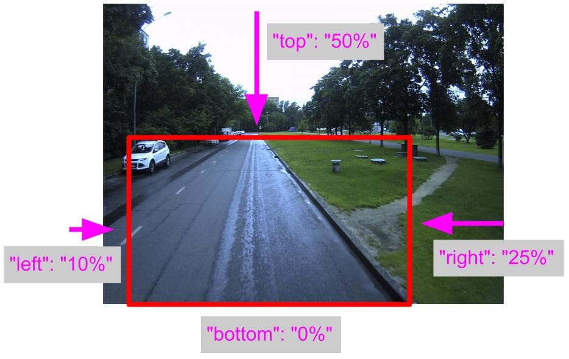
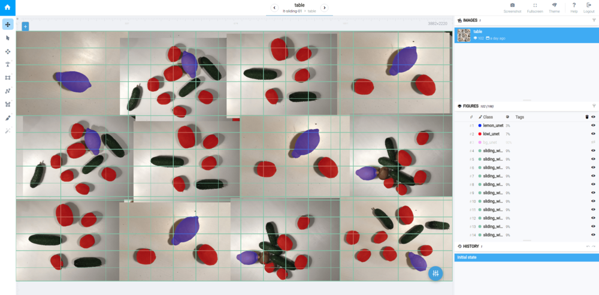
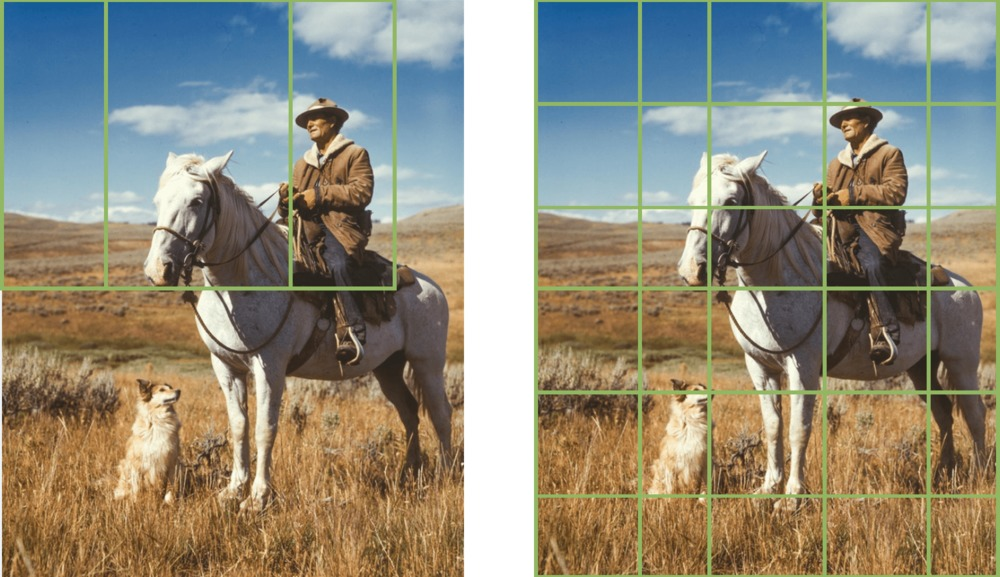
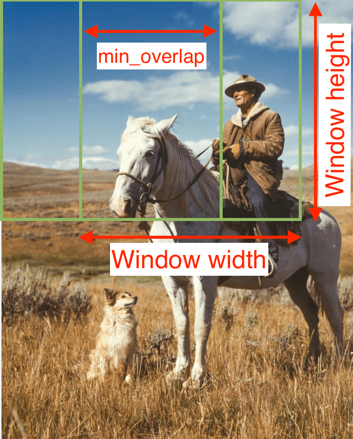

Supervisely supports a few inference modes. These modes differ from each other in what image area will be fed to the NN. 

## Full image
```json
{
  "model": {
    "gpu_device": 0
  },
  "mode": {
    "name": "full_image",
    "model_classes": {
      "save_classes": "__all__",
      "add_suffix": "_unet"
    }
  }
}

```

**`model`** - group contains unique settings for each model:
 
  * `gpu_device` - device to use for inference. Right now we support only single GPU.

**`mode`** - group contains all mode settings:

  *  `name` - mode name defines how to apply NN to image (e.g. `full_image` - apply NN to full image)
   
  *  `model_classes` - which classes will be used, e.g. NN produces 80 classes and you are going to use only a few and ignore others. In that case you should set `save_classes` field with the list of interested class names. `add_suffix` string will be added to new class to prevent having same class names as already exisiting classes in the project. If you are going to use all model classes just set `"save_classes": "__all__"`.



For example you have a project where each person is segmented (class 'person'). And you are going to apply a new model to this project to also segment humans, but you want to save both annotations: original and new predictions. Here is the appropriate config: 



```json

{
  "model": {
    "gpu_device": 0
  },
  "mode": {
    "name": "full_image",
    "model_classes": {
      "save_classes": ["person"],
      "add_suffix": "_unet"
    }
  }
}
```

All new annotations after NN inference will have class `person_unet`. 


## Objects
You can apply NN to image areas that are defined by object bounding boxes. Instead of applying NN to the whole image, it will be applied to a few image parts. It may be very usefull when you are going to apply a few NNs in a sequence. 

For example, you are going to segment person instances. But you don't want to use Mask-RCNN (due to low segmentation quality near object edges). Instead you apply Faster-RCNN to detect all persons, and then apply your custom UNet model to segment each person. 


```json
{
  "model": {
    "gpu_device": 0
  },
  "mode": {
    "name": "bboxes",
    "from_classes": ["person_bbox"],
    "padding": {
      "left": "5%",
      "top": "5%",
      "right": "5%",
      "bottom": "5%"
    },
    "save": true,
    "add_suffix": "_input_bbox",
    "model_classes": {
      "save_classes": ["person_bbox"],
      "add_suffix": "_unet"
    }
  }
}
```

Many of the fields are similar to those that were already described in the "Full image" chapter. Here is the explanation for the new ones.

**`mode`** - group contains all mode settings:

   * `name`: `bboxes` - apply NN to bounding boxes of specified objects

   * `from_classes` - list of classes. All objects of these classes will be used for inference: 
     1. get object bounding box, 
     2. apply padding to bounding box (slightly encrease its size), 
     3. feed the image area that is defined with the bounding box to the NN.  

   * `padding` - how to increase input bounding box. Possible values examples: `"5%"` or `"15px"`

   * `save` - save input bounding box after inference if set as `true`

   * `add_suffix` - suffix for input bounding box 


## ROI

This mode allow to use only a part of the input image. 

```json
{
  "model": {
    "gpu_device": 0
  },
  "mode": {
    "name": "roi",
    "bounds": {
      "left": "10%",
      "top": "50%",
      "right": "25%",
      "bottom": "0%"
    },
    "save": false,
    "class_name": "inference_roi",
    "model_classes": {
      "save_classes": "__all__",
      "add_suffix": "_unet"
    }
  }
}
```

Many of the fields are similar to those that were already described in the "Full image" chapter. Here is the explanation for the new ones.

**`mode`** - group contains all mode settings:

   * `name`: `roi` - apply NN to the image part defined by `bounds`

   * `bounds` - defines the relevant part of the input image. Below is the graphical explanation.

   * `save` - save input bounding box after inference if set as `true`

   * `class_name` - save input bounding box with given class name if the above option `save` is `true`. 





## Sliding window

The mode allows to perform inference on (possibly overlapping) parts of the image. It is useful for getting inference results on large or relatively large images without splitting them and stitching.



Sliding window of fixed size moves on the source image and covers it entirely. In each position the model is applied to the part of the image bounded by the window. After processing the whole image results from different positions are aggregated to get the final prediction.



Now we support the modes for image segmentation and detection models only.

### Sliding window for segmentation

Segmentation results are aggregated by averaging output probabilities.

```json
{
  "model": {
    "gpu_device": 0
  },
  "mode": {
    "name": "sliding_window",
    "window": {
      "width": 1000,
      "height": 750
    },
    "min_overlap": {
      "x": 600,
      "y": 600
    },
    "save": true,
    "class_name": "sl_window",
    "model_classes": {
      "save_classes": "__all__",
      "add_suffix": "_unet"
    }
  }
}
```

**`mode`** - group contains all mode settings:

 * `name`: `sliding_window` - selects the sliding window mode for segmentation models

 * `window` - defines fixed size of sliding window in pixels; crop with the size will be passed to network (note that in different NN implementations it would be resized to the fixed network input after that )

 * `min_overlap` - defines minimal overlap in pixels between different positions of the sliding window; real overlap may be greater to cover the source image entirely

 * `save` - save or not bounds of each sliding window position

 * `class_name` - class name for the sliding window bounds




### Sliding window for detection

Detection results can be merged by special postprocessing algorithm (described below).

```json
{
  "model": {
    "gpu_device": 0,
    "confidence_tag_name": "confidence"
  },
  "mode": {
    "name": "sliding_window_det",
    "window": {
      "width": 416,
      "height": 416
    },
    "min_overlap": {
      "x": 100,
      "y": 100
    },
    "save": true,
    "class_name": "sl_window",
    "nms_after": {
      "enable": true,
      "iou_threshold": 0.4,
      "confidence_tag_name": "confidence"
    },
    "model_classes": {
      "save_classes": "__all__",
      "add_suffix": "_yolo"
    }
  }
}
```

Many of the fields are similar to those that were already described in above chapters. Here is the explanation for new ones.

**`model`** - group contains unique settings for each model:

 * `confidence_tag_name` - name of the confidence tag for predicted bound boxes.
  
**`mode`** - group contains all mode settings:

 * `name`: `sliding_window_det` - selects the sliding window mode for detection models

 * **`nms_after`** - defines how to apply Non-Maximum-Suppression postprocessing algorithm:

    * `enable` - set `true` to enable postprocessing, or `false` elsewise.
   
    * `iou_threshold` - minimal [Intersection over Union](https://en.wikipedia.org/wiki/Jaccard_index) value for merging 2 intersected boxes with same classes.
   
    * `confidence_tag_name` - name of confidence tag. (Most always be equal value of `model -> confidence_tag_name` )  
