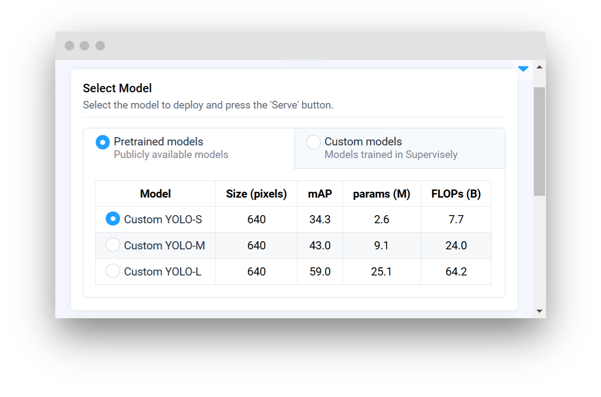

# Integrate Custom Inference

## Overview

In this guide, you'll learn how to build a custom [serving app](./supervisely-serving-apps.md) using the Supervisely SDK. By integrating your own model, you'll be able to deploy it on the Supervisely platform (or externally). In other words, you'll transform your model into a serving app that's ready to be used in production.

**Key Features:**

- **Easily Serve Your Model:** Run inference on your own data through Supervisely platform or locally.
- **Customize Your Solution:** Extend a Supervisely SDK class and implement the core methods needed for your custom inference solution.
- **Debug and Release**: Test locally, debug quickly, and deploy your app for production use.

## Step-by-Step Implementation

To integrate your custom model into the Supervisely platform, follow these steps:

- **Step 1. Prepare the Model Configuration List:** Create a `.json` file to list your model configurations.
- **Step 2. Prepare Inference Settings:** Create a `.yaml` file to specify parameters for inference.
- **Step 3. Prepare App Options:** Create a `.yaml` file to specify additional options for your app.
- **Step 4. Create Custom Class:** Create a python file that contains your custom inference class.
- **Step 5. Implement Required Methods:** Implement the `load_model` and `predict` methods.
- **Step 6. Create Main Script:** Create an entrypoint python script to run and serve your model.

### Implementation Example

```python
import torch
import supervisely as sly

class CustomYOLOInference(sly.nn.inference.ObjectDetection):
    # 1️⃣ Define essential class variables
    FRAMEWORK_NAME = "Custom YOLO"
    MODELS = "src/models.json"  # File containing your model configurations
    INFERENCE_SETTINGS = "src/inference_settings.yaml"  # Additional inference settings
    APP_OPTIONS = "src/app_options.yaml" # [optional] Additional app options


    # 2️⃣ Implement the load_model method
    def load_model(
        self,
        model_files: dict,
        model_info: dict,
        model_source: str,
        device: str,
        runtime: str
    ):
        """
        Load and prepare the model for inference.
        """
        checkpoint_path = model_files["checkpoint"]
        self.model = torch.load(checkpoint_path, map_location=device)
        self.model.to(device)
        self.model.eval()

    # 3️⃣ Prepare the postprocessor (convert raw outputs to predictions)
    def predict(self, image_path: str, settings: dict):
        """
        Run inference on the input image and return predictions.
        """
        img_tensor = self._preprocess_image(image_path)
        outputs = self.model(img_tensor)
        predictions = self._postprocess_outputs(outputs, settings)
        return predictions
```


### Step 1. Prepare the Model Configuration List

Create `models.json` file to list your model configurations. This file should include a list of dictionaries, each containing details about a specific model. If not specified, only custom models tab will be available in the GUI.

**Example `models.json`**

```json
[
    {
        "Model": "Custom YOLO-S",
        "Size (pixels)": "640",
        "mAP": "34.3",
        "params (M)": "2.6",
        "FLOPs (B)": "7.7",
        "meta": {
            "task_type": "object detection",
            "model_name": "custom yolo-s",
            "model_files": {"checkpoint": "https://.../yolo-s.pt"}
        }
    },
    // ... additional models
]
```

_Example GUI preview:_



**Table Fields:**

Fields that are displayed in the GUI for quick reference about the model performance. These fields can be anything you want to display in the GUI about your model and are not limited to the example shown above.

**Technical Field (meta):**

Each model must also include a `meta` field. This field is not displayed in the GUI. It contains technical information required by the inference class and ensures the app functions properly behind the scenes.

- (**required**) `task_type`: The type of task (e.g., object detection)
- (**required**) `model_name`: Model configuration name
- (**required**) `model_files`: Paths to the checkpoint and configuration files. You can extend this field with additional paths if needed
  - (**required**) `checkpoint`: Path or URL to the model checkpoint. URL will be downloaded automatically
  - (**optional**) `config`: Path to the model configuration file
  - (**optional**) Any additional files can be added to the `model_files` dictionary

### Step 2. Prepare Inference Settings

Create an `inference_settings.yaml` file to specify parameters for inference.

**Example `inference_settings.yaml`:**

```yaml
# bounding box confidence threshold
conf: 0.25
# intersection over union (IoU) threshold for NMS
iou: 0.7
# use half precision (FP16)
half: False
# maximum number of detections per image
max_det: 300
# whether to use class-agnostic NMS or not
agnostic_nms: False
```

### Step 3. [Optional] Prepare App Options

You can create an `app_options.yaml` file to specify additional options for your app. This file is optional and can be used to customize the app GUI.

```yaml
pretrained_models: true
custom_models: true
supported_runtimes: ["pytorch"]
```

**Available options:**

- **`pretrained_models`**
  - `description`: If enabled, shows the pretrained models tab in the GUI. Pretrained models are models that are provided by Supervisely.
  - `type`: boolean
  - `default`: `True`
- **`custom_models`**
  - `description`: If enabled, shows the custom models tab in the GUI. Custom models are models trained in Supervisely with corresponding training app.
  - `type`: boolean
  - `default`: `True`
- **`supported_runtimes`**
  - `description`: List of supported runtimes for the app. If not specified, "pytorch" is used by default. Available options: `pytorch`,  `onnx`, `tensorrt`.
  - `type`: list of strings
  - `default`: `["pytorch"]`

### Step 4. Create Custom Class

Create a python file (e.g., `src/custom_yolo.py`) that contains your custom inference class with implementation.

**Example custom_yolo.py:**

```python
import supervisely as sly

class CustomYOLOInference(sly.nn.inference.ObjectDetection):
    # Define essential class variables
    FRAMEWORK_NAME = "Custom YOLO"
    MODELS = "src/models.json"  # File containing your model configurations
    INFERENCE_SETTINGS = "src/inference_settings.yaml"  # Additional inference settings
    # ...
```

#### Inheritance

Your custom class should inherit from the appropriate Supervisely base class. For example, if you're working on an object detection model, you should inherit from `sly.nn.inference.ObjectDetection`.

**Available classes for inheritance:**

- `ObjectDetection`
- `ObjectDetection3D`
- `PoseEstimation`
- `PromptBasedObjectDetection`
- `PromptableSegmentation`
- `SalientObjectSegmentation`
- `SemanticSegmentation`

If none of these classes fit your model, you can inherit from the base `Inference` class and customize it as needed.

#### Class Variables

In your custom class, define class variables to specify the model framework, paths to model configurations, and inference settings.

**Class variables:**

- **`FRAMEWORK_NAME:`** Name of your model's framework or architecture.
- **`MODELS:`** Path to your `models.json` file.
- **`INFERENCE_SETTINGS:`** Path to your `.yaml` settings file.
- **`APP_OPTIONS:`** (Optional) Path to additional app options in `.yaml` format.

### Step 5. Implement Required Methods

#### The `load_model` Method

This method loads the model checkpoint and prepares it for inference.

Let's break down the `load_model` parameters:

- **`model_files`:** A dictionary containing paths to the model checkpoint and configuration files. All paths are local paths.
- **`model_info`:** A dictionary containing model information from the `models.json` file if model is pretrained, otherwise it's [experiment info](./integrate-custom-training.md#experiment-info) from custom model that was trained in Supervisely.
- **`model_source`:** The source of the model (`Pretrained models` or `Custom model`).
- **`device`:** The device to run the model on (e.g., "cpu", "cuda").
- **`runtime`:** The runtime to use for inference (e.g., "pytorch", "onnx").

```python
def load_model(
    self,
    model_files: dict,
    model_info: dict,
    model_source: str,
    device: str,
    runtime: str
):
    """
    Load and prepare the model for inference.
    """
    # 1️⃣ Retrieve the checkpoint file path
    checkpoint_path = model_files["checkpoint"]
    
    # 2️⃣ Load the model using PyTorch (simplified for this example)
    self.model = torch.load(checkpoint_path, map_location=device)
    self.model.to(device)
    self.model.eval()
```

#### The `predict` Method

This method processes the input image, runs inference, and then postprocesses the outputs to format them into predictions

```python
def predict(self, image_path: str, settings: dict):
    """
    Run inference on the input image and return predictions.
    """
    # 1️⃣ Preprocess the input image (implement your own method)
    img_tensor = self._preprocess_image(image_path)
    
    # 2️⃣ Run the model inference
    outputs = self.model(img_tensor)
    
    # 3️⃣ Postprocess the outputs to Supervisely format
    # (implement your own method, convert raw outputs to labels, boxes, scores, etc.)
    predictions = self._postprocess_outputs(outputs, settings)
    return predictions

#########################################################################################
# ⬇️ These methods are optional, you can implement everything in the predict method ⬇️ #
#########################################################################################

def _preprocess_image(self, image_path: str):
    # Your own logic to preprocess the input image
    pass

def _postprocess_outputs(self, outputs, settings: dict):
    # Your own logic to convert raw outputs to predictions
    pass
```

### Step 6. [Optional] Create Main Script

This step is optional, but we recommend to keep your main script separate from the custom class for better organization.

Create a main python script (e.g., `src/main.py`) to run and debug your app. This file should contain code to initialize custom class and serve it. This script will be the entry point for your app.

**Example `main.py`**

```python
import supervisely as sly
from custom_yolo import CustomYOLOInference

model = CustomYOLOInference(use_gui=True, use_serving_gui_template=True)
model.serve()
```

## Running and Debugging Your App

You can easily debug your code locally in your favorite IDE.


For now, we recommend using **Visual Studio Code** IDE, because our repositories have prepared settings for convenient debugging in VSCode. It is the easiest way to start.


#### For Visual Studio Code users

Create a `launch.json` file with configuration in the `.vscode` directory of your repository.

You can use the following template as a starting point:

```json
// .vscode/launch.json

{
  "version": "0.2.0",
  "configurations": [
  {
      "name": "Local Debug",
      "type": "python",
      "request": "launch",
      "program": "${workspaceFolder}/src/main.py", // path to your main file
      "console": "integratedTerminal",
      "justMyCode": false,
      "env": {
        "PYTHONPATH": "${workspaceFolder}:${PYTHONPATH}",
        "LOG_LEVEL": "DEBUG",
        "SLY_APP_DATA_DIR": "${workspaceFolder}/app_data"
      }
  },
  {
      "name": "Advanced Debug in Supervisely platform",
      "type": "debugpy",
      "request": "launch",
      "module": "uvicorn",
      "args": [
        "src.main:model.app", // path to your main file and the app object
        "--host",
        "0.0.0.0",
        "--port",
        "8000",
        "--ws",
        "websockets",
      ],
      "justMyCode": false,
      "env": {
        "PYTHONPATH": "${workspaceFolder}:${PYTHONPATH}",
        "LOG_LEVEL": "DEBUG",
        "DEBUG_APP_DIR": "app_data",
        "DEBUG_WITH_SLY_NET": "1"
      }
    }
  ]
}
```

### Local debug

You can run the code locally for debugging by running this command in the terminal:

```shell
python src/main.py
```

If you're a **Visual Studio Code** user use a prepared `launch.json` configuration that can be selected:


### Debug in Supervisely platform

Once the code seems working locally, it's time to test the code right in the Supervisely platform as a debugging app. For that:

1. If you develop in a Docker container, you should run the container with `--cap_add=NET_ADMIN` option.
2. Install `sudo apt-get install wireguard iproute2`.
3. Define your `TEAM_ID` in the `local.env` file. _Actually there are other env variables that is needed, but they are already provided in `./vscode/launch.json` for you._
4. Switch the `launch.json` config to the `Advanced debug in Supervisely platform`:


5. Run the code.

✅ It will deploy the model in the Supervisely platform as a regular serving App that is able to communicate with all others app in the platform:



Now you can use apps like [Apply NN to Images](https://ecosystem.supervisely.com/apps/nn-image-labeling/project-dataset), [Apply NN to videos](https://ecosystem.supervisely.com/apps/apply-nn-to-videos-project) with your deployed model.

Or get the model inference via **Python API** with the help of `sly.nn.inference.Session` class just in one line of code. See [Inference API Tutorial](https://developer.supervisely.com/app-development/neural-network-integration/inference-api-tutorial).


## Releasing Your App

Once you've tested the code, it's time to release it into the platform. It can be released as an App that shared with the all Supervisely community, or as your own private App.

Refer to [How to Release your App](https://developer.supervisely.com/app-development/basics/from-script-to-supervisely-app) for all releasing details. For a private app check also [Private App Tutorial](https://developer.supervisely.com/app-development/basics/add-private-app).

In this tutorial we'll quickly observe the key concepts of our app.

### Repository structure

The structure of repository is the following:

```text
📦
├── 📜README.md
├── 📜config.json
├── 📜create_venv.sh
├── 📜requirements.txt
├── 📂docker
│   ├── 🐋Dockerfile
│   └── 📜publish.sh
├── 📜local.env
└── 📂src
    ├── 📜models.json
    ├── 📜inference_settings.yaml
    ├── 📜app_options.yaml
    └── 🐍main.py
    └── 🐍custom_yolo.py
```

Explanation:

- `src/main.py` - main inference script
- `src/models.json` - file with model configurations
- `src/inference_settings.yaml` - file with inference settings
- `src/app_options.yaml` - file with additional app options
- `README.md` - readme of your application, it is the main page of an application in Ecosystem with some images, videos, and how-to-use guides
- `config.json` - configuration of the Supervisely application, which defines the name and description of the app, its context menu, icon, poster, and running settings
- `create_venv.sh` - creates a virtual environment, installs detectron2 and requirements.
- `requirements.txt` - all needed packages, avoid using this file if possible, we recommend to install all dependencies in the Dockerfile.
- `local.env` - file with env variables used for debugging
- `docker` - directory with the custom Dockerfile for this application and the script that builds it and publishes it to the docker registry

### App configuration

App configuration is stored in `config.json` file. A detailed explanation of all possible fields is covered in this [Configuration Tutorial](https://developer.supervisely.com/app-development/basics/app-json-config/config.json). Let's check the config for our current app:

```json
{
  "type": "app",
  "version": "2.0.0",
  "name": "Serve custom YOLO",
  "description": "Custom object detection model integration",
  "categories": [
    "neural network",
    "images",
    "object detection",
    "serve",
    "development"
  ],
  "session_tags": ["deployed_nn"],
  "need_gpu": true,
  "community_agent": false,
  "docker_image": "user/custom-yolo:1.0.0",
  "entrypoint": "python -m uvicorn src.main:m.app --host 0.0.0.0 --port 8000",
  "port": 8000,
  "headless": true
}
```

Here is an explanation for the fields:

- `type` - type of the module in Supervisely Ecosystem
- `version` - version of Supervisely App Engine. Just keep it by default
- `name` - the name of the application
- `description` - the description of the application
- `categories` - these tags are used to place the application in the correct category in Ecosystem.
- `session_tags` - these tags will be assigned to every running session of the application. They can be used by other apps to find and filter all running sessions
- `"need_gpu": true` - should be true if you want to use any `cuda` devices.
- `"community_agent": false` - this means that this app can not be run on the agents started by Supervisely team, so users have to connect their own computers and run the app only on their own agents. Only applicable in Community Edition. Enterprise customers use their private instances so they can ignore current option
- `docker_image` - Docker container will be started from the defined Docker image, github repository will be downloaded and mounted inside the container.
- `entrypoint` - the command that starts our application in a container
- `port` - port inside the container
- `"headless": true` means that the app has no User Interface
