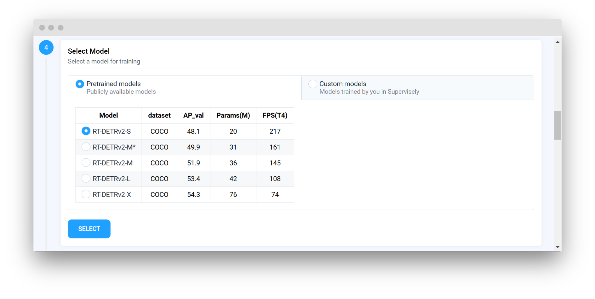
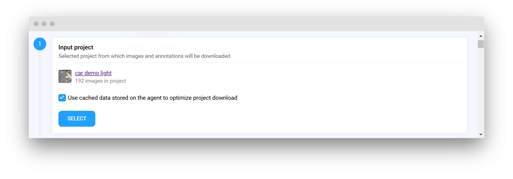
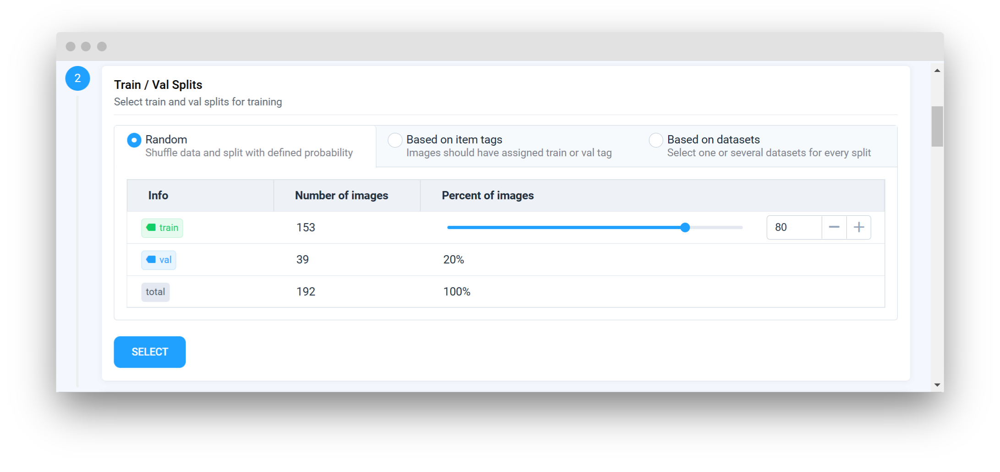
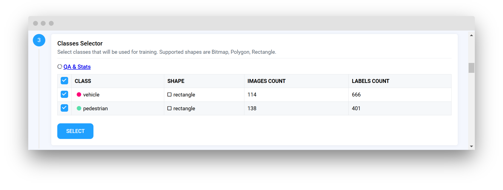
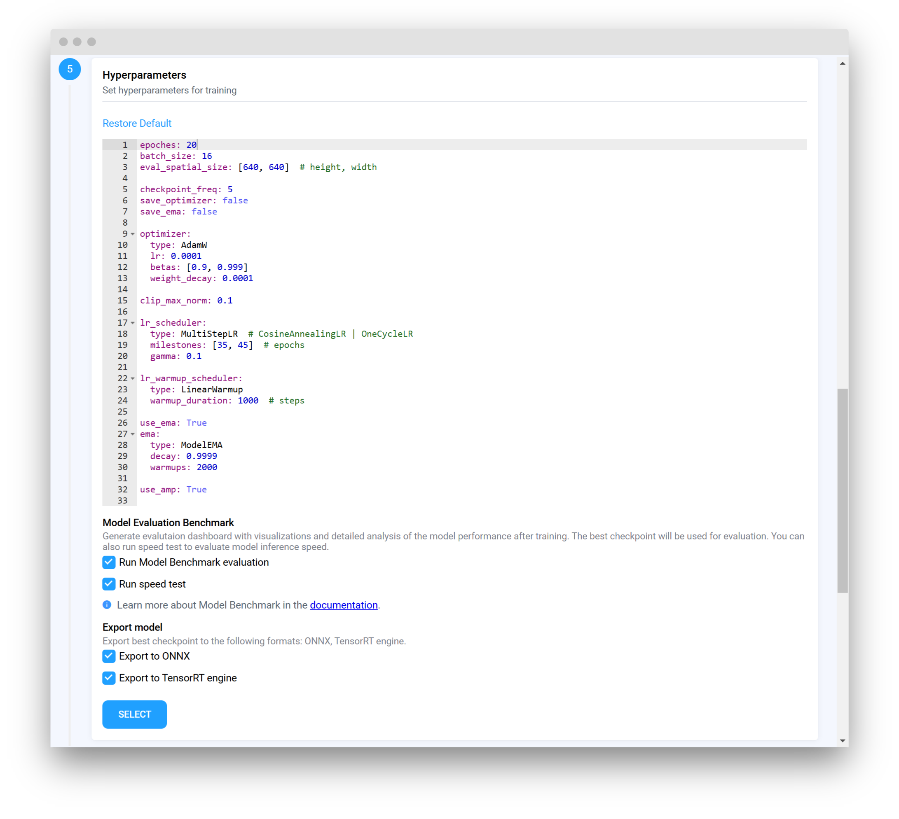
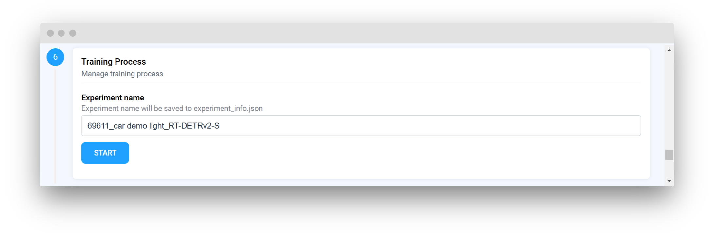
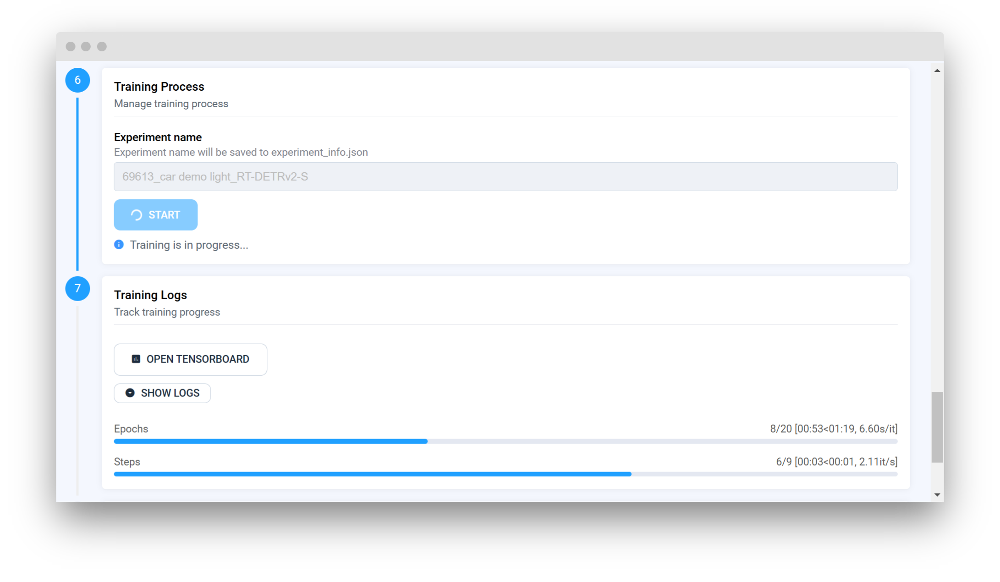
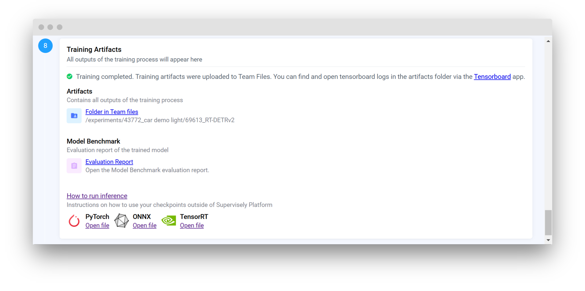

# Custom Model Integration Tutorial 🚀

## Overview

Welcome to this step-by-step tutorial on building model training applications with Supervisely SDK!
This guide will show you how to set up a training app in just a few lines of code, with a built-in user interface and all the necessary tools to seamlessly manage the training process. Supervisely has a dedicated `TrainApp` class that takes care of the heavy lifting, so you can focus directly on your model and training logic without worrying about the underlying infrastructure.

We'll use the [Train RT-DETRv2](https://ecosystem.supervisely.com/apps/rt-detrv2/supervisely_integration/train) example to walk you through the process.

**Key Features:**

- **Built-in GUI:** Simple and easy-to-follow customizable interface.  
- **Train and Val Splits:** Handles splitting of your project into training and validation sets.  
- **Data Preparation:** Easily convert Supervisely annotation format into one of the popular formats with a single line of code (e.g., COCO annotation format).  
- **Project Versioning:** Saves project versions to reproduce training with the same data and annotations.  
- **Model Evaluation:** On-demand evaluation (requires ❌ [model serving implementation](neural-networks/inference-and-deployment/...)).  
- **Model Export:** Export your model to ONNX or TensorRT format (requires [export implementation](#export-model-to-onnx-and-tensorrt)).  
- **Model Saving:** Automatically save your model and related files to Supervisely Team Files.  

## Step-by-Step Implementation

Let's dive into the steps required to integrate your custom model using the `TrainApp` class.

- **Step 1. Prepare the Model Configuration List:** Create a `models.json` file with a list of model configurations.
- **Step 2. Prepare Hyperparameters:** Define default hyperparameters and save to a `.yaml` file.
- **Step 3. Prepare App Options:** Add optional features to control the GUI layout and behavior.
- **Step 4. The `TrainApp`:** Initialize the `TrainApp` class with the required parameters.
- **Step 5. Integrate Your Custom Model:** Implement your custom model training logic using the `TrainApp` wrapper.
- **Step 6. Add optional features:** Enhance your training app with additional features like a progress bar or model evaluation.
- **Step 7. Run the application:** Launch the training app locally and deploy it to the Supervisely platform.

### Step 1. Prepare the Model Configuration List

To enable model selection in your training app, you'll need to create a models.json file. This file stores a list of model configurations, where each configuration is represented as a dictionary containing model-specific details. These configurations will be displayed in the app's GUI, allowing users to easily choose a model for training.



📄 See source file for the RT-DETRv2 [models.json](https://github.com/supervisely-ecosystem/RT-DETRv2/blob/main/supervisely_integration/models_v2.json)



**Example `models.json`**

```json
[
    {
        "Model": "RT-DETRv2-S",
        "dataset": "COCO",
        "AP_val": 48.1,
        "Params(M)": 20,
        "FPS(T4)": 217,
        "meta": {
            "task_type": "object detection",
            "model_name": "RT-DETRv2-S",
            "model_files": {
                "checkpoint": "https://github.com/lyuwenyu/storage/releases/download/v0.2/rtdetrv2_r18vd_120e_coco_rerun_48.1.pth",
                "config": "rtdetrv2_r18vd_120e_coco.yml"
            }
        }
    },
    // ... additional models
]
```

_Example GUI preview:_



**Table Fields:**

Fields that are displayed in the GUI for quick reference about the model performance. These fields can be anything you want to display in the GUI about your model and are not limited to the example shown above.

**Technical Field (meta):**

Each model must also include a `meta` field. This field is not displayed in the GUI. It contains technical information required by the inference class and ensures the app functions properly behind the scenes.

- (**required**) `task_type`: The type of task (e.g., object detection)
- (**required**) `model_name`: Model configuration name
- (**required**) `model_files`: Paths to the checkpoint and configuration files. You can extend this field with additional paths if needed
  - (**required**) `checkpoint`: Path or URL to the model checkpoint. URL will be downloaded automatically
  - (**optional**) `config`: Path to the model configuration file
  - (**optional**) Any additional files can be added to the `model_files` dictionary

### Step 2. Prepare Hyperparameters

Define your default hyperparameters save to a `.yaml` file (e.g., `hyperparameters.yaml`). Path to this file is then passed to the `TrainApp` for training configuration.

You can access hyperparameters later in the code by using `train.hyperparameters` in your training logic.



📄 See source file for the RT-DETRv2 [hyperparameters.yaml](https://github.com/supervisely-ecosystem/RT-DETRv2/blob/main/supervisely_integration/train/hyperparameters.yaml)



**Example `hyperparameters.yaml`**

```yaml
epoches: 50
batch_size: 16
eval_spatial_size: [640, 640]  # height, width

checkpoint_freq: 5
save_optimizer: false
save_ema: false

optimizer:
  type: AdamW
  lr: 0.0001
  betas: [0.9, 0.999]
  weight_decay: 0.0001

clip_max_norm: 0.1

lr_scheduler:
  type: MultiStepLR  # CosineAnnealingLR | OneCycleLR
  milestones: [35, 45]  # epochs
  gamma: 0.1

lr_warmup_scheduler:
  type: LinearWarmup
  warmup_duration: 1000  # steps

use_ema: True 
ema:
  type: ModelEMA
  decay: 0.9999
  warmups: 2000

use_amp: True
```

### Step 3. [Optional] Prepare App Options

You can provide additional options to control the GUI layout and behavior. Create an `app_options.yaml` file to enable or disable features.



📄 See source file for the RT-DETRv2 [app_options.yaml](https://github.com/supervisely-ecosystem/RT-DETRv2/blob/main/supervisely_integration/train/app_options.yaml)



**Example `app_options.yaml`**

```yaml
device_selector: false
model_benchmark: true
show_logs_in_gui: true
collapsable: false
auto_convert_classes: true
```

**Available options**

<details>
<summary> <b> Click to expand </b> </summary>

- **`device_selector`**
  - **description:** Show CUDA device selector in GUI
  - **default:** `false`
  - **options:** `true`, `false`
- **`model_benchmark`**
  - **description:** Add checkboxes to run model benchmark to the GUI
  - **default:** `false`
  - **options:** `true`, `false`
- **`export_onnx_supported`**
  - **description:** Enable export to ONNX format, requires [export implementation](#link-to-custom-export-tutorial)
  - **default:** `false`
  - **options:** `true`, `false`
- **`export_tensorrt_supported`**
  - **description:** Enable export to TensorRT format, requires [export implementation](#link-to-custom-export-tutorial)
  - **default:** `false`
  - **options:** `true`, `false`
- **`train_logger`**
  - **description:** Comment to use custom tensorboard logger (requires additional implementation). Set to `tensorboard` to use supervisely tensorboard logger.
  - **default:** `None`
  - **options:** `None`, `tensorboard`
- **`show_logs_in_gui`**
  - **description:** Show logs window in GUI during training
  - **default:** `true`
  - **options:** `true`, `false`
- **`auto_convert_classes`**
  - **description:** Automatically converts classes according to the model CV task for model benchmark and creates a new project.
  - **default:** `false`
  - **options:** `true`, `false`
- **`collapsable`** | <mark style="color:red">Beta feature</mark>
  - **description:**  Collapse GUI cards on selection
  - **default:** `false`
  - **options:** `true`, `false`
- **`demo`** | <mark style="color:purple">For developers</mark>
  - **description:**  Path to the demo folder containing tutorial data on how to use the model outside of the Supervisely platform
  - **default:** `None`
  - **options:** `path/to/demo/folder`

</details>

### Step 4. The `TrainApp`

Now that you have prepared the necessary files, you can initialize the `TrainApp` class with the required parameters. The `TrainApp` class is the core component that manages the training process and provides a user-friendly interface for interacting with the training app.

#### TrainApp Signature

```python
class TrainApp(
    framework_name: str,
    models: Union[str, List[Dict[str, Any]]],
    hyperparameters: str,
    app_options: Union[str, Dict[str, Any]] = None,
    work_dir: str = None,
)
```

|   Parameters    |                        Type                        |                  Description                   |
|:---------------:|:--------------------------------------------------:|:----------------------------------------------:|
| framework_name  |                        str                         |   Name of the ML framework used for training   |
|     models      |       Union\[str, List\[Dict\[str, Any\]\]\]       | Path to `.json` file with model configurations |
| hyperparameters |                        str                         |   Path to hyperparameters in `.yaml` format    |
|   app_options   | Optional\[Union\[str, List\[Dict\[str, Any\]\]\]\] |     Path to options file in `.yaml` format     |
|    work_dir     |                  Optional\[str\]                   |   Local path for storing intermediate files    |

#### Important TrainApp Attributes

- **`train.work_dir`** - Path to the working directory. Contains intermediate files.
- **`train.output_dir`** - Path to the output directory. Contains training results.

**Project-related Attributes**

- **`train.project_id`** - Supervisely project ID
- **`train.project_name`** - Project name
- **`train.project_info`** - Contains project information(ProjectInfo object)
- **`train.project_meta`** - [ProjectMeta](https://supervisely.readthedocs.io/en/latest/sdk/supervisely.project.project_meta.ProjectMeta.html#supervisely.project.project_meta.ProjectMeta) object with classes/tags info
- **`train.project_dir`** - Project directory path
- **`train.train_dataset_dir`** - Training dataset directory path
- **`train.val_dataset_dir`** - Validation dataset directory path
- **`train.sly_project`** - Supervisely [Project](https://supervisely.readthedocs.io/en/latest/sdk_packages.html#project) object

**Model-related Attributes**

- **`train.model_name`** - Name of the selected model
- **`train.model_source`** - Indicates if the model is pretrained or custom (trained in Supervisely)
- **`train.model_files`** - Dictionary containing paths to model files (e.g., `checkpoint` and optional `config`)
- **`train.model_info`** - Entry from the [models.json](#step-1-prepare-the-model-configuration-list-) for the selected model if model is selected from the list of pretrained models, otherwise [experiment info](#experiment-info)
- **`train.hyperparameters`** - Dictionary of selected hyperparameters
- **`train.classes`** - List of selected classes
- **`train.device`** - Selected CUDA device

### Step 5. Integrate Your Custom Model

Now it's time to integrate your custom model using the TrainApp class. We'll use the RT-DETRv2 model as an example. You can always refer to the source code for Train RT-DETRv2 on [GitHub](https://github.com/supervisely-ecosystem/RT-DETRv2/tree/main/supervisely_integration/train).

#### Step 5.1 Initialize Your Imports

```python
import os
import shutil
import sys
from multiprocessing import cpu_count

sys.path.insert(0, "rtdetrv2_pytorch")
import yaml

import supervisely as sly
from rtdetrv2_pytorch.src.core import YAMLConfig
from rtdetrv2_pytorch.src.solver import DetSolver
from supervisely.nn import ModelSource, RuntimeType
from supervisely.nn.training.train_app import TrainApp
from supervisely_integration.export import export_onnx, export_tensorrt
from supervisely_integration.serve.rtdetrv2 import RTDETRv2
```

#### Step 5.2 Initialize the `TrainApp`

Create an instance of the `TrainApp` by providing the framework name, model configuration file, hyperparameters file, and app options file.

```python
base_path = "supervisely_integration/train"
train = TrainApp(
    framework_name="RT-DETRv2",
    models=f"supervisely_integration/models_v2.json",
    hyperparameters=f"{base_path}/hyperparameters.yaml",
    app_options=f"{base_path}/app_options.yaml",
)
```

#### Step 5.3 Prepare Training data

The `TrainApp` gives you access to the Supervisely [Project](https://supervisely.readthedocs.io/en/latest/sdk/supervisely.project.project.Project.html#supervisely.project.project.Project) containing the `train` and `val` datasets. Convert these datasets to the desired format (e.g., COCO) and run your training routine. You can use built-in converters like `to_coco` to convert your datasets to the required format or write your custom converter if required.



Use `train.sly_project` to access the Supervisely project in the training code.



**Data Conversion Example:**

```python
def convert_data() -> Tuple[str, str]:
    # Get selected project from TrainApp
    project = train.sly_project
    meta = project.meta

    # Convert train dataset to COCO format
    train_dataset: sly.Dataset = project.datasets.get("train")
    train_ann_path = train_dataset.to_coco(meta, dest_dir=train_dataset.directory)

    # Convert val dataset to COCO format
    val_dataset: sly.Dataset = project.datasets.get("val")
    val_ann_path = val_dataset.to_coco(meta, dest_dir=val_dataset.directory)
    return train_ann_path, val_ann_path
```

#### Step 5.4 Implement Training Routine

All training code should be implemented in the function under the `@train.start` decorator and should return the experiment information dictionary.

Returned dictionary should contain the following fields:

- `model_name` - Name of the model used for training.
- `model_files` - Dictionary with paths to additional model files (e.g. `config`). These files together with checkpoints will be uploaded to Supervisely Team Files automatically.
- `checkpoints` - A list of checkpoint paths, or an output directory with checkpoints. These checkpoints will be uploaded to Supervisely Team Files automatically.
- `best_checkpoint` - Name of the best checkpoint file.



These fields will be validated upon training completion, and if one of them is missing, the training will be considered as failed.



In this example training logic and loop are inside `solver.fit()` function.



📄 See source code for the RT-DETRv2 [main.py](https://github.com/supervisely-ecosystem/RT-DETRv2/blob/main/supervisely_integration/train/main.py) and [training logic](https://github.com/supervisely-ecosystem/RT-DETRv2/blob/fd957cdfd793c0661a1b57a549f7bba82aeb7c84/rtdetrv2_pytorch/src/solver/det_solver.py#L20-L130)



##### Training Routine with @train.start Decorator

```python
@train.start
def start_training():
    # 1️⃣ Convert data to required format
    train_ann_path, val_ann_path = convert_data()

    # 2️⃣ Get the path to the selected checkpoint
    checkpoint = train.model_files["checkpoint"]

    # 3️⃣ Prepare custom config for training
    custom_config_path = prepare_config(train_ann_path, val_ann_path)
    cfg = YAMLConfig(
        custom_config_path,
        tuning=checkpoint,
    )
    output_dir = cfg.output_dir
    os.makedirs(output_dir, exist_ok=True)
    model_config_path = f"{output_dir}/model_config.yml"
    with open(model_config_path, "w") as f:
        yaml.dump(cfg.yaml_cfg, f)
    remove_include(model_config_path)

    # 4️⃣ Start tensorboard logs
    tensorboard_logs = f"{output_dir}/summary"
    train.start_tensorboard(tensorboard_logs)
    
    # 5️⃣ Start training
    solver = DetSolver(cfg)
    solver.fit()

    # 6️⃣ Return experiment information
    experiment_info = {
        "model_name": train.model_name,
        "model_files": {"config": model_config_path},
        "checkpoints": output_dir,
        "best_checkpoint": "best.pth",
    }
    return experiment_info
```

### Step 6. [Optional] Add optional features

You can enhance your training application by adding additional features like a progress bar or model evaluation. These features provide valuable feedback to the user and help in monitoring the training process.

#### 6.1 Progress Bar with the Train Logger ⏱️

Enhance your training feedback by incorporating a progress bar via the Supervisely `train_logger`.

Simply import `train_logger` from `supervisely.nn.training` and use it in your training loop.

```python
from supervisely.nn.training import train_logger

train_logger.train_started(total_epochs=(args.epoches - start_epcoch))
for epoch in range(start_epcoch, total_epochs):
    train_logger.epoch_started(epoch)
    ...
    train_logger.epoch_finished(epoch, metrics)
train_logger.train_finished()
```

#### 6.2 Register the Inference Class for model evaluation 📊

If you plan to use [Evaluation Model Benchmark](../model-evaluation-benchmark/README.md), you need to implement Inference class and register it for TrainApp. Refer to the ❌ [Integrate Custom Inference](https://...) guide for more information.

```python
train.register_inference_class(RTDETRv2)
```

### Step 7. Run the application

Now that you've integrated your custom model, you're ready to launch the training application. You can choose to run it locally for testing or deploy it directly to the Supervisely platform. The training app functions like any other Supervisely app, but with a built-in GUI.



**Useful links:**

- [Environment variables](https://developer.supervisely.com/getting-started/environment-variables) - Setting up environment variables for Supervisely App development
- [App developemnt](https://developer.supervisely.com/app-development/basics) - Basics of Supervisely App development
- [Hello world!](https://developer.supervisely.com/app-development/apps-with-gui/hello-world) - Simple example of a Supervisely App



#### Run and debug locally

Prepare environment file before running the app:

```text
# Change values to your own

PROJECT_ID=12208 # ⬅️ change it
APP_NAME=Train RT-DETRv2 # ⬅️ change it
DEBUG_APP_DIR=app_data # ⬅️ change it
```

You can run and debug your training app locally using the following shell command:

```shell
uvicorn main:train.app --host 0.0.0.0 --port 8000 --ws websockets
```

After running the app, you can access the GUI by opening the following URL in your browser:

```text
http://localhost:8000/
```

If you are a VSCode user, you can create `.vscode/launch.json` configuration to run and debug your training app locally.

**Example `launch.json`**

<details>
<summary> <b> Click to expand </b> </summary>

```json
{
  "version": "0.2.0",
  "configurations": [
    {
      "name": "Uvicorn Train",
      "type": "debugpy",
      "request": "launch",
      "module": "uvicorn",
      "args": [
        "main:train.app",
        "--host",
        "0.0.0.0",
        "--port",
        "8000",
        "--ws",
        "websockets",
      ],
      "justMyCode": false,
      "env": {
        "PYTHONPATH": "${workspaceFolder}:${PYTHONPATH}",
        "LOG_LEVEL": "DEBUG",
        "DEBUG_APP_DIR": "app_data"
      }
    }
    ]
}
```
</details>

#### Deploy to Supervisely

Releasing your private app to the Supervisely platform is very simple. You will need a git repository with your app code, Supervisely SDK and credentials to access the platform. You can refer to [Add private app](https://developer.supervisely.com/app-development/basics/add-private-app) for more information.

Follow steps below to release your app:

0. [Optional] git clone your app code if you haven't done it yet:
    ```bash
    git clone "your_app_repo_url"
    cd "your_app_repo"
    ```
1. [Optional] create a python virtual environment:
    ```bash
    python3 -m venv .venv
    source .venv/bin/activate
    ```
2. Install Supervisely SDK:
    ```bash
    pip install supervisely
    ```
3. Provide your Supervisely credentials in one of the following ways:
    - Create a file `supervisely.env` in the home directory with the fields:
      ```bash
      SERVER_ADDRESS=https://app.supervisely.com
      API_TOKEN=your_personal_token
      ```
    - Set environment variables:
      ```bash
      export SERVER_ADDRESS=https://app.supervisely.com
      export API_TOKEN=your_personal_token
      ```
4. Run CLI command to deploy the app:
    ```bash
    supervisely release
    ```
    If the app code is in a subdirectory, you can specify the path to the app code (directory with `config.json` file):
    ```bash
    supervisely release --sub-app "path/to/app"
    ```

## Final Steps 📦

After training is completed successfully, the `TrainApp` will automatically prepare and upload the model and all related files to Supervisely storage. During this finalization phase, TrainApp executes several important steps to ensure your experiment's outputs are correctly validated, processed, and stored.

Standard Supervisely storage path for the artifacts: `/experiments/{project_id}_{project_name}/{task_id}_{framework_name}/`

**Here's what happens:**

1. **Validating of `experiment_info`**
The system checks the `experiment_info` dictionary to ensure all required fields (like model name, file paths, etc.) are correct and complete. This step is essential to prevent any missing or incorrect metadata.

2. **Postprocess Training Artifacts**
Additional processing is applied to the raw training outputs (e.g., cleaning up temporary files, formatting logs, and aggregating metrics) to generate a standardized set of artifacts.

3. **Postprocess Training and Validation Splits**
The splits for training and validation data are further refined if needed. This step ensures consistency and prepares the splits for future reference or re-training if necessary.

4. **Upload Model Files and Checkpoints to Supervisely Storage**
All model files provided in experiment info and checkpoints (e.g., best, intermediate, and last checkpoints) are automatically uploaded to the Supervisely storage so that they are safely stored and can be accessed later.

5. **Create and Upload model_meta.json**
A metadata file (`model_meta.json`) is generated, which includes essential details about the model (such as its architecture, training parameters, and version). This file is then uploaded along with other artifacts.

6. **Run Model Benchmarking (if enabled)**
If model benchmarking is enabled in your `app_options`, the system will run automated tests to evaluate model performance. These benchmarks help in comparing the model against standard metrics.

7. **Export Model to ONNX and TensorRT (if enabled)**
For ease of deployment, the model may be automatically exported to additional formats like ONNX and TensorRT. This ensures compatibility with different serving environments.

8. **Generate and Upload Additional Training Files**
Other supplementary files such as logs, experiment reports, and configuration files are packaged and uploaded. These additional artifacts help in future debugging, auditing, or model evaluation.

### Training Artifacts

The final training artifacts are organized and stored in the Supervisely storage directory. This directory contains all the necessary files and metadata related to the training experiment.

**Output artifacts directory structure:**

```text
📦265_RT-DETRv2
 ┣ 📂checkpoints
 ┃ ┣ 📜best.pth
 ┃ ┣ 📜checkpoint0025.pth
 ┃ ┣ 📜checkpoint0050.pth
 ┃ ┗ 📜last.pth
 ┣ 📂export
 ┃ ┗ 📜best.onnx
 ┣ 📂logs
 ┃ ┗ 📜events.out.tfevents.1738673672.sly-app-265-lghhx.101.0
 ┣ 📜Model Evaluation Report.lnk
 ┣ 📜app_state.json
 ┣ 📜experiment_info.json
 ┣ 📜hyperparameters.yaml
 ┣ 📜model_config.yml
 ┣ 📜model_meta.json
 ┣ 📜open_app.lnk
 ┗ 📜train_val_split.json
```

### Experiment Info

Experiment info contains all the necessary information about the training experiment. This file is generated automatically by the `TrainApp` and is used to store metadata, paths to model files, checkpoints, and other artifacts, making it easy to track and manage the training process.

This file is essential and used by the Supervisely platform to organize and display models in a structured manner in training and serving apps.

**Example `experiment_info.json`**

This is an example of the final experiment information file that is generated:

```json
{
  "experiment_name": "265_Lemons_RT-DETRv2-M",
  "framework_name": "RT-DETRv2",
  "model_name": "RT-DETRv2-M",
  "task_type": "object detection",
  "project_id": 27,
  "task_id": 265,
  "model_files": {
    "config": "model_config.yml"
  },
  "checkpoints": [
    "checkpoints/best.pth",
    "checkpoints/checkpoint0025.pth",
    "checkpoints/checkpoint0050.pth",
    "checkpoints/last.pth"
  ],
  "best_checkpoint": "best.pth",
  // If export to ONNX is enabled and implemented
  "export": {
    "ONNXRuntime": "export/best.onnx"
  },
  // ----------------------------
  "app_state": "app_state.json",
  "model_meta": "model_meta.json",
  "train_val_split": "train_val_split.json",
  "train_size": 4,
  "val_size": 2,
  "hyperparameters": "hyperparameters.yaml",
  "artifacts_dir": "/experiments/27_Lemons/265_RT-DETRv2/",
  "datetime": "2025-02-04 12:56:57",
  // If model benchmarking is enabled and implemented
  "evaluation_report_id": 21037,
  "evaluation_report_link": "https://app.supervisely.com/model-benchmark?id=21037",
  "evaluation_metrics": {
    "mAP": 1,
    "AP50": 1,
    "AP75": 1,
    "f1": 0.8333333333333333,
    "precision": 1,
    "recall": 0.75,
    "iou": 0.9704312784799517,
    "classification_accuracy": 1,
    "calibration_score": 0.8725475046690554,
    "f1_optimal_conf": 0.5143424272537231,
    "expected_calibration_error": 0.12745249533094466,
    "maximum_calibration_error": 0.35718443564006264
  },
  // -----------------------------------
  "logs": {
    "type": "tensorboard",
    "link": "/experiments/27_Lemons/265_RT-DETRv2/logs/"
  }
}
```

**Fields explanation:**



All paths listed in the `experiment_info.json` are relative to the `artifacts_dir` field.



- **experiment_name**, **framework_name**, **model_name**, **task_type**: General metadata about the training experiment.
- **project_id**, **task_id**: IDs used to uniquely identify the project and the training task within Supervisely.
- **model_files**: Contains paths to the model configuration file(s).
- **checkpoints** & **best_checkpoint**: Lists the checkpoints produced during training and indicates the best-performing one.
- **export**: Shows the export file for ONNX (or TensorRT if enabled).
- **app_state**: Location of the `app_state.json` file for debugging and re-runs.
- **model_meta**: Path to the model meta file. Contains [ProjectMeta](https://supervisely.readthedocs.io/en/latest/sdk/supervisely.project.project_meta.ProjectMeta.html#supervisely.project.project_meta.ProjectMeta) object in `.json` format.
- **train_val_split**: Location of the `train_val_split.json` file containing the split information.
- **hyperparameters**: Path to the hyperparameters file used for training.
- **artifacts_dir** & **datetime**: Directory where artifacts are stored and the timestamp of the experiment.
- **evaluation_report** and **evaluation_metrics**: Information from the model benchmarking process (if run).
- **logs**: Location and type of training logs for review in the Supervisely interface.

## Additional Resources 📚

### Export Model to ONNX and TensorRT

If you'd like to export your trained model to the ONNX or TensorRT format, you can easily do so using dedicated decorators. Simply add the @train.export_onnx and @train.export_tensorrt decorators to your export functions. These functions should return the file path of the exported model, and the TrainApp will take care of uploading it to Supervisely storage automatically.

```python
@train.export_onnx
def export_onnx_model():
    # Your export model to ONNX format
    return path_to_onnx_model

@train.export_tensorrt
def export_tensorrt_model():
    # Your export model to TensorRT format code
    return path_to_tensorrt_model
```

### About GUI Layout

The graphical user interface (GUI) for the training app is a pre-built template based on [Supervisely Widgets](https://developer.supervisely.com/app-development/widgets). Each step is organized into a separate [Card](https://developer.supervisely.com/app-development/widgets/layouts-and-containers/card) that groups related settings together, making it intuitive to navigate through the training settings.

#### Step 1. Project Options

In this initial step, the app displays the project on which the training is run. It also offers an option to cache the project on the training agent for future use.



#### Step 2. Train and Val Splits

This step allows you to split your project data into training and validation sets. You can choose among different splitting methods such as random, tags, or by datasets.



#### Step 3. Classes Selector

Select the classes you want your model to train on. You can choose multiple classes from the provided classes table.



#### Step 4. Model Selector

Here, you can choose the model you wish to train. Select from pretrained models or your own custom models (trained previously in Supervisely). Once trained, your custom model will automatically appear in the custom models table next time you run the app.


#### Step 5. Hyperparameters

Set and adjust the training hyperparameters in this step. You can also enable model benchmarking (if enabled and implemented) and export your model to ONNX or TensorRT formats (if enabled and implemented). The hyperparameters are fully customizable using an [Editor](https://developer.supervisely.com/app-development/widgets/text-elements/editor) widget, allowing you to add as many variables and values as needed.



#### Step 6. Training Process

Enter your experiment name, choose the CUDA device (if enabled), and start the training process. Once training begins, previous steps will be locked to prevent changes during the run.



#### Step 7. Training Logs

View real-time training logs and progress via a progress bar (if implemented). This step also provides a link to the TensorBoard dashboard for more detailed monitoring (if implemented).



#### Step 8. Training Artifacts

After training finishes, this step displays the final training artifacts along with links to the stored files. These artifacts are automatically uploaded and organized in the Supervisely storage.

Default artifacts location is: `/experiments/{project_id}_{project_name}/{task_id}_{framework_name}/`



### How to see TensorBoard logs after the training is finished

Once the training process is complete, you can view the TensorBoard logs in the `logs` directory within the artifacts folder.

The default location for these logs is: `/experiments/{project_id}_{project_name}/{task_id}_{framework_name}/logs/`

To open and view the log file, you can use [Tensorboard Experiments Viewer](https://ecosystem.supervisely.com/apps/tensorboard-experiments-viewer) app.


### Debugging with app_state.json 🐞

The `app_state.json` file captures the state of the `TrainApp` right before training begins. This file is incredibly useful for debugging and troubleshooting issues that might arise during training. It allows developers to quickly restart the training process without having to reconfigure all the settings via the GUI.

You can access `app_state` in the training code by using `train.app_state` and dump it locally for debugging purposes.

```python
@train.start
def start_training():
    ...
    app_state = train.app_state
    with open("app_state.json", "w") as f:
        json.dump(app_state, f, indent=2)
    ...
```

**Why Use app_state.json?**

- **Quick Debugging:** If something goes wrong during training, you can inspect `app_state.json` file to see the exact configuration and quickle re-run the app without manually reselecting settings in the GUI every time.
- **State Preservation:** It preserves the state of the training app in a human-readable `.json` format.

**How to use app_state.json**

Call `load_from_app_state` method to load the app state from the `app_state.json` file after the app is initialized.

```python
base_path = "supervisely_integration/train"
train = TrainApp(
    framework_name="RT-DETRv2",
    models=f"supervisely_integration/models_v2.json",
    hyperparameters=f"{base_path}/hyperparameters.yaml",
    app_options=f"{base_path}/app_options.yaml",
)

train.register_inference_class(RTDETRv2)

# Call `train.gui.load_from_app_state` to load the app state
app_state = {...}
train.gui.load_from_app_state(app_state)

@train.start
def start_training():
    ...
```

**Example of `app_state.json`:**

```json
{
  "input": {
    "project_id": 27
  },
  "train_val_split": {
    "method": "random",
    "split": "train",
    "percent": 80
  },
  "classes": ["kiwi", "lemon"],
  "model": {
    "source": "Pretrained models",
    "model_name": "RT-DETRv2-M"
  },
  "hyperparameters": "epoches: 20\nbatch_size: 16\neval_spatial_size: [640, 640]...",
  "options": {
    "model_benchmark": {
      "enable": true,
      "speed_test": false
    },
    "cache_project": true
  }
}
```

#### Fields in app_state.json

**`input`**

- **description:** Contains the input data for the training app.
- **fields:**
  - `project_id` – The ID of the project to use for training.

**`train_val_split`**

- **description:** Configures how the dataset is split into training and validation sets.
- **fields:**
  - `method`: The splitting method (e.g., `random`, `tags`, or `datasets`).
  - If `method` is `random`:
    - `split`: Specifies which split to use (e.g., train or val).
    - `percent`: The percentage of the dataset to include for training.
  - If `method` is `tags`:
    - `train_tag`: The tag used for the training split.
    - `val_tag`: The tag used for the validation split.
    - `untagged_action`: Action for untagged images (options: train, val, or ignore).
  - If `method` is `datasets`:
    - `train_datasets`: IDs of datasets used for training.
    - `val_datasets`: IDs of datasets used for validation.

**`classes`**

- **description:** List of the classes to be used during training. Must match the class names in the project.

**`model`**

- **description:** Specifies the model configuration for training.
- **fields:**
  - `source`: The model source, such as `Pretrained models` or `Custom model`.
  - If `source` is `Pretrained models`:
    - `model_name`: The name of the pretrained model (should match an entry in `models.json`).
  - If `source` is `Custom model`:
    - `task_id`: The training session ID containing the custom checkpoint.
    - `checkpoint`: The name of the custom checkpoint to be used.

**`hyperparameters`**

- **description:** Contains the hyperparameters (in `.yaml` format) used for training.

**`options`**

- **description:** Provides additional optional configurations for the training app.
- **fields:**
  - `model_benchmark`: Configuration for model benchmarking.
    - `enable`: Boolean to enable or disable benchmarking.
    - `speed_test`: Boolean to enable or disable a speed test.
  - `cache_project`: Boolean to enable or disable caching of the project.
  - `export`: Configurations for model export.
    - `ONNXRuntime`: Option for enabling/disabling ONNX model export.
    - `TensorRT`: Option for enabling/disabling TensorRT model export.
