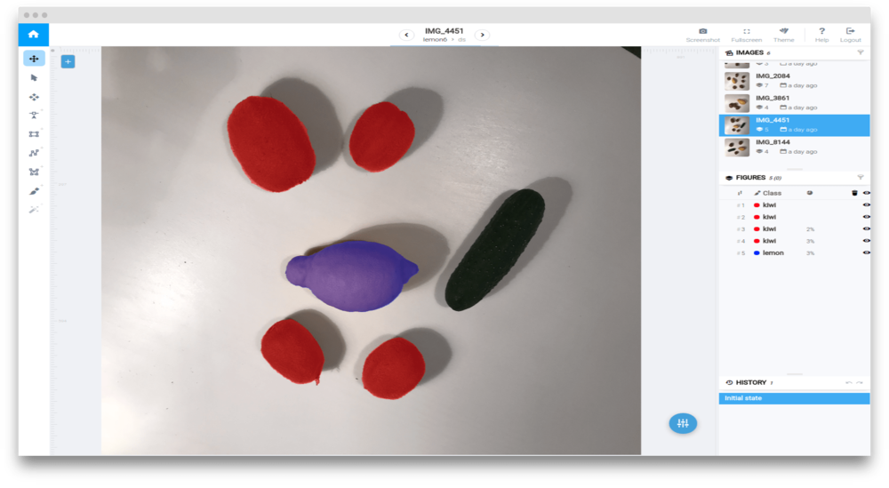
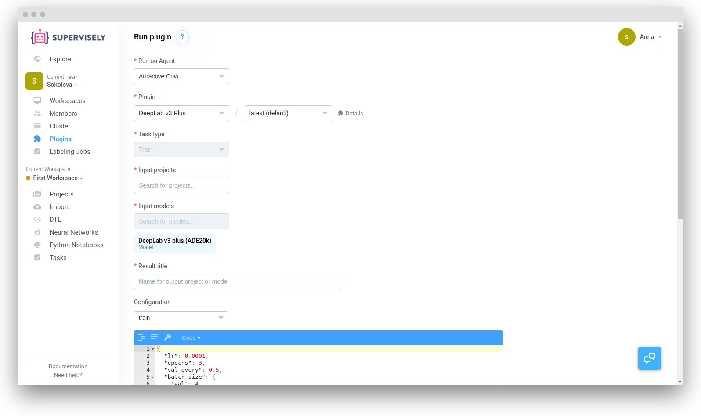

## Multi-class segmentation using Deeplab V3

In this example we will consider multi-class segmentation and will train [Deeplab V3](https://arxiv.org/abs/1706.05587). 

### Data preparation
To train Deeplab we will use our tiny dataset, containing only 6 images. In each image there are several annotated fruits, all other objects we will consider as a background.   



Using only 6 images for training is a direct road to overfitting, but not to obtaining an acceptable segmentation model. So let's use Data Transformation Language [(DTL)](../../data-manipulation/dtl/index.md) to augment these images, we will use this DTL config:
```json
[
  {
    "dst": "$sample",
    "src": [
      "lemon6/*"
    ],
    "action": "data",
    "settings": {
      "classes_mapping": "default"
    }
  },
  {
    "dst": "$fv",
    "src": [
      "$sample"
    ],
    "action": "flip",
    "settings": {
      "axis": "vertical"
    }
  },
  {
    "dst": "$fh",
    "src": [
      "$fv",
      "$sample"
    ],
    "action": "flip",
    "settings": {
      "axis": "horizontal"
    }
  },
  {
    "dst": "$data",
    "src": [
      "$fv",
      "$sample",
      "$fh"
    ],
    "action": "dummy",
    "settings": {}
  },
  {
    "dst": "$data2",
    "src": [
      "$data"
    ],
    "action": "multiply",
    "settings": {
      "multiply": 10
    }
  },
  {
    "dst": "$data3",
    "src": [
      "$data2"
    ],
    "action": "crop",
    "settings": {
      "random_part": {
        "width": {
          "max_percent": 90,
          "min_percent": 70
        },
        "height": {
          "max_percent": 90,
          "min_percent": 70
        },
        "keep_aspect_ratio": false
      }
    }
  },
  {
    "dst": [
      "$totrain",
      "$toval"
    ],
    "src": [
      "$data3",
      "$data"
    ],
    "action": "if",
    "settings": {
      "condition": {
        "probability": 0.95
      }
    }
  },
  {
    "dst": "$train",
    "src": [
      "$totrain"
    ],
    "action": "tag",
    "settings": {
      "tag": "train",
      "action": "add"
    }
  },
  {
    "dst": "$val",
    "src": [
      "$toval"
    ],
    "action": "tag",
    "settings": {
      "tag": "val",
      "action": "add"
    }
  },
  {
    "dst": "$data_with_bg",
    "src": [
      "$train",
      "$val"
    ],
    "action": "background",
    "settings": {
      "class": "bg"
    }
  },
  {
    "dst": "lemon6_train",
    "src": [
      "$data_with_bg"
    ],
    "action": "supervisely",
    "settings": {}
  }
]
```
After you open DTL and copy this config to the text window, your computational graph must look like this:


So, what's going on here?

1.  First, we take our project `lemon6` with all classes and datasets.

2.  Next, we generate vertical flips, then make horizontal flips from both the initial images and those that were flipped vertically.

3.  Then we merge the initial and flipped images and generate random crops from them.

4.  After that we take all images and randomly put 5% into the validation set and 95% into the training set.

5.  Now we tag images in training and validation sets so that neural network can separate them.

6.  We save everything back into Supervisely as a new project.

Push the "Start" button and at the end we should get a new project `lemon6_train`.


### Network training

1. Open "Neural Networks" section in the left menu and click the "Train" button.
	
3. Select the previously generated dataset `lemon6_train`and enter your model name: 
	
	To configure the settings use following config:

```json
{
  "input_size": {
    "width": 256,
    "height": 256
  },
  "batch_size": {
    "train": 12,
    "val": 6
  },
  "dataset_tags": {
    "train": "train",
    "val": "val"
  },
  "data_workers": {
    "train": 3,
    "val": 1
  },
  "special_classes": {
    "background": "bg",
    "neutral": "neutral"
  },
  "epochs": 10,
  "val_every": 0.5,
  "lr": 0.001,
  "gpu_devices": [
    0,
    1,
    2,
    3
  ],
  "weights_init_type": "transfer_learning"
}
```

Don't forget to set `gpu_devices` according to the number of GPUs you have on board.

5 . Start training.

6 . You can use `Chart` to check progress and metrics values during training.
		


### Test the model
After training is completed you can test your model.
1. Open "Neural Networks", select your model and click "Test" button.
	
2.  Choose your test project(`lemon_test` in my case).
	
3. Enter output project name and use this config to start inference:
	
```json
{
  "model": {
    "gpu_device": 0
  },
  "mode": {
    "name": "full_image",
    "model_classes": {
      "save_classes": [
        "lemon",
        "kiwi"
      ],
      "add_suffix": "_dl"
    }
  }
}
```
After inference is completed you find the resulting project in the "Projects" section.
