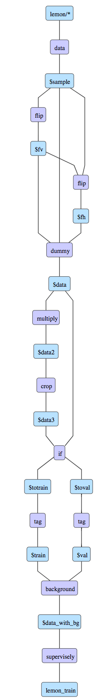
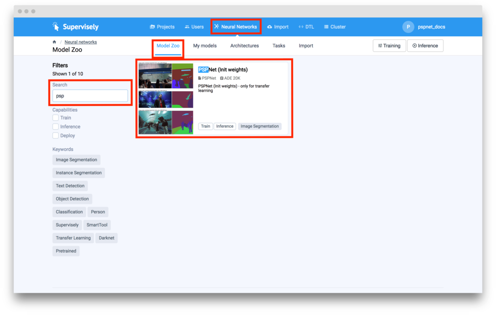
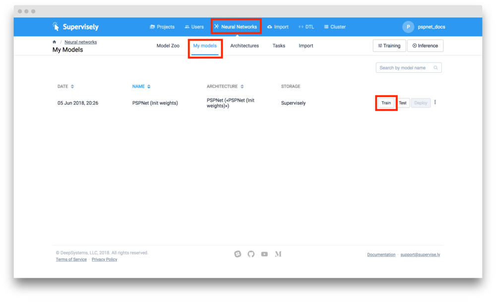
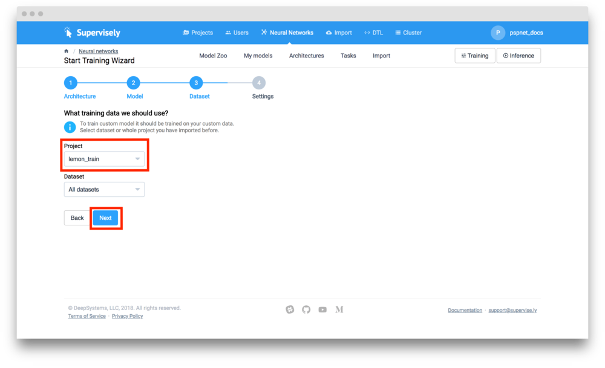
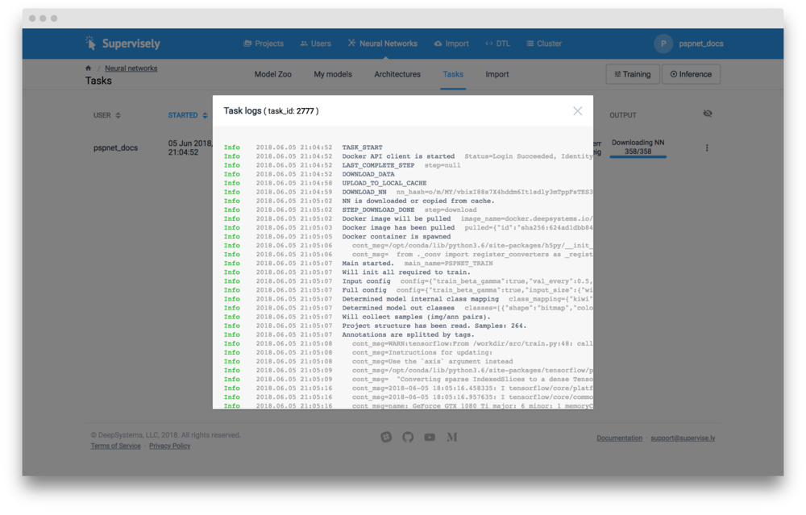
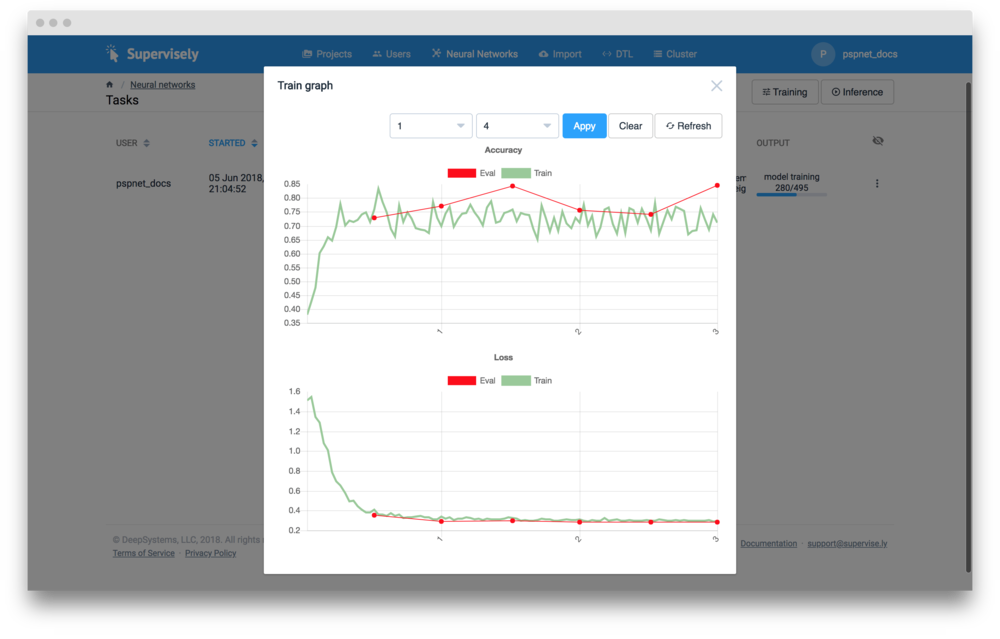
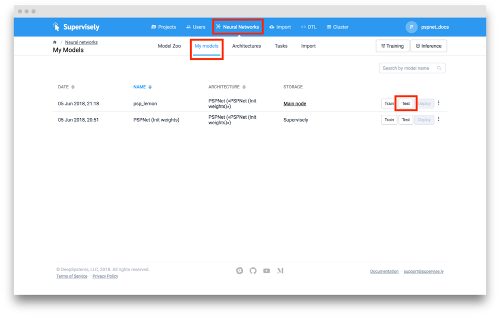
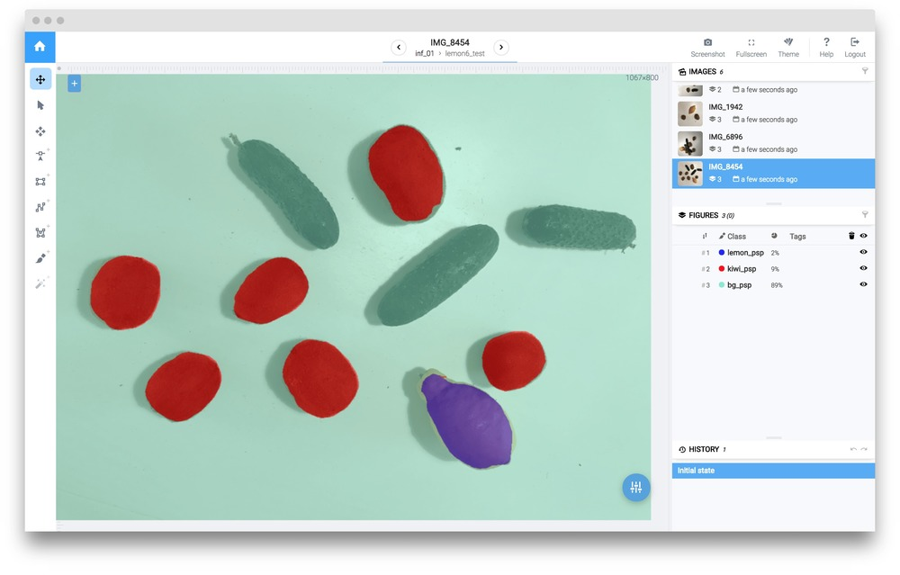

# DEPRECATED - DELETE IT?

## Multi-class image segmentation using PSPNet

In this example, we will consider semantic segmentation task. To solve this problem we will train [PSP Net](https://arxiv.org/abs/1612.01105) - state-of-the-art segmentation model. 

## Data preparation
To train PSPNet we will use our tiny dataset, containing only 6 images. In each image there are several annotated fruits belonging to different classes.   

This dataset has few interesting properties:

1. It is small (only 6 annotated images)

2. The classes are imbalanced

3. Background objects have similarities with target classes


Using only 6 images for training is a direct way to overfitting. To train such deep NN we have to prepare training dataset: perform various data augmentations. Supervisely has Data Transformation Language [(DTL)](../../data-manipulation/dtl/index.md) specially designed for that purpose. Full DTL config:

```json
[
  {
    "dst": "$sample",
    "src": [
      "lemon/*"
    ],
    "action": "data",
    "settings": {
      "classes_mapping": "default"
    }
  },
  {
    "dst": "$fv",
    "src": [
      "$sample"
    ],
    "action": "flip",
    "settings": {
      "axis": "vertical"
    }
  },
  {
    "dst": "$fh",
    "src": [
      "$fv",
      "$sample"
    ],
    "action": "flip",
    "settings": {
      "axis": "horizontal"
    }
  },
  {
    "dst": "$data",
    "src": [
      "$fv",
      "$sample",
      "$fh"
    ],
    "action": "dummy",
    "settings": {}
  },
  {
    "dst": "$data2",
    "src": [
      "$data"
    ],
    "action": "multiply",
    "settings": {
      "multiply": 10
    }
  },
  {
    "dst": "$data3",
    "src": [
      "$data2"
    ],
    "action": "crop",
    "settings": {
      "random_part": {
        "width": {
          "max_percent": 90,
          "min_percent": 70
        },
        "height": {
          "max_percent": 90,
          "min_percent": 70
        },
        "keep_aspect_ratio": false
      }
    }
  },
  {
    "dst": [
      "$totrain",
      "$toval"
    ],
    "src": [
      "$data3",
      "$data"
    ],
    "action": "if",
    "settings": {
      "condition": {
        "probability": 0.95
      }
    }
  },
  {
    "dst": "$train",
    "src": [
      "$totrain"
    ],
    "action": "tag",
    "settings": {
      "tag": "train",
      "action": "add"
    }
  },
  {
    "dst": "$val",
    "src": [
      "$toval"
    ],
    "action": "tag",
    "settings": {
      "tag": "val",
      "action": "add"
    }
  },
  {
    "dst": "$data_with_bg",
    "src": [
      "$train",
      "$val"
    ],
    "action": "background",
    "settings": {
      "class": "bg"
    }
  },
  {
    "dst": "lemon_train",
    "src": [
      "$data_with_bg"
    ],
    "action": "supervisely",
    "settings": {}
  }
]
```
After you open DTL and copy this config to text window, your computational graph should look like this:



So, what's going on here?

1.  First, we take entire project  `lemon` (all 6 images with annotations).  `"classes_mapping": "default"` means that we will keep original classes as is. 

2.  Next, generate vertical flips, then make horizontal flips from both original images and those that were flipped vertically.

3.  Then we merge original and flipped images and generate random crops from them.

4.  After that we take all images and randomly split all images into two groups: first group will contain 95% percent of images, second group will contain the rest. 

5. Tag `train` will be assigned to all images from first group. Tag `val` will be assigned to images from second group. These tags define training and validation sets that will use on training stage.

6.  Save everything back into Supervisely as a new project

Push "Start" button and at the end we should get new project `lemon_train`.

## Add NN architecture and pretrained weights

If you already have this NN in your account, you can skip this step. 

To add new architecture with pretrained weights to your account you should go to `Neural Networks` -> `Model Zoo`. Find PSPNet plate, point to it and click `Add model` button.



After that PSPNet architecture will be added to your account. Also PSPNet model (pretrained on COCO) will be added to the list of your models. This means that now you can train NN with your custom data and use pretrained weights for transfer learning. 


## Network training

1. Go to `Neural Networks` -> `My models`. Find YOLO model and push `Train` button. 


2. Now we should select project we will use for training. Select `lemon_train` project and click `Next` button. 


3. Before starting the training we have to define name of resulting NN, choose one of the node from cluster, and define some training configuration.

Model name: `psp_lemon`

Training configuration:

```json
{
  "lr": 0.0001,
  "epochs": 15,
  "momentum": 0.9,
  "val_every": 0.5,
  "batch_size": {
    "val": 1,
    "train": 2
  },
  "input_size": {
    "width": 713,
    "height": 713
  },
  "gpu_devices": [
    0,
    1,
    2,
    3
  ],
  "data_workers": {
    "val": 0,
    "train": 3
  },
  "dataset_tags": {
    "val": "val",
    "train": "train"
  },
  "weight_decay": 0.0001,
  "special_classes": {
    "neutral": "neutral",
    "background": "bg"
  },
  "update_mean_var": true,
  "train_beta_gamma": true,
  "weights_init_type": "transfer_learning"
}
```
<!--
Training configuration defines input resolution, batch size, learning rate, list of gpu_devices used for training and other parameters.
-->

4 . Press `Start training` button.

5 . You will be redirected to `Neural networks`->`Tasks` page. Here you can view logs and training charts:






## Test model
After training is completed you can apply your model to test images.


1. Go to `Neural networks` -> `My models`. Find model and press `Test` button in front of it. 


2. Choose your test project(`lemon_test`) and press `Next` button.

3. Define output project name and inference configuration:

Output project name: `inf_01`

```json
{
  "gpu_devices": [
    0
  ],
  "model_classes": {
    "save_classes": "__all__",
    "add_suffix": "_psp"
  },
  "existing_objects": {
    "save_classes": [],
    "add_suffix": ""
  },
  "mode": {
    "source": "full_image"
  }
}
```
<!---
Inference configuration defines the way image will be feeded to the neural network. Supervisely supports few inference types ( image, objects, roi, sliding window). "Full image" inference mode is used in this example.  
-->

After inference is completed you find result project in "Projects" section.

Here is the examaple of NN predictions:


