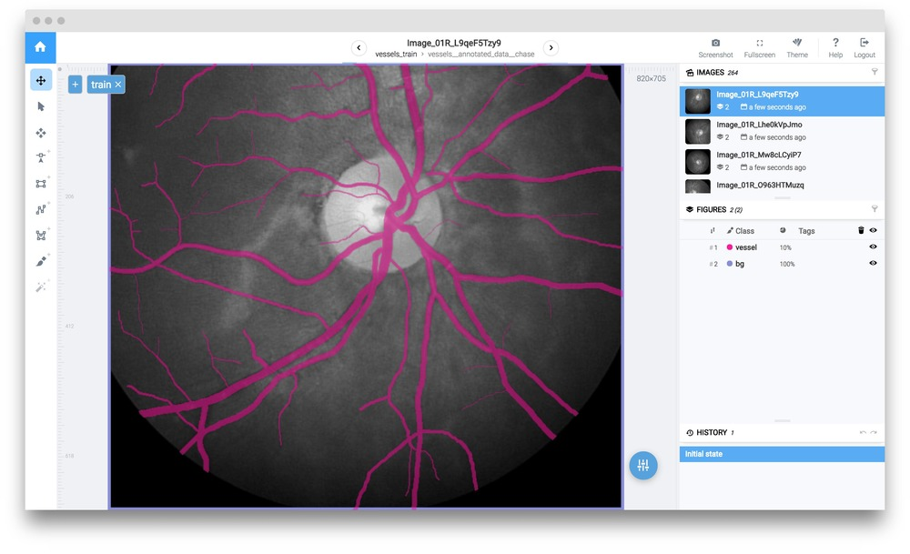

## Multi-class image segmentation using UNet V2

In this example we will consider a semantic segmentation task. To solve this problem we will train a modification of [UNet](https://arxiv.org/abs/1505.04597) - fast, accurate and easy to train segmentation model. 

## Data preparation
To train UNet we will use a tiny dataset - subsample of [Vessels - Chase](https://blogs.kingston.ac.uk/retinal/chasedb1/), containing only 6 images with only one class. 

This dataset has a few interesting properties:

1. It is small (only 6 annotated images)

2. The classes (background and vessel) are unbalanced in terms of area.


Using only 6 images for training is a direct path to overfitting. To train such deep NN we have to prepare a training dataset: perform various data augmentations. Supervisely has Data Transformation Language [(DTL)](../../data-manipulation/dtl/index.md) specially designed for that purpose. Full DTL config:

```json
[
  {
    "dst": "$sample",
    "src": [
      "vessels/*"
    ],
    "action": "data",
    "settings": {
      "classes_mapping": "default"
    }
  },
  {
    "dst": "$fv",
    "src": [
      "$sample"
    ],
    "action": "flip",
    "settings": {
      "axis": "vertical"
    }
  },
  {
    "dst": "$fh",
    "src": [
      "$fv",
      "$sample"
    ],
    "action": "flip",
    "settings": {
      "axis": "horizontal"
    }
  },
  {
    "dst": "$data",
    "src": [
      "$fv",
      "$sample",
      "$fh"
    ],
    "action": "dummy",
    "settings": {}
  },
  {
    "dst": "$data2",
    "src": [
      "$data"
    ],
    "action": "multiply",
    "settings": {
      "multiply": 10
    }
  },
  {
    "dst": "$data3",
    "src": [
      "$data2"
    ],
    "action": "crop",
    "settings": {
      "random_part": {
        "width": {
          "max_percent": 90,
          "min_percent": 70
        },
        "height": {
          "max_percent": 90,
          "min_percent": 70
        },
        "keep_aspect_ratio": false
      }
    }
  },
  {
    "dst": [
      "$totrain",
      "$toval"
    ],
    "src": [
      "$data3",
      "$data"
    ],
    "action": "if",
    "settings": {
      "condition": {
        "probability": 0.95
      }
    }
  },
  {
    "dst": "$train",
    "src": [
      "$totrain"
    ],
    "action": "tag",
    "settings": {
      "tag": "train",
      "action": "add"
    }
  },
  {
    "dst": "$val",
    "src": [
      "$toval"
    ],
    "action": "tag",
    "settings": {
      "tag": "val",
      "action": "add"
    }
  },
  {
    "dst": "$data_with_bg",
    "src": [
      "$train",
      "$val"
    ],
    "action": "background",
    "settings": {
      "class": "bg"
    }
  },
  {
    "dst": "vessels_train",
    "src": [
      "$data_with_bg"
    ],
    "action": "supervisely",
    "settings": {}
  }
]
```
After you open the DTL page and copy this config to the text window, your computational graph should look like this:


So, what's going on here?

1.  First, we take the entire project  `vessels` (all 6 images with annotations).  `"classes_mapping": "default"` means that we will keep original classes as is. 

2.  Next, we generate vertical flips, then make horizontal flips from both original images and those that were flipped vertically.

3.  Then we merge original and flipped images and generate random crops from them.

4.  After that we take all images and randomly split them into two groups: first group will contain 95% percent of images, second group will contain the rest. 

5. Tag `train` will be assigned to all images in the first group. Tag `val` will be assigned to the images in the second group. These tags define training and validation sets that we will use on the training stage.

6.  Next we save everything back into Supervisely as a new project.

Push "Start" button and at the end we should get a new project `vessels_train`.

Here is an example of an image from `vessels_train`.



## Add NN architecture and pretrained weights

If you already have this NN in your account, you can skip this step. 

To add a new architecture with pretrained weights to your account you should go to `Explore` -> `Models`. Find UNet V2, point to it and click the `Add model` button. You can use the search function for ease.


After that UNetV2 architecture will be added to your account. Also UNetV2 model (VGG weights) will be added to the list of your models. This means that now you can train NN with your custom data and use pretrained weights for transfer learning. 


## Network training

1. Go to `Neural Networks`. Find your model and push the `Train` button. 


2. Now we should select project we will use for training. Select `vessels_train` project and click `Next` button. 


3. Before starting the training we have to define name of resulting NN, choose one of the node from cluster, and define some training configuration.

Model name: `UNet Trained`

Training configuration:

```json
{
  "lr": 0.001,
  "epochs": 15,
  "val_every": 0.5,
  "batch_size": {
    "val": 6,
    "train": 12
  },
  "input_size": {
    "width": 256,
    "height": 256
  },
  "gpu_devices": [
    0,
    1,
    2,
    3
  ],
  "data_workers": {
    "val": 0,
    "train": 3
  },
  "dataset_tags": {
    "val": "val",
    "train": "train"
  },
  "special_classes": {
    "neutral": "neutral",
    "background": "bg"
  },
  "weights_init_type": "transfer_learning"
}
```

Training configuration defines input resolution, batch size, learning rate, list of gpu_devices used for training and other parameters.

4 . Press the `Run` button.

5 . You will be redirected to the `Tasks` page. Here you can view logs and training charts.


## Test the model
After training is completed you can apply your model to test images.


1. Go to `Neural networks`. Find the model and press the `Test` button in front of it. 


2. Choose your test project(`vessels_test`).


3. Define the output project name and inference configuration:

Output project name: `inf_01`

```json
{
  "model": {
    "gpu_device": 0
  },
  "mode": {
    "name": "full_image",
    "model_classes": {
      "save_classes": "__all__",
      "add_suffix": "_unet"
    }
  }
}
```
Inference configuration defines the way image will be feeded to the neural network. Supervisely supports a few [inference types](../configs/inference_config.md) ( image, objects, roi, sliding window). "Full image" inference mode is used in this example.  

After inference is completed you find the result project on the "Projects" page.

Here is the example of NN predictions:


### Video

<iframe width="560" height="315" src="https://www.youtube.com/embed/RlIwCBB84Xo" frameborder="0" allow="autoplay; encrypted-media" allowfullscreen></iframe>


