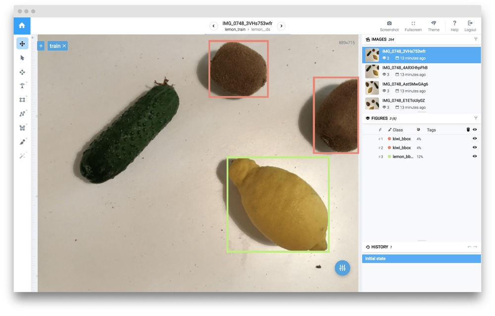
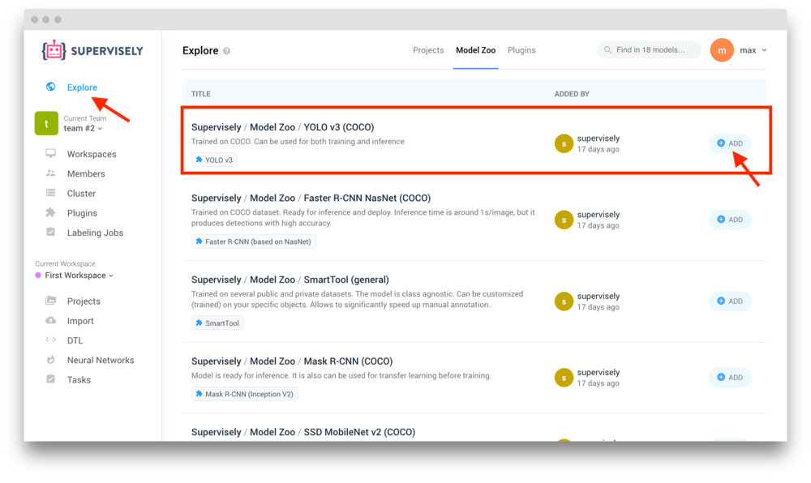
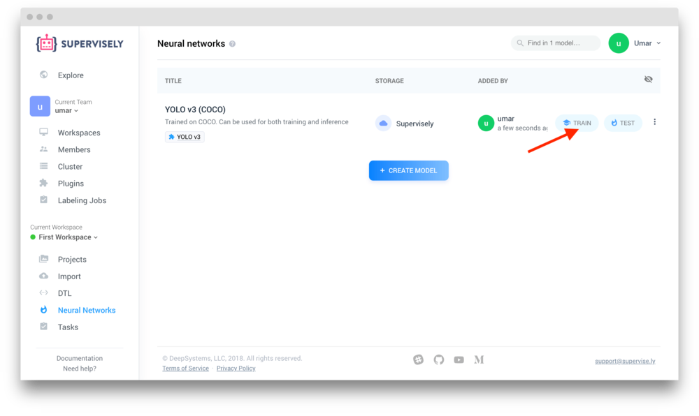
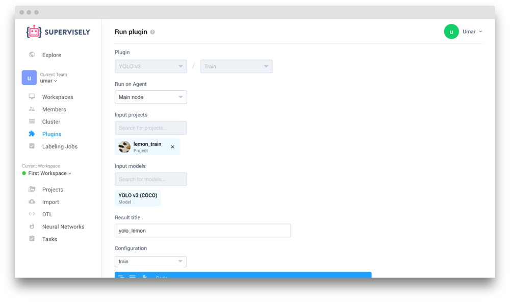
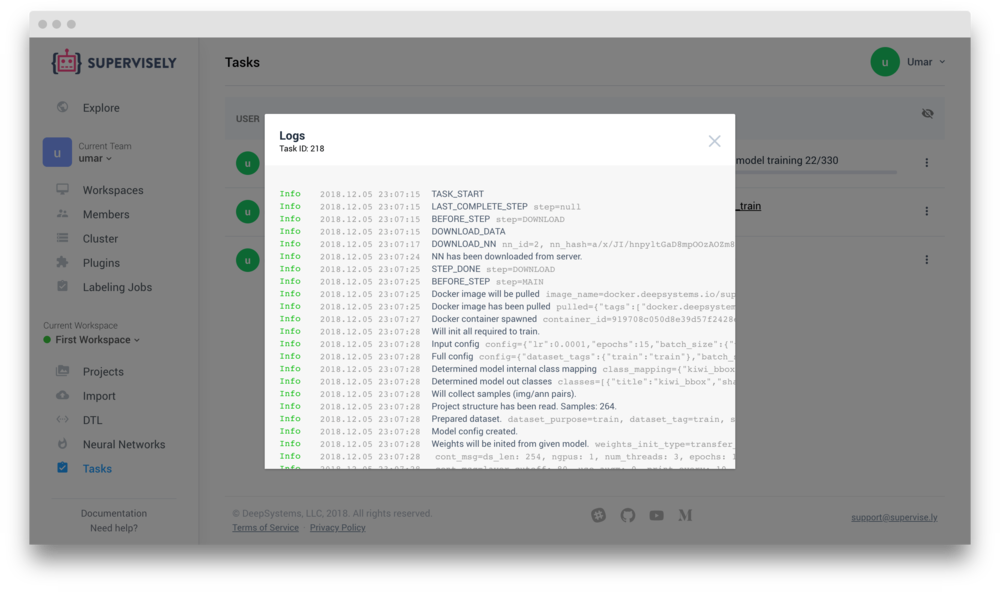
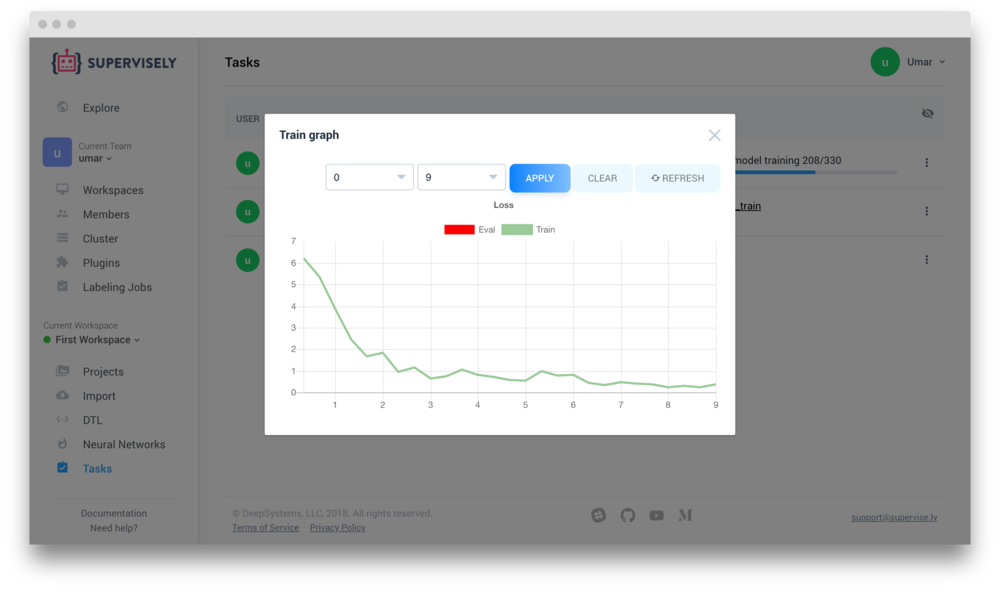
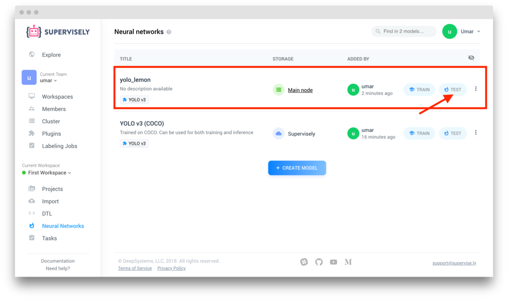
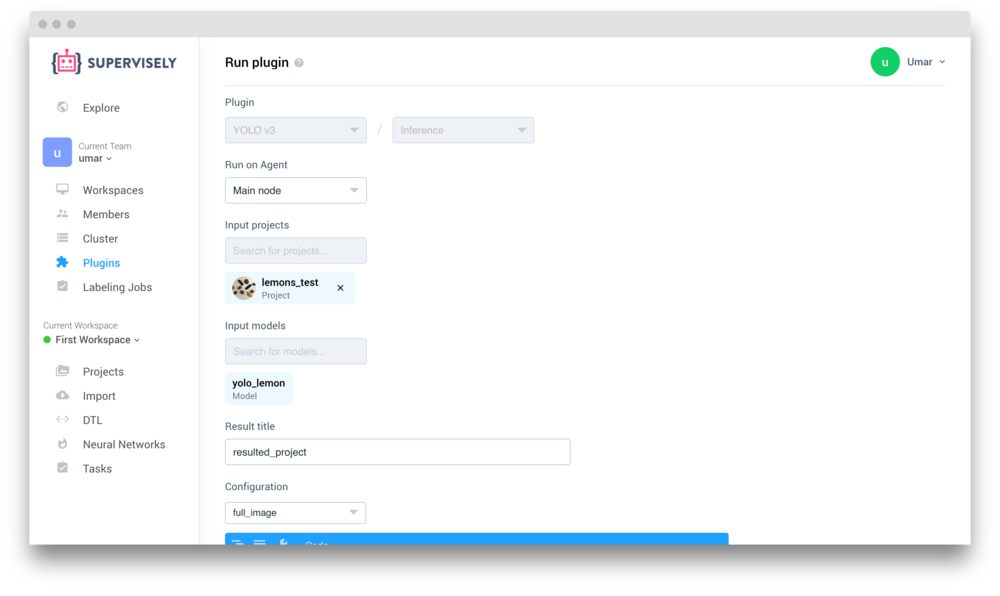
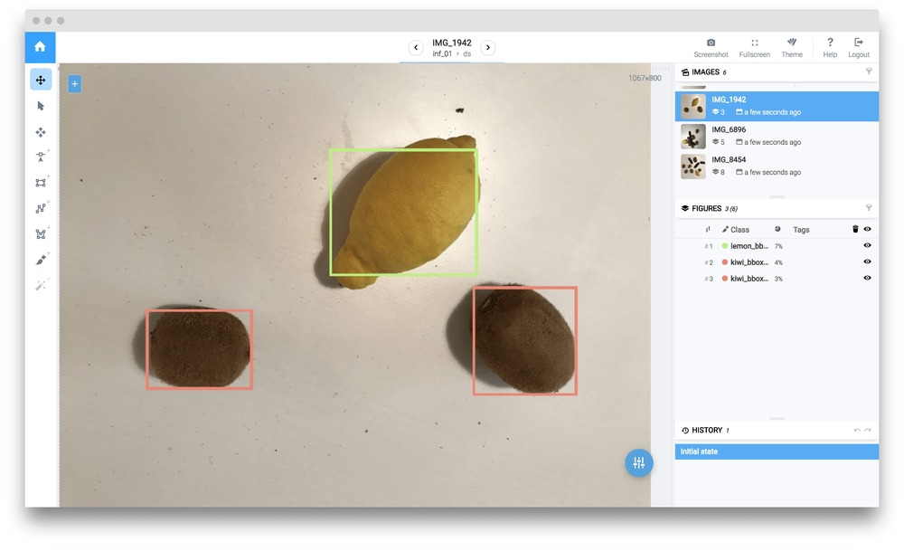

## Multi-class object detection using YOLO V3

In this example, we will consider object detection task. To solve this problem we will train [YOLO v3](https://pjreddie.com/darknet/yolo/) - state-of-the-art instance segmentation model. 

## Data preparation
To train YOLO V3 we will use our tiny dataset, containing only 6 images. In each image there are several annotated fruits belonging to different classes.   

This dataset has few interesting properties:

1. It is small (only 6 annotated images)

2. The classes are imbalanced

3. Background objects have similarities with target classes


You can clone this dataset to your workspace from Explore page. Search for "Supervisely / Demo / lemons_annotated" project and click "Add to my Projects". Edit title of your new dataset by selecting "Edit title & description" in context menu and enter "lemons".

Using only 6 images for training is a direct way to overfitting. To train such deep NN we have to prepare training dataset: perform various data augmentations. Supervisely has Data Transformation Language [(DTL)](../../../data-manipulation/dtl/index.md) specially designed for that purpose. Full DTL config:

```json
[
  {
    "dst": "$data01",
    "src": [
      "lemon/*"
    ],
    "action": "data",
    "settings": {
      "classes_mapping": "default"
    }
  },
  {
    "dst": "$boxes",
    "src": [
      "$data01"
    ],
    "action": "bbox",
    "settings": {
      "classes_mapping": {
        "kiwi": "kiwi_bbox",
        "lemon": "lemon_bbox"
      }
    }
  },
  {
    "dst": "$fv",
    "src": [
      "$boxes"
    ],
    "action": "flip",
    "settings": {
      "axis": "vertical"
    }
  },
  {
    "dst": "$fh",
    "src": [
      "$fv",
      "$boxes"
    ],
    "action": "flip",
    "settings": {
      "axis": "horizontal"
    }
  },
  {
    "dst": "$data",
    "src": [
      "$fv",
      "$boxes",
      "$fh"
    ],
    "action": "dummy",
    "settings": {}
  },
  {
    "dst": "$data2",
    "src": [
      "$data"
    ],
    "action": "multiply",
    "settings": {
      "multiply": 10
    }
  },
  {
    "dst": "$data3",
    "src": [
      "$data2"
    ],
    "action": "crop",
    "settings": {
      "random_part": {
        "width": {
          "max_percent": 90,
          "min_percent": 70
        },
        "height": {
          "max_percent": 90,
          "min_percent": 70
        },
        "keep_aspect_ratio": false
      }
    }
  },
  {
    "dst": [
      "$totrain",
      "$toval"
    ],
    "src": [
      "$data3",
      "$data"
    ],
    "action": "if",
    "settings": {
      "condition": {
        "probability": 0.95
      }
    }
  },
  {
    "dst": "$train",
    "src": [
      "$totrain"
    ],
    "action": "tag",
    "settings": {
      "tag": "train",
      "action": "add"
    }
  },
  {
    "dst": "$val",
    "src": [
      "$toval"
    ],
    "action": "tag",
    "settings": {
      "tag": "val",
      "action": "add"
    }
  },
  {
    "dst": "lemon_train",
    "src": [
      "$train",
      "$val"
    ],
    "action": "supervisely",
    "settings": {}
  }
]
```
After you open DTL and copy this config to text window, your computational graph should look like this:


So, what's going on here?

1.  First, we take entire project  `lemon` (all 6 images with annotations).  `"classes_mapping": "default"` means that we will keep original classes as is. 

2.  Convert all objects from bitmaps to bounding boxes to train our custom detector. 

3.  Next, generate vertical flips, then make horizontal flips from both original images and those that were flipped vertically.

4.  Then we merge original and flipped images and generate random crops from them.

5.  After that we take all images and randomly split all images into two groups: first group will contain 95% percent of images, second group will contain the rest. 

6. Tag `train` will be assigned to all images from first group. Tag `val` will be assigned to images from second group. These tags define training and validation sets that will use on training stage.

7.  Save everything back into Supervisely as a new project

Push "Start" button and at the end we should get new project `lemon_train`.

Here is the example of image from `lemon_train`.



## Add NN architecture and pretrained weights

If you already have this NN in your account, you can skip this step. 

To add new architecture with pre-trained weights to your account you should go to `Explore` -> `Model Zoo`. Find "Supervisely / Model Zoo / YOLO v3 (COCO)" and click `Add` button.



After that YOLO V3 plugin will be added to your account. Also, YOLO V3 model (pretrained on COCO) will be added to the list of your models. This means that now you can train NN with your custom data and use pretrained weights for transfer learning. 

## Network training

### Step 1

Go to `Neural Networks`. Find YOLO model and push `Train` button. 



### Step 2

Choose one of your agents from cluster to run training on.

Now we should select Input Project we will use for training. Select `lemon_train` project. 

Finally, define title of resulting NN, for example, `yolo_lemon`.



### Step 3

Now define some training configuration.

Training configuration:

```json
{
  "lr": 0.0001,
  "epochs": 15,
  "batch_size": {
    "train": 12
  },
  "input_size": {
    "width": 416,
    "height": 416
  },
  "bn_momentum": 0.01,
  "gpu_devices": [
    0
  ],
  "data_workers": {
    "train": 3
  },
  "dataset_tags": {
    "train": "train"
  },
  "subdivisions": {
    "train": 1
  },
  "print_every_iter": 10,
  "weights_init_type": "transfer_learning",
  "enable_augmentations": false
}
```

Training configuration defines input resolution, batch size, learning rate, list of gpu_devices used for training and other parameters.

Press `Run` button to start training.

### Step 4

You will be redirected to `Tasks` page. Here you can view logs and training charts:






## Test model
After training is completed you can apply your model to test images.

### Step 1

Go to `Neural networks`. Find your new model (i.e. `yolo_lemon`) and press `Test` button. 



### Step 2

Choose input project. We will use test project from Explore page called "Supervisely / Demo / lemons_test". It doesn't contain annotations and our models hasn't seen any image from it.

Define output project name and inference configuration:

```json
{
  "model": {
    "gpu_device": 0,
    "confidence_tag_name": "confidence"
  },
  "mode": {
    "name": "full_image",
    "model_classes": {
      "save_classes": "__all__",
      "add_suffix": "_yolo"
    }
  }
}
```

Inference configuration defines the way image will be fed to the neural network. Supervisely supports few [inference types](../../configs/inference_config.md) ( image, objects, roi, sliding window). "Full image" inference mode is used in this example.  



Press "Run" to start inference.

After inference is completed you find result project in "Projects" section.

Here is an example of NN predictions:



