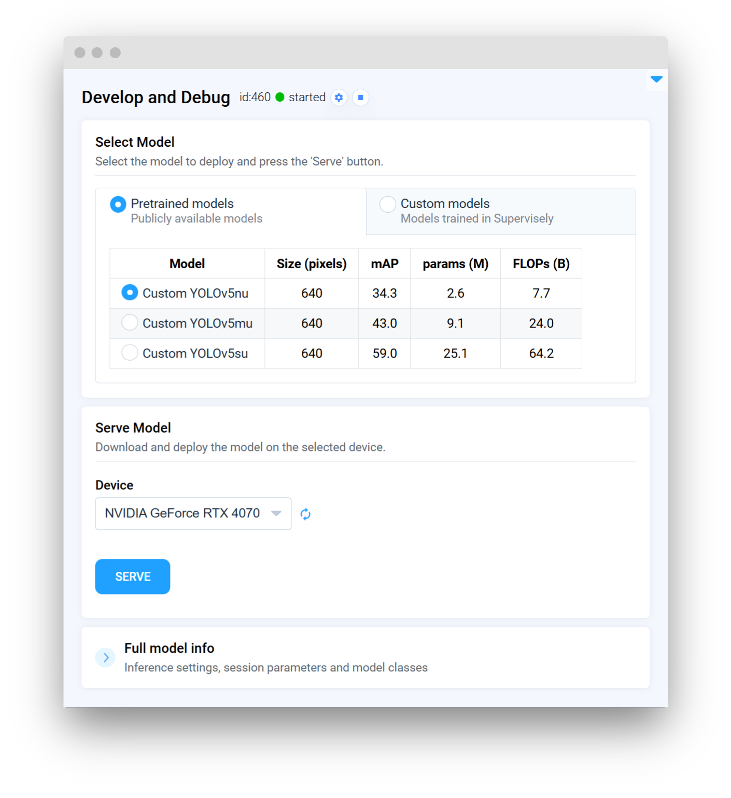
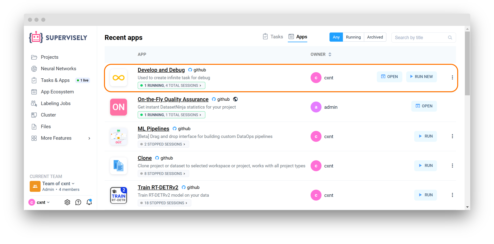

# Integrate Custom Inference

In this guide, you’ll learn how to build a custom serving app using the Supervisely SDK. By integrating your own model, you’ll be able to deploy a fully functional inference app on the Supervisely platform (or externally) that serves predictions in real time. In other words, you'll transform your model into a serving app that’s ready to be used in production.

## Overview

By following this guide, you’ll convert your custom model into a fully deployable serving app. This integration lets you:

- **Easily Serve Your Model:** Run inference on your own data through Supervisely’s platform.
- **Customize Your Solution:** Extend a Supervisely SDK class and implement the core methods needed for your custom inference solution.
- **Debug and Release**: Test locally, debug quickly, and deploy your app for production use.

## Step-by-Step Implementation

Let's dive into the steps:

1. **Create Your Implementation File:** Create your custom model class (inheriting from `sly.nn.inference.ObjectDetection` or a similar base class).
2. **Prepare models and inference settings files:** Create a `.json` file that lists your model configurations and details and `.yaml` file for any extra inference settings.
3. **Implement Key Methods:**
   - `load_model`: Load and set up your model for inference.
   - `predict`: Process input data, run inference, and format the predictions.
4. **Define Inference Settings:** Create an inference_settings.yaml file for any extra parameters you need during inference.
5. **Run, Debug, and Release:** Test your app locally (with IDE tips provided), then deploy it on the Supervisely platform.

Below is a simple example for a YOLO‑based object detection model. This example demonstrates the core functionality without distracting external dependencies.

```python
import torch
import supervisely as sly

class CustomYOLOInference(sly.nn.inference.ObjectDetection):
    # 1️⃣ Define essential class variables
    FRAMEWORK_NAME = "Custom YOLO"
    MODELS = "path/to/models.json"  # File containing your model configurations
    INFERENCE_SETTINGS = "path/to/inference_settings.yaml"  # Additional inference settings
    APP_OPTIONS = "path/to/app_options.yaml" # [optional] Additional app options


    # 2️⃣ Implement the load_model method
    def load_model(
        self,
        model_files: dict,
        model_info: dict,
        model_source: str,
        device: str,
        runtime: str
    ):
        """
        Load and prepare the model for inference.
        """
        checkpoint_path = model_files["checkpoint"]
        self.model = torch.load(checkpoint_path, map_location=device)
        self.model.to(device)
        self.model.eval()

    # 3️⃣ Prepare the postprocessor (convert raw outputs to predictions)
    def predict(self, image_path: str, settings: dict):
        """
        Run inference on the input image and return predictions.
        """
        img_tensor = self._preprocess_image(image_path)
        outputs = self.model(img_tensor)
        predictions = self._postprocess_outputs(outputs, settings)
        return predictions

# 4️⃣ Initialize and serve the model using custom inference class
model = CustomYOLOInference(use_gui=True, use_serving_gui_template=True)
model.serve()
```



### Step 1. Create a custom class

Write a Python file (e.g., src/main.py) that contains your custom inference class.

Example snippet:

```python
import supervisely as sly

class CustomYOLOInference(sly.nn.inference.ObjectDetection):
    # Define essential class variables
    FRAMEWORK_NAME = "Custom YOLO"
    MODELS = "path/to/models.json"  # File containing your model configurations
    INFERENCE_SETTINGS = "path/to/inference_settings.yaml"  # Additional inference settings
    # ...
```

### Step 2. Prepare models and inference settings files

#### Create models.json

Create a `models.json` file that holds a list of model configurations and assign the path to this file in the `MODELS` variable in your custom class. Each entry is a dictionary with model-specific details. These fields are used to populate the model table and can be customized based on your model requirements. This data will be displayed in the GUI for model selection (except for the technical `meta` field, which is required for the `Inference` to correctly access model info).

**Example `models.json`**

```json
[
    {
        "Model": "Custom YOLOv5nu",
        "Size (pixels)": "640",
        "mAP": "34.3",
        "params (M)": "2.6",
        "FLOPs (B)": "7.7",
        "meta": {
            "task_type": "object detection",
            "model_name": "custom yolov5nu",
            "model_files": {"checkpoint": "https://my_custom_model.com/download/yolov5nu.pt"}
        }
    },
    // ... additional models
]
```

**Note:**

- The `meta` field holds technical details used by the inference class to load the model:
  - (**required**) `task_type`: The type of task (e.g., object detection)
  - (**required**) `model_name`: Model name
  - (**required**) `model_files`: Paths to the checkpoint and configuration files
    - (**required**) `checkpoint`: Path or URL to the model checkpoint. URL will be downloaded automatically.
    - (**optional**) `config`: Path to the model configuration file

#### Create inference_settings.yaml

Create an `inference_settings.yaml` file to specify any extra settings needed during inference and assign path to this file in the `INFERENCE_SETTINGS` variable in your custom class.

```yaml
confidence_threshold: 0.4
```

### Step 3. Implement Required Methods

#### Inheritance and Class Variables

Your custom class should inherit from the appropriate Supervisely base class. Define key class variables:

**`FRAMEWORK_NAME:`** Name of your model's framework.
**`MODELS:`** Path to your `models.json` file.
**`INFERENCE_SETTINGS:`** Path to your `.yaml` settings file.
**`APP_OPTIONS:`** (Optional) Path to additional app options in `.yaml` format.

#### The `load_model` Method

This method loads the model checkpoint and prepares it for inference.

```python
def load_model(self, model_files: dict, model_info: dict, model_source: str, device: str, runtime: str):
    """
    Load and prepare the model for inference.
    """
    # 1️⃣ Retrieve the checkpoint file path
    checkpoint_path = model_files["checkpoint"]
    
    # 2️⃣ Load the model using PyTorch (simplified for this example)
    self.model = torch.load(checkpoint_path, map_location=device)
    self.model.to(device)
    self.model.eval()
```

#### The `predict` Method

This method processes the input image, runs inference, and then postprocesses the outputs to format them into predictions

```python
def predict(self, image_path: str, settings: dict):
    """
    Run inference on the input image and return predictions.
    """
    # 1️⃣ Preprocess the input image (implement your own method)
    img_tensor = self._preprocess_image(image_path)
    
    # 2️⃣ Run the model inference
    outputs = self.model(img_tensor)
    
    # 3️⃣ Postprocess the outputs (convert raw outputs to labels, boxes, scores, etc.)
    predictions = self._postprocess_outputs(outputs, settings)
    return predictions
```

## Running and Debugging Your App

You can easily debug your code locally in your favorite IDE.


For now, we recommend using **Visual Studio Code** IDE, because our repositories have prepared settings for convenient debugging in VSCode. It is the easiest way to start.


#### For Visual Studio Code users

Create a `launch.json` file with configuration in the `.vscode` directory of your repository.

You can use the following template as a starting point:

```json
// .vscode/launch.json

{
  "version": "0.2.0",
  "configurations": [
  {
      "name": "Local Debug",
      "type": "python",
      "request": "launch",
      "program": "${workspaceFolder}/src/main.py", // path to your main file
      "console": "integratedTerminal",
      "justMyCode": false,
      "env": {
        "PYTHONPATH": "${workspaceFolder}:${PYTHONPATH}",
        "LOG_LEVEL": "DEBUG",
        "SLY_APP_DATA_DIR": "${workspaceFolder}/app_data"
      }
  },
  {
      "name": "Advanced Debug in Supervisely platform",
      "type": "debugpy",
      "request": "launch",
      "module": "uvicorn",
      "args": [
        "src.main:model.app", // path to your main file and the app object
        "--host",
        "0.0.0.0",
        "--port",
        "8000",
        "--ws",
        "websockets",
      ],
      "justMyCode": false,
      "env": {
        "PYTHONPATH": "${workspaceFolder}:${PYTHONPATH}",
        "LOG_LEVEL": "DEBUG",
        "DEBUG_APP_DIR": "app_data",
        "DEBUG_WITH_SLY_NET": "1"
      }
    }
  ]
}
```

### Local debug

You can run the code locally for debugging by running this command in the terminal:

```shell
python src/main.py
```

If you're a **Visual Studio Code** user use a prepared `launch.json` configuration that can be selected:


### Debug in Supervisely platform

Once the code seems working locally, it's time to test the code right in the Supervisely platform as a debugging app. For that:

1. If you develop in a Docker container, you should run the container with `--cap_add=NET_ADMIN` option.
2. Install `sudo apt-get install wireguard iproute2`.
3. Define your `TEAM_ID` in the `local.env` file. _Actually there are other env variables that is needed, but they are already provided in `./vscode/launch.json` for you._
4. Switch the `launch.json` config to the `Advanced debug in Supervisely platform`:


5. Run the code.

✅ It will deploy the model in the Supervisely platform as a regular serving App that is able to communicate with all others app in the platform:




Now you can use apps like [Apply NN to Images](https://ecosystem.supervisely.com/apps/nn-image-labeling/project-dataset), [Apply NN to videos](https://ecosystem.supervisely.com/apps/apply-nn-to-videos-project) with your deployed model.

Or get the model inference via **Python API** with the help of `sly.nn.inference.Session` class just in one line of code. See [Inference API Tutorial](https://developer.supervisely.com/app-development/neural-network-integration/inference-api-tutorial).


## Releasing Your App

Once you've tested the code, it's time to release it into the platform. It can be released as an App that shared with the all Supervisely community, or as your own private App.

Refer to [How to Release your App](https://developer.supervisely.com/app-development/basics/from-script-to-supervisely-app) for all releasing details. For a private app check also [Private App Tutorial](https://developer.supervisely.com/app-development/basics/add-private-app).

In this tutorial we'll quickly observe the key concepts of our app.

### Repository structure

The structure of repository is the following:

```text
📦
├── 📜README.md
├── 📜config.json
├── 📜create_venv.sh
├── 📜requirements.txt
├── 📂docker
│   ├── 🐋Dockerfile
│   └── 📜publish.sh
├── 📜local.env
└── 📂src
    ├── 📜models.json
    ├── 📜inference_settings.yaml
    ├── 📜app_options.yaml
    └── 🐍main.py
```

Explanation:

- `src/main.py` - main inference script
- `src/models.json` - file with model configurations
- `src/inference_settings.yaml` - file with inference settings
- `src/app_options.yaml` - file with additional app options
- `README.md` - readme of your application, it is the main page of an application in Ecosystem with some images, videos, and how-to-use guides
- `config.json` - configuration of the Supervisely application, which defines the name and description of the app, its context menu, icon, poster, and running settings
- `create_venv.sh` - creates a virtual environment, installs detectron2 and requirements.
- `requirements.txt` - all needed packages, avoid using this file if possible, we recommend to install all dependencies in the Dockerfile.
- `local.env` - file with env variables used for debugging
- `docker` - directory with the custom Dockerfile for this application and the script that builds it and publishes it to the docker registry

### App configuration

App configuration is stored in `config.json` file. A detailed explanation of all possible fields is covered in this [Configuration Tutorial](https://developer.supervisely.com/app-development/basics/app-json-config/config.json). Let's check the config for our current app:

```json
{
  "type": "app",
  "version": "2.0.0",
  "name": "Serve custom YOLO",
  "description": "Custom object detection model integration",
  "categories": [
    "neural network",
    "images",
    "object detection",
    "serve",
    "development"
  ],
  "session_tags": ["deployed_nn"],
  "need_gpu": true,
  "community_agent": false,
  "docker_image": "supervisely/detectron2-demo:1.0.3",
  "entrypoint": "python -m uvicorn src.main:m.app --host 0.0.0.0 --port 8000",
  "port": 8000,
  "headless": true
}
```

Here is an explanation for the fields:

- `type` - type of the module in Supervisely Ecosystem
- `version` - version of Supervisely App Engine. Just keep it by default
- `name` - the name of the application
- `description` - the description of the application
- `categories` - these tags are used to place the application in the correct category in Ecosystem.
- `session_tags` - these tags will be assigned to every running session of the application. They can be used by other apps to find and filter all running sessions
- `"need_gpu": true` - should be true if you want to use any `cuda` devices.
- `"community_agent": false` - this means that this app can not be run on the agents started by Supervisely team, so users have to connect their own computers and run the app only on their own agents. Only applicable in Community Edition. Enterprise customers use their private instances so they can ignore current option
- `docker_image` - Docker container will be started from the defined Docker image, github repository will be downloaded and mounted inside the container.
- `entrypoint` - the command that starts our application in a container
- `port` - port inside the container
- `"headless": true` means that the app has no User Interface

## Additional resources

### Create app_options.yaml

You can create an `app_options.yaml` file to specify additional options for your app. This file is optional and can be used to customize the app GUI. Assign path to this file in the `APP_OPTIONS` variable in your custom class if you plan to use it.

```yaml
pretrained_models: true # If enabled shows pretrained models tab in the GUI
custom_models: true # If enabled shows custom models tab in the GUI (Custom models are models that were trained in Supervisely)
supported_runtimes: ["pytorch"] # Available options: "pytorch", "onnxruntime", "tensorrt". Each runtime requires a separate implementation
```

**Available classes for inheritance:**

- `ObjectDetection`
- `ObjectDetection3D`
- `PoseEstimation`
- `PromptBasedObjectDetection`
- `PromptableSegmentation`
- `SalientObjectSegmentation`
- `SemanticSegmentation`
