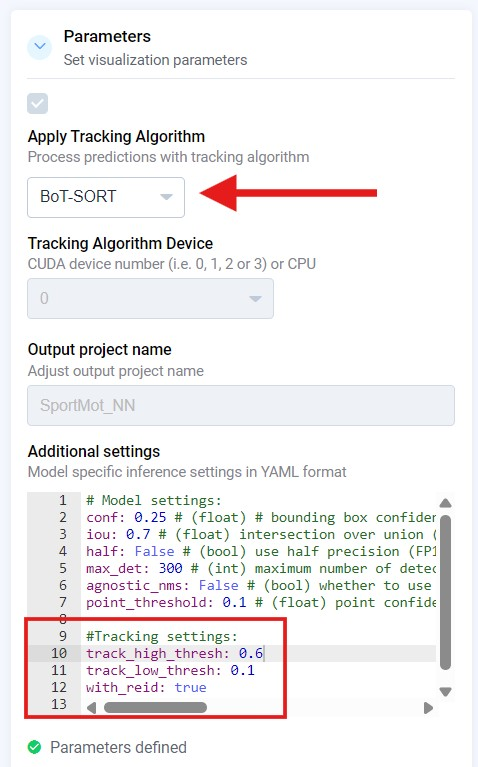

# BotSort Tracker — Documentation

## Introduction

Tracking is a core computer vision task that lets us follow objects over time in a video. On Supervisely we provide a ready-to-use tracker that works with any detector available on the platform. Our BotSort tracker is integrated into the platform — this section explains the easy ways to apply the tracker to your data.

The algorithm works by the principle of **tracking by detection**:

1. First, a neural network detects objects on each frame.
2. Then the tracker “connects the dots” — it links the detected objects between frames and assigns them unique IDs.

This is especially useful in video analytics systems where it is important not only to detect objects, but also to understand how they move over time.

Tracking helps answer questions like: how each object moves, how many objects are present, and what happens to them during the video.

Tracking is useful for tasks such as counting people or vehicles, trajectory analysis, and behavior monitoring.

### Why we chose BotSort and its advantages

**BotSort** is a modern tracker that we use as a base.

We chose BotSort because it provides an excellent balance between speed and accuracy. In MOT17-style benchmarks BotSort achieves strong tracking metrics while keeping high throughput. 

| Tracker            |  MOTA↑ |  IDF1↑ |  HOTA↑ |
| ------------------ | -----: | -----: | -----: |
| BoT-SORT           |   80.6 |   79.5 |   64.6 |
| ByteTrack          |   80.3 |   77.3 |   63.1 |
| StrongSORT         |   79.6 |   79.5 |   64.4 |
| OCSORT             |   78.0 |   77.5 |   63.2 |
| MAATrack           |   79.4 |   75.9 |   62.0 |


Its main advantage is speed — e.g. \~38.4 FPS — which makes it suitable for real-time use while preserving good tracking quality. This combination of accuracy and performance makes BotSort an ideal choice for Supervisely, where both metrics and throughput matter.

#### Our enhancement: ReID with OSNet

In our implementation we integrated an improved ReID mechanism based on  the [OSNet x1\_0 architecture](https://arxiv.org/pdf/1905.00953) instead of the FastReID variant. This change lets the tracker use visual features of objects in addition to bounding box coordinates, which significantly improves tracking stability in challenging scenes.

OSNet gives better re-identification of objects after temporary occlusions or when objects cross each other. That makes the tracker more reliable in real-world scenarios where objects can be partially hidden or leave and re-enter the frame.

OSNet weights are available in the: *[model zoo](https://kaiyangzhou.github.io/deep-person-reid/MODEL_ZOO)*.

---

## Ways to use the tracker

Users have three main ways to use our tracker, depending on their goals and needs. Each method has its own advantages and suits different scenarios:

1. [**Apply NN to Video**](https://ecosystem.supervisely.com/apps/apply-nn-to-videos-project) — the most convenient path via Supervisely's visual interface.
2. [**Via Prediction API**](https://docs.supervisely.com/neural-networks/overview-1/prediction-api) — programmatic access through the Prediction API: you send requests and receive predictions while tracking runs on the server.
3. **Run Tracker Locally (SDK)** — use the tracker inside your own code or application with the Supervisely SDK on your machine, without sending requests to the server.

---

## Apply NN to Video

Apply NN to Video (through the interface) is the easiest option for users.

1. [Deploy a model](https://docs.supervisely.com/neural-networks/overview-1/supervisely-serving-apps#how-to-deploy-a-model)  for Object Detection or Instance Segmentation.
2. Open the **Apply NN** app and wait until it is ready.
3. Select a video, choose a model, and select classes to run inference on.
4. Choose the algorithm **BoT-SORT** and select the device (CPU or GPU).
6. In advanced settings you can pass hyperparameters (see [Hyperparameter Configuration](#hyperparameter-configuration)).

<figure><figcaption>Tracking settings</figcaption></figure>


Example parameters:

```yaml
device: 'cuda'
track_high_thresh: 0.6
track_low_thresh: 0.1
new_track_thresh: 0.7
match_thresh: 0.8
with_reid: true
appearance_thresh: 0.25
min_box_area: 10
track_buffer: 30
```


## Tracking via Prediction API

> [Prediction API documentation](https://docs.supervisely.com/neural-networks/overview-1/prediction-api)

This option is intended for developers who want to control tracking via the API. In this workflow you do not run the tracking code locally — you call the Prediction API and receive predictions from the server.

Steps:

1. Deploy a model.
2. Call Prediction API for a video.
3. To enable tracking, add `tracking=True` in the request.
4. Pass tracker settings via `tracking_config`.

Example:

```python
import supervisely as sly

# API connection
api = sly.Api()
model = api.nn.connect(task_id=YOUR_TASK_ID)

# Video tracking
predictions = model.predict(
    video_id=42,
    start_frame=0,
    num_frames=100,
    tracking=True,
    tracking_config={
        "tracker": "botsort",
        "device": "cuda",
        "track_high_thresh": 0.6,
        "track_low_thresh": 0.1,
        "new_track_thresh": 0.7,
        "match_thresh": 0.8,
        "with_reid": True,
        "appearance_thresh": 0.25,
        "proximity_thresh": 0.5
    }
)

# Processing results
for pred in predictions:
    frame_index = pred.frame_index
    annotation = pred.annotation
    track_ids = pred.track_ids
    print(f"Frame {frame_index}: {len(track_ids)} tracks")
```

### Visualizing Prediction API results

If you want to visualize the results after receiving a Prediction, use the `visualize` funtction to draw predictions on the input video and save the result.

```python
from supervisely.nn.tracker.visualize import visualize

video_path = "path_to_your_video.avi"
output_path = "path_to_save_result_api.avi"

visualize(predictions, video_path, output_path, show_classes=False)
```

## Run Tracker Locally (SDK)

This approach allows you to use the tracker inside your own code or application using the Supervisely SDK on the same machine/hardware, without sending requests to the server.

You can apply the tracker directly to annotations that you obtain from a detector.

Input parameters `frames` and `annotations`:

* `frames` — a list of numpy arrays representing video frames.
* `annotations` — a list of `sly.Annotation`, where each element is the annotation for the corresponding frame. See the Supervisely docs for the `Annotation` object. The output is a `VideoAnnotation` object.

There are two ways to use the tracker with SDK:

* **Method 1: `update()`** — processes frame by frame and is convenient for online/streaming usage.
* **Method 2: `track()`** — processes the whole sequence or chunks and returns a `VideoAnnotation` in one call.



```python
from supervisely.nn.tracker import BotSortTracker
import supervisely as sly

# Data preparation (assuming you have frames and annotations)
frames = [...]  # list of numpy arrays
annotations = [...]  # list of sly.Annotation

# Tracker initialization
tracker = BotSortTracker(settings={
    "track_high_thresh": 0.6,
    "track_low_thresh": 0.1,
    "new_track_thresh": 0.7,
    "with_reid": True
})

tracker.reset() # reset the tracker, if necessary

for frame, annotation in zip(frames, annotations):
    matches = tracker.update(frame, annotation)
    
    # matches contains detection -> track correspondences
    for match in matches:
        track_id = match["track_id"]
        label = match["label"]
        print(f"Object {label.obj_class.name} assigned track ID: {track_id}")

# After applying .update() method, tracker accumulates video annotations
video_annotation = tracker.video_annotation
```


```python
from supervisely.nn.tracker import BotSortTracker
import supervisely as sly

# Data preparation (assuming you have frames and annotations)
frames = [...]  # list of numpy arrays
annotations = [...]  # list of sly.Annotation

# Tracker initialization
tracker = BotSortTracker(settings={
    "track_high_thresh": 0.6,
    "track_low_thresh": 0.1,
    "new_track_thresh": 0.7,
    "with_reid": True
})

video_annotation = tracker.track(frames, annotations)
```




### Visualizing SDK / VideoAnnotation results

If you want to visualize the results after receiving a Video annotation, use the same `visualize` function to render the `VideoAnnotation` into a result video.

```python
from supervisely.nn.tracker.visualize import visualize

visualize(video_annotation, video_path, output_path, show_trajectories=False)
```
The visualization video will be saved in the output_path.

### Matches structure

`matches` is a list of dictionaries where each dictionary contains the correspondence between a `track_id` and a `sly.Label` (part of the `annotations` structure that contains information about a single detected object: bbox, class, score).

Example structure:

```python
# Example contents of matches
matches = [
    {
        "track_id": 1,
        "label": sly.Label(...)  
    },
    {
        "track_id": 2,
        "label": sly.Label(...)
    }
]
```

Difference between methods:

* `update()` — step-by-step processing, good for streaming and fine control.
* `track()` — one-shot processing, convenient for batch processing.

Both methods create a `VideoAnnotation` object where each object is assigned a `track_id`.

---

## Visualization overview


You can visualize the tracker’s results with the `visualize` function. It accepts either predictions (from the Prediction API) or `VideoAnnotation` (from the tracker), the path to your input video, and the path to save the output video.

Additional options:

* `show_labels`: Display object labels.
* `show_classes`: Display object classes.
* `show_trajectories`: Draw object trajectories.
* `box_thickness`: Thickness of bounding boxes.
* `auto_color`: Use default color palette.

Details for `auto_color`:

If `auto_color=True`, ignore annotation colors and use the default color palette. If `auto_color=False`, the visualizer tries to use colors from annotations when possible.

---

## Metrics Evaluation

Input for metrics evaluation: the function accepts two `sly.VideoAnnotation` objects — predicted annotations (`video_ann_pred`) and ground truth annotations (`video_ann_true`).

If you have ground truth data in the form of video annotations, you can evaluate the tracker’s performance using the `evaluate` function.

First, install the required libraries:

```bash
pip install motmetrics
pip install git+https://github.com/JonathonLuiten/TrackEval.git
```

Simply pass predicted annotations and ground truth annotations:

```python
from supervisely.nn.tracker.calculate_metrics import evaluate

metrics = evaluate(video_ann_pred, video_ann_true)
```
`metrics` will contain json in the following format:

```json
{
    "precision": 0.8413143658585454,
    "recall": 0.6863354037267081,
    "f1": 0.755963633090287,
    "avg_iou": 0.9612887407707322,
    "true_positives": 4199,
    "false_positives": 792,
    "false_negatives": 1919,
    "total_gt_objects": 6118,
    "total_pred_objects": 4991,
    "mota": 0.5562275253350768,
    "motp": 0.05367845372475279,
    "idf1": 0.4922135205689081,
    "id_switches": 8,
    "fragmentations": 3,
    "num_misses": 1917,
    "num_false_positives": 790,
    "iou_threshold": 0.5
}
```

The output includes several groups of metrics:

### Basic Detection Metrics

* **Precision** — ratio of correct detections among all detections.
* **Recall** — ratio of detected objects among all ground truth objects.
* **F1** — harmonic mean of precision and recall.
* **Average IoU** — average overlap between predicted and true bounding boxes.

### MOT (Multiple Object Tracking) Metrics

* **MOTA** (Multi-Object Tracking Accuracy) — overall accuracy, combining misses, false positives, and ID switches.
* **MOTP** (Multi-Object Tracking Precision) — how precisely the tracker matches predicted and true positions.
* **IDF1** — measures how well object identities are preserved across frames.
* **ID Switches** — number of times the tracker assigned the wrong ID to the same object.
* **Fragmentations** — how often a trajectory is broken into parts.
* **Misses / False Positives** — counts of missed objects and false alarms.

### Count Metrics

* **True Positives / False Positives / False Negatives** — raw counts of detection outcomes.
* **Total GT Objects / Predicted Objects** — number of objects in ground truth and predictions.

These metrics give both a high-level and detailed view of how well the tracker performs.

---

## Hyperparameter Configuration

### Core Tracking Parameters

| Parameter           | Default | Description                                                                                                            |
| ------------------- | ------- | ---------------------------------------------------------------------------------------------------------------------- |
| `track_high_thresh` | 0.6     | High confidence threshold for detections. Detections with confidence above this value are used for primary association |
| `track_low_thresh`  | 0.1     | Low confidence threshold. Detections between low and high thresh are used for secondary association                    |
| `new_track_thresh`  | 0.7     | Threshold for creating new tracks. Detections with confidence above this threshold can become new tracks               |
| `match_thresh`      | 0.8     | IoU threshold for matching detections and tracks. Higher values mean stricter matching conditions                      |
| `track_buffer`      | 30      | Number of frames a lost track remains in memory                                                                        |
| `min_box_area`      | 10.0    | Minimum bounding box area for tracking                                                                                 |

### ReID (Appearance) Parameters

| Parameter           | Default | Description                                                              |
| ------------------- | ------- | ------------------------------------------------------------------------ |
| `with_reid`         | true    | Enable/disable ReID mechanism for enhanced association                   |
| `appearance_thresh` | 0.25    | Threshold for appearance similarity. Lower values mean stricter matching |
| `proximity_thresh`  | 0.5     | Proximity threshold for ReID features                                    |

### Algorithm Configuration

| Parameter    | Default | Description                                      |
| ------------ | ------- | ------------------------------------------------ |
| `fuse_score` | false   | Whether to fuse detection and ReID scores        |
| `ablation`   | false   | Enable ablation study mode for research purposes |

### Camera Motion Compensation

| Parameter    | Default         | Description                                                                       |
| ------------ | --------------- | --------------------------------------------------------------------------------- |
| `cmc_method` | "sparseOptFlow" | Camera motion compensation method. Options: "orb", "sift", "ecc", "sparseOptFlow" |

### Performance & Hardware

| Parameter | Default | Description                                                           |
| --------- | ------- | --------------------------------------------------------------------- |
| `device`  | "auto"  | Computing device ("cuda", "cpu", "auto"). Auto uses CUDA if available |
| `fp16`    | false   | Enable half-precision (FP16) computation for faster inference         |
| `fps`     | 30      | Video FPS for correct track\_buffer calculation                       |

---
