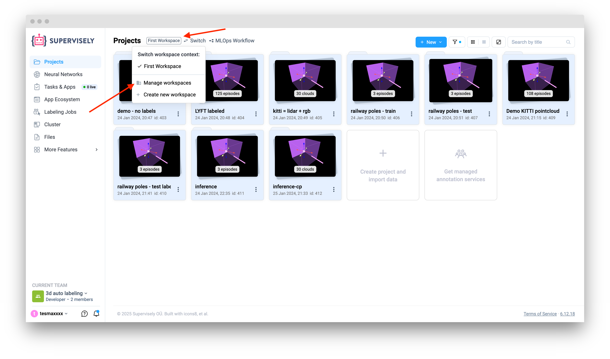
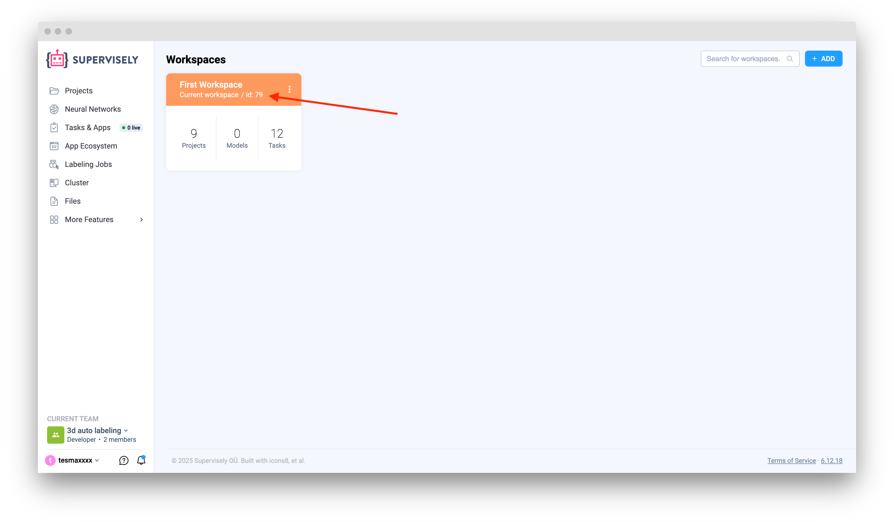
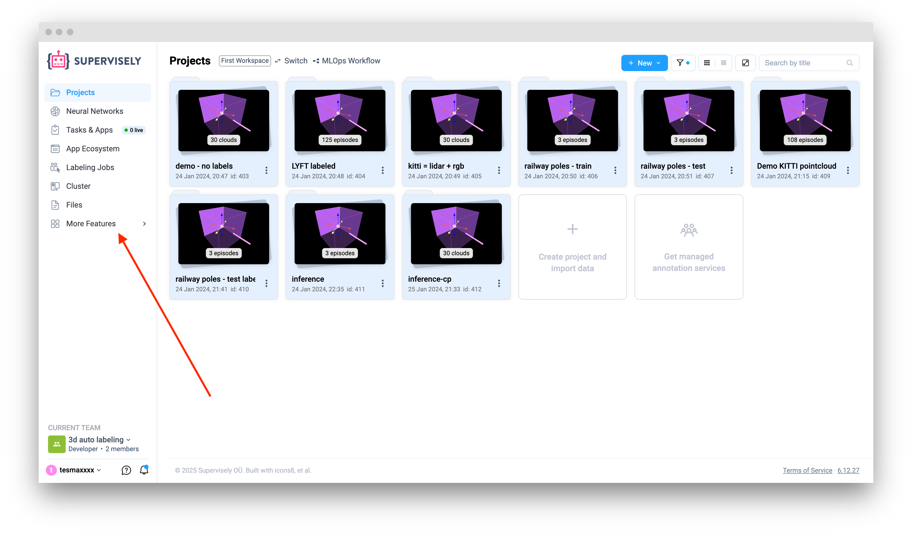
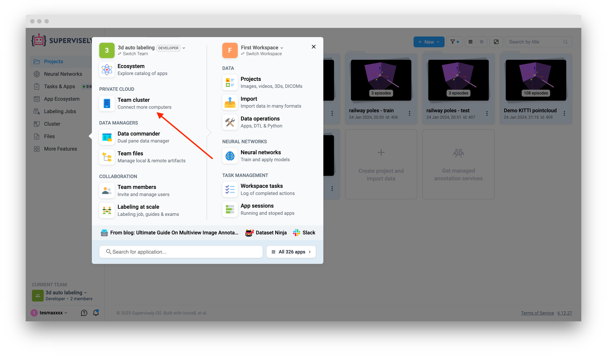
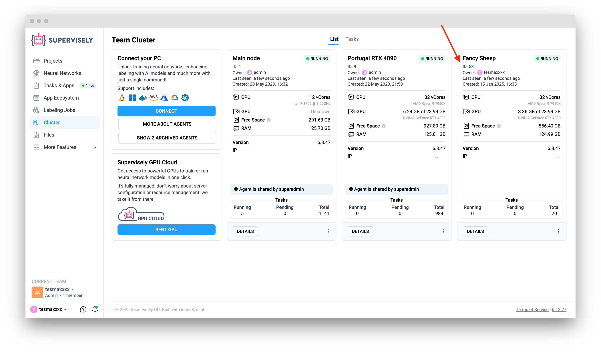

# Visual Question Answering

## Introduction

Visual Question Answering (VQA) is a multidisciplinary task at the intersection of computer vision and natural language processing. VQA system receives an image and a text prompt as inputs and outputs a natural language answer.

Visual question answering has numerous applications:

- Assistive technology for visually impaired users
- Automatic scene description and captioning enhancement
- Interactive robots and autonomous systems
- Medical imaging Q&A
- Educational tools and image-based search

## Visual Language Models

VQA requires model to have several capabilities:

- Object detection - localizing objects on images and classifying them
- Attribute classification - colors, materials, expressions, etc.
- Counting - input questions often require to estimate number of objects on image
- Spatial reasoning	- understanding spatial relationships between objects
- Common sense / world knowledge - understanding of everyday situations, like how the world works and common relationships between objects and events
- Optical character recognition - detecting and reading text in images

Models which are capable of solving VQA tasks are called visual language models (VLMs). Vision-Language Model (VLM) is a machine learning model designed to jointly understand visual data (images or video) and natural language. Unlike standard vision or NLP models that handle a single modality, VLMs learn from paired image–text data and can perform multimodal reasoning.

Supervisely Ecosystem provides several modern VLMs which can be integrated into any data processing pipeline with the help of Supervisely API:

- **Molmo** - a family of vision-language models trained from scratch using newly collected datasets (called PixMo) instead of relying on synthetic data distilled from proprietary models. The architecture pairs a pre-trained vision encoder with a large language model, connected via a vision-language adapter, and uses a multi-stage training pipeline (dense captioning pre-training followed by fine-tuning on QA, pointing and grounding tasks).
- **Florence 2** - a vision foundation model which uses a sequence-to-sequence architecture: an image encoder together with a multimodal encoder-decoder setup that takes an image + a text prompt ("task instruction") and produces a textual output (which may include coordinates, masks, descriptions).
- **Kosmos 2** - a multimodel large language model which follows the common "vision-encoder + language model" paradigm, but introduces a grounding-aware multimodal interface that allows the model to process images, text, and region-level grounding information jointly. Main novelty is grounding representation - in the training dataset referring expressions are represented in markdown-style links (e.g. "the brown dog"(x1,y1,x2,y2)), bounding box coordinates are embedded as a sequence of special grounding tokens. This allows the transformer to condition text generation on specific image regions, enabling phrase grounding, referring expression comprehension and grounded captioning.

## How to use VLMs for visual question answering in Supervisely

Supervisely Python SDK provides convenient api for VLM deployment and interaction.

### Deploy pretrained VLM

In order to deploy pretrained VLM via api, you will need to define 2 variables: `WORKSPACE ID` and `AGENT ID` (if you don't have supervisely agent, you can learn how to install it [here](https://docs.supervisely.com/agents/connect-your-computer)).

`WORKSPACE ID` can be obtained from Projects page on the platform:

<figure><figcaption></figcaption></figure>

<figure><figcaption></figcaption></figure>


`AGENT ID` can be obtained from Team Cluster page on the platform:

<figure><figcaption></figcaption></figure>

<figure><figcaption></figcaption></figure>

<figure><figcaption></figcaption></figure> 

When workspace and agent IDs are defined, you can initialize supervisely API and deploy VLM using `api.nn.deploy` method:



```python
import supervisely as sly


# define workspace and agent IDs
workspace_id = your_workspace_id
agent_id = your_agent_id

# initialize Supervisely API
api = sly.Api()

# deploy VLM
model = api.nn.deploy(
    model="Molmo/Molmo", # model identifier in the format "framework/model_name"
    workspace_id=workspace_id,
    agent_id=agent_id,
)
```


```python
import supervisely as sly


# define workspace and agent IDs
workspace_id = your_workspace_id
agent_id = your_agent_id

# initialize Supervisely API
api = sly.Api()

# deploy VLM
model = api.nn.deploy(
    model="Kosmos-2/Kosmos-2", # model identifier in the format "framework/model_name"
    workspace_id=workspace_id,
    agent_id=agent_id,
)
```


```python
import supervisely as sly


# define workspace and agent IDs
workspace_id = your_workspace_id
agent_id = your_agent_id

# initialize Supervisely API
api = sly.Api()

# deploy VLM
model = api.nn.deploy(
    model="Florence-2/Florence-2-base", # model identifier in the format "framework/model_name"
    workspace_id=workspace_id,
    agent_id=agent_id,
)
```



### Get prompt instructions specific for deployed VLM

After model is deployed, you can extract task ID and use it to send inference requests:

```python
task_id = model.task_id
```

Each VLM has its own prompt specificity. In order to get prompt istructions for deployed VLM model, you can run the following code:

```python
response = api.task.send_request(
    task_id,
    "get_prompt_instructions",
    data={},
)
print(response["instructions"])
```

### Run VLM inference via API

After VLM is deployed and prompt instructions are clear, you can prepare image and text prompts and run inference. You can use both ID of the image from your dataset on the Supervisely platform or use image located locally on your machine (in case your data is not uploaded to the platform):



```python
image_id = your_image_id

response = api.task.send_request(
    task_id,
    "visual_question_answering",
    {
        "image_id": image_id,
        "text_prompt": "Describe this image.",
    },
)
print(response["answer"])
```


```python
import base64

local_image_path = your_image_path

with open(local_image_path, "rb") as img:
    b64 = base64.b64encode(img.read()).decode()

response = api.task.send_request(
    task_id,
    "visual_question_answering",
    data={"image_encoding": b64, "text_prompt": "Describe this image."},
)
print(response["answer"])
```



### Examples

Image question answering using Molmo:

Input image:

<figure><figcaption></figcaption></figure>

Code:

```python
response = api.task.send_request(
    task_id,
    "visual_question_answering",
    {"image_id": your_image_id, "text_prompt": "What time is it in New York?"},
)
print(response["answer"])
```

Answer:

`The clock in the image shows 1:52 for New York. This time is displayed on the leftmost clock, which represents New York. The other two clocks in the image show different times for London and Tokyo, but the question specifically asks about New York, so I'm focusing on that clock`.

Image captioning using Florence 2:

Input image:

<figure><figcaption></figcaption></figure>

Code:

```python
response = api.task.send_request(
    task_id,
    "visual_question_answering",
    {"image_id": your_image_id, "text_prompt": "<DETAILED_CAPTION>"},
)
print(response["answer"])
```

Answer:

`The image shows a red car parked on the side of a street next to a building. There is a person sitting in the car, and a bicycle parked nearby. The street is lined with plants with flowers, and there are steps with railings leading up to the building`.

Object counting using Kosmos 2:

Input image:

<figure><figcaption></figcaption></figure>

Code:

```python
response = api.task.send_request(
    task_id,
    "visual_question_answering",
    {"image_id": your_image_id, "text_prompt": "Question: How many people are there in this picture? Answer:"},
)
print(response["answer"])
```

Answer:

`Question: How many people are there in this picture? Answer: There are three women in the picture`.