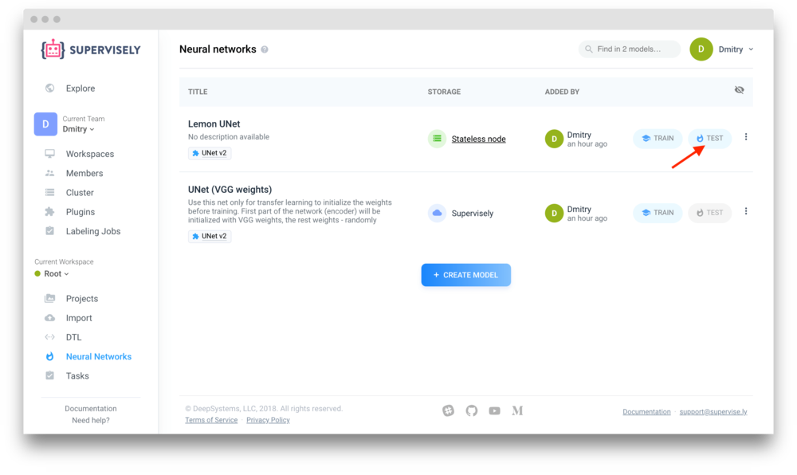
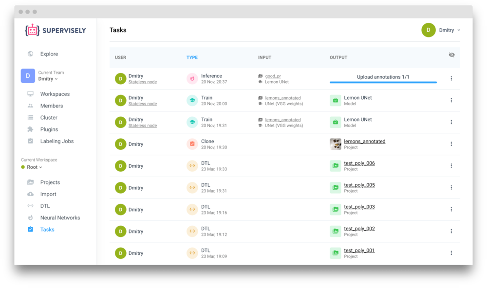

Inference of a neural network inside Supervisely is as easy as a few mouse clicks. Here you can find all necessary information regarding how to start an inference task. 


The procedure described below is applicable for all Neural Networks inside Supervisely. The difference will only be in the json configurations used for inference. Such configurations are similar for most of the models but may differ for some of them.  


You start inference from an existing neural network. Please refer to this [page](../my-models/my-models.md) to learn how you can add a model to your workspace.

Open the "Neural Networks" page and start inference by clicking the "Inference" button in the models list.

The "Run Plugin" page will load and necessary fields will be automatically set.

## Step 1: Inference Settings

Configure the following fields:

1. Agent: choose an agent from the Cluster page on which the model will be applied. 

2. Input project: choose a project from the current workspace to apply the model on

3. Result title: enter the name for the resulting Project. You can change it later. You will see it in the list of your Projects after inference. If a project with the same name already exists a random suffix will be added automatically.

4. Configuration: the plugin associated with the source model may provide pre-configured options. Inference configs for all models are almost the same but may have some differences. Read "Configurations" chapter to learn mode. Inference configuration is a set of JSON-based settings that are passed directly to the model. Depending on the model, you can choose desirable classes, GPU device to use and other options. 

Click "Run" to start inference.

## Step 2: Monitoring the progress

New task will be started and "Tasks" will open.

You can select "Logs" in the model context menu ("three dots" icon) to monitor the task output or to stop inference.

## Step 3: The task is finished

A project with the model predictions will appear on the Projects page.
