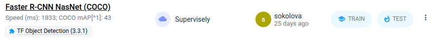
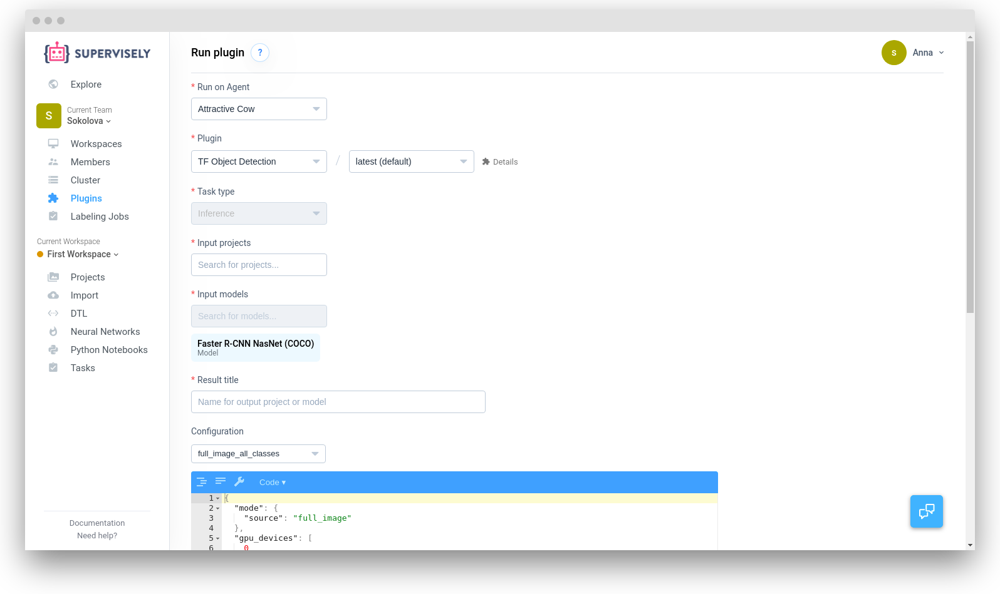
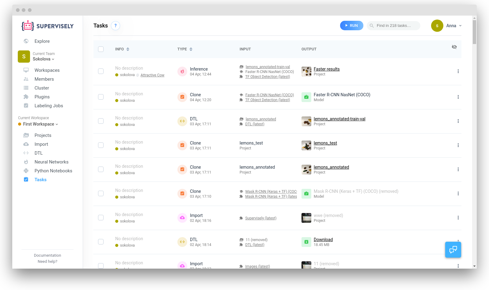

# Object detection with pre-trained Faster-RCNN

In this example we will consider using the trained Faster-RCNN model to detect objects.

To run inference you'll need to have a connected [agent](../../customization/agents/overview.md) to use its computational resources.

## Step 1: Get the model

Add the pre-trained model from the[ Models list in the Explore section ](../model-zoo/model-zoo.md) if you haven't yet. Open "Explore" -> "Models", find the "Faster-RCNN" preset, click the "Add model" button and it will appear on the [Neural Networks](../my-models/my-models.md) page.

The model is pretrained on MS COCO dataset.

## Step 2. Select the model

Find the model in the [Neural Networks](../my-models/my-models.md) table and click the "Test" button.



## Step 3: Inference settings




There are reasonable default values for every option, so one may start inference with empty `{}` settings.


Select the provided config (named like `faster_rcnn_full_image_all_classes`) from the drop-down list with saved inference configs.

Here are the simple settings:

```json
{
  "model": {
    "gpu_device": 0,
    "confidence_tag_name": "confidence"
  },
  "mode": {
    "name": "full_image",
    "model_classes": {
      "save_classes": "__all__",
      "add_suffix": "_bbox"
    }
  }
}
```

Set device index in `gpu_device` if you have multi-GPU node and some GPUs are busy. Please note that right now we support inference with only single GPU.

In the field "Model config" below you can see list of classes on which the model has been trained.

## Step 4: Run task

Now click the "Run" button.

The task list will be opened with the new inference task.

When the task will be <span style="color:green">Done link to result project will appear.



Enjoy the results.


