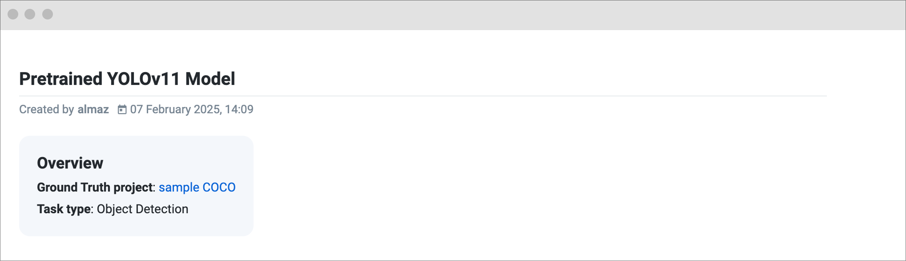
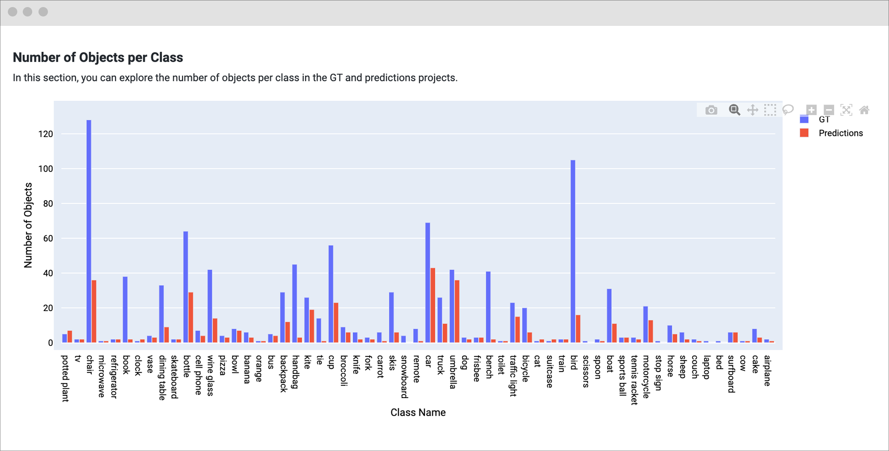

# Custom Benchmark Implementation

In the world of machine learning, evaluation is a crucial step in the model development process. It helps to understand how well the model performs on unseen data and provides insights into its strengths and weaknesses. **Supervisely provides a set of built-in evaluation metrics for various task types**, such as object detection, instance segmentation, and semantic segmentation. However, in some cases, you may need to define custom metrics that are specific to your use case.

✨ In this guide, we will show you how to integrate a custom evaluation benchmark using Supervisely SDK with metrics for your specific needs. We will use the object detection task type as an example and show you how to add your own specific business metrics. The result will be a comprehensive report with charts and tables.

<figure><figcaption></figcaption></figure>

## Overview

We will consider 2 scenarios:

1. **Custom Benchmark using GT and Prediction Projects**: Implementing an evaluation using two projects (Ground Truth and Prediction) without running inference every time. We will show you how to run the evaluation and visualize the results. In this scenario, you can modify both the visualizer and evaluator classes or use the default implementation.

2. **Custom Benchmark using GT Project and Deployed Model**: Using the deployed model session to automatically run inference and evaluation on images from the GT project with the same classes (or a subset of them). We will describe key points of the full benchmark flow and show you how to integrate the process with a GUI interface.

## Scenario 1: Custom Benchmark using GT and Prediction Projects

In this scenario, we will show you how to implement a custom benchmark using two projects: Ground Truth (GT) and Predictions. We will calculate custom metrics and generate simple visualizations for the evaluation report.


Before you start, make sure you have Ground Truth and Predictions projects with the same structure of datasets and images. The projects should contain the same classes.


Here is a brief overview of the relationships between the classes and files we will create:

<figure><figcaption></figcaption></figure>

---

Just to give you a quick overview, here is the structure of the files we will create:

```plaintext
.
├── src/
│   ├── __init__.py
│   ├── benchmark.py            # 15 lines of code
│   ├── evaluator.py            # 47 lines of code
│   ├── eval_result.py          # 38 lines of code
│   ├── visualizer.py           # 64 lines of code
│   ├── widgets/
│   │   ├── __init__.py
│   │   ├── intro.py            # 37 lines of code
│   │   ├── key_metrics.py      # 34 lines of code
│   │   └── custom_metric.py    # 26 lines of code
│   └── main.py                 # 20 lines of code
└── local.env                   # 1 line of code
```


You can find the full code for this scenario in the [GitHub repository]()


### Step 1.1: Implement Custom Evaluator

Create a custom evaluator class that inherits from `BaseEvaluator` and overrides the `evaluate` method. This method should calculate evaluation metrics and save them to disk.

```python
# src/evaluator.py
from pathlib import Path

import supervisely as sly
from src.eval_result import MyEvalResult
from supervisely.nn.benchmark.base_evaluator import BaseEvaluator


class MyEvaluator(BaseEvaluator):
    eval_result_cls = MyEvalResult
    # EVALUATION_PARAMS_YAML_PATH = "path/to/evaluation_params.yaml"  # Optional

    def evaluate(self):
        # This method should CALCULATE evaluation metrics and DUMP them to disk.

        # Available attributes:
        # self.gt_project_path: str                 # Path to the local GT project
        # self.pred_project_path: str               # Path to the local Predictions project
        # self.evaluation_params: Dict[str, Any]    # Optional: Evaluation parameters
        # self.result_dir: str                      # Optional: Directory to save evaluation results
        # self.classes_whitelist: List[str]         # Optional: List of classes to evaluate
        # self.pbar: tqdm                           # Optional: Progress bar

        # ---------------- ⬇︎ Placeholder for your custom code ⬇︎ ---------------- #
        # Example:

        # read Supervisely projects (GT and predictions)
        gt_project = sly.Project(self.gt_project_path, sly.OpenMode.READ)
        pred_project = sly.Project(self.pred_project_path, sly.OpenMode.READ)

        # just for demonstration purposes:
        # calculate difference between the number of labels in GT and predictions
        custom_metric = {}
        for ds_1 in gt_project.datasets:
            ds_2 = pred_project.datasets.get(ds_1.name)
            ds_1: sly.Dataset
            for name in ds_1.get_items_names():
                ann_1 = ds_1.get_ann(name, gt_project.meta)
                ann_2 = ds_2.get_ann(name, pred_project.meta)

                custom_metric[name] = len(ann_2.labels) - len(ann_1.labels)

        self.eval_data = {"custom_metric": custom_metric}
        # -------------------------------------------------------------------------#

        # IMPORTANT: save the eval_data to disk
        save_path = Path(self.result_dir) / "eval_data.json"
        sly.json.dump_json_file(self.eval_data, save_path)
```

### Step 1.2: Implement Custom EvalResult

Create a custom `EvalResult` class that inherits from `BaseEvalResult`. This class will be used as a data interface to access the evaluation metrics in the visualizer.
All you need to do is implement the `_read_files` and `_prepare_data` methods.

```python
# src/eval_result.py
from pathlib import Path

import supervisely as sly
from supervisely.nn.benchmark.base_evaluator import BaseEvalResult


class MyEvalResult(BaseEvalResult):
    def _read_files(self, path: str) -> None:
        """This method should LOAD evaluation metrics from disk."""

        # ---------------- ⬇︎ Placeholder for your custom code ⬇︎ ---------------- #
        save_path = Path(path) / "eval_data.json"  # path to the saved evaluation metrics
        self.eval_data = sly.json.load_json_file(str(save_path))
        # -------------------------------------------------------------------------#

    def _prepare_data(self) -> None:
        """This method should PREPARE data to allow easy access to the data."""

        # ---------------- ⬇︎ Placeholder for your custom code ⬇︎ ---------------- #
        self.custom_metric = self.eval_data.get("custom_metric", {})
        self.abs_custom_metric = {k: abs(v) for k, v in self.custom_metric.items()}
        self.mean_custom_metric = round(
            sum(self.abs_custom_metric.values()) / len(self.abs_custom_metric), 2
        )
        self.max_custom_metric = max(self.abs_custom_metric.values())
        self.min_custom_metric = min(self.abs_custom_metric.values())
        self._key_metrics = {
            "mean_custom_metric": self.mean_custom_metric,
            "max_custom_metric": self.max_custom_metric,
            "min_custom_metric": self.min_custom_metric,
            "num_items": len(self.abs_custom_metric),
        }
        # -------------------------------------------------------------------------#

    @property
    def key_metrics(self):
        """You can create any properties or methods to access the data easily."""
        return self._key_metrics.copy()
```

### Step 1.3: Implement Custom Visualizer

This step involves creating a custom `Visualizer` class that inherits from `BaseVisualizer`. The class should generate visualizations and save them to disk.

But first, let's create a few widgets that we will use in the visualizer.
Let's start with the `Intro`, `KeyMetrics`, and `CustomMetric` widgets. To make the code more readable, we will split the widget classes into separate files.

Feel free to change the widget content and appearance to suit your needs. The example below with Markdown widgets is just a starting point.

```python
# src/widgets/intro.py
from datetime import datetime

from supervisely.nn.benchmark.object_detection.base_vis_metric import DetectionVisMetric
from supervisely.nn.benchmark.visualization.widgets import MarkdownWidget


class Intro(DetectionVisMetric):

    def get_header(self, user_login: str) -> MarkdownWidget:
        current_date = datetime.now().strftime("%d %B %Y, %H:%M")

        header_text = (
            "<h1>Pretrained YOLOv11 Model</h1>"
            "<div class='model-info-block'>"
            f"   <div>Created by <b>{user_login}</b></div>"
            f"   <div><i class='zmdi zmdi-calendar-alt'></i><span>{current_date}</span></div>"
            "</div>"
        )
        header = MarkdownWidget("markdown_header", "Header", text=header_text)
        return header

    @property
    def md(self) -> MarkdownWidget:
        gt_id = self.eval_result.gt_project_info.id
        gt_name = self.eval_result.gt_project_info.name
        project_link = f"<a href='/projects/{gt_id}/datasets' target='_blank'>{gt_name}</a>"
        text = (
            f"## Overview \n"
            f"- **Ground Truth project**: {project_link}\n"
            f"- **Task type**: Object Detection\n"
            "- **Key features**: Mean Custom Metric, Max Custom Metric, Min Custom Metric."
        )

        md = MarkdownWidget(name="intro", title="Intro", text=text)
        md.is_info_block = True  # add a special style to the widget
        md.width_fit_content = True  # add a special style to the widget
        return md
```

Take a look at the `Intro` widget:

<figure><figcaption></figcaption></figure>

Let's create the `KeyMetrics` section:

```python
# src/widgets/key_metrics.py
from supervisely.nn.benchmark.object_detection.base_vis_metric import DetectionVisMetric
from supervisely.nn.benchmark.visualization.widgets import MarkdownWidget, TableWidget


class KeyMetrics(DetectionVisMetric):
    @property
    def md(self) -> MarkdownWidget:
        text = (
            "## Key Metrics\n"
            "In this section, you can explore in table key metrics, such as:\n\n"
            "> **Note:** Markdown syntax is supported."
        )
        return MarkdownWidget(name="key_metrics", title="Key Metrics", text=text)

    @property
    def table(self) -> TableWidget:
        columns = ["Metric", "Value"]
        columns_options = [{"disableSort": True}, {"disableSort": True}]
        content = []
        for metric, value in self.eval_result.key_metrics.items():
            content.append({"row": [metric, value], "id": metric, "items": [metric, value]})

        data = {
            "columns": columns,
            "content": content,
            "columnsOptions": columns_options,
        }
        return TableWidget(
            name="key_metrics",
            data=data,
            fix_columns=1,
            show_header_controls=False,
            main_column=columns[0],
        )
```

Here is the `KeyMetrics` widget in action:

<figure><figcaption></figcaption></figure>

Let's create the `CustomMetric` section:

```python
# src/widgets/custom_metric.py
from supervisely.nn.benchmark.object_detection.base_vis_metric import DetectionVisMetric
from supervisely.nn.benchmark.visualization.widgets import ChartWidget, MarkdownWidget


class CustomMetric(DetectionVisMetric):

    @property
    def md(self) -> MarkdownWidget:
        text = "## Custom Metric\n In this section, you can explore a custom metric in a chart."
        return MarkdownWidget(name="custom_metric", title="Custom Metric", text=text)

    @property
    def chart(self) -> ChartWidget:
        import plotly.express as px

        y = list(self.eval_result.custom_metric.values())
        x = list(self.eval_result.custom_metric.keys())

        fig = px.bar(x=x, y=y, labels={"x": "Items", "y": "Values"})
        fig.update_traces(marker_color=["red" if val < 0 else "green" for val in y])
        fig.update_xaxes(showticklabels=False)
        return ChartWidget(name="custom_metric", figure=fig)
```

The `CustomMetric` widget will look like this:

<figure><figcaption></figcaption></figure>

Finally, let's implement the custom visualizer class that will use these widgets.
All you need to do is to implement the `_create_widgets` and `_create_layout` methods.

```python
# src/visualizer.py
from src.widgets import CustomMetric, Intro, KeyMetrics
from supervisely.nn.benchmark.base_visualizer import BaseVisualizer
from supervisely.nn.benchmark.visualization.widgets import (
    ContainerWidget,
    SidebarWidget,
)
from supervisely.nn.task_type import TaskType


class MyVisualizer(BaseVisualizer):

    @property
    def cv_task(self):
        return TaskType.OBJECT_DETECTION

    def _create_widgets(self):
        """In this method, we initialize and configure all the widgets that we will use"""

        vis_text = "N/A"  # not used in this example

        # ---------------- ⬇︎ Placeholder for your widgets ⬇︎ ------------------- #
        # Intro (Markdown)
        me = self.api.user.get_my_info()
        intro = Intro(vis_text, self.eval_result)
        self.intro_header = intro.get_header(me.login)
        self.intro_md = intro.md

        # Key Metrics (Markdown + Table)
        key_metrics = KeyMetrics(vis_text, self.eval_result)
        self.key_metrics_md = key_metrics.md
        self.key_metrics_table = key_metrics.table

        # Custom Metric (Markdown + Chart)
        custom_metric = CustomMetric(vis_text, self.eval_result)
        self.custom_metric_md = custom_metric.md
        self.custom_metric_chart = custom_metric.chart
        # ------------------------------------------------------------------------ #

    def _create_layout(self):
        """
        In this method, we create the layout of the visualizer.
        We define the order of the widgets in the report and their visibility in the sidebar.
        """
        # Create widgets
        self._create_widgets()


        # ---------------- ⬇︎ Placeholder for your widgets ⬇︎ ------------------- #
        # In the code below, you should define the order of the widgets in the report and their visibility in the sidebar.
        # If 1 -
        is_anchors_widgets = [
            # Intro
            (0, self.intro_header),
            (1, self.intro_md),
            # Key Metrics
            (1, self.key_metrics_md),
            (0, self.key_metrics_table),
            # Custom Metric
            (1, self.custom_metric_md),
            (0, self.custom_metric_chart),
        ]
        # ------------------------------------------------------------------------ #

        anchors = []
        for is_anchor, widget in is_anchors_widgets:
            if is_anchor:
                anchors.append(widget.id)

        sidebar = SidebarWidget(widgets=[i[1] for i in is_anchors_widgets], anchors=anchors)
        layout = ContainerWidget(title="Custom Benchmark", widgets=[sidebar])
        return layout
```

### Step 1.4: Implement Custom Benchmark Class

Now, let's create a custom benchmark class that inherits from `BaseBenchmark`. This class will orchestrate the evaluation process and generate the report.

```python
# src/benchmark.py
from src.evaluator import MyEvaluator
from src.visualizer import MyVisualizer
from supervisely.nn.benchmark.base_benchmark import BaseBenchmark
from supervisely.nn.benchmark.base_evaluator import BaseEvaluator
from supervisely.nn.task_type import TaskType


class CustomBenchmark(BaseBenchmark):
    visualizer_cls = MyVisualizer

    @property
    def cv_task(self) -> str:
        return TaskType.OBJECT_DETECTION

    def _get_evaluator_class(self) -> BaseEvaluator:
        return MyEvaluator
```

### Step 1.5: Run the Custom Benchmark

Before we run the custom benchmark, prepare the environment:

- variables in the `local.env` file:

```plaintext
TEAM_ID = 8         # ⬅︎ change the value
```

- credentials in the `supervisely.env` file:

```plaintext
SERVER_ADDRESS=     # ⬅︎ change the value
API_TOKEN=          # ⬅︎ change the value
```

Learn about the basics of authentication in Supervisely [here](https://developer.supervisely.com/getting-started/basics-of-authentication#basics-of-authentication).

Create a `main.py` script to run the custom benchmark:

```python
# src/main.py
import os

from dotenv import load_dotenv

import supervisely as sly
from src.benchmark import CustomBenchmark

if sly.is_development():
    load_dotenv(os.path.expanduser("~/supervisely.env"))
    load_dotenv("local.env")

api = sly.Api()

gt_project_id = 73
pred_project_id = 133

# 1. Initialize benchmark
bench = CustomBenchmark(api, gt_project_id)

# 2. Run evaluation
bench.evaluate(pred_project_id)

# 3. Generate templates with visualizations
bench.visualize()

# 4. Upload to Supervisely Team Files
# (it is required to open visualizations in the web interface)
remote_dir = f"/model-benchmark/custom_benchmark_{sly.rand_str(6)}"
bench.upload_eval_results(remote_dir + "/evaluation/")
bench.upload_visualizations(remote_dir + "/visualizations/")
```

Recap of the files structure:

```plaintext
.
├── src/
│   ├── __init__.py
│   ├── benchmark.py            # 15 lines of code
│   ├── evaluator.py            # 47 lines of code
│   ├── eval_result.py          # 38 lines of code
│   ├── visualizer.py           # 64 lines of code
│   ├── widgets/
│   │   ├── __init__.py
│   │   ├── intro.py            # 37 lines of code
│   │   ├── key_metrics.py      # 34 lines of code
│   │   └── custom_metric.py    # 26 lines of code
│   └── main.py                 # 20 lines of code
└── local.env                   # 1 line of code
```

Run the script:

<figure><figcaption></figcaption></figure>

After running the script, you will see the evaluation results in the Team Files.
Find the `evaluation` and `visualizations` folders with the generated report (`Model Evaluation Report.lnk` file).
Also, you can open the report in the web interface by clicking on the link in the logs.


## Scenario 2: Custom Benchmark using GT Project and Deployed Model

In this scenario, we will show you how to integrate your custom benchmark with a deployed model session. The benchmark will automatically run inference and evaluation on images from the GT project with the same classes.

Here is a brief overview of the relationships between the classes in this scenario. As you can see, we will use the same classes, but the input will be different:

<figure><figcaption></figcaption></figure>

---


