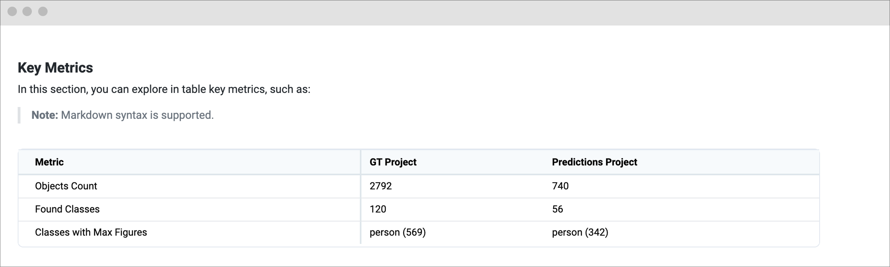

# Custom Benchmark Implementation

## Overview

In this guide, we will show you how to **integrate a custom benchmark evaluation** using Supervisely SDK. For most use cases, our [Evaluator for Model Benchmark](https://ecosystem.supervisely.com/apps/model-benchmark) app in the Ecosystem provides a set of built-in evaluation metrics for various task types, such as [object detection](object-detection.md), [instance segmentation](./instance-segmentation.md), and [semantic segmentation](./semantic-segmentation.md).
However, in some cases, you may need to define custom metrics that are specific to your use case. The custom benchmark implementation allows you to achieve this goal – to evaluate the model performance with your own business metrics and visualize the results in a comprehensive report.




Key features of the custom benchmark implementation in Supervisely:

- **Custom Metrics and Charts**: Implement custom evaluation metrics and visualizations for your specific use case.
- **Automate with Python SDK & API**: Run evaluations from the script in your pipeline or [release as a private app](https://developer.supervisely.com/app-development/basics/add-private-app#option-1.-recommended-cli-run-command-in-terminal). Releasing as a private app allows you to run evaluations with a few clicks in the GUI interface or automate the launch using the Supervisely API (learn more [here](https://developer.supervisely.com/advanced-user-guide/automate-with-python-sdk-and-api/start-and-stop-app)).
- **Easy integration with experiments in Supervisely**: Integrate the custom benchmark with your custom training app to evaluate the best model checkpoint after training automatically and visualize the results in the Experiments page.



## Implement Custom Evaluation

The custom benchmark implementation consists of several classes that interact with each other to perform the evaluation process and generate the report.


🧩 **Key Components.**

Here are the main classes that you need to subclass to implement your custom benchmark:

- **BaseEvaluator**: This class responsible for all calculations and evaluation procedures needed for metrics and visualizations. It should output evaluation data, from which the necessary metrics and charts will be generated. It should also save this data to disk.
- **BaseEvalResult**: A data interface class that provides easy access to metrics and data for charts. The `EvalResult` class will be used by the `Visualizer` to retrieve ready-to-use metrics.
- **BaseVisualizer**: A class that generates the resulting evaluation report. It responsible for renedering all your code and widgets into a web page.
  <!-- - **VisMetric** (widgets): A set of classes that define the content and appearance of the visualizations in the report. -->



🛠️ Brief overview of the relationships between the instances:


And all you need to do is to implement these classes with your custom logic to calculate the metrics and generate the visualizations. We will guide you through the process step by step. Let's get started!


You can find the source code for this guide [here](https://github.com/supervisely-ecosystem/tutorial-custom-benchmark)


### 1. Custom Evaluator

The `Evaluator` is the key component of a custom benchmark. Its main responsibility is to process **Ground Truth (GT)** and **Predictions** data, preparing it for evaluation.

Instead of computing every metric and chart directly, the `Evaluator` focuses on generating **essential processed data** that serves as the foundation for further analysis. Some computer vision tasks require computationally expensive operations. For example, in **object detection**, each predicted instance must be matched with the corresponding GT instance, which can take significant time. However, once this matching is done, calculating metrics becomes straightforward.

To optimize performance, the `Evaluator`:

- **Processes raw GT and Prediction data** into a structured format suitable for metric calculation.
- **Handles computationally intensive tasks** like matching predictions to GT.
- **Saves processed data to disk**, avoiding redundant computations and speeding up further analysis.

By handling the heavy lifting in the evaluation pipeline, the `Evaluator` ensures that metric computation remains efficient and scalable.


Before you start, make sure you have downloaded Ground Truth and Predictions projects in Supervisely format with the same datasets and classes. If you need to run evaluations on a subset of classes, you can provide a `classes_whitelist` parameter.


`BaseEvaluator` is a base class that provides the basic functionality for the evaluator.

Available arguments in the `BaseEvaluator` class:

- `gt_project_path`: Path to the local GT project.
- `pred_project_path`: Path to the local Predictions project.
- `evaluation_params`: Optional: Evaluation parameters.
- `result_dir`: Optional: Directory to save evaluation results. Default is `./evaluation`.
- `classes_whitelist`: Optional: List of classes to evaluate.

Let's start by creating a new class `MyEvaluator` that inherits from `BaseEvaluator` and overrides the `evaluate` method. In our example, `evaluate` method compares GT and Predicted annotations from two projects, counting the occurrences of each object class in images and objects. It iterates through datasets and images, retrieves annotations, and collects statistics for both ground truth and predicted data. Finally, it saves the evaluation results in `self.eval_data`.

```python
# src/evaluator.py
from collections import defaultdict
from pathlib import Path

import supervisely as sly
from supervisely.nn.benchmark.base_evaluator import BaseEvaluator

from src.eval_result import MyEvalResult


class MyEvaluator(BaseEvaluator):
    eval_result_cls = MyEvalResult  # we will implement this class in the next step

    def evaluate(self):
        """This method should perform the evaluation process."""

        # For example, let's iterate over all datasets and calculate some statistics
        gt_project = sly.Project(self.gt_project_path, sly.OpenMode.READ)
        pred_project = sly.Project(self.pred_project_path, sly.OpenMode.READ)

        gt_stats = {"images_count": defaultdict(int), "objects_count": defaultdict(int)}
        pred_stats = {"images_count": defaultdict(int), "objects_count": defaultdict(int)}

        for ds_1 in gt_project.datasets:
            ds_2 = pred_project.datasets.get(ds_1.name)
            ds_1: sly.Dataset
            for name in ds_1.get_items_names():
                ann_1 = ds_1.get_ann(name, gt_project.meta)
                ann_2 = ds_2.get_ann(name, pred_project.meta)

                for label in ann_1.labels:
                    class_name = label.obj_class.name
                    gt_founded_classes.add(class_name)
                    gt_stats["objects_count"][class_name] += 1
                for label in ann_2.labels:
                    class_name = label.obj_class.name
                    pred_founded_classes.add(class_name)
                    pred_stats["objects_count"][class_name] += 1

                for class_name in gt_founded_classes:
                    gt_stats["images_count"][class_name] += 1
                for class_name in pred_founded_classes:
                    pred_stats["images_count"][class_name] += 1

        # save the evaluation results
        self.eval_data = {"gt_stats": gt_stats, "pred_stats": pred_stats}

        # Dump the eval_data to disk (to be able to load it later)
        save_path = Path(self.result_dir) / "eval_data.json"
        sly.json.dump_json_file(self.eval_data, save_path)
        return self.eval_data
```

### 2. Custom EvalResult

This class will be used as a data interface to access the evaluation metrics in the visualizer.

When initializing the `EvalResult` object, it calls the `_read_files` method to load the evaluation metrics from disk and the `_prepare_data` method to prepare the data for easy access. So, you need to implement these two methods in the `MyEvalResult` class.

Let's create a new file `eval_result.py` and implement the `MyEvalResult` class.

```python
# src/eval_result.py
from collections import defaultdict
from pathlib import Path

import supervisely as sly
from supervisely.nn.benchmark.base_evaluator import BaseEvalResult


class MyEvalResult(BaseEvalResult):

    def _read_files(self, path: str) -> None:  # ⬅︎ This method is required
        """This method should LOAD evaluation metrics from disk."""
        save_path = Path(path) / "eval_data.json"  # path to the saved evaluation metrics
        self.eval_data = sly.json.load_json_file(str(save_path))

    def _prepare_data(self) -> None:  # ⬅︎ This method is required
        """This method should PREPARE data to allow easy access to the data."""

        gt = self.eval_data.get("gt_stats", {})
        pred = self.eval_data.get("pred_stats", {})

        # class statistics (class names as keys and number of objects as values)
        self._objects_per_class = self._get_objects_per_class(gt, pred)

        # GT metrics
        gt_obj_num = self._get_total_objects_count(gt)
        gt_cls_num = self._get_num_of_used_classes(gt)
        gt_cls_most_freq = self._get_most_frequent_class(gt)

        # Prediction metrics
        pred_obj_num = self._get_total_objects_count(pred)
        pred_cls_num = self._get_num_of_used_classes(pred)
        pred_cls_most_freq = self._get_most_frequent_class(pred)

        self._key_metrics = {
            "Objects Count": [gt_obj_num, pred_obj_num],
            "Found Classes": [gt_cls_num, pred_cls_num],
            "Classes with Max Figures": [gt_cls_most_freq, pred_cls_most_freq],
        }

    # ---------------- ⬇︎ Properties to access the data easily ⬇︎ ----------------- #
    @property
    def key_metrics(self):
        """Return key metrics as a dictionary."""
        return self._key_metrics.copy()

    @property
    def objects_per_class(self):
        """Return the number of objects per class."""
        return self._objects_per_class.copy()

    # ------- ⬇︎ Utility methods (you can create any methods you need) ⬇︎ --------- #
    def _get_most_frequent_class(self, stats: dict):
        name = max(stats.get("objects_count", {}).items(), key=lambda x: x[1])[0]
        return f"{name} ({stats['objects_count'][name]})"

    def _get_total_objects_count(self, stats: dict):
        return sum(stats.get("objects_count", {}).values())

    def _get_objects_per_class(self, gt: dict, pred: dict):
        gt_img_stats = gt.get("objects_count", {})
        pred_img_stats = pred.get("objects_count", {})

        images_per_class = defaultdict(dict)
        for name, gt_images_count in gt_img_stats.items():
            pred_images_count = pred_img_stats.get(name, 0)
            images_per_class[name] = [gt_images_count, pred_images_count]

        return images_per_class

    def _get_num_of_used_classes(self, stats: dict):
        return len(stats.get("images_count", {}))
```

### 3. Visualizer, Charts and Widgets

This step involves creating a custom `Visualizer` class that inherits from `BaseVisualizer`. The class should generate visualizations, save them to disk, and upload them to the Team Files (to open the visualizations in the web interface).


**Key points of the visualizer implementation:**

- **Widgets**: Widgets are the building blocks of the visualizations in the report. All widgets should be initialized in the `_create_widgets` method of the visualizer class.
- **Available widgets**: `MarkdownWidget`, `TableWidget`, `ChartWidget`, `CollapseWidget`, `ContainerWidget`, `GalleryWidget`, `RadioGroupWidget`, `NotificationWidget`, and `SidebarWidget`.
- **Grouping widgets**: Each widget has a `to_html()` method, and, in the end, it is just HTML code. You can combine them as you like, but we recommend organizing them into separate classes that inherit from `BaseVisMetric`, which can be responsible for a specific section of the report or ML metric, for example, Precision, Recall, F1-score, etc.
- **Layout**: The `BaseVisualizer` class has a `_create_layout` method and here you need to define the order of the widgets in the report and the anchors in the sidebar.
- **Upload to Team Files**: To open the report in the web interface, you need to upload the visualization results to the Team Files. We will call the `upload_results` or `upload_visualizations` methods in the main script.



First, let's create a few widgets that we will use in the visualizer. We will start with the `MarkdownWidget`, `TableWidget`, and `ChartWidget`.
Our example will include three sections in the report: `Intro` (header + overview), `KeyMetrics` (text + table), and `CustomMetric` (text + chart). To make the code more readable, we will split the code into separate files for each section.

Feel free to change the widget content and appearance to suit your needs. The example below with Markdown, Table, and Chart widgets is just a starting point.

<details>

<summary><strong>src/widgets/intro.py</strong></summary>

```python
# src/widgets/intro.py
from datetime import datetime

from supervisely.nn.benchmark.object_detection.base_vis_metric import BaseVisMetric
from supervisely.nn.benchmark.visualization.widgets import MarkdownWidget


class Intro(BaseVisMetric):

    def get_header(self, user_login: str) -> MarkdownWidget:
        current_date = datetime.now().strftime("%d %B %Y, %H:%M")

        header_text = (
            "<h1>Pretrained YOLOv11 Model</h1>"
            "<div class='model-info-block'>"
            f"   <div>Created by <b>{user_login}</b></div>"
            f"   <div><i class='zmdi zmdi-calendar-alt'></i><span>{current_date}</span></div>"
            "</div>"
        )
        header = MarkdownWidget("markdown_header", "Header", text=header_text)
        return header

    @property
    def md(self) -> MarkdownWidget:
        text = "## Overview \n- **Task type**: Object Detection\n"
        md = MarkdownWidget(name="intro", title="Intro", text=text)
        md.is_info_block = True
        md.width_fit_content = True
        return md
```

</details>

Take a look at the `Intro` widget:

<figure><figcaption></figcaption></figure>

Let's create the `KeyMetrics` section.

<details>

<summary><strong>src/widgets/key_metrics.py</strong></summary>

```python
# src/widgets/key_metrics.py
from supervisely.nn.benchmark.object_detection.base_vis_metric import BaseVisMetric
from supervisely.nn.benchmark.visualization.widgets import MarkdownWidget, TableWidget


class KeyMetrics(BaseVisMetric):
    @property
    def md(self) -> MarkdownWidget:
        text = (
            "## Key Metrics\n"
            "In this section, you can explore in table key metrics, such as:\n\n"
            "> **Note:** Markdown syntax is supported."
        )
        return MarkdownWidget(name="key_metrics", title="Key Metrics", text=text)

    @property
    def table(self) -> TableWidget:
        columns = ["Metric", "GT Project", "Predictions Project"]
        columns_options = [{"disableSort": True}] * len(columns)
        content = []
        for metric, values in self.eval_result.key_metrics.items():
            row = [metric, *values]
            content.append({"row": row, "id": metric, "items": row})

        data = {"columns": columns, "content": content, "columnsOptions": columns_options}
        return TableWidget(
            name="key_metrics",
            data=data,
            fix_columns=1,
            show_header_controls=False,
            main_column=columns[0],
        )
```

</details>

Here is the `KeyMetrics` widget in action:

<figure><figcaption></figcaption></figure>

Let's create the `CustomMetric` section.

<details>

<summary><strong>src/widgets/custom_metric.py</strong></summary>

```python
# src/widgets/custom_metric.py
from supervisely.nn.benchmark.object_detection.base_vis_metric import BaseVisMetric
from supervisely.nn.benchmark.visualization.widgets import ChartWidget, MarkdownWidget


class CustomMetric(BaseVisMetric):

    @property
    def md(self) -> MarkdownWidget:
        text = (
            "## Number of Objects per Class\n"
            " In this section, you can explore the number of objects per class"
            " in the GT and predictions projects."
        )
        return MarkdownWidget(name="custom_metric", title="Custom Metric", text=text)

    @property
    def chart(self) -> ChartWidget:
        import plotly.graph_objects as go

        x = list(self.eval_result.objects_per_class.keys())
        y1, y2 = zip(*self.eval_result.objects_per_class.values())

        fig = go.Figure()
        fig.add_trace(go.Bar(y=y1, x=x, name="GT"))
        fig.add_trace(go.Bar(y=y2, x=x, name="Predictions"))

        fig.update_layout(barmode="group", bargap=0.15, bargroupgap=0.05)
        fig.update_xaxes(title_text="Class")
        fig.update_yaxes(title_text="Images")

        return ChartWidget(name="images_chart", figure=fig)
```

</details>

The `CustomMetric` widget will look like this:

<figure><figcaption></figcaption></figure>

Finally, let's implement the custom visualizer class that will use these widgets.
All you need to do is to implement the `_create_widgets` and `_create_layout` methods.

```python
# src/visualizer.py
from supervisely.nn.benchmark.base_visualizer import BaseVisualizer
from supervisely.nn.benchmark.visualization.widgets import (
    ContainerWidget,
    SidebarWidget,
)
from supervisely.nn.task_type import TaskType

from src.widgets import CustomMetric, Intro, KeyMetrics


class MyVisualizer(BaseVisualizer):

    @property
    def cv_task(self):
        return TaskType.OBJECT_DETECTION

    def _create_widgets(self):
        """In this method, we initialize and configure all the widgets that we will use"""

        vis_text = "N/A"  # not used in this example

        # Intro (Markdown)
        me = self.api.user.get_my_info()
        intro = Intro(vis_text, self.eval_result)
        self.intro_header = intro.get_header(me.login)
        self.intro_md = intro.md

        # Key Metrics (Markdown + Table)
        key_metrics = KeyMetrics(vis_text, self.eval_result)
        self.key_metrics_md = key_metrics.md
        self.key_metrics_table = key_metrics.table

        # Custom Metric (Markdown + Chart)
        custom_metric = CustomMetric(vis_text, self.eval_result)
        self.custom_metric_md = custom_metric.md
        self.custom_metric_chart = custom_metric.chart

    def _create_layout(self):
        """
        Method to create the layout of the visualizer.
        We define the order of the widgets in the report and their visibility in the sidebar.
        """

        # Create widgets
        self._create_widgets()

        # Configure sidebar
        # (if 1 - will display in sidebar, 0 - will not display in sidebar)
        is_anchors_widgets = [
            # Intro
            (0, self.intro_header),
            (1, self.intro_md),
            # Key Metrics
            (1, self.key_metrics_md),
            (0, self.key_metrics_table),
            # Custom Metric
            (1, self.custom_metric_md),
            (0, self.custom_metric_chart),
        ]
        anchors = []
        for is_anchor, widget in is_anchors_widgets:
            if is_anchor:
                anchors.append(widget.id)

        sidebar = SidebarWidget(widgets=[i[1] for i in is_anchors_widgets], anchors=anchors)
        layout = ContainerWidget(title="Custom Benchmark", widgets=[sidebar])
        return layout
```

### 4. Run the code

Before we run the custom benchmark, prepare the environment credentials in the `supervisely.env` file:

```plaintext
SERVER_ADDRESS=     # ⬅︎ change the value
API_TOKEN=          # ⬅︎ change the value
```

Learn about the basics of authentication in Supervisely [here](https://developer.supervisely.com/getting-started/basics-of-authentication#basics-of-authentication).

Create a `main.py` script to run the custom benchmark:

```python
# src/main.py
import os

import supervisely as sly
from dotenv import load_dotenv

from src.evaluator import MyEvaluator
from src.visualizer import MyVisualizer

if sly.is_development():
    load_dotenv(os.path.expanduser("~/supervisely.env"))
    load_dotenv("local.env")

api = sly.Api()

team_id = sly.env.team_id()
gt_project_id = 73
pred_project_id = 159


workdir = sly.app.get_data_dir()
gt_path = os.path.join(workdir, "gt_project")
pred_path = os.path.join(workdir, "pred_project")
eval_result_dir = os.path.join(workdir, "evaluation")
vis_result_dir = os.path.join(workdir, "vizualizations")

# 0. Download projects
for project_id, path in [(gt_project_id, gt_path), (pred_project_id, pred_path)]:
    if not sly.fs.dir_exists(path):
        sly.download_project(
            api,
            project_id,
            path,
            log_progress=True,
            save_images=False,
            save_image_info=True,
        )


# 1. Initialize Evaluator
evaluator = MyEvaluator(gt_path, pred_path, eval_result_dir)

# 2. Run evaluation
evaluator.evaluate()

# 3. Initialize EvalResult object
eval_result = evaluator.get_eval_result()

# 4. Initialize visualizer and visualize
visualizer = MyVisualizer(api, [eval_result], vis_result_dir)
visualizer.visualize()

# 5. Upload to Supervisely Team Files
remote_dir = "/model-benchmark/custom_benchmark"
api.file.upload_directory(team_id, evaluator.result_dir, remote_dir + "/evaluation")
# ⬇︎ required to open visualizations in the web interface
visualizer.upload_results(team_id, remote_dir + "/visualizations/")
```


Please note that to open the report in the web interface, visualization results need to be uploaded to the Team Files. The `upload_results` method in the visualizer class will take care of this.


🔗 Recap of the files structure:

```plaintext
.
├── src/
│   ├── __init__.py
│   ├── evaluator.py            # 49 lines of code
│   ├── eval_result.py          # 73 lines of code
│   ├── visualizer.py           # 64 lines of code
│   ├── widgets/
│   │   ├── __init__.py
│   │   ├── intro.py            # 36 lines of code
│   │   ├── key_metrics.py      # 38 lines of code
│   │   └── custom_metric.py    # 22 lines of code
│   └── main.py                 # 53 lines of code
└── local.env                   # 1 line of code
```

Run the `main.py` script – `python src/main.py` in the terminal.
For debugging, you can use the `launch.json` file in the repository (select the "Python Current File" configuration and press `F5` or `Run and Debug`).

<details>

<summary><strong>.vscode/launch.json</strong></summary>

```json
{
  "version": "0.2.0",
  "configurations": [
    {
      "name": "Python: Current File",
      "type": "debugpy",
      "request": "launch",
      "program": "${file}",
      "console": "integratedTerminal",
      "justMyCode": false,
      "env": {
        "PYTHONPATH": "${workspaceFolder}:${PYTHONPATH}",
        "LOG_LEVEL": "DEBUG"
      }
    }
  ]
}
```

</details>

<figure><figcaption></figcaption></figure>

After the evaluation is complete, you will receive **a link to the report in the logs**. You can open the report in the web interface by clicking on the link. Also, you will find the evaluation results in the Team Files in the folder that you specified in the script (`/model-benchmark/custom_benchmark/vizualizations/Model Evaluation Report.lnk`)

<figure><figcaption></figcaption></figure>

hooray! 🎉 You have successfully implemented a custom benchmark evaluation in Supervisely!

<figure><figcaption></figcaption></figure>

But wait, there is another way to run the custom benchmark – using Deployed NN Model. Let's move on to the next step.

## Run Evaluation of your Models

In this section we will evaluate a model, that is deployed in Supervisely platform. We will use the model to get predictions and evaluate them, instead of using downloaded project with predictions.

For this purpose, we will create a new custom benchmark class that inherits from the `BaseBenchmark`.


The `BaseBenchmark` class is a all-in-one base class that orchestrates all the processes – runs the inference, evaluation, and visualization processes. It provides the basic functionality to run the evaluation process and generate the report.


All you need to do is to change only 3 lines of code! 💫

**1. Create a new file `benchmark.py`** with the following content:

```python
# src/benchmark.py
from supervisely.nn.benchmark.base_benchmark import BaseBenchmark
from supervisely.nn.task_type import TaskType

from src.evaluator import MyEvaluator
from src.visualizer import MyVisualizer


class CustomBenchmark(BaseBenchmark):
    visualizer_cls = MyVisualizer  # ⬅︎ the visualizer class

    @property
    def cv_task(self) -> str:
        return TaskType.OBJECT_DETECTION  # ⬅︎ the visualizer class

    def _get_evaluator_class(self) -> type:
        return MyEvaluator  # ⬅︎ the visualizer class
```

Here is a brief overview of the relationships between the classes in this scenario. As you can see, we will use the same engine classes, but the input will be different – the GT project ID and the deployed model session ID (instead of the local projects).


**2. Update the `main.py` script** to run the custom benchmark on the deployed model session:

```python
# src/main.py
import os

import supervisely as sly
from dotenv import load_dotenv

from src.benchmark import CustomBenchmark

if sly.is_development():
    load_dotenv(os.path.expanduser("~/supervisely.env"))
    load_dotenv("local.env")

api = sly.Api()

team_id = 8
gt_project_id = 73
pred_project_id = 159
model_session_id = 1234

# 1. Initialize benchmark
bench = CustomBenchmark(api, gt_project_id, output_dir=sly.app.get_data_dir())

# 2. Run evaluation
bench.evaluate(pred_project_id)  # ⬅︎ evaluate without inference
# bench.run_evaluation(model_session_id)    # ⬅︎ evaluate with inference

# 3. Generate charts and dashboards
bench.visualize()

# 4. Upload to Supervisely Team Files
remote_dir = f"/model-benchmark/custom_benchmark/{model_session_id}"
bench.upload_eval_results(remote_dir + "/evaluation/")
# ⬇︎ required to open visualizations in the web interface
bench.upload_visualizations(remote_dir + "/visualizations/")
```

That's it! And you are ready to run the custom evaluation on different deployed models.

Run the `main.py` script – `python src/main.py` in the terminal (or use the `launch.json` file from source code for debugging).

As in the previous step, you will receive a link to the report in the logs or find the evaluation results in the Team Files.

<figure><figcaption></figcaption></figure>

Great job! 🎉 You have successfully implemented a custom benchmark evaluation on the deployed model in Supervisely!


Using the `BaseBenchmark` class, you still have the flexibility to run evaluations on two projects. And you can do it even easier – just pass project IDs instead of paths and use the `bench.evaluation(pred_project_id)` method. The `BaseBenchmark` class will take care of the rest.


Let's move on to the next level and integrate the custom benchmark with **the GUI interface** 🎨.

## Plug-in the Custom Benchmark to the GUI

In this step, we will create a `sly.Application` (high-level class in the Supervisely SDK that allows you to create a FastAPI application with GUI interface) that will run the custom benchmark evaluation. The application will allow you to select the GT project, the deployed model session, and the evaluation parameters and run the evaluation with a few clicks in the web interface.

You can take a look at the [Evaluator for Model Benchmark](https://ecosystem.supervisely.com/apps/model-benchmark) app in the Ecosystem to see how we implemented the GUI interface for the evaluation process.


You can find the full code for this scenario in the [here](https://github.com/supervisely-ecosystem/tutorial-custom-benchmark)


First, let's create the `local.env` file with the following variables:

```plaintext
SLY_APP_DATA_DIR = "APP_DATA"
TEAM_ID = 8
```

Now, we will upgrade the `main.py` from the simple script to the `sly.Application`.

<details>

<summary><strong>src/main.py</strong></summary>

```python
# src/main.py
import os

import supervisely as sly
import supervisely.app.widgets as sly_widgets
import yaml
from dotenv import load_dotenv
from supervisely.nn.inference import SessionJSON

from src.benchmark import CustomBenchmark
from src.evaluator import MyEvaluator

if sly.is_development():
    load_dotenv("local.env")
    load_dotenv(os.path.expanduser("~/supervisely.env"))


api = sly.Api.from_env()

team_id = sly.env.team_id()
project_id, session_id, selected_classes = None, None, None

# Widgets for INPUT (project and model)
sel_dataset = sly_widgets.SelectDataset(
    default_id=None,
    project_id=project_id,
    multiselect=True,
    select_all_datasets=True,
    allowed_project_types=[sly.ProjectType.IMAGES],
)
sel_app_session = sly_widgets.SelectAppSession(team_id, tags=["deployed_nn"], show_label=True)

# Additional widgets (classes, evaluation params, progress bars)
check_input = sly_widgets.Button("Check input")
classes_text = sly_widgets.Text(status="info")
eval_params = sly_widgets.Editor(initial_text=None, language_mode="yaml", height_px=200)
eval_params.hide()
eval_pbar = sly_widgets.SlyTqdm()
sec_eval_pbar = sly_widgets.SlyTqdm()

# Widgets for EVALUATION
eval_button = sly_widgets.Button("Evaluate")
eval_button.disable()
report_model_benchmark = sly_widgets.ReportThumbnail()
report_model_benchmark.hide()


evaluation_container = sly_widgets.Container(
    [
        sel_dataset,
        sel_app_session,
        check_input,
        classes_text,
        eval_params,
        eval_button,
        report_model_benchmark,
        eval_pbar,
        sec_eval_pbar,
    ]
)
card = sly_widgets.Card(title="Model Evaluation", content=evaluation_container)
app = sly.Application(layout=card)


@check_input.click
def check_input_info():
    """Check input data and show selected classes"""
    global project_id, session_id, dataset_ids, selected_classes

    selected_classes = None
    classes_text.text = "Selected classes: None"
    project_id = sel_dataset.get_selected_project_id()
    if project_id is None:
        raise ValueError("No project selected")
    dataset_ids = sel_dataset.get_selected_ids()
    if len(dataset_ids) == 0:
        dataset_ids = None
    session_id = sel_app_session.get_selected_id()
    if session_id is None:
        raise ValueError("No model selected")

    selected_classes = match_classes(api, project_id, session_id)
    classes_text.text = f"Selected classes: {', '.join(selected_classes)}"

    params = MyEvaluator.load_yaml_evaluation_params()
    eval_params.set_text(params, language_mode="yaml")
    eval_params.show()
    eval_button.enable()


@eval_button.click
def start_evaluation():
    """Run evaluation if button is clicked"""
    check_input.disable()
    sel_dataset.disable()
    eval_pbar.show()
    sec_eval_pbar.show()

    work_dir = sly.app.get_data_dir() + "/benchmark_" + sly.rand_str(6)
    project = api.project.get_info_by_id(project_id)

    params = eval_params.get_value()
    if isinstance(params, str):
        params = yaml.safe_load(params)

    bm = CustomBenchmark(
        api,
        project.id,
        gt_dataset_ids=dataset_ids,
        output_dir=work_dir,
        progress=eval_pbar,
        progress_secondary=sec_eval_pbar,
        classes_whitelist=selected_classes,
        evaluation_params=params,
    )

    task_info = api.task.get_info_by_id(session_id)
    task_dir = f"{session_id}_{task_info['meta']['app']['name']}"

    res_dir = f"/model-benchmark/{project.id}_{project.name}/{task_dir}/"
    res_dir = api.storage.get_free_dir_name(team_id, res_dir)

    bm.run_evaluation(model_session=session_id, batch_size=16)
    bm.visualize()

    bm.upload_eval_results(res_dir + "/evaluation/")
    bm.upload_visualizations(res_dir + "/visualizations/")

    report_model_benchmark.set(bm.report)
    report_model_benchmark.show()

    eval_pbar.hide()
    sec_eval_pbar.hide()
    eval_params.hide()
    eval_button.disable()
    check_input.disable()


def match_classes(api, project_id, session_id):
    """Match classes from project and model"""
    project_meta = sly.ProjectMeta.from_json(api.project.get_meta(project_id))
    session = SessionJSON(api, session_id)
    model_meta = sly.ProjectMeta.from_json(session.get_model_meta())

    matched_classes = []
    for obj_class in project_meta.obj_classes:
        if model_meta.obj_classes.has_key(obj_class.name):
            if obj_class.geometry_type == sly.Polygon:
                matched_classes.append(obj_class.name)
            else:
                sly.logger.warning(f"Project class {obj_class.name} not supported by model")
        else:
            sly.logger.warning(f"Project class {obj_class.name} not found in model")

    for obj_class in model_meta.obj_classes:
        if not project_meta.obj_classes.has_key(obj_class.name):
            sly.logger.warning(f"Model class {obj_class.name} not found in GT project")

    return matched_classes
```

</details>

Launch the application using the following command in the terminal:

```bash
uvicorn src.main:app --host 0.0.0.0 --port 8000 --ws websockets --reload
```

Or use the `launch.json` file from the source code for debugging and press `F5` or `Run and Debug`.

<details>

<summary><strong>.vscode/launch.json</strong></summary>

```json
{
  "version": "0.2.0",
  "configurations": [
    {
      "name": "GUI app",
      "type": "debugpy",
      "request": "launch",
      "module": "uvicorn",
      "args": [
        "src.main:app",
        "--host",
        "0.0.0.0",
        "--port",
        "8000",
        "--ws",
        "websockets"
      ],
      "jinja": true,
      "justMyCode": false,
      "env": {
        "PYTHONPATH": "${workspaceFolder}:${PYTHONPATH}",
        "LOG_LEVEL": "DEBUG"
      }
    }
  ]
}
```

</details>

Open the browser and go to [http://localhost:8000](http://localhost:8000) to see the GUI interface.Select the GT project, the deployed model session, and press the `Evaluate` button to run the evaluation. The app will connect to the deployed NN model, run the inference, upload predictions to a new project, evaluate the model, and generate the report.

After the process is complete, you will see a widget with the evaluation report (click on the link to open the report in the web interface).

<figure><figcaption></figcaption></figure>

Check out our Developer Portal to learn more on how to release your app as a private app in Supervisely – [here](https://developer.supervisely.com/app-development/basics/add-private-app#option-1.-recommended-cli-run-command-in-terminal).

Congratulations! 🎉 You have successfully integrated the custom benchmark with the GUI interface in Supervisely!

<figure><figcaption></figcaption></figure>
