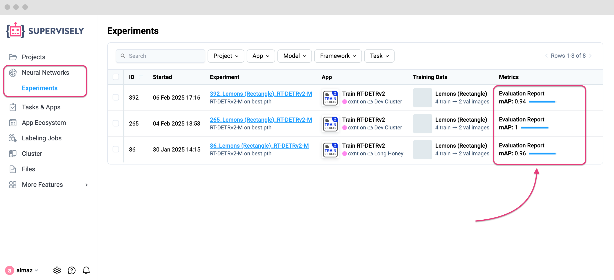
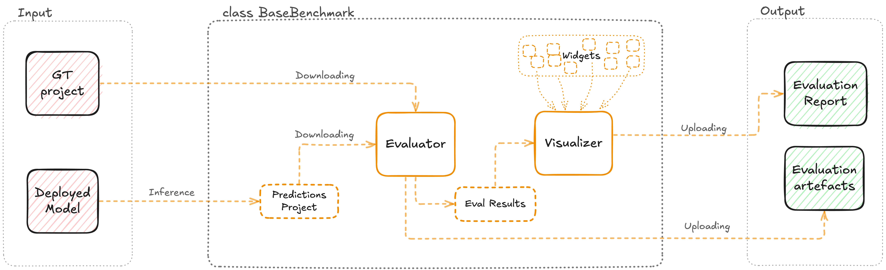

# Custom Benchmark Implementation

✨ In this guide, we will show you how to **integrate a custom benchmark evaluation** using Supervisely SDK. 

For most use cases, our [Evaluator for Model Benchmark](https://ecosystem.supervisely.com/apps/model-benchmark) app in the Ecosystem provides a set of built-in evaluation metrics for various task types, such as object detection, instance segmentation, and semantic segmentation. 
However, in some cases, you may need to define custom metrics that are specific to your use case. The custom benchmark implementation allows you to achieve this goal – to evaluate the model performance with your own business metrics and visualize the results in a comprehensive report.

<figure><figcaption></figcaption></figure>



Key features of the custom benchmark implementation in Supervisely:

- **Custom Evaluator**: Implement your own logic to calculate evaluation metrics with custom parameters.
- **Visualizations Diversity**: Create a report with various visualizations, such as markdown, tables, clickable charts, and galleries.
- **Easy GUI Integration**: Run the benchmark with a few clicks using the Supervisely GUI interface.
- **Automate with Python SDK & API**: Release your custom benchmark as a [private app](https://developer.supervisely.com/app-development/basics/add-private-app#option-1.-recommended-cli-run-command-in-terminal) and manage application sessions to run evaluations automatically. Learn more [here](https://developer.supervisely.com/advanced-user-guide/automate-with-python-sdk-and-api/start-and-stop-app).
- **Automated Inference**: Run inference on images from the GT project with a deployed model session and evaluate the results.
- **Integration with Train Apps**: Integrate the custom benchmark with the training process to evaluate the best model checkpoint after training automatically.
- **Comparison of Multiple Reports**: Compare multiple reports in a convenient way (coming soon).



Let's dive into the details! 🔍

## Overview

We will consider 2 scenarios:

1. **Custom Benchmark using GT and Prediction Projects**: Implementing an evaluation using two projects (Ground Truth and Prediction) – this scenario is useful when you already have the test predictions and want to evaluate them without running inference. We will show you how to run the evaluation and visualize the results. In this scenario, you can modify both the visualizer and evaluator classes or use the default implementation.

2. **Custom Benchmark using GT Project and Deployed Model**: Using the deployed model session to automatically run inference and evaluation on images from the GT project with the same classes (or a subset of them). We will describe key points of the full benchmark flow and show you how to integrate the process with a GUI interface.


**🧩 Key Components**:

If we take a high-level view, Supervisely divides the entire benchmark task into separate components: `evaluator` (metric calculation), `eval_result` (quick access to calculated metrics), `visualizer` + `widgets` (to generate a report with visualizations), and the main `benchmark` class that orchestrates the entire process (look at the schema below ⤵︎). Additionally, it is easy to plug in a `GUI interface` to launch the benchmark with a few clicks.


## Scenario 1: Custom Benchmark using GT and Prediction Projects

In this scenario, we will show you how to implement a custom benchmark using two projects: Ground Truth (GT) and Predictions. We will calculate custom metrics and generate simple visualizations for the evaluation report.


❕ Before you start, make sure you have Ground Truth and Predictions projects with the same structure of datasets and images. The projects should contain the same classes. If you need to run evaluations on a subset of classes, you can provide a `classes_whitelist` parameter to the benchmark class.


🛠️ Here is a brief overview of the relationships between the classes we will create:


🔗 Just to give you a quick overview, here is the structure of the files we will create:

```plaintext
.
├── src/
│   ├── __init__.py
│   ├── benchmark.py            # 15 lines of code
│   ├── evaluator.py            # 47 lines of code
│   ├── eval_result.py          # 38 lines of code
│   ├── visualizer.py           # 64 lines of code
│   ├── widgets/
│   │   ├── __init__.py
│   │   ├── intro.py            # 37 lines of code
│   │   ├── key_metrics.py      # 34 lines of code
│   │   └── custom_metric.py    # 26 lines of code
│   └── main.py                 # 20 lines of code
└── local.env                   # 1 line of code
```


You can find the full code for this scenario in the [here]()


### Step 1.1: Implement Custom Evaluator

Create a custom evaluator class that inherits from `BaseEvaluator` and overrides the `evaluate` method.
Generally, this is a main class of the evaluation process, where you should calculate the evaluation metrics and save them to disk.

```python
# src/evaluator.py
from pathlib import Path

import supervisely as sly
from src.eval_result import MyEvalResult
from supervisely.nn.benchmark.base_evaluator import BaseEvaluator


class MyEvaluator(BaseEvaluator):
    eval_result_cls = MyEvalResult
    # EVALUATION_PARAMS_YAML_PATH = "path/to/evaluation_params.yaml"  # Optional

    def evaluate(self):
        # This method should CALCULATE evaluation metrics and DUMP them to disk.

        # Available attributes:
        # self.gt_project_path: str                 # Path to the local GT project
        # self.pred_project_path: str               # Path to the local Predictions project
        # self.evaluation_params: Dict[str, Any]    # Optional: Evaluation parameters
        # self.result_dir: str                      # Optional: Directory to save evaluation results
        # self.classes_whitelist: List[str]         # Optional: List of classes to evaluate
        # self.pbar: tqdm                           # Optional: Progress bar

        # ---------------- ⬇︎ Placeholder for your custom code ⬇︎ ---------------- #
        # Example:

        # read Supervisely projects (GT and predictions)
        gt_project = sly.Project(self.gt_project_path, sly.OpenMode.READ)
        pred_project = sly.Project(self.pred_project_path, sly.OpenMode.READ)

        self.eval_data = {"gt_objects_count": 0, "pred_objects_count": 0}

        # just for demonstration purposes we will calculate and save some statistics
        self.eval_data["gt_project_stats"] = gt_project.get_classes_stats()
        self.eval_data["pred_project_stats"] = pred_project.get_classes_stats()

        # you can iterate over datasets and items to calculate metrics
        for ds_1 in gt_project.datasets:
            ds_2 = pred_project.datasets.get(ds_1.name)
            ds_1: sly.Dataset
            for name in ds_1.get_items_names():
                ann_1 = ds_1.get_ann(name, gt_project.meta)
                ann_2 = ds_2.get_ann(name, pred_project.meta)
                self.eval_data["gt_objects_count"] += len(ann_1.labels)
                self.eval_data["pred_objects_count"] += len(ann_2.labels)
        # -------------------------------------------------------------------------#

        # IMPORTANT: save the eval_data to disk
        save_path = Path(self.result_dir) / "eval_data.json"
        sly.json.dump_json_file(self.eval_data, save_path)
```

### Step 1.2: Implement Custom EvalResult

Create a custom `EvalResult` class that inherits from `BaseEvalResult`. This class will be used as a data interface to access the evaluation metrics in the visualizer.
All you need to do is implement the `_read_files` and `_prepare_data` methods.

```python
# src/eval_result.py
from collections import defaultdict
from pathlib import Path

import supervisely as sly
from supervisely.nn.benchmark.base_evaluator import BaseEvalResult


class MyEvalResult(BaseEvalResult):
    def _read_files(self, path: str) -> None:
        """This method should LOAD evaluation metrics from disk."""

        # ---------------- ⬇︎ Placeholder for your custom code ⬇︎ ---------------- #
        save_path = Path(path) / "eval_data.json"  # path to the saved evaluation metrics
        self.eval_data = sly.json.load_json_file(str(save_path))

        # project statistics
        self.gt_project_stats = self.eval_data.get("gt_project_stats", {})
        self.pred_project_stats = self.eval_data.get("pred_project_stats", {})

        # objects count
        self.gt_objects_count = self.eval_data.get("gt_objects_count", 0)
        self.pred_objects_count = self.eval_data.get("pred_objects_count", 0)
        # -------------------------------------------------------------------------#

    def _prepare_data(self) -> None:
        """This method should PREPARE data to allow easy access to the data."""

        # ---------------- ⬇︎ Placeholder for your custom code ⬇︎ ---------------- #

        # class statistics (dict with class names as keys and class statistics as values)
        self._class_items_stats = defaultdict(dict)
        self._class_figures_stats = defaultdict(dict)
        for name, items_count in self.gt_project_stats.get("items_count", {}).items():
            pred_items_count = self.pred_project_stats.get("items_count", {}).get(name, 0)
            self._class_items_stats[name] = {"gt": items_count, "pred": pred_items_count}

        for name, gt_figures_cnt in self.gt_project_stats.get("figures_count", {}).items():
            pred_figures_cnt = self.pred_project_stats.get("figures_count", {}).get(name, 0)
            self._class_figures_stats[name] = {"gt": gt_figures_cnt, "pred": pred_figures_cnt}

        # number of classes used in the projects
        gt_classes_used = self.gt_project_stats.get("items_count", {})
        gt_classes_used = len([k for k, v in gt_classes_used.items() if v > 0])
        pred_classes_used = self.pred_project_stats.get("items_count", {})
        pred_classes_used = len([k for k, v in pred_classes_used.items() if v > 0])

        # class (and number of figures) with the maximum number of figures
        most_figures_gt_class = max(
            self.gt_project_stats.get("figures_count", {}).items(), key=lambda x: x[1]
        )
        most_figures_pred_class = max(
            self.pred_project_stats.get("figures_count", {}).items(), key=lambda x: x[1]
        )

        self._key_metrics = {
            "Objects Count": [self.gt_objects_count, self.pred_objects_count],
            "Found Classes": [gt_classes_used, pred_classes_used],
            "Classes with Max Figures": [most_figures_gt_class, most_figures_pred_class],
        }
        # -------------------------------------------------------------------------#

    @property
    def key_metrics(self):
        """You can create any properties or methods to access the data easily."""
        return self._key_metrics.copy()

    @property
    def class_items_stats(self):
        return self._class_items_stats.copy()

    @property
    def class_figures_stats(self):
        return self._class_figures_stats.copy()
```

### Step 1.3: Implement Custom Visualizer

This step involves creating a custom `Visualizer` class that inherits from `BaseVisualizer`. The class should generate visualizations and save them to disk.

But first, let's create a few widgets that we will use in the visualizer.
Let's start with the `Intro`, `KeyMetrics`, and `CustomMetric` widgets. To make the code more readable, we will split the widget classes into separate files.

Feel free to change the widget content and appearance to suit your needs. The example below with Markdown widgets is just a starting point.

```python
# src/widgets/intro.py
from datetime import datetime

from supervisely.nn.benchmark.object_detection.base_vis_metric import DetectionVisMetric
from supervisely.nn.benchmark.visualization.widgets import MarkdownWidget


class Intro(DetectionVisMetric):

    def get_header(self, user_login: str) -> MarkdownWidget:
        current_date = datetime.now().strftime("%d %B %Y, %H:%M")

        header_text = (
            "<h1>Pretrained YOLOv11 Model</h1>"
            "<div class='model-info-block'>"
            f"   <div>Created by <b>{user_login}</b></div>"
            f"   <div><i class='zmdi zmdi-calendar-alt'></i><span>{current_date}</span></div>"
            "</div>"
        )
        header = MarkdownWidget("markdown_header", "Header", text=header_text)
        return header

    @property
    def md(self) -> MarkdownWidget:
        gt_id = self.eval_result.gt_project_info.id
        gt_name = self.eval_result.gt_project_info.name
        project_link = f"<a href='/projects/{gt_id}/datasets' target='_blank'>{gt_name}</a>"
        text = (
            f"## Overview \n"
            f"- **Ground Truth project**: {project_link}\n"
            f"- **Task type**: Object Detection\n"
        )

        md = MarkdownWidget(name="intro", title="Intro", text=text)

        # add a special styles to the widget
        md.is_info_block = True
        md.width_fit_content = True
        return md
```

Take a look at the `Intro` widget:

<figure><figcaption></figcaption></figure>

Let's create the `KeyMetrics` section:

```python
# src/widgets/key_metrics.py
from supervisely.nn.benchmark.object_detection.base_vis_metric import DetectionVisMetric
from supervisely.nn.benchmark.visualization.widgets import MarkdownWidget, TableWidget


class KeyMetrics(DetectionVisMetric):
    @property
    def md(self) -> MarkdownWidget:
        text = (
            "## Key Metrics\n"
            "In this section, you can explore in table key metrics, such as:\n\n"
            "> **Note:** Markdown syntax is supported."
        )
        return MarkdownWidget(name="key_metrics", title="Key Metrics", text=text)

    @property
    def table(self) -> TableWidget:
        columns = ["Metric", "GT Project", "Predictions Project"]
        columns_options = [{"disableSort": True}] * len(columns)
        content = []
        # ---------------- ⬇︎ Placeholder for your custom code ⬇︎ ---------------- #
        for metric, values in self.eval_result.key_metrics.items():
            gt, pred = values
            gt = f"{gt[0]} ({gt[1]})" if isinstance(gt, (list, tuple)) else str(gt)
            pred = f"{pred[0]} ({pred[1]})" if isinstance(pred, (list, tuple)) else str(pred)
            content.append({"row": [metric, gt, pred], "id": metric, "items": [metric, gt, pred]})

        data = {
            "columns": columns,
            "content": content,
            "columnsOptions": columns_options,
        }
        return TableWidget(
            name="key_metrics",
            data=data,
            fix_columns=1,
            show_header_controls=False,
            main_column=columns[0],
        )
```

Here is the `KeyMetrics` widget in action:

<figure><figcaption></figcaption></figure>

Let's create the `CustomMetric` section:

```python
# src/widgets/custom_metric.py
from supervisely.nn.benchmark.object_detection.base_vis_metric import DetectionVisMetric
from supervisely.nn.benchmark.visualization.widgets import ChartWidget, MarkdownWidget


class CustomMetric(DetectionVisMetric):

    @property
    def md(self) -> MarkdownWidget:
        text = "## Custom Metric\n In this section, you can explore a custom metric in a chart."
        return MarkdownWidget(name="custom_metric", title="Custom Metric", text=text)

    @property
    def chart(self) -> ChartWidget:
        import plotly.express as px

        x = list(self.eval_result.class_items_stats.keys())
        y1 = [self.eval_result.class_items_stats[val]["gt"] for val in x]
        y2 = [self.eval_result.class_items_stats[val]["pred"] for val in x]

        fig = px.bar(x=x, y=[y1, y2], labels={"x": "Classes", "y": "Images"}, barmode="group")
        return ChartWidget(name="images_chart", figure=fig)
```

The `CustomMetric` widget will look like this:

<figure><figcaption></figcaption></figure>

Finally, let's implement the custom visualizer class that will use these widgets.
All you need to do is to implement the `_create_widgets` and `_create_layout` methods.

```python
# src/visualizer.py
from src.widgets import CustomMetric, Intro, KeyMetrics
from supervisely.nn.benchmark.base_visualizer import BaseVisualizer
from supervisely.nn.benchmark.visualization.widgets import (
    ContainerWidget,
    SidebarWidget,
)
from supervisely.nn.task_type import TaskType


class MyVisualizer(BaseVisualizer):

    @property
    def cv_task(self):
        return TaskType.OBJECT_DETECTION

    def _create_widgets(self):
        """In this method, we initialize and configure all the widgets that we will use"""

        vis_text = "N/A"  # not used in this example

        # ---------------- ⬇︎ Placeholder for your widgets ⬇︎ ------------------- #
        # Intro (Markdown)
        me = self.api.user.get_my_info()
        intro = Intro(vis_text, self.eval_result)
        self.intro_header = intro.get_header(me.login)
        self.intro_md = intro.md

        # Key Metrics (Markdown + Table)
        key_metrics = KeyMetrics(vis_text, self.eval_result)
        self.key_metrics_md = key_metrics.md
        self.key_metrics_table = key_metrics.table

        # Custom Metric (Markdown + Chart)
        custom_metric = CustomMetric(vis_text, self.eval_result)
        self.custom_metric_md = custom_metric.md
        self.custom_metric_chart = custom_metric.chart
        # ------------------------------------------------------------------------ #

    def _create_layout(self):
        """
        In this method, we create the layout of the visualizer.
        We define the order of the widgets in the report and their visibility in the sidebar.
        """
        # Create widgets
        self._create_widgets()


        # ---------------- ⬇︎ Placeholder for your widgets ⬇︎ ------------------- #
        # In the code below, you should define the order of the widgets in the report and their visibility in the sidebar.
        # (if 1 - will display in sidebar, 0 - will not display in sidebar)
        is_anchors_widgets = [
            # Intro
            (0, self.intro_header),
            (1, self.intro_md),
            # Key Metrics
            (1, self.key_metrics_md),
            (0, self.key_metrics_table),
            # Custom Metric
            (1, self.custom_metric_md),
            (0, self.custom_metric_chart),
        ]
        # ------------------------------------------------------------------------ #

        anchors = []
        for is_anchor, widget in is_anchors_widgets:
            if is_anchor:
                anchors.append(widget.id)

        sidebar = SidebarWidget(widgets=[i[1] for i in is_anchors_widgets], anchors=anchors)
        layout = ContainerWidget(title="Custom Benchmark", widgets=[sidebar])
        return layout
```

### Step 1.4: Implement Custom Benchmark Class

Now, let's create a custom benchmark class that inherits from `BaseBenchmark`. This class will orchestrate the evaluation process and generate the report.

```python
# src/benchmark.py
from src.evaluator import MyEvaluator
from src.visualizer import MyVisualizer
from supervisely.nn.benchmark.base_benchmark import BaseBenchmark
from supervisely.nn.benchmark.base_evaluator import BaseEvaluator
from supervisely.nn.task_type import TaskType


class CustomBenchmark(BaseBenchmark):
    visualizer_cls = MyVisualizer

    @property
    def cv_task(self) -> str:
        return TaskType.OBJECT_DETECTION

    def _get_evaluator_class(self) -> BaseEvaluator:
        return MyEvaluator
```

### Step 1.5: Run the Custom Benchmark

Before we run the custom benchmark, prepare the environment:

- variables in the `local.env` file:

```plaintext
TEAM_ID = 8         # ⬅︎ change the value
```

- credentials in the `supervisely.env` file:

```plaintext
SERVER_ADDRESS=     # ⬅︎ change the value
API_TOKEN=          # ⬅︎ change the value
```

Learn about the basics of authentication in Supervisely [here](https://developer.supervisely.com/getting-started/basics-of-authentication#basics-of-authentication).

Create a `main.py` script to run the custom benchmark:

```python
# src/main.py
import os

from dotenv import load_dotenv

import supervisely as sly
from src.benchmark import CustomBenchmark

if sly.is_development():
    load_dotenv(os.path.expanduser("~/supervisely.env"))
    load_dotenv("local.env")

api = sly.Api()

gt_project_id = 73
pred_project_id = 133

# 1. Initialize benchmark
bench = CustomBenchmark(api, gt_project_id)

# 2. Run evaluation
bench.evaluate(pred_project_id)

# 3. Generate templates with visualizations
bench.visualize()

# 4. Upload to Supervisely Team Files
# (it is required to open visualizations in the web interface)
remote_dir = f"/model-benchmark/custom_benchmark_{sly.rand_str(6)}"
bench.upload_eval_results(remote_dir + "/evaluation/")
bench.upload_visualizations(remote_dir + "/visualizations/")
```

🔗 Recap of the files structure:

```plaintext
.
├── src/
│   ├── __init__.py
│   ├── benchmark.py            # 15 lines of code
│   ├── evaluator.py            # 47 lines of code
│   ├── eval_result.py          # 38 lines of code
│   ├── visualizer.py           # 64 lines of code
│   ├── widgets/
│   │   ├── __init__.py
│   │   ├── intro.py            # 37 lines of code
│   │   ├── key_metrics.py      # 34 lines of code
│   │   └── custom_metric.py    # 26 lines of code
│   └── main.py                 # 20 lines of code
└── local.env                   # 1 line of code
```

Run the script:

<figure><figcaption></figcaption></figure>

After running the script, you will see the evaluation results in the Team Files.
Find the `evaluation` and `visualizations` folders with the generated report (`Model Evaluation Report.lnk` file).
Also, you can open the report in the web interface by clicking on the link in the logs.

<figure><figcaption></figcaption></figure>



**💫 New Beta Feature**: The `Experiments` page is now available. All information about experiments (GT project, Train session, Checkpoint, Artifacts, Evaluation Report) is in quick access in one place.





## Scenario 2: Custom Benchmark using GT Project and Deployed Model

In this scenario, we will not describe the components as in the previous scenario ⤴︎. Instead, we will show you how to integrate the custom benchmark with the GUI interface, pass the necessary evaluation parameters, classes, and use a deployed model session.

Here is a brief overview of the relationships between the classes in this scenario. As you can see, we will use the same classes, but the input will be different – the GT project and the deployed model session (instead of the Predictions project).



As you can see, the structure of the files is the same as in the previous scenario. The only difference is in the `main.py` script, where we will use the deployed model session instead of the Predictions project and create a GUI interface to run the benchmark.


You can find the full code for this scenario in the [here]()


First, let's update the `local.env` file with the following variables:

```plaintext
SLY_APP_DATA_DIR = "APP_DATA"
TEAM_ID = 8
```

Now, we will change the `main.py` from the simple script to a FastAPI application that will run the benchmark with the GUI interface.

<details>

<summary><strong>FULL CODE</strong></summary>

```python
import os

import yaml
from dotenv import load_dotenv

import supervisely as sly
import supervisely.app.widgets as sly_widgets
from src.tests.custom_benchmark.benchmark import CustomBenchmark
from src.tests.custom_benchmark.evaluator import MyEvaluator
from supervisely.nn.inference import SessionJSON

if sly.is_development():
    load_dotenv("local.env")
    load_dotenv(os.path.expanduser("~/supervisely.env"))


api = sly.Api.from_env()

team_id = sly.env.team_id()
project_id, session_id, selected_classes = None, None, None

# Widgets for INPUT (project and model)
sel_dataset = sly_widgets.SelectDataset(
    default_id=None,
    project_id=project_id,
    multiselect=True,
    select_all_datasets=True,
    allowed_project_types=[sly.ProjectType.IMAGES],
)
sel_app_session = sly_widgets.SelectAppSession(team_id, tags=["deployed_nn"], show_label=True)

# Additional widgets (classes, evaluation params, progress bars)
check_input = sly_widgets.Button("Check input")
classes_text = sly_widgets.Text(status="info")
eval_params = sly_widgets.Editor(initial_text=None, language_mode="yaml", height_px=200)
eval_params.hide()
eval_pbar = sly_widgets.SlyTqdm()
sec_eval_pbar = sly_widgets.SlyTqdm()

# Widgets for EVALUATION
eval_button = sly_widgets.Button("Evaluate")
eval_button.disable()
report_model_benchmark = sly_widgets.ReportThumbnail()
report_model_benchmark.hide()


evaluation_container = sly_widgets.Container(
    [
        sel_dataset,
        sel_app_session,
        check_input,
        classes_text,
        eval_params,
        eval_button,
        report_model_benchmark,
        eval_pbar,
        sec_eval_pbar,
    ]
)
card = sly_widgets.Card(title="Model Evaluation", content=evaluation_container)
app = sly.Application(layout=card)


@check_input.click
def check_input_info():
    """Check input data and show selected classes"""
    global project_id, session_id, dataset_ids, selected_classes

    selected_classes = None
    classes_text.text = "Selected classes: None"
    project_id = sel_dataset.get_selected_project_id()
    if project_id is None:
        raise ValueError("No project selected")
    dataset_ids = sel_dataset.get_selected_ids()
    if len(dataset_ids) == 0:
        dataset_ids = None
    session_id = sel_app_session.get_selected_id()
    if session_id is None:
        raise ValueError("No model selected")

    selected_classes = match_classes(api, project_id, session_id)
    classes_text.text = f"Selected classes: {', '.join(selected_classes)}"

    params = MyEvaluator.load_yaml_evaluation_params()
    eval_params.set_text(params, language_mode="yaml")
    eval_params.show()
    eval_button.enable()


@eval_button.click
def start_evaluation():
    """Run evaluation if button is clicked"""
    check_input.disable()
    sel_dataset.disable()
    eval_pbar.show()
    sec_eval_pbar.show()

    work_dir = sly.app.get_data_dir() + "/benchmark_" + sly.rand_str(6)
    project = api.project.get_info_by_id(project_id)

    params = eval_params.get_value()
    if isinstance(params, str):
        params = yaml.safe_load(params)

    bm = CustomBenchmark(
        api,
        project.id,
        gt_dataset_ids=dataset_ids,
        output_dir=work_dir,
        progress=eval_pbar,
        progress_secondary=sec_eval_pbar,
        classes_whitelist=selected_classes,
        evaluation_params=params,
    )

    task_info = api.task.get_info_by_id(session_id)
    task_dir = f"{session_id}_{task_info['meta']['app']['name']}"

    res_dir = f"/model-benchmark/{project.id}_{project.name}/{task_dir}/"
    res_dir = api.storage.get_free_dir_name(team_id, res_dir)

    bm.run_evaluation(model_session=session_id, batch_size=16)
    bm.visualize()

    bm.upload_eval_results(res_dir + "/evaluation/")
    bm.upload_visualizations(res_dir + "/visualizations/")

    report_model_benchmark.set(bm.report)
    report_model_benchmark.show()

    eval_pbar.hide()
    sec_eval_pbar.hide()
    eval_params.hide()
    eval_button.disable()
    check_input.disable()


def match_classes(api, project_id, session_id):
    """Match classes from project and model"""
    project_meta = sly.ProjectMeta.from_json(api.project.get_meta(project_id))
    session = SessionJSON(api, session_id)
    model_meta = sly.ProjectMeta.from_json(session.get_model_meta())

    matched_classes = []
    for obj_class in project_meta.obj_classes:
        if model_meta.obj_classes.has_key(obj_class.name):
            if obj_class.geometry_type == sly.Polygon:
                matched_classes.append(obj_class.name)
            else:
                sly.logger.warning(f"Project class {obj_class.name} not supported by model")
        else:
            sly.logger.warning(f"Project class {obj_class.name} not found in model")

    for obj_class in model_meta.obj_classes:
        if not project_meta.obj_classes.has_key(obj_class.name):
            sly.logger.warning(f"Model class {obj_class.name} not found in GT project")

    return matched_classes
```

</details>

Launch the application and run the evaluation. After the evaluation is complete, you will see a widget with the evaluation report.

<figure><figcaption></figcaption></figure>
