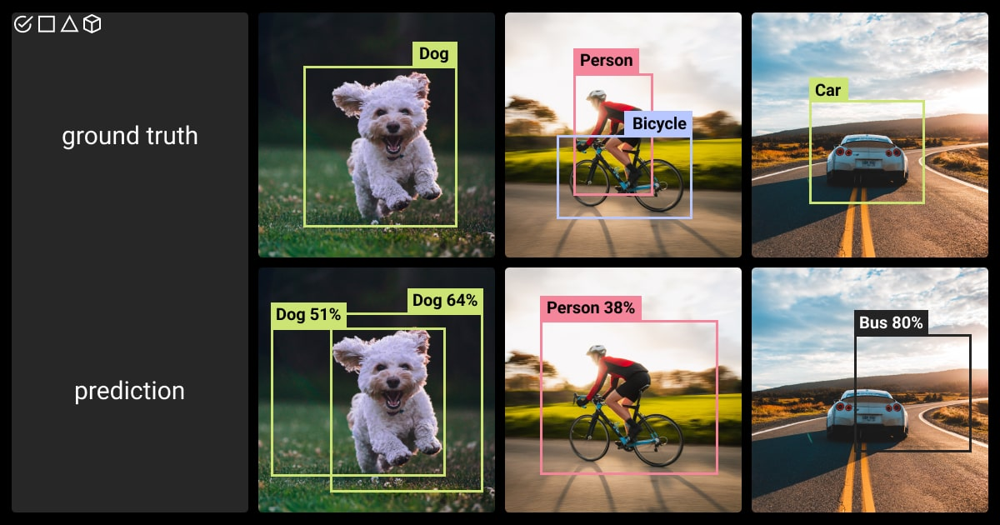

# Object Detection

## Implementation Overview

We use [pycocotools](https://github.com/cocodataset/cocoapi/tree/master) to compute basic metrics such as mAP, precision, and recall. Additionally, we utilize algorithms from pycocotools for object matching based on IoU. This approach allows us to adhere to the original algorithm for calculating the mAP metric, as different implementations can yield slightly varying results. Moreover, pycocotools is a C++ library with Python bindings, which ensures fast and efficient calculations.

### Matching Algorithm from pycocotools

To calculate common metrics, we need to *match* predicted bounding boxes with the actual ones. During the matching stage, we assign each boudnding box an outcome: **True Positive**, **False Positive**, or **False Negative**. These categories are essential for calculating precision, recall, f1, and mAP. A predicted bounding box is considered **matched** if it overlaps with an actual bounding box with [IoU](#localization-accuracy-iou) >= 0.5.

<figure><figcaption></figcaption></figure>

### Averaging IoU thresholds

When calculating the main metrics, such as Precision, Recall, F1-score, we average the results across a range of IoU thresholds. For instance, Precision is calculated as `Precision@IoU=[0.5,0.55,0.6...0.95]`. We calculate precision for each threshold and average them getting the final metric.

Averaging across IoU thresholds is often used in detection and segmentation benchmarks, for example in [COCO challenges](https://cocodataset.org/#detection-eval). Such a metric provides more comprehensive view of model performance, than a metric calculated with a single IoU threhsold. Otherwise, there's a problem with metric discreteness due strict thresholding.

To demonstrate the problem, consider an example: let's say we want to calculate `precision@IoU=0.85` (i.e., precision with 0.85 IoU threshold, without averaging). Then, in cases where the model correctly predicted an object of the true class but with IoU, say 0.84 or 0.83, which is quite a decent prediction, we would still record it as a wrong prediction. In extreme cases, this metric might end up being close to zero, despite the model producing not bad predictions. In another example, we might set a lower IoU threshold, say 0.5. In this case, the metric will saturate very early, hitting 1.0 score even if predictions are not perfect.

Therefore, with averaging IoU thresholds, setting a strict IoU threshold is not necceassary, and we can evaluate the model performance more comprehensively.


Note, that IoU Averaging can be applied only in calculation of the general metrics, such as Precision, Recall, F1-score. But in many charts, such as Confusion Matrix, Outcome Counts, and in image previews, only sigle IoU threshold can be used, since there is no way to average across several thresholds here.


## Outcome Counts

Outcome Counts provides a quick assessment of model accuracy. It offers a general overview of how many instances the model correctly detected (True Positive), how many it missed (False Negative), and how many predictions were incorrect (False Positive).

**True Positive (TP)** predictions are those that have matched with a ground truth bounding box and share the same class.

**False Positive (FP)** occurs when the model predicts an object that is not actually present in the image. For example, if the model detects a car in the image but no car is annotated. A false positive detection happens when a ground truth counterpart is not found, the IoU is less than 0.5, or their classes do not match.

**False Negative (FN)** happens when the model fails to detect an object that is present in the image. For instance, if the model does not detect a car that is actually in the ground truth. A false negative detection occurs when a ground truth bounding box has no matching predicted bounding box with an IoU greater than 0.5, or their classes do not match.

#### How to use

The larger the green bar for true positive outcomes, and the smaller the red bars for false negative and false positive outcomes, the better the model's predictions. This chart helps to compare and understand the balance between false negatives and false positives, thus identifying which type of error is more prevalent in the model given the current confidence threshold.


Note, the ratio between false negatives and false positives depends on the confidence threshold.


#### Calculating

To calculate Outcome Counts, we use the results from the matching procedure and count the instances of TP, FP, and FN across the entire dataset.

## Recall

Recall measures the completeness of the model predictions. It answers the question: Of all the objects in the dataset, how many did the model manage to find? The recall chart allows you to evaluate recall for each class and visually compare them.

_<mark style="color:green;">Higher recall values are better.</mark>_

#### Calculating recall

Recall for a given class is calculated as the proportion of correct predictions (true positives) to the total number of objects in that class (true positives + false negatives).

$$\text{Recall (for a class)} = \frac{TP}{TP + FN}$$

The overall recall is the average recall across all classes.

## Precision

Precision evaluates the accuracy of a model by answering the question: Out of all the predictions made by the model, how many were actually correct? The precision chart allows you to assess the precision for each class and visually compare the results across different classes.

_<mark style="color:green;">Higher precision values are better.</mark>_

#### Calculating precision

Precision for a specific class is calculated as the ratio of correct predictions (true positives) to the total number of predictions made for that class (true positives + false positives).

$$\text{Precision (for a class)} = \frac{TP}{TP + FP}$$

The overall precision is the average precision across all classes.

## F1-score

The f1-score is a useful metric that combines both precision and recall into a single measure. As the harmonic mean of precision and recall, the f1-score provides a balanced representation of both metrics in one value. F1-score ranges from 0 to 1, with a higher score indicating better model performance.

#### Calculating f1-score

The formula for the F1-score:

$$F1 = 2 \cdot \frac{\text{precision} \cdot \text{recall}}{\text{precision} + \text{recall}}$$

## mAP & Precision-Recall Curve

### Overview

**Mean Average Precision (mAP)** is a comprehensive metric used to evaluate detection performance. It calculates the average precision at various recall levels and IoU thresholds for all classes within a dataset. Our benchmark includes a visualization of the Precision-Recall curve, from which the resulting mAP is derived (since mAP is the area under this curve).

#### Understanding Precision-Recall Tradeoff

* A system with high recall but low precision generates many results, but most of its predictions are incorrect or redundant (false positives).
* Conversely, a system with high precision but low recall produces very few results, but most of its predictions are accurate.
* The ideal system achieves both high precision and high recall, meaning it returns many results with a high accuracy rate.

### How to use

A high-quality model should sustain strong precision as recall increases. This implies that as you move along the X-axis (from left to right) on the Precision-Recall curve, there should not be a significant drop in precision (Y-axis). Such a model is effective at identifying many relevant instances while maintaining a high level of precision.&#x20;

_<mark style="color:green;">A larger area under the Precision-Recall curve indicates better performance.</mark>_

### Calculating mAP

To calculate mAP, we first construct the Precision-recall curve following these steps:

1. **Sort predictions:** Arrange all the bounding box predictions by their confidence scores in descending order.
2. **Classify outcomes:** For each prediction, determine if it is a true positive (TP) or a false positive (FP) and record these classifications in a table.
3. **Calculate cumulative metrics:** As you move through each prediction, calculate the cumulative precision and recall. Add these values to the table.
4. **Plot points:** Each row in the table now represents a point on a graph, with cumulative recall on the x-axis and cumulative precision on the y-axis. Initially, this creates a zig-zag line because of variations between predictions.
5. **Interpolation to 101 recall levels:** The actual PR-curve is derived by plotting only maximum precision values for each recall level. This involves connecting only the highest precision points for each segment of recall, smoothing out the zig-zags and forming a curve that slopes downward as recall increases. This interpolates the curve to evenly spaced recall intervals, which are ranging from 0 to 1 with step of 0.01 (e.g., 0.0, 0.01, 0.02, ..., 1.0), giving 101 recall levels.
6. **Calculating AP:** We then calculate Average Precision (AP) by averaging precision values across 101 recall levels.
7. **Calculating mAP:** Now, imagine the above steps were performed only for one class, and the IoU threshold was set to 0.5. Then, the actual mAP is just an average of APs (average precisions), that were calculated for each class in the dataset and for each IoU threshold. IoU thresholds, similarly to recall levels, are ranging from 0.5 to 0.95 with the step of 0.05 (i.e, 0.5, 0.55, 0.6, ..., 0.95).


We leverage pycocotools for fast calculating of mAP and precision-recall curves.


## Classification Accuracy

We additionally measure the classification accuracy of an object detection model. This metric represents the percentage of correctly labeled instances among all correctly localized bounding boxes (where the IoU for each box is greater than 0.5, regardless of class). Classification accuracy tells us: When a model correctly identifies the location of objects in an image, how often does it assign the right label to these objects?

The formula for classification accuracy is:

$$\text{Classification accuracy} = \frac{\text{TP}}{\text{TP} + \text{Mislabel}}$$

Here, TP (True Positives) are correctly labeled instances, and Mislabel refers to cases where the IoU between the ground truth and prediction is higher than 0.5, but the predicted class does not match the actual class.

## Confusion Matrix

The confusion matrix reveals which classes the model commonly confuses with each other.

#### How to use

* **Each row** of the matrix corresponds to the actual instances of a class.
* **Each column** corresponds to the instances as predicted by the model.
* **The diagonal elements** of the matrix represent correctly predicted instances.
* By examining the o**ff-diagonal elements**, you can see if the model is confusing two classes by frequently mislabeling one as the other.&#x20;
* **The last row**, labeled as "(None)" indicates instances where the model failed to predict an actual class (False Negatives). By examining the last row, you can identify how many actual instances were missed by the model. This helps in understanding the recall performance.
* **The last column**, labeled as "(None)," represents instances where the model incorrectly predicted a class when there was none (False Positives). This helps in understanding the precision performance.

## Frequently Confused Classes

This chart complements the confusion matrix, visualizing the most frequently confused classes as the probability of confusion. The probability of confusion between two classes indicates how often the model predicts one class instead of the other.

_<mark style="color:green;">Lower probabilities of confusion are better.</mark>_

#### Calculating probability of confusion

The probability of confusion between classes A and B is calculated as:

$$\text{probability of confusion (A, B)} = \frac{(\text{predicted (A)} \cap \text{actually (B)} + \text{predicted (B)} \cap \text{actually (A)})}{(\text{predicted (A)} + \text{predicted (B)})}$$

**Numerator:**

* predicted (A) ∩ actually (B): This represents the number of instances where class A is predicted, but it is actually class B.
* predicted (B) ∩ actually (A): This represents the number of instances where class B is predicted, but it is actually class A.
* The sum of these two terms gives the total number of misclassifications between classes A and B.

**Denominator:**

* predicted (A) + predicted (B) gives the total number of instances predicted as either class A or B.

The formula provides symmetry for classes A and B. For example, the probability of confusing a car with a truck is the same as the probability of confusing a truck with a car. This symmetry helps identify pairs of commonly confused classes within a dataset.

## Localization accuracy (IoU)

We assess localization accuracy of an object detector by calculating average IoU and visualizing histogram of IoU scores.

**Intersection over Union (IoU)** measures how closely predicted bounding boxes match the actual (ground truth) bounding boxes. It is calculated as the area of overlap between the predicted bounding box and the ground truth bounding box, divided by the area of union of these bounding boxes.

<figure><figcaption></figcaption></figure>

**IoU histogram** represents the distribution of IoU scores among all predictions. This gives a sense of how well the model aligns bounding boxes. Ideally, if the model aligns boxes very well, the rightmost bars (from 0.9 to 1.0 IoU) should be much higher than others.

## Calibration Curve

Calibration curve, also known as a reliability diagram, helps in understanding whether the confidence scores of a detector accurately represent the true probability of a correct detection. A well-calibrated model means that when it predicts a detection with, say, 80% confidence, approximately 80% of those predictions should actually be correct.

#### How to use

We are looking at how much the model’s calibration curve diverges from a perfectly calibrated line.

1. **If the curve is above the perfect line (Underconfidence):** If the calibration curve is consistently above the perfect line, this indicates underconfidence. The model’s predictions are more correct than the confidence scores suggest. For example, if the model predicts a set of bounding boxes with 70% confidence but, empirically, 90% of such detections are correct, the model is underconfident.
2. **The curve is below the perfect line (Overconfidence):** If the calibration curve is below the perfect line, the model exhibits overconfidence. This means it is too sure of its predictions. For instance, if the model predicts bounding boxes with 80% confidence but only 40% of these predictions are correct, it is overconfident.

The reliability diagram shows how often predictions with the given confidence turn out to be correct. In other words, the reliability diagram indicates **precision** in each bin of confidence range.

## Expected Calibration Error (ECE)

Intuitively, ECE can be viewed as a measure of deviation of the model’s calibration curve from a perfectly calibrated line.

_<mark style="color:green;">Lower ECE values are better.</mark>_

**ECE** is calculated by partitioning predictions into M equally-spaced bins (similar to the reliability diagrams) and taking a weighted average of the bins’ accuracy/confidence difference.

$$\text{ECE} = \sum_{m=1}^{M} \frac{|B_m|}{n} \cdot \left| \text{acc}(B_m) - \text{conf}(B_m) \right|$$

where _**n**_ is the number of samples, _**M**_ is the number of bins. The difference between acc(Bm) and conf(Bm) is a difference between precision and average confidence in the bin **m**.

* Please, see the paper for details: [https://arxiv.org/pdf/1706.04599](https://arxiv.org/pdf/1706.04599).

## Confidence Score Profile

Confidence Score Profile is a comprehensive view of a model's confidence scores. It combines metrics, such as precision, recall, f1 on Y-axis with confidence scores generated by a model on X-axis.

Confidence Profile has a notable feature, if you pick a confidence value on the X-axis, you can see what the resulting metrics will be (Y-axis). If you’d set this value as a confidence threshold while evaluating the model, you get exactly these results for precision, recall and f1.

#### How to build this plot

First, we sort all predictions by confidence in descending order. Like in mAP calculation, we calculate cumulative metrics (precision, recall, f1) for each prediction in the dataset. Then we plot predictions as points where the X-axis is for confidence score, and Y-axis for a metric value.

#### F1-optimal confidence threshold

We automatically find the f1-optimal confidence threshold. It is equal to the argmax of the f1 confidence profile. For example, if we get a maximal f1-score on the confidence profile line (maximum on Y-axis), then the best confidence threshold will lie under this point on X-axis.

### Confidence Profile at Different IoU thresholds

This is an extended version of the confidence profile used for validation confidence scores at different IoU thresholds. In COCO evaluation you can set an IoU threshold above which a prediction will be considered correct. The above F1-optimal confidence threshold is derived with IoU threshold set to 0.5 (default in COCO), while in this chart, you can derive various F1-optimal thresholds depending on IoU threshold defined for evaluation. The IoU thresholds are ranging from 0.5 to 0.95.

**What is IoU threshold:** The IoU threshold is a predefined value (set to 0.5 in many benchmarks) that determines the minimum acceptable IoU score for a predicted bounding box to be considered a correct prediction. When the IoU of a predicted box and actual box is higher than this IoU threshold, the prediction is considered correct.

### Confidence Distribution

This graph helps to assess whether high confidence scores correlate with correct detections (true positives) and the low confidence scores correlate with incorrect ones (false positives). It consists of two histograms, one for true positive predictions filled with green, and one for false positives filled with red.

## Outcome Counts by Class

This chart breaks down all predictions into True Positives (TP), False Positives (FP), and False Negatives (FN) by classes. This helps to visually assess the type of errors the model often encounters for each class.

You can choose whether to normalize outcome counts.

**Absolute counts:**

If normalization is off, the chart will display the total count of instances that correspond to outcome type (one of TP, FP or FN). This is identical to the main Outcome Counts graph on the top of the page. However, when normalization is off, you may encounter a class imbalance problem. Visually, bars that correspond to classes with many instances in the dataset will be much larger than others. This complicates the visual analysis.

**Normalized counts:**

Normalization is used for better interclass comparison. If the normalization is on, the total outcome counts are divided by the number of ground truth instances of the corresponding class. This is useful, because on the chart, the sum of TP and FN bars will always result in 1.0, representing the full set of ground truth instances in the dataset for a class. This provides a clear visual understanding of how many instances the model correctly detected, how many it missed, and how many were false positives. For example, if a green bar (TP outcomes) reaches 1.0, this means the model has managed to predict all objects for the class without false negatives. Everything that is higher than 1.0 corresponds to False Positives, i.e, redundant predictions that the model should not predict. You can turn off the normalization, switching to absolute counts.

---

## Inference speed

We conduct a speed test analysis for different models in various scenarios.

Our benchmark aims to assess the following capabilities of a model:

1. **Real-time inference** with batch size is set to 1. This is suitable for processing a stream of images or for real-time video capture. It is a crucial benchmark for real-time object detectors, such as YOLO and RT-DETR.
2. **Batch processing.** This is a common scenario where the model can process a batch of images. We also assess the scalability of model efficiency with increasing batch size, conducting tests with various batch sizes (i.e, setting batch size to 1, 8, 16).
3. **Runtime environments.** We provide benchmarks in both the original python environment and in optimized runtimes, such as ONNXRuntime and TensorRT. This is important because python code can be suboptimal, and this level of optimization provides significant performance improvements.

#### Methodology

1. We use **consistent hardware** between tests for a fair model comparison.
2. We run a model on a set of 100 images from the evaluated dataset with a resolution of 640x640 (most models can process this resolution, but if not, we add a note about resolution).
3. **3-stage inference:** We measure inference in 3 stages: **pre-processing, inference, post-processing.** This provides insights into where optimization efforts can be focused. Additionally, it gives us another level of verification to ensure that tests are conducted properly for a model.

* **Preprocess:** The stage where images are prepared for input into the model. This includes image reading, resizing, and any necessary transformations.
* **Inference:** The main computation phase where the forward pass of the model is running.
* **Postprocess:** This stage includes tasks such as NMS (Non-maximal suppression), resizing output masks, aligning predictions with the input image, converting bounding boxes into a specific format or filtering out low-confidence detections.
