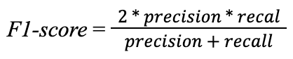

# Semantic Segmentation

## Implementation Overview

The segmentation error analysis methodology used for model benchmark is based on paper ["What’s Outside the Intersection? Fine-grained Error Analysis for Semantic Segmentation Beyond IoU”](https://openaccess.thecvf.com/content/WACV2024/html/Bernhard_Whats_Outside_the_Intersection_Fine-Grained_Error_Analysis_for_Semantic_Segmentation_WACV_2024_paper.html) authored by Maximilian Bernhard, Roberto Amoroso, Yannic Kindermann, Lorenzo Baraldi, Rita Cucchiara, Volker Tresp and Matthias Schubert. Additionally, approach proposed in paper ["Boundary IoU: Improving object-centric image segmentation evaluation”](https://arxiv.org/abs/2103.16562) authored by Bowen Cheng, Ross Girshick, Piotr Dollar, Alexander C. Berg and Alexander Kirillov was used for boundary IoU calculation.

## Pixel accuracy

Pixel accuracy reflects the percent of image pixels which were correctly classified.

<figure><figcaption></figcaption></figure>

Pixel accuracy is an easy-to-understand metric, but it can be misleading in conditions of class imbalance. Pixel accuracy provides superficial understanding of model performance, but it does not give information about where exactly the model makes mistakes (which error type is prevailing - false positive or false negative?).

## Precision

Precision reflects the number of correctly predicted positive segmentations divided by the total number of predicted positive segmentations.

<figure><figcaption></figcaption></figure>

Precision measures the accuracy of positive predictions and can be useful in cases when the cost of false positive errors is high (for example, spam filtering) and it is important to minimize them. At the same time precision does not take into account false negative errors. So this metric alone will not provide a complete picture of neural network performance, it is better to use precision in combination with other evaluation metrics in order to get unbiased information about model performance.

## Recall

Recall reflects the number of correctly predicted positive segmentations divided by the number of all samples that should have been segmented as positive.

<figure><figcaption></figcaption></figure>

Recall measures the model’s ability to correctly segment all positive instances and can be useful in cases when it is necessary to minimize false negative errors (for example, disease diagnostics). Disadvantages of this metric are similar to disadvantages of precision: recall does not take into account false positive errors - it means that recall will be not representative on significantly imbalanced data (since the model which segments all pixels as positive will have high recall, but very low precision). So general recommendation for recall usage is the same as for precision - use it in combination with other evaluation metrics.

## F1-score

F1-score reflects the tradeoff between precision and recall. It is equivalent to the Dice coefficient and calculated as a harmonic mean of precision and recall.

<figure><figcaption></figcaption></figure>

F1-score combines precision and recall into a single evaluation metric. It is especially useful in cases when there is a necessity in minimizing both false positive and false negative errors (it is highly demanded in the medical imaging domain). On the other hand, it is necessary to remember that sets equal weight to precision and recall, which might be not suitable for cases when the cost of false positive and false negative error is not equal.

## Intersection over union

Intersection over union (IoU, also known as the Jaccard index) measures the overlap between ground truth mask and predicted mask. It is calculated as the ratio of the intersection of the two masks’ areas to their combined areas.

<figure><figcaption></figcaption></figure>

Intersection over union is currently being used as a gold standard for comparing semantic segmentation models. However, intersection over union does not offer insights into the types of errors produced by the model. It is also necessary to remember that intersection over union values all pixels equally and, therefore, is less sensitive to boundary quality in larger objects: the number of interior pixels grows quadratically in object size and can far exceed the number of boundary pixels, which only grows linearly.

## Boundary intersection over union

This metric was proposed by Bowen Cheng, Ross Girshick, Piotr Dollar, Alexander C. Berg and Alexander Kirillov in their article “Boundary IoU: Improving object-centric image segmentation evaluation” [2].

Boundary IoU is a segmentation consistency measure that first computes the sets of ground truth (G)  and predicted (P)  masks’ pixels that are located within the distance d from each contour (Gd and Pd respectively)  and then computes intersection over union of these two sets.

<figure><figcaption></figcaption></figure>

On boundary IoU computation illustration below mask pixels located within distance d from the contours are highlighted with blue and orange for ground truth and predicted masks respectively. Boundary IoU ​​computes intersection over union between the highlighted regions.

<figure><figcaption></figcaption></figure>

Pixel distance parameter d (pixel width of the boundary region) controls the sensitivity of the metric. Higher parameter d makes boundary IoU closer to the usual IoU (less sensitive to the boundary quality), while lower parameter d makes  boundary IoU more sensitive to the boundary quality. It is necessary to find golden mean, because too low d parameter will severely penalize even small misalignments which can often occur in conditions of ambiguity of the contours, while too high d parameter may cause undesirable sensitivity reduction. Original paper proposes to set pixel distance parameter d as 2% of the image diagonal for normal resolution images (ADE20K, COCO) and 0.5% of the image diagonal for high resolution images (Cityscapes).

Boundary IoU demonstrates strong sensitivity to boundary errors. On the example image below there is a comparison of Mask R-CNN, BMask R-CNN and PointRend segmentation performance. Mask-RCNN scores 89% IoU by predicting mask with fuzzy boundaries, while PointRend scores only 8% higher IoU by producing mask with significantly more accurate boundaries. Boundary IoU, on the contrary, rewards improvements in boundary segmentation quality significantly more by giving PointRend 22% higher score than Mask R-CNN.

<figure><figcaption></figcaption></figure>

In contrast to classic IoU, which demonstrates unbalanced responsiveness to the boundary quality across object sizes, boundary IoU is sensitive to boundary quality across all scales. That’s why boundary IoU will be a reasonable choice when estimating contour alignment between ground truth and predicted masks.

## Error over union and its components: boundary, extent, segment

This segmentation error analysis methodology was proposed by Maximilian Bernhard, Roberto Amoroso, Yannic Kindermann, Lorenzo Baraldi, Rita Cucchiara, Volker Tresp and Matthias Schubert in their paper “What’s Outside the Intersection? Fine-grained Error Analysis for Semantic Segmentation Beyond IoU” [1].

Error over union (EoU) reflects the ratio of incorrectly segmented pixels of ground truth and predicted masks to their combined areas.

<figure><figcaption></figcaption></figure>

Error over union is a metric opposite to intersection over union and can be interpreted as what the model lacked in order to show the perfect performance with IoU = 1. It is usually decomposed into boundary, extent and segment errors over union in order to get exhaustive information about the model’s strengths and weaknesses.

<figure><figcaption></figcaption></figure>

Each pixel is assigned to one of the following categories:

* 0 - true positive
* 1 - true negative
* 2 - false positive boundary
* 3 - false negative boundary
* 4 - false positive extent
* 5 - false negative extent
* 6 - false positive segment
* 7 - false negative segment

Semantic segmentation errors are divided into 3 categories:

* Boundary errors indicate that the model was able to correctly detect a transition between two semantic classes in the region of the respective pixel, but failed at the exact delineation of the boundary.
* Extent errors indicate that a model recognized an instance (represented by a contiguous segment) and its class, but, in contrast to boundary errors, severely over- or underestimated its extent (missing non-discriminative parts).
* Segment errors are in no apparent relation to true positive predictions, i.e., entire segments are mispredicted. Thus, a high number of segment errors indicates a model’s weakness in the classification of its predicted segments.

Boundary error occurs when  a transition between foreground and background for a class has been recognized, but not delineated perfectly. Like boundary IoU, boundary EoU uses pixel distance parameter d to define boundary region, but uses slightly different methodology: boundary errors can be at most 2d pixels away from true positive and true negative pixels. For choosing pixel distance parameter d value, an approach similar to boundary IoU can be used - set it dependent on the image size. Original paper proposes 1% of the image diagonal for normal resolution images and 0.25-0.5% for high resolution images.

Extent errors occur when a segment has been recognized, but under- or overestimated in its extent. False positive extent errors are pixels that belong to a contiguous predicted segment which intersects with the ground truth foreground. False negative extent errors are pixels that belong to a contiguous ground-truth segment which intersects with the predicted foreground.

Segment errors have no apparent relation to true positive predictions. False positive segment errors are predicted segments that do not have any intersection with the ground truth foreground. False negative segment errors are ground truth foreground segments that do not have any intersection with the predicted foreground.

Mean error over union (mEoU) for each of these error categories represents an intuitive extension of mIoU and allows to determine how much loss in mIoU each error type causes. Based on these error rates, conclusions about the model’s strengths and weaknesses can be made.

## Renormalized error over union

Error over union decomposition has its own pitfalls. It is important to understand that models which tend to produce segment errors (when entire segments are mispredicted and there is no intersection between ground truth and predicted mask) will face less occasions to produce boundary and extent errors - as a result, boundary and extent error over union values will be underestimated.

Let’s imagine two machine learning models: model A and model B. Model A and model B have equal performances in regards of boundary and extent segmentation errors, but model A has better classification capabilities and, as a consequence, produces fewer segment errors. Due to the fewer segment errors, model A will face more occasions to produce boundary and extent errors and, therefore, have larger EoU_boundary and EoU_extent values. Lower EoU_segment may cause higher EoU_boundary and EoU_extent. Carrying this logic forward, a lower EoU_extent can cause larger values for EoU_boundary. In order to account for this effect and give unbiased estimation of model performance, error over union renormalization was proposed [1].

<figure><figcaption></figcaption></figure>

In terms of localization, segment error is more fundamental than extent, while extent error is more fundamental than boundary. Renormalization is performed by removing more fundamental errors from the denominator. Visualization of renormalization effect can be seen on the illustration below:

<figure><figcaption></figcaption></figure>

The renormalized error over union still ranges from 0 to 1. However, it loses the property that the IoU plus the error rates sum up to one.

## Confusion Matrix

The confusion matrix reveals which classes the model commonly confuses with each other.

* **Each row** of the matrix corresponds to the actual instances of a class.
* **Each column** corresponds to the instances as predicted by the model.
* **The diagonal elements** of the matrix represent correctly predicted instances.
* By examining the **off-diagonal elements**, you can see if the model is confusing two classes by frequently mislabeling one as the other.

## Acknowledgement

[1] Maximilian Bernhard, Roberto Amoroso, Yannic Kindermann, Lorenzo Baraldi, Rita Cucchiara, Volker Tresp, Matthias Schubert. [What’s Outside the Intersection? Fine-grained Error Analysis for Semantic Segmentation Beyond IoU](https://openaccess.thecvf.com/content/WACV2024/html/Bernhard_Whats_Outside_the_Intersection_Fine-Grained_Error_Analysis_for_Semantic_Segmentation_WACV_2024_paper.html). In Proceedings of the IEEE / CVF Conference on Computer Vision and Pattern Recognition, pages 969 - 977, 2024.

[2] Bowen Cheng, Ross Girshick, Piotr Dollar, Alexander C. Berg, Alexander Kirillov. [Boundary IoU: Improving object-centric image segmentation evaluation](https://arxiv.org/abs/2103.16562). In Proceedings of the IEEE / CVF Conference on Computer Vision and Pattern Recognition, pages 15334 - 15342, 2021.
