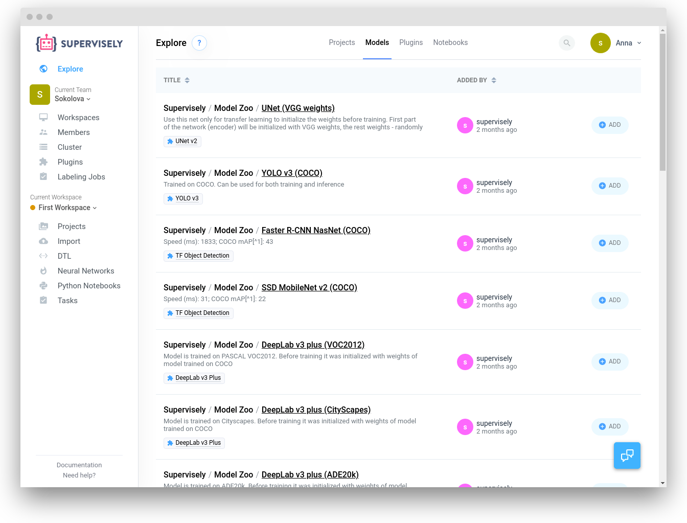

The Explore page has a Models section, where you can find all [supported neural networks](../supported_nns.md) and add them to your account.

Search for the relevant model and click the "Add" button to clone the public model to your current workspace. In will appear on the "Neural Networks" page.

