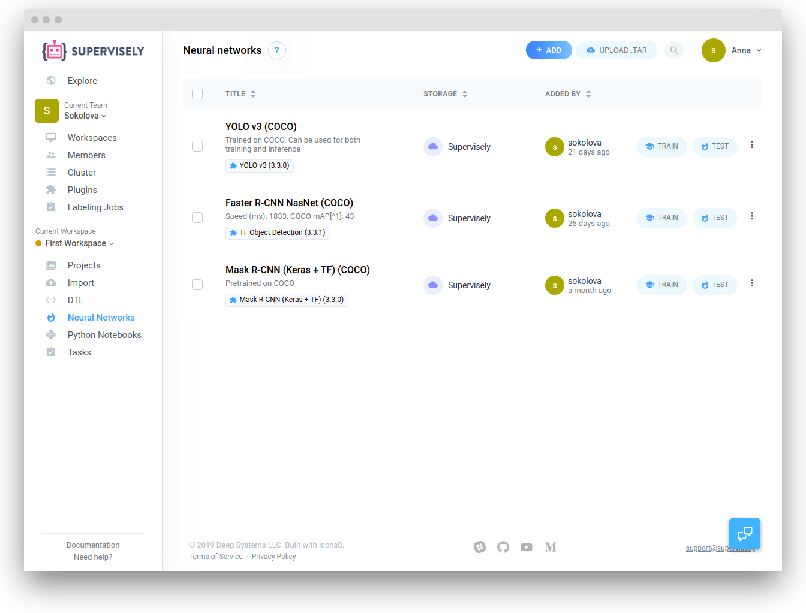
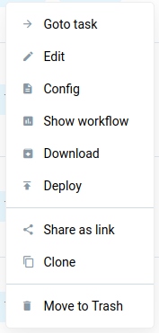

In this section you can view and manage your models.

Models are added to this list in a few ways:

* From the the Models list in the Explore section

* Training will automatically save the last checkpoint 

* You can manually select a checkpoint after training

* Manual upload


## Models list

At the "Neural networks" page you will see all the models in your current workspace.



You can view the following fields:

1. Creation date

2. Model name

3. Associated NN Architecture ([Plugin](../../customization/plugins/README.md)) 

4. Storage - where the model weights are stored: Supervisely Server or some Node from your Cluster 


## Managing your models

Click the "three dots" icon to see all available actions for the model.



&nbsp;

1. Goto task - redirects to the task page and filters all tasks. User will be able to get all necessary information about training: logs, charts, [checkpoints](../checkpoints.md), etc.

2. Edit - change the model name

3. Upload to Supervisely - if the model is stored on some Node from Cluster, user can upload this model to the Supervisely Server. That allows using this model on other computational Nodes. Read mode on [NN lifecycle](../nn-lifecycle/nn-lifecycle.md)

4. Archive

5. Config - training configuration (it is useful to see all training parameters including classes the model predicts).

Here is the example of the entire training configuration for our custom YOLO V3. 

```json
{
  "settings": {
    "lr": 0.0001,
    "epochs": 15,
    "batch_size": {
      "train": 12
    },
    "input_size": {
      "width": 256,
      "height": 256
    },
    "bn_momentum": 0.07,
    "gpu_devices": [
      0,
      1,
      2,
      3
    ],
    "data_workers": {
      "train": 3
    },
    "dataset_tags": {
      "train": "train"
    },
    "subdivisions": {
      "train": 1
    },
    "print_every_iter": 10,
    "weights_init_type": "transfer_learning",
    "enable_augmentations": false
  },
  "out_classes": [
    {
      "color": "#82789c",
      "shape": "rectangle",
      "title": "kiwi_bbox"
    },
    {
      "color": "#57c0cb",
      "shape": "rectangle",
      "title": "lemon_bbox"
    }
  ],
  "class_title_to_idx": {
    "kiwi_bbox": 0,
    "lemon_bbox": 1
  }
}
```

* `settings` - training parameters

* `out_classes` - classes model predicts

* `class_title_to_idx` - mapping from class title to class index


## Downloading models

If the model is stored on some Node from you Cluster, you have to upload it to the Supervisely Server ([manage models](#manage-models)). After that the "Download" button will be available. As a result user will download `.tar` archive with model weights.

## Starting training / inference

From this page you can start training or inference. Please read corresponding chapters to get more information.
